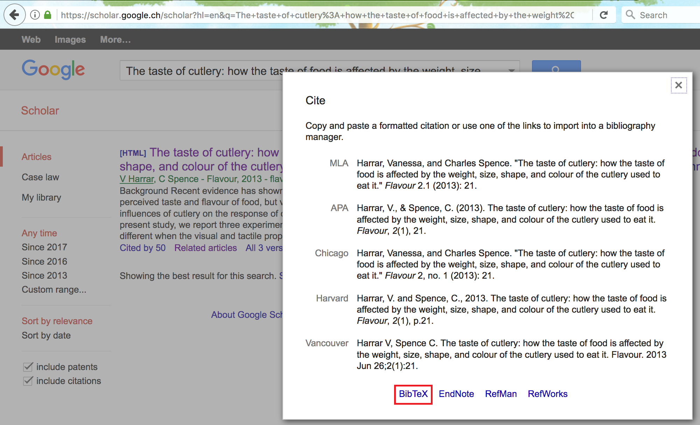

# RMarkdown

RMarkdown is a framework that provides a literate programming format for data science. It can be used to save and execute R code within RStudio, and also as a simple formatting syntax for authoring HTML, PDF, ODT, RTF, and MS Word documents as well as seamless transitions between available formats. The name "markdown" is an intentional contrast to other "markup" languages--e.g., hypertext markup language (HTML)--which require syntax that can be quite difficult to decipher for the uninitiated. One aim of the markdown paradigm is a syntax that is as human-readable as possible. "RMarkdown" is an implementation of the "markdown" language dsigned to accommodated embedded `R` code.

What is **literate** programming? 

Literate programming is the notion for programmers of adding narrative context with code to produce documententation for the program simultaneously. Consequently, it is possible to read through the code with explanations so that any viewer can follow through the presentation. RMarkdown offers a simple tool that allows to create reports or presentation slides in a reproducible manner with collateral advantages such as avoiding repetitive tasks by, for example, changing all figures when data are updated. 

What is **reproducible** research?

Reproducible research or reproducible analysis is the notion that an experiment's whole process, including collecting data, performing analysis, and producing output can be reproduced the same way by someone else. Building non-reproducible experiments has been a problem both in research and in the industry, and having such an issue highly decreases the credibility of the author's findings and potentially, the author. In essence, allowing for reproducible research implies that anyone could run the code (knit the document, etc.) and obtain the same exact results as the original research and RMarkdown is commonly used to address this issue. 

**JUSTIN: It could be nice to add a sketch to show what is going on in RMarkdown (maybe data -> RMarkdown -> output, under RMarkdown show that data importing/cleaning, analysis, writing slide/report content is done, output show the kind of output, from slides, html, this book, latex document (sweave) and so on). Finally, we could add a video somewhere in the intro to present RMarkdown in RStudio. What do you think?**

An RMarkdown is a plain text file that contains three different aspects:

- YAML metadata
- Code Chunks 
- Text 

## YAML Metadata 

YAML stands for *YAML Ain't Markup Language*, and is used to specify document configurations and properties such as name, date, output format, etc. The (optional) YAML header surrounded before and after by "---" on a dedicated line.


You can also include additional formatting [options](http://rmarkdown.rstudio.com/html_document_format.html), such as a table of contents, or even a custom CSS style template which can utilized to further enhance presentation. For the purpose of the class, the default options should be sufficient. Below is an example knit output of the above RMarkdown file. 


The default output above is an html_document format. However, this can be specified as well, such as `pdf_document`. The pdf format, however, requires additional installation and configuration of a TeX distribution such as [MikTeX](https://miktex.org/2.9/setup). Once available, the user can also include raw LaTeX and even define LaTeX macros in the RMarkdown document if necessary.


### Subsections  {-}

To make your sections numbered as sections and subsections, make sure you specify `number_sections: yes` as part of the YAML Metadata as shown below. 


## Text 

In addition, due to its literate nature, text will be an essential part in explaining your analysis. With RMarkdown, we can specify custom text formatting, such as with emphasis such as *italics*, **bold**, or `code style`. To understand how to format text, our previous would be as follows in RMarkdown:


```
With RMarkdown, we can specify custom text formatting, such as with emphasis such as *italics*, **bold**, or even a `code style`.
```

### Headers {-}

As seen above, headings are preceded with a #. A single `#` produces the largest heading text; to output smaller headings, simply add more #! Heading level also impacts section and subsection nesting in documents and tables of contents, as well as slide breaks in presentation formats.

### Lists {-}

Lists can be extremely convienient to make text more readable or to take course notes during class. RMarkdown allows to create different list structures as shown in the code below:  

```{r, eval = FALSE, highlight = FALSE}
* You can create bullet points by using symbols such as *, +, or -. 
+ simply add an indent or four preceding spaces to indent a list. 
    + You can manipulate the number of spaces or indents to your liking. 
        - Like this. 
    * Here we go back to the first indent. 
1. To make the list ordered, use numbers. 
1. We can use one again to continue our ordered list. 
2. Or we can add the next consecutive number. 
```

which delivers the following list structure:

* You can create bullet points by using symbols such as *, +, or -. 
+ Simply add an indent or four preceding spaces to indent a list. 
    + You can manipulate the number of spaces or indents to your liking. 
        - Like this. 
    * Here we go back to the first indent. 
1. To make the list ordered, use numbers instead of symbols. 
2. Here we write the next consecutive number to continue.
    - Add more content by indenting like before. 

### Hyperlinks {-}

To add hyperlinks with the full link, (ex: <https://google.com/>) you can follow the syntax below: 

```{r, eval = FALSE, highlight = FALSE}
<https://google.com/>
```

whereas to add hyperlinks with a custom link title, (ex: [Google](https://google.com)) follow the syntax below: 

```{r, eval = FALSE, highlight = FALSE}
[Google](https://google.com)
```

### Blockquotes {-}

**Same thing for citation... What do you think?**

> Use the > character in front of a line, *just like in email*.
> Use it if you're quoting a person, a song or whatever.


### Pictures {-}

To add a picture with captions, follow the syntax below:

```{r, eval = FALSE, highlight = FALSE}

```


Else, to add a picture without any captions, follow the syntax below:

```{r, eval = FALSE, highlight = FALSE}

```


### Cache {-}

Depending on the complexity of calculations in your embedded R code, it may be convenient to avoid re-running the computations (which could be lengthy) each time you knit the document together. For this purpose, it possible to specify an additional argument for your embedded R code which is the `cache` argument. By default this argument is assigned the value `FALSE` and therefore the R code is run every time your document is compiled. However, if you specify this argument as `cache = TRUE`, then the code is only run the first time the document is compiled while the following times it simply stores and presents the results of the computations when the document was first compiled.

Let us consider an example where we want to embed an R code with a very simple operation such as assigning the value of 2 to an object that we call `a` (that we saw earlier). This is clearly not the best example since this operation runs extremely quickly and there is no visible loss in document compilation time. However, we will use it just to highlight how the `cache` argument works. Therefore, if we want to avoid running this operation each time the document is compiled, then we just embed our R code as follows:

```{r computeA, cache = TRUE, highlight=FALSE}
a = 2
```

You will notice that we called this chunk of embedded R code `computeA` and the reason for this will become apparent further on. Once we have done this we can compile the document that will run this operation and store its result. Now, if we compile the document again (independently from whether we made changes to the rest of the document or not) this operation will not be run and the result of the previous (first) compiling will be presented. However, if changes are made to the R code which has been "cached", then the code will be run again and this time its new result will be stored for all the following compilings until it is changed again.

This argument can therefore be very useful when computationally intensive R code is embedded within your document. Nevertheless it can suffer from a drawback which consists in dependencies of your "cached" R code with other chunks within the document. In this case, the other chunks of R code can be modified thereby outputting different results but these will not be considered by your "cached" R code. As an example, suppose we have another chunk of R code that we can "cache" and that takes the value of `a` from the previous chunk:

```{r, cache = TRUE, highlight=FALSE}
(d = 2*a)
```

In this case, the output of this chunk will be `## 4` since `a = 2` (from the previous chunk). What happens however if we modify the value of `a` in the previous chunk? In this case, the previous chunk will be recomputed but the value of `d` (in the following chunk) will not be updated since it has stored the value of 4 and it is not recomputed since this chunk has not been modified. To avoid this, a solution is to specify the chunks of code that the "cached" code depends on. This is why we initially gave a name to the first chunk of code ("computeA") so as to refer to it in following chunks of "cached" code that depend on it. To refer to this code you need to use the option `dependson` as follows:

```{r, cache = TRUE, dependson = "computeA", highlight=FALSE}
d = 2*a
```

In this manner, if the value of `a` changes in the first chunk, the value of `d` will also change but will be stored until either the `computeA` chunk or the latter chunk is modified.


### LaTeX {-}

What is **LaTeX**?

LaTeX is a document preparation system that uses plain text as opposed to formatted text used for applications such as Microsoft Word. It is widely used in academia as a standard for the publication of scientific documents. It has control over large documents containing sectioning, cross-references, tables and figures. 

#### LaTeX in RMarkdown {-}

Unlike a highly formatted word processor, we cannot produce equations by clicking on symbols. As data scientists we need to explain distributions and equations that are behind the methods we present. Within the text section of an RMarkdown document you can include LaTeX format text to output different forms of text, mainly equations and mathematical expressions. 

Inline mathematical expressions can be added using the syntax: `$math expression$`. For example, if we want to write "where $\alpha$ is in degrees" we would write:

```{r, eval = FALSE, highlight = FALSE}
"where $\alpha$ is in degrees".
```

Using a slightly different syntax (i.e. `$$math expression$$`) we can obtain centered mathematical expressions. For example, the binomial probability in LaTeX is written as

`$$f(y|N,p) = \frac{N!}{y!(N-y)!}\cdot p^y \cdot (1-p)^{N-y} = {{N}\choose{y}} \cdot p^y \cdot (1-p)^{N-y}$$`

which is output as:

$$f(y|N,p) = \frac{N!}{y!(N-y)!}\cdot p^y \cdot (1-p)^{N-y} = {{N}\choose{y}} \cdot p^y \cdot (1-p)^{N-y}$$

An introduction to the LaTeX format can be found [here](http://www.math.harvard.edu/texman/) if you want to learn more about the basics. An alternative can be to insert custom LaTeX formulas using a graphical interface such as [codecogs](https://www.codecogs.com/latex/eqneditor.php). 

### Cross-referencing Sections {-}

You can also use the same syntax `\@ref(label)` to reference sections, where label is the section identifier (ID). By default, Pandoc will generate IDs for all section headers, e.g., `# Hello World` will have an ID `hello-world`. To call header `hello-world` as a header, we type `\@ref(hello-world)` to cross-reference the section. In order to avoid forgetting to update the reference label after you change the section header, you may also manually assign an ID to a section header by appending {#id} to it.

### Citations and Bibliography {-}

Citations and bibliographies can automatically be generated with RMarkdown. In order to use this feature we first need to create a "BibTex" database which is a simple plain text file (with the extension ".bib") where each reference you would like to cite is entered in a specific manner. 

To illustrate how this is done, let us take the example of a recent paper where two researchers from Oxford University investigated the connection between the taste of food and various features of cutlery such as weight and colour (calling this phenomenon the "taste of cutlery"). The bibtex "entry" for this paper is given below:

```
@article{harrar2013taste,
  title={The taste of cutlery: how the taste of food is affected by the weight, size,
   shape, and colour of the cutlery used to eat it},
  author={Harrar, Vanessa and Spence, Charles},
  journal={Flavour},
  volume={2},
  number={1},
  pages={21},
  year={2013},
  publisher={BioMed Central}
}
```

This may look like a complicated format to save a reference but there is an easy way to obtain this format without having to manually fill in the different slots. To do so, go online and search for "Google Scholar" which is a search engine specifically dedicated to academic or other types of publications. In the latter search engine you can insert keywords or the title and/or authors of the publication you are interested in and find it in the list of results. In our example we search for "The tast of cutlery" and the publication we are interested in is the first in the results list.


Below every publication in the list there is a set of options among which the one we are interested in is the "Cite" option that should open a window in which a series of reference options are available. Aside from different reference formats that can be copied and pasted into your document, at the bottom of the window you can find another set of options (with related links) that refer to different bibliography managers.



For ".bib" files we are interested in the "BibTex" option and by clicking on it we will be taken to another tab in which the format of the reference we want is provided. All that needs to be done at this point is to copy this format (that we saw earlier in this section) and paste in the ".bib" file you created and save the changes.


However, your Rmarkdown document does not know about the existence of this bibliography file and therefore we need to insert this information in the YAML metadata at the start of our document. To do so, let us suppose that you named this file "biblio.bib" (saved in the same location as your Rmarkdown document). All that needs to be done is to add another line in the YAML metadata with `bibliography: biblio.bib` and your Rmarkdown will now be able to recognise the references within your ".bib" file. There are also a series of other options that can be specified for the bibliography such as its format or the way references can be used within the text (for a more detailed overview the BibTex environment and managing references in Rmarkdown see, for example, this [link](https://www.economics.utoronto.ca/osborne/latex/BIBTEX.HTM) and this [link](http://rmarkdown.rstudio.com/authoring_bibliographies_and_citations.html) respectively).

Once the ".bib" file has been created and has been linked to your Rmarkdown document through the details in the YAML metadata, you can now start using the references you have collected in the ".bib" file. To insert these references within your document at any point of your text you need to use the name that starts the reference field in your ".bib" file and place it immediately after the `@` symbol (without spaces). So, for example, say that we wanted to cite the publication on the "taste of cutlery": in your Rmarkdown all you have to do is to type `@harrar2013taste` at the point where you want this citation in the text and you will obtain: @harrar2013taste.

```{block2, type='rmdnote'}
The user can also change the name that is used to call the desired reference as long as the same name is used to cite it in the Rmarkdown document and that this name is not the same as another reference. 
```

```{block2, type='rmdcaution'}
The references in the ".bib" file will not appear in the references that are output from the Rmarkdown compiling procedure unless they are specifically used within the Rmarkdown document.
```

Additional References: 

- [Intro to bibtex](https://www.economics.utoronto.ca/osborne/latex/BIBTEX.HTM)
- [Ref on ref for rmd](http://rmarkdown.rstudio.com/authoring_bibliographies_and_citations.html)


### Tables {-}

For simple tables, we can be manually insert values as such, 

```
+---------------+---------------+--------------------+
| Fruit         | Price         | Advantages         |
+===============+===============+====================+
| *Bananas*     | $1.34         | - built-in wrapper |
|               |               | - bright color     |
+---------------+---------------+--------------------+
| Oranges       | $2.10         | - cures scurvy     |
|               |               | - **tasty**        |
+---------------+---------------+--------------------+
```

to produce:

+---------------+---------------+--------------------+
| Fruit         | Price         | Advantages         |
+===============+===============+====================+
| *Bananas*     | $1.34         | - built-in wrapper |
|               |               | - bright color     |
+---------------+---------------+--------------------+
| Oranges       | $2.10         | - cures scurvy     |
|               |               | - **tasty**        |
+---------------+---------------+--------------------+

As an alternative we can use the simple graphical user interface [online](http://www.tablesgenerator.com/markdown_tables). For more extensive tables, we create dataframe objects and project them using `knitr::kable()`, which we will explain later. 

### Additional References {-}

There are many more elements to creating a useful report using RMarkdown, and we encourage you to use the [Rmarkdown Cheatsheet](https://www.rstudio.com/wp-content/uploads/2015/02/rmarkdown-cheatsheet.pdf) as a reference. 


## Code Chunks 

This is where you enter your code. 

You can quickly insert chunks like these into your file with

- the keyboard shortcut Ctrl + Alt + I (OS X: Cmd + Option + I)
- the Add Chunk command in the editor toolbar
- by typing the chunk delimiters **\`\`\`\{\r\}** and **\`\`\`**.


### Code Chunk Options

In the third code chunk above, we also configure chunk options. Note that the `echo = FALSE` parameter was added to the code chunk to prevent printing of the R code that generated the plot. This is a useful way to embed figures. More options can be referred from the [Rmarkdown Cheatsheet](https://www.rstudio.com/wp-content/uploads/2015/02/rmarkdown-cheatsheet.pdf) and Yihui's notes on knitr [options](https://yihui.name/knitr/options/). Here are some explanations of the most commonly used chunk options exerted from above: 

- eval: (TRUE; logical) whether to evaluate the code chunk
- echo: (TRUE; logical or numeric) whether to include R source code in the output file
- warning: (TRUE; logical) whether to preserve warnings (produced by warning()) in the output like we run R code in a terminal (if FALSE, all warnings will be printed in the console instead of the output document)
- cache: (FALSE; logical) whether to cache a code chunk;

Plot figure options: 

- fig.path: ('figure/'; character) prefix to be used for figure filenames (fig.path and chunk labels are concatenated to make filenames)
- fig.show: ('asis'; character) how to show/arrange the plots
- fig.width, fig.height: (both are 7; numeric) width and height of the plot, to be used in the graphics device (in inches) and have to be numeric
- fig.align: ('default'; character) alignment of figures in the output document (possible values are left, right and center
- fig.cap: (NULL; character) figure caption to be used in a figure environment 


### In-line R {-}

The variables we store in a RMarkdown will stay within the environment. This means that we can call and manipulate them anywhere within the document. In Rmarkdown, we can reference the variable in-line in the text section by using ` r variable` to show the value of our variable embedded within the sentence. Here is an example: 

```{r}
a = 2
```

Above, we stored the value 2 into `a`. 

```{r, eval = FALSE, highlight = FALSE}
The value of $a$ is `r a`. 
```

This translates in R Markdown to "The value of $a$ is `r a`."


## Render Output 

After you are done, run `rmarkdown::render()` or click the `Knit` button at the top of the RStudio scripts pane to save the output in your working directory. 


Click on the links below for more information on RMarkdown:

- [RStudio RMarkdown tutorial](http://rmarkdown.rstudio.com/authoring_quick_tour.html)
- [R-blogger's RMarkdown tutorial](https://www.r-bloggers.com/r-markdown-and-knitr-tutorial-part-1/)


