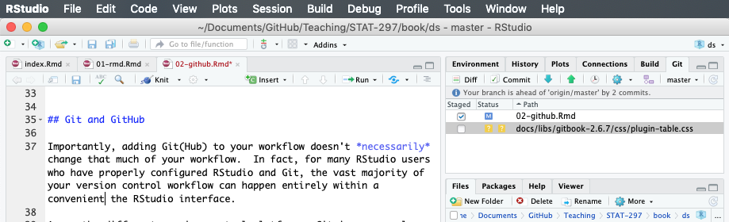
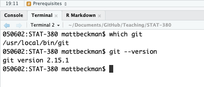
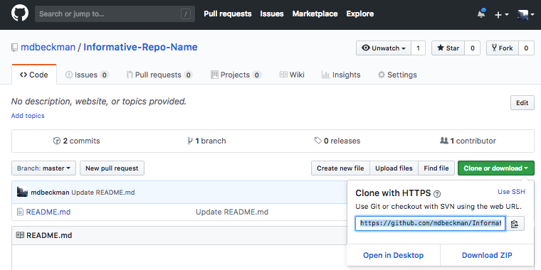
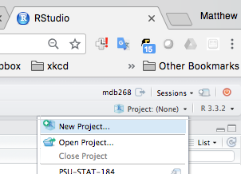
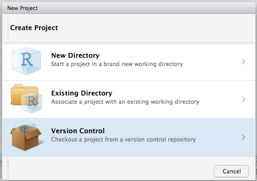
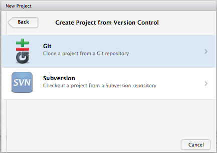
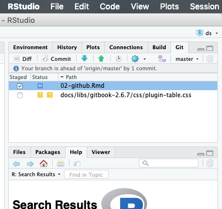

# GitHub 

> git gets easier once you get the basic idea that branches are homeomorphic endofunctors mapping submanifolds of a Hilbert space.
> <cite> Isaac Wolkerstorfer </cite>

When working on a report or a project, it is often the case that you keep separate versions either to keep track of the changes (in case you want to go back to a previous version) or to have a version for each person working on different parts of the project. As a result of this approach, you may have created or encountered a file directory attempting to preserve multiple copies or iterations of the same files:

<center>

</center>

This behavior is basically a defensive strategy attempting to remedy one or more a real or percieved threats to progress.  For example,

- you or a collaborator may have made progress on different parts of the project in separate versions of the document
- you may want to preserve an earlier state of the document (e.g. a "clean" copy before proposing edits)

Unforutunately, this type of strategy can easily lead to frustration as users lose track of which documents have the most up-to-date content for different portions of the document.  This is effectively a problem of "version control" (sometimes called "source control"). 


To respond to this problem, software has been developed to keep track of your changes by informing you on the saves you made and allowing you to go back to previous versions in order to revert those changes. This chapter discusses the features of this software as well as introducing a specific version control tools: *Git* and *GitHub*. People often use the two somewhat interchangeably in casual discussion--or use GitHub as a surrogate for the combination.  In fact, Git is the name of the version control software, and everything that Git can accomplish is possible to do without using Git**Hub** at all. GitHub is a commercial web-based version control repository hosting service which includes some additional features to make Git more user-friendly.   


## Version Control 

As mentioned above, *version control* is a system that records changes to a file or a set of files in order to keep track and possibly revert to or modify those changes over time. More specifically, it allows you to: 

- record the entire history of a file;
- revert to a specific version of the file;
- collaborate on the same platform with other people;
- make changes without modifying the main file and add them once you feel comfortable with them. 

All these features are highly important when projects start becoming more complex and/or include multiple contributors. There are several mature software tools designed for version control including, but not limited to, Git, Subversion, Mercurial, and more. Furthermore, there are several web-based version control repository hosting services such as GitLab, GitHub, Bitbucket, and more that accomplish the same goals. In the next section, we introduce use of Git and GitHub as tools for version control and collaboration.  

Rather than save many independent copies of each file--as shown earlier when the user saved many versions of a "final" document--most version control software tools simply track incremental changes to the files under version control. Storing a complete record of just the bits that *change* from one version to the next is far more efficient than saving many copies of whole documents for which a majority of the content may be unchanged from one iteration to the next.  Moreover, with a complete record of every incremental change, it's just as easy to piece together the current state of a document or to rebuild a previous the state of a document at an earlier point recorded in it's development lifecycle.  In other words, it's like version control software effectively offers access to free a document editing *time machine*!


## Git and GitHub

Importantly, adding Git(Hub) to your workflow doesn't *necessarily* change that much of your workflow.  In fact, for many RStudio users who have properly configured RStudio and Git, the vast majority of your version control workflow can happen entirely within a convenient the RStudio interface.  We'll discuss specific details, but it's sufficient to note the "Git" tab shown in the upper right pane of the RStudio window shown.

<center>

</center>


The latter uses the Git platform and stores local files into a flexible folder called a "repository".

Git(Hub) uses *repositories* to organize your work.  If you like, you can store a bunch of files in a repository (or Repo) on the GitHub remote servers and delete them from your computer entirely.  You can replace the files with new versions or even edit some specific types of files right from the GitHub webpage.  When you are ready to get them back, you could simply locate the files through your GitHub account and retrieve them.  

More commonly, users establish a link between a file directory on their (local) computer and a Repo stored on the GitHub remote.  You edit files on your computer and save your progress as you normally would, except now that you have established a link with Git(Hub) you can periodically update the Repo on the GitHub remote with the latest progress. 

Below is a video introducing the basic look and feel of GitHub. 

<center>
```{r, echo=FALSE}
knitr::include_url("https://www.youtube.com/embed/SB5YkjB9FWc")
```
</center>

### Git & RStudio Configuration


As mentioned previously, with proper configuration a large majority of your use of Git can happen entirely within the RStudio environment.  In this section, we step through a basic configuration.  If necessary, a more comprehensive guide to configuring Git(Hub) and R/RStudio is available at <https://happygitwithr.com/> from which a substantial portion of this congifiguration guidance was originally adapted.


#### Install Git

Before begining, make sure you have installed both R and RStudio.  Some systems will already have Git installed, or will install Git automatically when prompted.  In either case, open a terminal in RStudio (RStudio >> Tools >> Terminal >> New Terminal) and then enter the following commands--one at a time--after the dollar sign prompt ($) as shown below.

```
which git
git --version
```

<center>

</center>


If git is installed, the result will indicate a where the software is located and the version you have available.  If Git has not yet been installed, go to the [website](https://git-scm.com/downloads) and select the version which is compatible with the OS of your computer (e.g. Windows/Mac/Linux/Solaris). Again, for additional support corresponding to various operating systems see <https://happygitwithr.com/install-git.html>. 


#### Tell Git Who You Are

Once Git is installed, the first thing you should do is set your name and the email address associated with your GitHub profile. This is information is used to synchronize the work on your computer with your Repo on the GitHub remote server.

Again, you will need a Terminal window in RStudio (RStudio >> Tools >> Terminal >> New Terminal) and then enter the following commands--one at a time--after the dollar sign prompt ($) as shown below.

```
git config --global user.name 'Aaron Carlson'
git config --global user.email 'abc1234@psu.edu'
git config --global --list
```

Note: the last command `git config --global --list` should verify that Git now knows you! ...or at least acknowledges your name and email address.  This operation only needs to be done once when using the "--global" option because, in this case, Git will always use that information for anything you do on that system. If you want to override this with a different name or email address for specific projects, you can run the command without the "--global" option while working on those projects.


### GitHub Setup 

In order to set up GitHub, go to the [GitHub website](https://github.com/) and, for the purposes of the course, the first step is to sign up with your University email address.


```{block2, type='rmdnote'}
Your username and email can be changed at any time so, if you want to change it, you can easily do so after the course.  

Your GitHub profile can also serve as a *resume* of your data science skills that will be highlighted by possible future projects that you save and commit.

Since your profile will be public, it's a good idea to choose a username that you would be comfortable sharing with an employer in a job interview.  Better still is a name that is *recognizable* as you as a derivative of your actual name.  For example, our sample name in the last section, Aaron Carlson, might choose "acarlson" as a username rather than "abc1234" which would not be recognizable to those outside the university.
```


Once you have a GitHub profile, log in and create a Repo for your project (or navigate to an existing Repo).  Make sure you check the box to "initialize this repository with a README." *It's generally a good idea to always initialize new Repos with a README unless you have a specific reason not to do so.*  Then, click the green button "Clone or Download" and copy the URL as shown here.

<center>

</center>


### Connecting to RStudio 

With the URL of your GitHub Repo still copied to your clipboard, go to RStudio and initate a new "Project."  You can either navigate the menus in RStudio (RStudio >> File >> New Project) or use the "Project" navigation feature in the upper right of the RStudio window a shown.


<center>

</center>

Next, RStudio will prompt you with a dialogue box to configure the new project. Select "Version Control" and then "Git" on the following screen as shown.

<center>

</center>

<center>

</center>


Remember when you copied the URL for your Repo from GitHub?  If not, go copy it again and we'll paste it into the line "Repository URL" in order to "Clone" the Git Repository to a file directory (i.e. folder) on your computer as shown.

- "Repository URL": Paste the URL that you previously copied from GitHub
- "Project Directory Name": This will be the name of a new folder (i.e. directory) on **your computer**. Use the same name as your GitHub Repo (e.g. mine was "Informative-Repo-Name" here). 
- "Create Project as a Subdirectory Of": This is the location on **your computer** for the new folder. For example, you may want to make a folder on your computer for each class and then put this Repo (and others for the class) together in that directory location.

<center>

</center>


</br>

You're *in*! (hopefully)... 

The "Project" menu shown in the upper right corner of the RStudio Server Window now shows the name of your Repo/Project (e.g. mine was "Informative-Repo-Name" in this demonstration).  Also, a new "Git" tab appears and has started tracking file changes in my Repo. A few initial files will appear (e.g., ".gitignore" and something ending in ".RProj").  These basically help Git & RStudio handle logistics, just "commit" and "push" them.  


### The basic workflow

Git Basics: <https://git-scm.com/book/en/v2/Getting-Started-Git-Basics>

<center>

</center>

From now on, nearly everything (~90-95%) of your interactions with Git can happen in RStudio... at least in this class.  The remaining bits consist of things like initializing or cloning Repos from the GitHub website.  If you do internet searches for Git help, you'll see lots of command line terminal stuff, but you won't likely need to execute commands in the terminal for our purposes.

The basic workflow is as follows...

1. Open the RStudio Project connected to your Git(Hub) Repo
2. Work on your computer just like always
3. **Save** your work often just like always
4. When you want to preserve a **snapshot** of your project, you make a "commit"
5. When you have a few commits and want to archive them, you "push" them to the GitHub remote server
6. If you decide to work from a different computer, or want to pick up where a collaborator left off, you can "pull" the most up-to-date version of the files from the GitHub remote to your local computer and go back to step 2.

Let's unpack the workflow slightly...

1. *Open the RStudio Project connected to your Git(Hub) Repo.*  We'll come back to this when we discuss common mistakes.

2. *Work on the files just like you always do.*  Seriously.  

This certainly includes technical tasks like writing code in R, but it also includes standard operations like dragging and dropping things into the directory folder linked to your Repo.  For example, if you want to have access to a picture or a file with a data set in it, you could copy it to the directory folder for your project just like you normally would.  

When you add a new file, you may simply notice the name of that file will appear on a list in the "Git" tab in your RStudio window.  Git is basically just alerting you that it has noticed something changed in the repo, that's all.

3. * **Save** your work often just like always.*  You should save your work as you make progress just like you always would, even if Git weren't involved.  

When you save changes to an existing file, the name of that file will appear on a list in the "Git" tab in your RStudio window again.  Once again, Git is just alerting you that it has noticed something changed.  Git is *very* observant that way.

4. *When you want to preserve a **snapshot** of your project, you make a "commit."*  This is the first new bit.

A commit is quite literally a snapshot of the state of your whole project (e.g., file directory), like a photograph.  One you take a photograph, you have an exact picture of precisely how things looked at that moment in time.  You should make commits frequently as you make progress with your work.  
When you want to make a commit using the RStudio interface, you simply select a small checkbox next to the files that you want to include in the snapshot.  This is called "staging" files for the commit.  Then, when you click the "commit button, a new window will open that will attempt to summarize all the differences between the new file and the previous version.  This is called the "diff."

In order to complete each commit, you must include a commit message. It's a good idea to write informative commit messages, and Git will even force you to write *something* before executing the commit.  Remember when we described version control as a sort of time machine?  You will probably be the one reading through many dozens of commit messages to figure out where to send the time machine... They are also tremendously helpful if you have collaborators on a Repo so you can all keep up with what is changing throughout the project.[^1]  


<center>

</center>


5. *When you have a few commits and want to archive them, you "push" them to the GitHub remote server.*

This is the first step in the workflow that is **not** simply happening on your local computer.  When you "push" one or more commits to the GitHub remote server it is like archiving all of those snapshots/photographs in a permanent file cabinet.


6. *If you decide to work from a different computer, or want to pick up where a collaborator left off, you can "pull" the most up-to-date version of the files from the GitHub remote to your local computer and go back to step 2.*

Again, nearly everything you are doing with Git is happening locally *on your computer*.  If a collaborator made changes on a different computer, or if **you** made changes from a different computer somewhere, you will need to "pull" them from the GitHub remote into your local working directory. 

Actually, if you are working from several computers or with other collaborators, it's a good habit to **"pull" before you "push"** in order to make sure that you don't end up with two different versions of the same thing that are in direct conflict with one another.  This results in a "merge conflict" and can become a bit of a headache to untangle.


#### Common mistakes in the Git/RStudio Workflow

**Commits in the wrong Repo**.  It's a common mistake to forget to change from one RStudio Project to the next.  If you forget, it may look like your changes aren't tracked by Git.  In reality, Git will still monitor changes... but it is monitoring them in the correct Repo linked to the file, so you won't be able to make commits on those files until you change to the correct RStudio Project.

**Large files**.  GitHub is generously storing all sorts of things for us and (as academic users) doing so free of charge.  Having said that, storage presumably costs *them* money, so they don't like to store large files.  You'll be warned if you try and commit any single file that is more than 10 MB.  There are sensible ways to work around this, but a common strategy is to tell Git to simply "ignore" the large file... that is, don't include it in my snapshots and don't archive it on the GitHub remote.  


### Note about GitHub Student Developer Pack

As a student, it is possible to benefit from specific advantages when using GitHub. Indeed, once you have set up your profile you can go to this [link](https://education.github.com/discount_requests/new) and follow the steps below to set up a "student developer pack" discount request to GitHub. Through this setup it will be possible for you not only to have unlimited free *public* repositories.  In the past, students could access free unlimited *private* repositories only after some vetting by GitHub. This changed in 2019 shortly after GitHub was acquired by Microsoft.  At the time of this writing, free unlimited private repositories were made available to all users, and restrictions were instead based on limiting the number of **collaborators** for private Repos.  Students should still get the student developer pack, but it may not be as critical as it once was for most student users.


<center>

</center>


<!-- ## GitHub Workflow  -->

<!-- Here is a video demonstrating the basic GitHub workflow in GitHub Desktop (initializing, committing, pushing and pulling) that we will follow for our assignments and projects.  -->

<!-- <center> -->
<!-- ```{r, echo = FALSE} -->
<!-- knitr::include_url("https://www.youtube.com/embed/-cLn7Uk-Zo0") -->
<!-- ``` -->
<!-- </center> -->

<!-- In addition, here is a video demonstrating the basic GitHub workflow within RStudio.  -->
<!-- <center> -->
<!-- ```{r, echo = FALSE} -->
<!-- knitr::include_url("https://www.youtube.com/embed/VOIQgViCyTo") -->
<!-- ``` -->
<!-- </center> -->

<!-- While the main features and actions to manage the workflow in GitHub are desribed in the above videos, the following paragraphs give some extra details that can be helpful to consider when working with this version-control platform. -->

<!-- ### Branching  -->

<!-- In the previous section we discussed the workflow as a means of directly making changes in the so-called *master* branch which is where our original and up-to-date work is stored. However, when working with different collaborators for example, it may be appropriate to create separate branches that will avoid modifying the original one until you're sure of the changes. In this perspective, *branching* is essentially creating an environment in which we can change anything without obstructing our original document. As mentioned, this idea is very useful for group-based activities where different people are working on the same files. Once we have made all our changes and are sure of the changes, we can merge the changes to the main `master` branch. You can learn more about branching [here](https://git-scm.com/book/en/v1/Git-Branching-Basic-Branching-and-Merging) and [here](https://gist.github.com/vlandham/3b2b79c40bc7353ae95a).  -->


<!-- ### Pull  -->

<!-- Before starting (or continuing) to work on your project, make sure to always review changes that another collaborator has made. Once this is done you can make sure there are no merge conflicts and you can pull (or synchronize) your local branch with the most recent version of the repository. If merge conflicts were to happen, these can still be solved but it would be preferable to avoid them generating confusion.  -->


<!-- ### Commits  -->

<!-- After we have created the branch, we can start modifying the documents (add, edit, or delete) within the repository. Once these changes are made, you need to `commit` them with an informative message, explaining why a particular change is being made. These specific messages allow you to backtrack on these changes later if you decide to look at the history of any of these files and find a bug. This information is extremely important since otherwise there's little point in using version control like GitHub. [^1] -->

<!-- <center></center> -->


<!-- #### Pull Request  -->

<!-- If you are directly working on the master branch, please disregard this section. Else, a `pull request` may be made by the person working on the branch, so that other collaborators can discuss about the commits made in the branch. Also, there are options for conversation in which they can review and comment directly onto the code as well.  -->


<!-- ### Push or Merge  -->

<!-- Once you have either made the commits on your master branch or have the pull request confirmed by other collaborators, you can merge or push the changes into the remote master branch. This means that the version of the repository online will have your updated code and documents. This will be the final step to the cycle of the workflow after which we can clear and repeat the above procedure.   -->

<!-- ### Merge Conflicts  -->

<!-- Merge conflicts often occur when two different collaborators make different changes to the same line of a file, and also can happen when a file that is meant to be modified is deleted (although these may not be the only situations). To resolve these conflicts, we must directly edit the documents making sure potential conflicts are discussed before merging or pushing to the master branch, since merge conflicts often occur from miscommunication within groups.  -->


<!-- ## GitHub Workflow on Command Line / Git Bash  -->

<!-- Here are commands that we can use within `Git Bash` if we are more comfortable working on the command line.  -->

<!-- | Command                        | Function                                      | -->
<!-- |--------------------------------|-----------------------------------------------| -->
<!-- | git init                       | Create a **local** repository                 | -->
<!-- | git branch "newbranch"         | Create a new branch with given name           | -->
<!-- | git checkout "newbranch"       | Switch to specified branch                    | -->
<!-- | git status                     | List all the files that you have modified     | -->
<!-- | git add -A                     | Add **all** files to staging                  | -->
<!-- | git commit -m "commit message" | Commit staged changes to **local** repository | -->
<!-- | git push                       | Commit saved changes to **remote** repository | -->
<!-- | git pull                       | Update changes from the **remote** repository | -->

<!-- However, it is better for us to startby using more graphical user-interface options since they allow us to better understand what is going on. You **do not** want to follow this example[^2]... -->

<!-- <center></center> -->

<!-- It is always important to know what is happening when we create, change, push, branch and pull from a repository. -->


## Issues 

*Issues* are a very good way to keep track of group tasks, bugs and announcements for your projects within GitHub. Below is a basic video introducing `issues` in GitHub. 

<center>
```{r, echo = FALSE}
knitr::include_url("https://www.youtube.com/embed/HRikDvXEpVM")
```
</center>


## Slack Integration 

Slack is a platform created to communicate between group members, allowing for both direct individual messages as well as group messages. More information on how to use Slack can be found in this [Slack Tutorial](https://get.slack.help/hc/en-us/articles/218080037-Getting-started-for-new-members).

An added benefit of using Slack is that it can be integrated with GitHub in such a way that notifications will be posted to the group whenever someone pushes or makes a pull request. More information on GitHub integration with Slack can be found [here](https://get.slack.help/hc/en-us/articles/232289568-Use-GitHub-with-Slack). 

A more detailed video providing a demonstration on the use of Slack in a real-life setting can be found below.

<center>
```{r, echo = FALSE}
knitr::include_url("https://www.youtube.com/embed/PpnFCp4Wr_g")
```
</center>


## Additional References 

Below are some supplemental references that can support you in a better use of GitHub.

- <http://happygitwithr.com/>

<!-- - [GitHub Introduction with RStudio](https://www.r-bloggers.com/rstudio-and-github/) -->
<!-- - [GitHub Workflow](https://guides.github.com/introduction/flow/) -->
<!-- - [GitHub on Command Line (video)](https://www.youtube.com/watch?v=oFYyTZwMyAg) -->

[^1]: https://xkcd.com/1296/
[^2]: https://xkcd.com/1597/