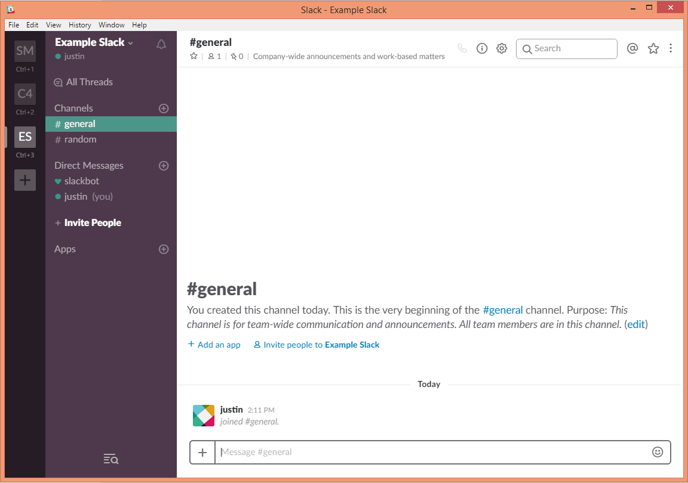

# GitHub 

When working on a report or a project, it is often the case that you keep separate versions either to keep track of the changes (in case you want to go back to a previous version) or to have a version for each person working on different parts of the project. As a result of this approach, you may have experienced a moment like this at least once in your life:

<center>

</center>

In these cases, after having modified and changed different parts of a report, you probably find yourself saving the same file over and over again while losing track of what changes you made. To respond to this problem, software has been developed to keep track of your changes by informing you on the saves you made and allowing you to go back to previous versions in order to revert those changes. This software is generally called "version control" and this chapter discusses the features of this software as well as introducing a specific version control platform called "GitHub". The latter includes a series of highly useful tools that can be extremely helpful, not only for the projects developed based on this book, but also for any personal or collaborative project you may undertake in the future. 

Below is a video introducing GitHub. 

<center>
```{r, echo=FALSE}
knitr::include_url("https://www.youtube.com/embed/SB5YkjB9FWc")
```
</center>

## Version Control 

As mentioned above, *version control* is a system that records changes to a file or a set of files in order to keep track and possibly revert to or modify those changes over time. More specifically, it allows you to: 

- record the entire history of a file;
- revert to a specific version of the file;
- collaborate on the same platform with other people;
- make changes without modifying the main file and add them once you feel comfortable with them. 

All these features are highly important when projects start becoming more complex and/or different collaborators contribute to it. In the next section we present a version control platform called "GitHub" that is commonly used among programmers and software developers thereby allowing them also to make their work visible and available to the general public. 

## Git and GitHub

Among the different version control platforms, Git is a commonly used and powerful tool that is made more accessible through GitHub which is a commercial website. The latter uses the Git platform and stores local files into a flexible folder called a "repository". For the purposes of this course, we will be using this platform and in the following sections we will briefly describe how to install and get started with this version control platform.


### Git Setup 

To install Git, go to the [website](https://git-scm.com/downloads) and select the version which is compatible with the OS of your computer (e.g. Windows/Mac/Linux/Solaris). Once you've downloaded and installed Git, the first thing you should do is to configure it by setting your username and email address. This is important because each time you interact with the platform and upload (commit) your changes to Git, this information is used to synchronize versions and keep track of project evolution. 


#### Tell Git Who You Are

Once you have installed Git, run the `Git Bash` software and type the following code below. 

```
$ git config --global user.name "John Doe"
$ git config --global user.email johndoe@example.com
```

This is the initial configuration of your author name and email address for your commits. You may need to do this before you begin pushing and pulling with your current account information. This operation only needs to be done once if using the "--global" option because then Git will always use that information for anything you do on that system. If you want to override this with a different name or email address for specific projects, you can run the command without the "--global" option while working on those projects.


### GitHub Setup 

In order to set up GitHub, go to the [GitHub website](https://github.com/) and, for the purposes of the course, the first step is to sign up with your University email address.

```{block2, type='rmdnote'}
Your username and email can be changed at any time so, if you want to change it, you can easily do so once this course is over.
```

<center>

</center>

Once this is done, you reach `Step 2: Choose your plan` where you can choose the default plan ("Unlimited public repositories for free") and click `Continue`. The last (optional) step is `Step 3: Tailor your experience` which allows you to submit your information but this can also be skipped. 

```{block2, type='rmdnote'}
Your GitHub profile can also serve as a *resume* of your Data Science skills that will be highlighted by possible future projects that you save and commit.
```

### Student Developer Pack

As a student, it is possible to benefit from specific advantages when using GitHub. Indeed, once you have set up your profile you can go to this [link](https://education.github.com/discount_requests/new) and follow the steps below to set up a "student developer pack" discount request to GitHub. Through this setup it will be possible for you not only to have free *public* repositories but also to make your own *private* repositories for free. 

<center>

</center>

## GitHub Workflow 

Here is a video demonstrating basic GitHub workflow in GitHub Desktop (initializing, committing, pushing, and pulling) we will follow for our assignments and projects. 

<center>
```{r, echo = FALSE}
knitr::include_url("https://www.youtube.com/embed/-cLn7Uk-Zo0")
```
</center>

Here is a video demonstrating basic GitHub workflow within RStudio. 

<center>
```{r, echo = FALSE}
```
</center>

### Branching 

Above, we talk about the workflow in terms of directly making changes in the master branch. Branching is essentially creating an environment in which we can change anything without obstructing our original document. This idea is very useful for group-based activities, where different people are working on the same files. Once we have made all our changes and are sure of the changes, we can merge the changes to the main `master` branch. You can learn more about branching [here](https://git-scm.com/book/en/v1/Git-Branching-Basic-Branching-and-Merging) and [here](https://gist.github.com/vlandham/3b2b79c40bc7353ae95a). 

### Commits 

After we have created the branch, we can start modifying the documents (add, edit, or delete) within the repository. After we have made these changes, we need to `commit` it with an informative message, explaining why a particular change is being made. These specific messages allow us to backtrack on these changes later on if we decide to look at the history of any of these files and find a bug. Without it being informative, there will be no point in using version control like GitHub. [^1]

<center></center>

#### Pull Request 

If you are directly working on the master branch, please disregard this section. Else, a `pull request` may be made by the person working on the branch, so that other collaborators can discuss about the commits made in the branch. Also, there are options for conversation in which they can review and comment directly onto the code as well. 

### Push or Merge 

Once you have either made the commits on your master branch or have gotten the pull request confirmed by other collaborators, we can merge or push the changes into the remote master branch. This means that the version of the repository online will have your updated code and documents. This will be the final step to the cycle of the workflow. After this step, we rinse and repeat the above procedure.  


## GitHub Workflow on Command Line / Git Bash 

Here are commands that we can use within `Git Bash` if we are more comfortable working on the command line. 

| Command                        | Function                                      |
|--------------------------------|-----------------------------------------------|
| git init                       | Create a **local** repository                 |
| git branch "newbranch"         | Create a new branch with given name           |
| git checkout "newbranch"       | Switch to specified branch                    |
| git status                     | List all the files that you have modified     |
| git add -A                     | Add **all** files to staging                  |
| git commit -m "commit message" | Commit staged changes to **local** repository |
| git push                       | Commit saved changes to **remote** repository |
| git pull                       | Update changes from the **remote** repository |

However, it is better for us to start with using more graphical user interface options, since they help us understand better of what is going on. You **do not** want to follow this example[^2]...

<center></center>

It is important to know what is happening when we create, change, push, branch, and pull from a repository.


## Slack Integration 

Slack is a platform created for utilizing communication between group members. It allows for direct message, as well as group messages. (like group chatting) More information on how to use Slack can be found in this [Slack Tutorial](https://get.slack.help/hc/en-us/articles/218080037-Getting-started-for-new-members).

<center></center>

An added benefit of using Slack is that we can integrate GitHub, in a way that whenever someone pushes or makes a pull request, notifications will be posted to the group. More information on GitHub integration on Slack can be found [here](https://get.slack.help/hc/en-us/articles/232289568-Use-GitHub-with-Slack). 


## Additional References 

Here are some supplemental references for your comprehension.

- [GitHub Introduction with RStudio](https://www.r-bloggers.com/rstudio-and-github/)
- [GitHub Workflow](https://guides.github.com/introduction/flow/)
- [GitHub on Command Line (video)](https://www.youtube.com/watch?v=oFYyTZwMyAg)

[^1]: https://xkcd.com/1296/
[^2]: https://xkcd.com/1597/