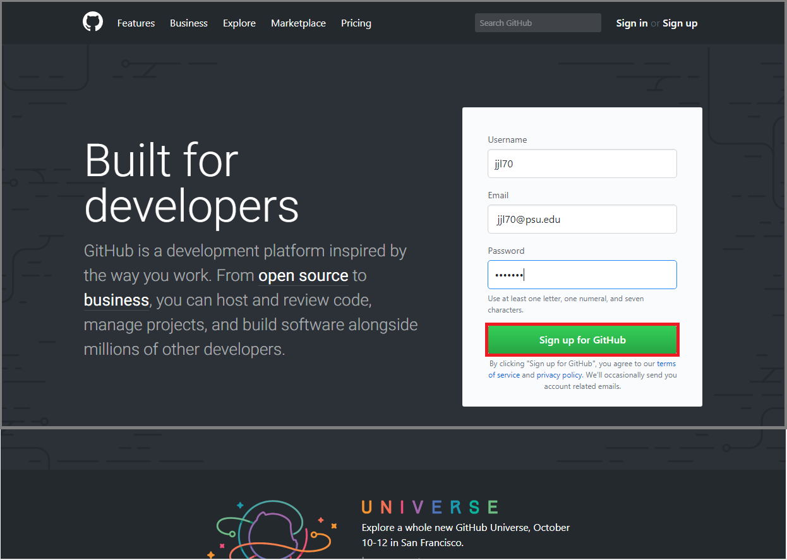
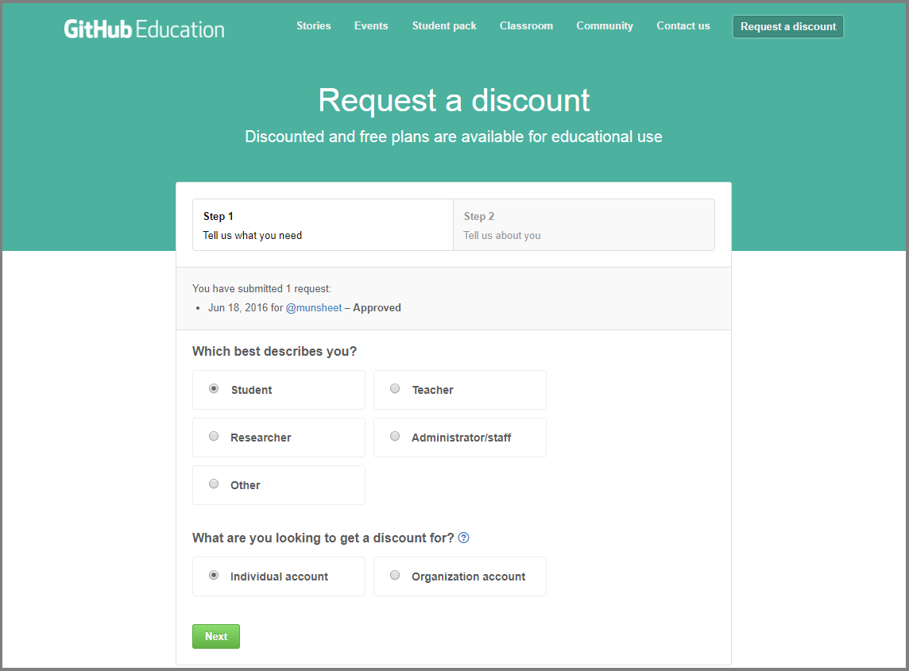

# GitHub 

> git gets easier once you get the basic idea that branches are homeomorphic endofunctors mapping submanifolds of a Hilbert space.
> <cite> Isaac Wolkerstorfer </cite>

When working on a report or a project, it is often the case that you keep separate versions either to keep track of the changes (in case you want to go back to a previous version) or to have a version for each person working on different parts of the project. As a result of this approach, you may have created or encountered a file directory attempting to preserve multiple copies or iterations of the same files:

<center>

</center>

This behavior is basically a defensive strategy attempting to remedy one or more a real or percieved threats to progress.  For example,

- you or a collaborator may have made progress on different parts of the project in separate versions of the document
- you may want to preserve an earlier state of the document (e.g. a "clean" copy before proposing edits)

Unforutunately, this type of strategy can easily lead to frustration as users lose track of which documents have the most up-to-date content for different portions of the document.  This is effectively a problem of "version control" (sometimes called "source control"). 


To respond to this problem, software has been developed to keep track of your changes by informing you on the saves you made and allowing you to go back to previous versions in order to revert those changes. This chapter discusses the features of this software as well as introducing a specific version control tools: *Git* and *GitHub*. People often use the two somewhat interchangeably in casual discussion--or use GitHub as a surrogate for the combination.  In fact, Git is the name of the version control software, and everything that Git can accomplish is possible to do without using Git**Hub** at all. GitHub is a commercial web-based version control repository hosting service which includes some additional features to make Git more user-friendly.   


## Version Control 

As mentioned above, *version control* is a system that records changes to a file or a set of files in order to keep track and possibly revert to or modify those changes over time. More specifically, it allows you to: 

- record the entire history of a file;
- revert to a specific version of the file;
- collaborate on the same platform with other people;
- make changes without modifying the main file and add them once you feel comfortable with them. 

All these features are highly important when projects start becoming more complex and/or include multiple contributors. There are several mature software tools designed for version control including, but not limited to, Git, Subversion, Mercurial, and more. Furthermore, there are several web-based version control repository hosting services such as GitLab, GitHub, Bitbucket, and more that accomplish the same goals. In the next section, we introduce use of Git and GitHub as tools for version control and collaboration.  

Rather than save many independent copies of each file--as shown earlier when the user saved many versions of a "final" document--version control software tools simply track incremental changes to the files under version control. Storing a complete record of just the bits that *change* from one version to the next is far more efficient than saving many copies of whole documents for which a majority of the content may be unchanged from one iteration to the next.  Moreover, with a complete record of every incremental change, it's just as easy for Git(Hub) to piece together the current state of a document or to rebuild a previous the state of a document at an earlier point recorded in it's development lifecycle.  In other words, it's like version control software effectively offers access to free a document editing *time machine*!


## Git and GitHub

Importantly, adding Git(Hub) to your workflow doesn't *necessarily* change that much of your workflow.  In fact, for many RStudio users who have properly configured RStudio and Git, the vast majority of your version control workflow can happen entirely within a convenient the RStudio interface.  We'll discuss specific details, but it's sufficient to note the "Git" tab shown in the upper right pane of the RStudio window shown.

<center>

</center>


The latter uses the Git platform and stores local files into a flexible folder called a "repository".

Git(Hub) uses *repositories* to organize your work, which you can think of as establishing a link between a file directory location on your computer and 

For the purposes of this course, we will be using this platform and in the following sections we will briefly describe how to install and get started with this version control platform.

Below is a video introducing GitHub. 

<center>
```{r, echo=FALSE}
knitr::include_url("https://www.youtube.com/embed/SB5YkjB9FWc")
```
</center>

### Git Setup 

To install Git, go to the [website](https://git-scm.com/downloads) and select the version which is compatible with the OS of your computer (e.g. Windows/Mac/Linux/Solaris). Once you've downloaded and installed Git, the first thing you should do is to configure it by setting your username and email address. This is important because each time you interact with the platform and upload (commit) your changes to Git, this information is used to synchronize versions and keep track of project evolution. 


#### Tell Git Who You Are

Once you have installed Git, run the `Git Bash` software and type the following code below. 

```
$ git config --global user.name "John Doe"
$ git config --global user.email johndoe@example.com
```

This is the initial configuration of your author name and email address for your commits. You may need to do this before you begin pushing and pulling with your current account information. This operation only needs to be done once when using the "--global" option because, in this case, Git will always use that information for anything you do on that system. If you want to override this with a different name or email address for specific projects, you can run the command without the "--global" option while working on those projects.


### GitHub Setup 

In order to set up GitHub, go to the [GitHub website](https://github.com/) and, for the purposes of the course, the first step is to sign up with your University email address.

```{block2, type='rmdnote'}
Your username and email can be changed at any time so, if you want to change it, you can easily do so once this course is over.
```

<center>

</center>

Once this is done, you reach `Step 2: Choose your plan` where you can choose the default plan ("Unlimited public repositories for free") and click `Continue`. The last (optional) step is `Step 3: Tailor your experience` which allows you to submit your information but this can also be skipped. 

```{block2, type='rmdnote'}
Your GitHub profile can also serve as a *resume* of your data science skills that will be highlighted by possible future projects that you save and commit.
```

### Student Developer Pack

As a student, it is possible to benefit from specific advantages when using GitHub. Indeed, once you have set up your profile you can go to this [link](https://education.github.com/discount_requests/new) and follow the steps below to set up a "student developer pack" discount request to GitHub. Through this setup it will be possible for you not only to have free *public* repositories but also to make your own *private* repositories for free. 

<center>

</center>


## GitHub Workflow 

Here is a video demonstrating the basic GitHub workflow in GitHub Desktop (initializing, committing, pushing and pulling) that we will follow for our assignments and projects. 

<center>
```{r, echo = FALSE}
knitr::include_url("https://www.youtube.com/embed/-cLn7Uk-Zo0")
```
</center>

In addition, here is a video demonstrating the basic GitHub workflow within RStudio. 
<center>
```{r, echo = FALSE}
knitr::include_url("https://www.youtube.com/embed/VOIQgViCyTo")
```
</center>

While the main features and actions to manage the workflow in GitHub are desribed in the above videos, the following paragraphs give some extra details that can be helpful to consider when working with this version-control platform.

### Branching 

In the previous section we discussed the workflow as a means of directly making changes in the so-called *master* branch which is where our original and up-to-date work is stored. However, when working with different collaborators for example, it may be appropriate to create separate branches that will avoid modifying the original one until you're sure of the changes. In this perspective, *branching* is essentially creating an environment in which we can change anything without obstructing our original document. As mentioned, this idea is very useful for group-based activities where different people are working on the same files. Once we have made all our changes and are sure of the changes, we can merge the changes to the main `master` branch. You can learn more about branching [here](https://git-scm.com/book/en/v1/Git-Branching-Basic-Branching-and-Merging) and [here](https://gist.github.com/vlandham/3b2b79c40bc7353ae95a). 


### Pull 

Before starting (or continuing) to work on your project, make sure to always review changes that another collaborator has made. Once this is done you can make sure there are no merge conflicts and you can pull (or synchronize) your local branch with the most recent version of the repository. If merge conflicts were to happen, these can still be solved but it would be preferable to avoid them generating confusion. 


### Commits 

After we have created the branch, we can start modifying the documents (add, edit, or delete) within the repository. Once these changes are made, you need to `commit` them with an informative message, explaining why a particular change is being made. These specific messages allow you to backtrack on these changes later if you decide to look at the history of any of these files and find a bug. This information is extremely important since otherwise there's little point in using version control like GitHub. [^1]

<center></center>


#### Pull Request 

If you are directly working on the master branch, please disregard this section. Else, a `pull request` may be made by the person working on the branch, so that other collaborators can discuss about the commits made in the branch. Also, there are options for conversation in which they can review and comment directly onto the code as well. 


### Push or Merge 

Once you have either made the commits on your master branch or have the pull request confirmed by other collaborators, you can merge or push the changes into the remote master branch. This means that the version of the repository online will have your updated code and documents. This will be the final step to the cycle of the workflow after which we can clear and repeat the above procedure.  

### Merge Conflicts 

Merge conflicts often occur when two different collaborators make different changes to the same line of a file, and also can happen when a file that is meant to be modified is deleted (although these may not be the only situations). To resolve these conflicts, we must directly edit the documents making sure potential conflicts are discussed before merging or pushing to the master branch, since merge conflicts often occur from miscommunication within groups. 


## GitHub Workflow on Command Line / Git Bash 

Here are commands that we can use within `Git Bash` if we are more comfortable working on the command line. 

| Command                        | Function                                      |
|--------------------------------|-----------------------------------------------|
| git init                       | Create a **local** repository                 |
| git branch "newbranch"         | Create a new branch with given name           |
| git checkout "newbranch"       | Switch to specified branch                    |
| git status                     | List all the files that you have modified     |
| git add -A                     | Add **all** files to staging                  |
| git commit -m "commit message" | Commit staged changes to **local** repository |
| git push                       | Commit saved changes to **remote** repository |
| git pull                       | Update changes from the **remote** repository |

However, it is better for us to startby using more graphical user-interface options since they allow us to better understand what is going on. You **do not** want to follow this example[^2]...

<center></center>

It is always important to know what is happening when we create, change, push, branch and pull from a repository.


## Issues 

*Issues* are a very good way to keep track of group tasks, bugs and announcements for your projects within GitHub. Below is a basic video introducing `issues` in GitHub. 

<center>
```{r, echo = FALSE}
knitr::include_url("https://www.youtube.com/embed/HRikDvXEpVM")
```
</center>


## Slack Integration 

Slack is a platform created to communicate between group members, allowing for both direct individual messages as well as group messages. More information on how to use Slack can be found in this [Slack Tutorial](https://get.slack.help/hc/en-us/articles/218080037-Getting-started-for-new-members).

An added benefit of using Slack is that it can be integrated with GitHub in such a way that notifications will be posted to the group whenever someone pushes or makes a pull request. More information on GitHub integration with Slack can be found [here](https://get.slack.help/hc/en-us/articles/232289568-Use-GitHub-with-Slack). 

A more detailed video providing a demonstration on the use of Slack in a real-life setting can be found below.

<center>
```{r, echo = FALSE}
knitr::include_url("https://www.youtube.com/embed/PpnFCp4Wr_g")
```
</center>


## Additional References 

Below are some supplemental references that can support you in a better use of GitHub.

- [GitHub Introduction with RStudio](https://www.r-bloggers.com/rstudio-and-github/)
- [GitHub Workflow](https://guides.github.com/introduction/flow/)
- [GitHub on Command Line (video)](https://www.youtube.com/watch?v=oFYyTZwMyAg)

[^1]: https://xkcd.com/1296/
[^2]: https://xkcd.com/1597/