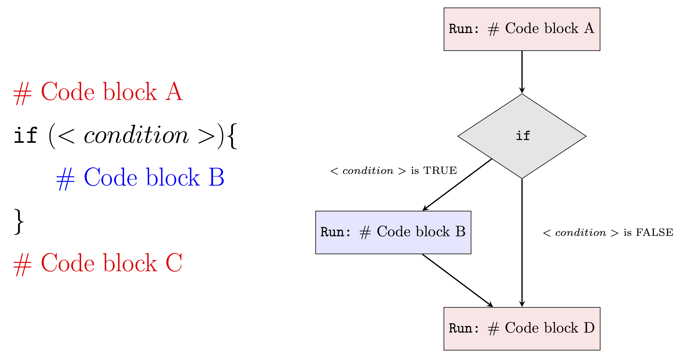
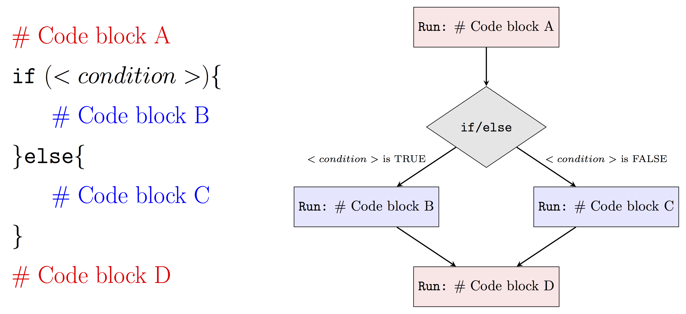
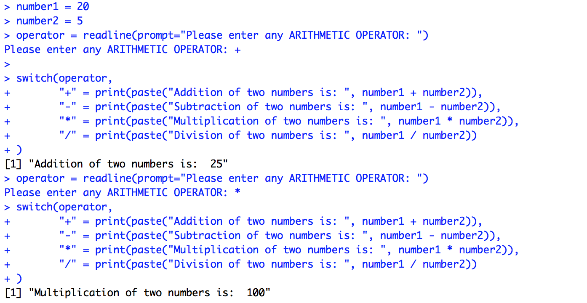
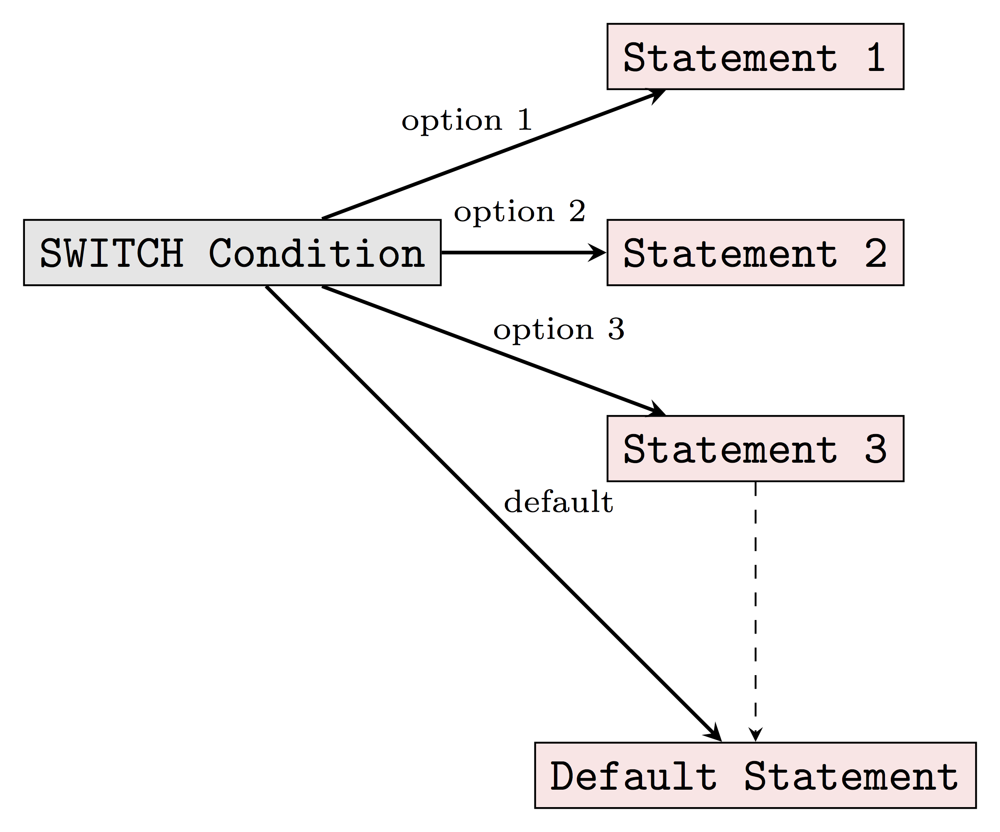
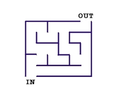
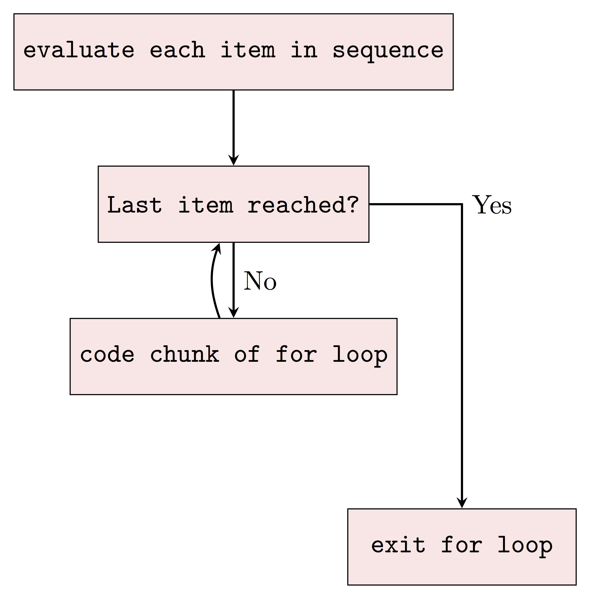
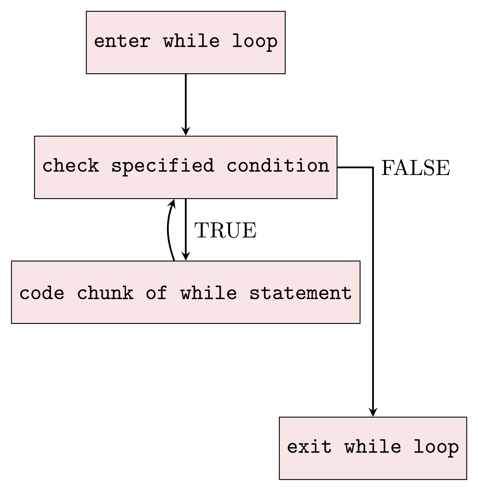

# Control Structures {#control}

## Introduction

When you're building a larger or more complex program than the examples we considered previously, we need to use various **control structures** to control the "flow" of our actions. Essentially, a control structure is a "block" of code that analyzes variables and chooses a direction in which to go based on given parameters. These pieces of code represent the most basic decision-making processes in computing. 

There exist essentially two kinds of control structures. 

- The first one allows to determine whether a given condition is satisfied and select an appropriate response. A simple analogy to our day-to-day life would be "**if** it's raining outside, **then** take an umbrella" (we will come back to this example in the next section). 
- The second kind of control structure allows to repeat of a block of code multiple times. For example, such an approach can be used to convert a color image to a gray-scale by applying the same operation(s) (i.e. same code) to each pixel of the image. In this chapter, we will first discuss the two kinds of control structures previously mentioned and then present various examples to help build our intuition.

<!-- Just like in our daily life, we need to place conditions in which we manipulate our behavior. Statistical programming also fundamentally works in the same way. We program specific behaviors for the program to follow to obtain the statistics that we may need for various tasks like regression and bootstrapping. -->

## Selection control statements {#selcontrostat}

Suppose that we are interested in creating a simple code to check if it rained over the last hour and, if this is the case, lead us to decide whether we should take an umbrella today. To write such a code we essentially need three things:

1) Find out how much it rained in the last hour at our location. Such information is now easily accessible through various websites and we can for example used the R package `rwunderground` to access this information. Note that you will need to create an account and request an API key before being able to use it (see [package documentation](https://cran.r-project.org/web/packages/rwunderground/rwunderground.pdf) for more details). Then, the amount of precipitation (in inches) in the last hour can be retrieved using the code below:

```{r, echo=FALSE, message=FALSE, warning=FALSE, include=FALSE}
library(rwunderground)
set_api_key("8fc6fd48b2db3a55")
```

```{r, warning=FALSE, message=FALSE}
library(rwunderground)
(rain <- conditions(set_location(zip_code = "16802"), message = FALSE)$precip_1hr)
```

2) Construct a logical (or Boolean) variable created from the variable `rain` to assess whether or not an umbrella is needed. For example, we can say that if we see signs of rain in the last hour, then we should take an umbrella. This can be done using the code below and in Section \@ref(logical_operators) we will discuss how to construct logical variables in more detail.

```{r}
(umbrella <- rain > 0)
```

3) Finally, we need to select operators based on the logical variables constructed in the previous step to bring everything together. For example, we could use the `if/else` statement presented below. This simple code will print "*You should probably take an umbrella*" if the logical variable `umbrella` is `TRUE` and print "*An umbrella is probably not necessary*", otherwise.

```{r}
if (umbrella){
  print("You should probably take an umbrella")
}else{
  print("An umbrella is probably not necessary")
}
```


### Logical Operators {#sec_logical}

Logical operators are very commonly used in programming to create (or return) logical (boolean) variables. In general, logical operations take place by comparing one or more variables following specific rules. The table below summarizes the commonly used logical operators:

| Command     | Description                |   Example                           |    Result                             |
|-------------|----------------------------|-------------------------------------|---------------------------------------|
| x `>` y     | x greater than y           | `4 > 3`                             | `r 4 > 3`                             |
| x `>=` y    | x greater or equals to y   | `1 >= 1`                            | `r 1 >= 1`                            |
| x `<` y     | x less than y              | `c(12 < 20, 1 < 1)`                 | `r c(12 < 20, 1 < 1)`                 |
| x `<=` y    | x less than or equals to y | `12 <= 1`                           | `r 12 <= 1`                           |
| x `==` y    | x equal to y               | `c(2 == 2, 1 == 2)`                 | `r c(2 == 2, 1 == 2)`                 |
| x `!=` y    | x not equal to y           | `c(2 != 2, F != T)`                 | `r c(2 != 2, FALSE != TRUE)`          |
| `!`x        | Not x                      | `c(!(2 > 1), !FALSE)`               | `r c(!(2 > 1), !FALSE)`               |
| x `|| `y    | x or y (not vectorized)    | `(1 > 1) || (2 < 3)`                | `r (1 > 1) || (2 < 3)`                |
| x `| `y     | x or y (vectorized)        | `c(1 > 1, F) || c(T, 2 < 3)`        | `r c(1 > 1, F) || c(T, 2 < 3)`        |
| x `&&` y    | x and y (not vectorized)   | `TRUE && TRUE`                      | `r TRUE && TRUE`                      |
| x `&` y     | x and y (vectorized)       | `c(TRUE, T) & c(TRUE, F)`           | `r c(TRUE, T) & c(TRUE, F)`           |
| xor(x,y)    | test if only one is TRUE   | `xor(TRUE, TRUE)`                   | `r xor(TRUE, TRUE)`                   |
| `all`(x)    | test if all are TRUE       |  `all(c(T, F, F))`                  | `r all(c(T, F, F))`                   |
| `any`(x)    | test if one or more is TRUE|  `any(c(T, F, F))`                  | `r any(c(T, F, F))`                   |


```{block2, type='rmdnote'}
There is a subtle difference between `||`and `|` (or `&&` and `&`). Indeed, when using `x && y` or `x || y` it implicitly assumes that `x` and `y`are of length 1 and when these are applied to vectors **only the first elements** of each vector will be considered. For example, `c(TRUE,FALSE) || c(FALSE, FALSE)` is equivalent to `TRUE || FALSE` and will only return `TRUE`. On the other hand, `&` and `|` can be applied to vectors and `c(TRUE,FALSE) || c(FALSE, FALSE)` is equivalent to `c(TRUE || FALSE, FALSE || FALSE)` and will return `TRUE FALSE`. It is also worth mentioning that `TRUE | c(FALSE, FALSE)` is equivalent to `c(TRUE || FALSE, TRUE || FALSE)` (i.e. the `TRUE` is used twice) and will return `TRUE TRUE`. These differences are a common source of bugs. 
```

```{block2, type='rmdnote'}
When using `&` or `|` to create/return logical variables we have to be aware of something called **short-circuit evaluation** which can create bugs that may be difficult to find. Indeed, suppose that we interested in using an expression such as `x & y` and that if the variable `x` is `FALSE` then `y` will not be evaluated. The idea behind this evaluation is that, regardless of the value of `y`, the expression `x & y` should be `TRUE`. However, this implicitly assumes that `y` does not contain any mistakes and if this were indeed to be the case, this could create bugs that would be hard to find. For example, consider the expression `y = x && 2 == NULL`, then if `x` is `FALSE` `y` will be `FALSE` while if `x` is `TRUE` `y` will be `NA`, which obviously is likely to be problematic. Similarly, when considering an expression such as `x | y`, the variable `y` will only be evaluated if `x` is `FALSE`.
```


<!--
```{r}
x = c(3,6,3,4,5)
y = c(2,3,4,5,6)
x>y
```

This method outputs a vector of boolean TRUE and FALSE values that perform element-wise comparisons. Note, this is called a vectorized method, which we will further mention in more details later. `isTRUE()` checks if all the elements within the object is `TRUE`. 

```{r}
isTRUE(TRUE)
isTRUE(x>y)
```
-->

### Selection Operators 

Selection operators govern the flow of code. We can observe if/else statements everywhere, no matter what language. 

#### `if` Statements

The most basic selection operator is called an `if` statement. Essentially, an `if` statement tells R to do a certain task for a certain case. In plain English it would correspond to something like, "If this is true, do that" or as in our motivating example "If it rains take an umbrella". In R, you would say:

```{r, eval = FALSE}
if (<this is TRUE>){
  <do that>
}
```

or

```{r, eval = FALSE}
if (<it rains>){
  <take an umbrella>
}
```

In general, we can represent an `if` statement using the following diagram:

<center>

</center>

The `<conditon>` denotes a **logical** variable that is used determine if the code inside of `{ }` will be evaluated. For example, if `<condition>` is `FALSE` then our program will run `Code block A` and then `Code block C`. On the other hand, if `<condition>` is `TRUE` our program will run `Code block A`, `Code block B` and finally `Code block C`.

Below we present two examples where two `if` statements are used. In the first example, we use an `if` statement to compute the absolute value of a variable called `x`:

```{r}
x <- 4

if (x < 0){
  x <- -x
}

x
```

Now we change `x` to a negative value:

```{r}
x <- -4

if (x < 0){
  x <- -x
}

x
```

In the second example, we use an `if` statement to assess if `x` is an even number and, if this is the case, we print a simple message.

```{r}
if (x %% 2 == 0){
  print(paste(x, "is an even number"))
}
```

```{r}
x <- 3

if (x %% 2 == 0){
  print(paste(x, "is an even number"))
}
```


#### `if/else` Statements

Often when we write a program we want to tell R what to do when our condition is `TRUE` and also what to do when it is `FALSE`. Of course, we could do something like:

```{r, eval = FALSE}
if (condition){
  plan A
}

if (!condition){
  plan B
}
```

However, the above syntax is somewhat clumsy and one generally would prefer to use an `if/else` statement. In plain English it would correspond to something like, "If this is true, then do plan A otherwise do plan B". In R we would write:

```{r, eval=FALSE}
if (condition){
  plan A
}else{
  plan B
}
```

Similarly to an `if` statement, we can represent an `if/else` statement using the diagram below:

<center>

</center>

Therefore, when `<condition>` is `TRUE` our program will run `Code block A`, `Code block B` and then `Code block D` while when `<condition>` is `FALSE` it will run `Code block A`, `Code block B` and finally `Code block D`. Using this new tool we can revisit our previous example on even numbers to include a custom message in the case of an odd number. This can be done as follows:

```{r}
x <- 2

if (x %% 2 == 0){
  print(paste(x, "is an even number"))
}else{
  print(paste(x, "is an odd number"))
}
```

```{r}
x <- 3

if (x %% 2 == 0){
  print(paste(x, "is an even number"))
}else{
  print(paste(x, "is an odd number"))
}
```

#### `if/elseif/else` Statements

We can also control the flow of statements with multiple if/else statements, depending on the number of cases we consider. Typically, the more cases we have, the more else if statements. An example visualization is provided below.

<center>

</center>

#### `switch` Statement

Above we mentioned that if/elseif/else statement allowed us to choose between TRUE and FALSE when there are two options. With the above idea, when there are more than two options, we can simply use nested if else statement. What about when we have say 20 options to choose from? In this case, if we still sticks on using nested if else statement, the programming logic will be very difficult to understand. Switch statement option in R programming can help us handle this type of problems more effectively.

Before we put switch statement into case study, let's first start to understand the basic switch statement syntax in R. 

```{r, eval = FALSE}
switch (Expression,
        "Option 1" = Execute this statement when the expression result matches Option 1,
        "Option 2" = Execute this statement when the expression result matches Option 2,
        "Option 3" = Execute this statement when the expression result matches Option 3,
        ....
        ....
        "Option N" = Execute this statement when the expression result matches Option N,
        Default Statements
)
```

- The `expression` value is the condition which R will evaluate. This should be either integer or character. 
- When the `expression` value matches more than one option, the first matching statemnet will be returned.
- Besides the conditional statement, R also allows us to add the `default statement`, which will be returned when none of the listed options are matched.


With the above syntax in mind, now let's check out a simple case study with R switch statement.
```{r}
number1 = 20
number2 = 5
operator = readline(prompt="Please enter any ARITHMETIC OPERATOR: ")

switch(operator,
       "+" = print(paste("Addition of two numbers is: ", number1 + number2)),
       "-" = print(paste("Subtraction of two numbers is: ", number1 - number2)),
       "*" = print(paste("Multiplication of two numbers is: ", number1 * number2)),
       "/" = print(paste("Division of two numbers is: ", number1 / number2))
)
```

When running the above code in R, we can expect results like:
<center>

</center>


In conclusion, we can visualize the R switch statement as follows: 
<center>

</center>


### Iterative Control Statements {#iter_cont_stat}

Iterative control statements are extremly usefull R’s  method  for  repeating  a  task multiple times. For example, pretend we are trying to build a program that solves a simple maze like the one below. 

<center>

</center>

It would be pretty easy to simply draw out the possible solutions with the naked eye. However, if you were actually inside the maze, you would need to narrow your perspective and think of a strategy, like marking paths you have already visited. Suppose that we have strategy in mind to solve this problem. For example, we could consider the following approach at any given point in time:

- if there is space in front of you, go forward 
- else, if there is space on your right, turn right 
- else, if there is space on your left, turn left
- else, [all three sides (forward, left, right) are closed] turn around

This strategy could easily be programmed using the methods discussed in Section \@ref(selcontrostat) but to actually program it you would need to repeat this strategy until you escaped the maze. Your strategy could for example be written as:

```{r, eval = FALSE}
repeat (until "you are free"){
  if ("space in front of you"){
    go forward
  }else if ("space on your right"){
    turn right 
  }else if ("space on your left"){
    turn left
  }else{
    turn around
  }
}
```

Try to develop an algorithm to exit the maze presented above. Could you escape? Though it might take some time (and probably would not correspond to the fastest strategy) one can show that this method can solve any maze (assuming of course that a solution exists). In this section we discuss the elements necessary to actually program the "`repeat (until "you are free")`" part of our algorithm. 

#### `for` Loops

Let's consider the following situation:

```{r, eval = FALSE}
print(1)
print(2)
print(3)
print(4)
print(5)
print(6)
```

This seems feasible when we only need to print out the numbers from 1 to 6. What if we want to print out the numbers from 1 to 100? It is such a clumsy and tedious approach if we keep repeating `print()` line by line to do so.

For loops in R help us solve this type of problems much more effectively in only a couple lines of codes. It allows us to repeat the same part of code, or say a sequence of same instructions, under certain conditions without explicitly writing out the code everytime. For example, to do exactly the same as the above example with for loops, all we need is:

```{r}
for (number in 1:6){
  print(number)
}
```

To interpret the above for loops in plain English, we can read it as "When the number is in the sequence {1,2,3,4,5,6}, we will print this number until we exhaust all numbers in the sequence". As we can see obviously, this approach simplifies our code so much more as we only need to write the code chunk (`print()` in this case) once, not six times, not to mention when we want to print out all the numbers from 1 to 100 compared to repeating `print()` line by line for 100 times.

The basic syntax of for loops in R is as follows:
```{r, eval = FALSE}
for (some specified sequence to loop over){
  execute this statement when we still haven not reached the last item in the sequence
}
```

`Next` also helps when you want to skip for some cases in which you don't want the statement to be executed. To see how `next` works together with for loops in R, let's consider the following more mathematical example when you want to print out all the odd numbers between 1 to 10. 

```{r}
for (i in 1:10) {
  if (!i %% 2){
    next
  }
  print(i)
}
```

From the results, we notice that R automatically skip to run `print(i)` when `!i %%2` is TRUE. To interpret the above in plain English, we can read it as "if the number i cannot be divided by 2, we skip the below and consider the NEXT number in the sequence". In this case, we can still use for loops when we have some exceptional cases.

In conclusion, we can visualize the R for loops as follows: 
<center>

</center>


Up till now, we can see that for loops can simplify our work a lot when we need to execute a sequence of same instructions for multiple times. However, there are still disadvantages to use for loops in R. We may hardly notice now with only a few simple iterations to run. But indeed, R can be very slow when running iteration, especially when we need to do a lot of big iterations with big data. Sometimes we may prefer to avoid using for loops in R by using other approaches since R supports vectorization, which will allow for much faster calculations. For example, solutions that make use of loops are less efficient than vectorized solutions that make use of apply functions, such as lapply and sapply. It’s often better to use the latter. 

Apply methods are often used to make operations on some structured data. For example, let's simulate a matrix of some random samples. 

```{r}
(exp_mat = matrix(rnorm(60),ncol = 3))
```

To get the mean of each column, we can calculate each column mean separately or use a for loop. 

```{r}
# Observe what this does
mean(exp_mat)

# Calculate separately 
mean(exp_mat[,1])
mean(exp_mat[,2])
mean(exp_mat[,3])

# Using a for loop 
for(i in 1:3){
  print(mean(exp_mat[,i]))
}
```


However, using `apply`, we can do this in a very simple manner.

```{r}
apply(exp_mat, 2, mean) 
# The 2 indicates operations on columns and not rows 
```

We will see how these approaches can help accelerate our work later. 


#### `while` Statements
As an alternative of for loops, while statement in R is another approach that can help us repeat the code chunk only when specific conditions are satisfied. For example, we can use while statement to do exactly the same as above to print out all numbers from 1 to 6 as followings:

```{r}
i = 1
while (i <= 6){
  print(i)
  i = i+1
}
```

The above code can be interprented in plain English as: "Let's start with number 1. When the number i is still smaller than or equal to 6, we print it out. Then we consider the next integer of it and stop when we finish all the numbers smaller than or equal to 6."

As we can see, while statement is used to iterate until a specific condition is met. To make use of while statement in R, we introduce the basic syntax of it as following: 

```{r eval = FALSE}
while (some specified condition)
{
   statement to execute when the above condition is satisfied
}
```

Here we evaluate the condition and if it is `TRUE`, then we execute the statement inside the code chunk. Once we finish running the statement, we evaluate the condition again and exit the loops when the condition is evaluated as `FALSE`.

In conclusion, we can visualize how the while statement works in R as following:
<center>

</center>

##### A Practical Example of the `for` loop: The Bootstrap

The (non-parametric) bootstrap was introduced by Efron (1979) (**ADD REF**) as a numerical method to provide a simple estimator of the distribution of an estimator. This method became rapidly very popular since it is completely automatic, requires no theoretical derivation and is (almost) always available no matter how complicated our estimator of interest is. Moreover, most statistical methods are based on various asymptotic approximations (often through the central limit theorem) that can however deliver poor results in finite sample settings. Bootstrap techniques generally enjoy better finite sample performance while paying a price in terms of computation burden. A formal discussion of the properties of (non-parametric) bootstrap techniques is far beyond the scope of this textbook but it's actually quite simple to understand its algorithm. To motivate this discussion, suppose that we ask 10 students how much time they work at home for their STAT 297 class. Say we obtain the following results (in hours):

```{r}
student_work <- c(0, 0, 0, 0, 0, 0.25, 0.75, 0.75, 1, 1.25, 6)
```

We can compute the mean time spent

```{r}
mean_hour <- mean(student_work)
```

Moreover, we compute a simple confidence interval of the **average number** of hours spent by a student enrolled in STAT 297. Since we have no reason to believe that the number of hours spent working at home for this class is not Gaussian, we can construct an asymtotic confidence interval using:

\[
\bar{x} \pm z_{1-\alpha/2} \frac{\hat{\sigma}}{\sqrt{n}},
\]

where $\bar{x}$ is the sample mean, $\alpha$ is the significance level which delivers $z_{1-\alpha/2}$ quantile of standard Gaussian distribution and $\hat{\sigma}$ is the sample standard deviation (we assume that estimating the standard deviation has no impact on the distribution of $\bar{x}$). In R, this interval can therefore be computed as follows:


```{r}
alpha <- 0.05
n <- length(student_work)
sd_hour <- sd(student_work)
z <- qnorm(1 - alpha/2)
mean_hour + c(-1, 1)*z*sd_hour/sqrt(n)
```

Based on this confidence interval your instructor is very disappointed since the confidence interval includes 0, indicating that it is possible that the students study on average zero hours. But does this interval makes sense? The lower bound of the interval is negative implying that students can also have negative hours of study. This of course makes no sense indicating that with this sample size the asymptotic Gaussian approximation makes little sense.

To solve this issue, the (non-parametric) bootstrap is convenient and appropriate tool to compute more adequate finite sample confidence intervals. Letting $\mathbf{X} = \left[X_1 \;\; \ldots \;\; X_n\right] denote the sample (in our case `student_work`), the way the bootstrap works is as follows:

- **Step 1:** Let $i = 1$.
- **Step 2:** Construct a new sample, say $\mathbf{X}^*$, by sampling **with replacement** $n$ observations from $\mathbf{X}$.
- **Step 3:** Compute the average of $\mathbf{X}^*$ which we will denote as $\bar{X}_i$. Let $i = i + 1$ and if $i < B$ go to **Step 2** otherwise go to **Step 4**.
- **Step 4**: Compute the empirical quantiles of $\bar{X}_i$.

Here is a simple function to implement this approach:

```{r}
# Number of boostrap replications
B <- 500

# Compute the length of vector
n <- length(student_work)

# Confidence level
alpha <- 0.05

# Initialisation of 
boot_mean <- rep(NA, B)

# Step 1
for (i in 1:B){
  # Step 2
  student_work_star <- student_work[sample(1:n, replace = TRUE)]
  
  # Step 3
  boot_mean[i] <- mean(student_work_star)
}

# Step 4
quantile(boot_mean, c(alpha/2, 1 - alpha/2))
```

Based on this result your instructor is relieved since they know that, at a level of confidence of 95\%, you are spending at least more than 10 minutes on your course work.

```{block2, type='rmdnote'}
How would you modify the above code to obtain the same output using the `while` control?
```


