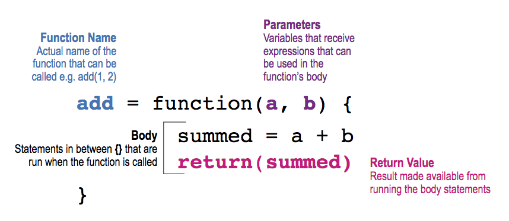

```{r setup, cache = F, echo=F}
knitr::opts_chunk$set(error = TRUE)
```

# Functions

This chapter aims at highlighting the main advantages, characteristics, arguments and structure of functions in R. As you already know, a function is a collection of logically connected commands and operations that allow the user to input some arguments and obtain a desired output (based on the given arguments) without having to rewrite the mentioned code each time that specific output is needed. Indeed, a common task in statistical research for example consists in running some simulation studies which give support (or not) to the use of a certain method of inference. In this case, it's not efficient to rewrite the code each time it is needed within a simulation study because it would lead to lengthy code and increased risk of miss-coding. 

In the following paragraphs, we will describe an example for which we will build a function that allows to respond to the related research question. Following from the previous chapter where we discussed matrix algebra in R, at the end of this chapter we will therefore implement a function that allows us to perform least-squares regression and inference using these notions of matrix algebra. Indeed, it may be interesting to understand the behavior of this estimator in different simulation settings and it would not be practical to rewrite the series of commands to obtain the least-squares estimator in each setting. For this reason, a function that implements this estimator would be more appropriate and, in fact, this function already exists in the base R functions and is called `lm()`. However, we will learn how to build our own least-squares regression function and compare its results with those of `lm()` to check if they're the same. To do so, we will consider a dataset in which linear regression is used to study the age of the universe.

**Example: The Hubble Constant**

The example dataset we will study is taken from @wood2017generalized which discusses data collected from the Hubble Space Telescope key project containing information on the velocity and relative distance of 24 galaxies. This information has been used to compute the "Hubble constant" which is a fixed parameter that links velocity and distance of celestial bodies through which it is possible to compute the age of the universe based on the "Big Bang" theory. The link is given by this simple linear relationship

\begin{equation*}
  y = \beta x ,
\end{equation*}

where $y$ represents the velocity while $x$ is the distance between galaxies. Once the Hubble constant is known, its inverse (i.e. $\beta^{-1}$) gives the age of the universe based on the big bang theory. 

Therefore we will use the abovementioned dataset to estimate Hubble's constant to then get an estimate of the age of the universe. This dataset can be found in the `gamair` package under the name `hubble` and when plotting the two variables of interest in a scatterplot there appears to be a positive linear relationship between the two variables.

```{r}
# Load gamair library and retrieve Hubble dataset
library(gamair)
data(hubble)

# Plot data
plot(y = hubble$y, x = hubble$x, col="red", main="Distance vs. Velocity", ylab = "Velocity (in km/s)", xlab = "Distance (in Megaparsecs)")
```

By the end of this chapter we will therefore be able to build a function to obtain an estimate of $\beta$ and, consequently, an estimate of the age of the universe based on the big bang theory (as well as a means of testing whether a Creationist hypothesis on the age of the universe is reasonable based on the latter theory).

## R functions

In order to build our own functions, the next sections will present the main features of functions in R by studying their main components. The following annotated example gives a brief overview of a simple function that takes two values and sums them [^1]:

<center></center>

[^1]: This scheme is taken from the STAT385 class given by James J. Balamuta at the University of Illinois at Urbana-Champaign who we thank for making it available to us.

As can be noticed, we first define the name we want to give to the function. 

```{block2, type='rmdwarning'}
It is important to make sure that the function name is specific and does not correspond to other functions that may need to be used within your work session. If two functions have the same name, just as with other R objects, the function that will be used is the last one that has been defined within the R working session.
```

Once we have defined the name, we then attribute a function to this name by using the `function` syntax to which we assign some parameters (or attributes). The latter are the values or data that the user will input in order for the function to deliver the desired output. The latter is subsequently obtained through the code constituting the *body* of the function. Once the code has made the necessary computations, the function needs to know which results are to be given as an output. This can be done, for example, using the `return` syntax.

A couple of simple examples can be functions that compute the sample mean:

```{r}
my_mean <- function (x) {
  
  average <- sum(x, na.rm = T)/sum(!is.na(x))
  
  return(average)
  
}
```

or multiplies two numbers:

```{r}
my_prod <- function (a, b) {
  
  prod <- a*b
  
  return(prod)
  
}
```

Using these functions, we can compute the sample mean of the annual precipitation in US cities (that can be found in the base R dataset `precip`):

```{r}
my_mean(precip)
```

or the product of 265 and 83:

```{r}
my_prod(265, 83)
```

Having described the general structure of an R function, let us go more into detail by analysing the three main components to R functions:

- *body*: the code lines containing the commands and operations which deliver the desired output;
- *arguments*: the inputs the user gives to the function which will determine the value or type of output of a function;
- *environment*: every R function is built within an enviroment of reference from which to source possible input values and/or other functions necessary for it to work.

The next sections will therefore go more into detail regarding these components and describe how they contribute to the correct building of a function in R.

## Creating functions in R

As an example for the following sections, let us implement a function that takes two arguments and multiplies them according to the type of object they are (i.e. scalar, vector or matrix). To do so, we will first build a skeleton for this function:

```{r, eval=F}
gen_prod <- function (...) {
  
  ...
  
}
```

As you can see, we find a name for the function we want to build, which in this case is `gen_prod`, and specify that we are going to attribute a `function` to this name. Following this assignment, we find a set of curved brackets `(...)` followed by a set of curly brackets `{...}` which should include the *arguments* and *body* of the function respectively. The next two sections will describe these two components and then discuss the third component which is the function *environment*.

### Function arguments

Before implementing a function, we first need to ask ourselves what is the basic information that we need in order to obtain the desired output. In the case of a general product, as mentioned above, the only information that is essential to perform the operation is the first element and the second element we wish to multiply. These will therefore have to be the elements we need to provide to our function in order for it to deliver the desired product and, in R, we can provide the names we want for them (say `first_arg` and `second_arg`): 

```{r, eval=FALSE}
gen_prod <- function (first_arg, second_arg) {
  
  ...
  
}

```

We will build this function such that the first argument has a higher (or equal) dimension than the second (e.g. the first is a vector while the second is another vector or a scalar). Let us suppose that `a = matrix(1:8, 4, 2)` is a 4 $\times$ 2 matrix and `b = matrix(8:1, 2, 4)` is a 2 $\times$ 4 matrix. Given that this is a matrix multiplication, these arguments need to be entered in the correct order (such that the dimensions correspond):

```{r, eval=FALSE}
gen_prod(a, b)
```

In the above syntax, we used so-called *positional matching* where arguments to the function must be entered in the same order as they are defined in the function itself. If these are entered in the wrong order the function will either give the incorrect output or give errors since the format of the input could be incompatible with the body of the function. In general, it is therefore possible to use positional matching for the first and most important arguments of a function, but it is generally suggested to use names for the arguments. For our function, we could consequently define the arguments as follows:

```{r, eval=FALSE}
gen_prod <- function (first_arg = matrix(rnorm(9), 3, 3), second_arg = matrix(rnorm(9), 3, 3)) {
  
  ...
  
}

```

You can notice that we assigned the value `matrix(rnorm(9), 3, 3)` to both of these variables. This is their "default" value which, if not specified otherwise, is used as input for the function (which in this case would deliver a 3 $\times$ 3 matrix result of the product of the two matrices whose elements are generated randomly from a standard normal distribution).

Supposing that we leave the arguments of the functions defined as above, there are different ways to specify these arguments. When calling a function, R first matches the arguments through *perfect matching*, meaning that it searches for the arguments matching the exact name (in our case "first_arg" and "second_arg"). Failing to match the arguments by their exact name, R then searches for the arguments through *prefix matching*, meaning that it uses the first letters of the argument names to match them. For example, we could call the function in the following manner:

```{r, eval=FALSE}
gen_prod(second_arg = b, first_arg = a)
```

or even

```{r, eval=FALSE}
gen_prod(fi = a, second = b)
```

So, as long we correctly specify the beginning of the argument's name and as long as it's not ambigiuous (meaning that its name cannot be confused with that of another argument), then it is possible to provide only part of the argument's name and R will recognise and correctly associate the provided value with the corresponding variable.

Finally, failing to match arguments in any of the above cases, R uses positional matching and therefore assigns values to the variables based on the order they have been entered when calling the function. We could therefore go back to using the function like we did at the start by specifying `gen_prod(a, b)`.

```{block2, type='rmdnote'}
It is possible to also specify arguments in terms of the default value of other arguments. For example, we could define the arguments as follows `a = matrix(rnorm(9), 3, 3), b = 2*a`. There are many other interesting ways of specifying argument values and they can be seen, for example, in @wickham2014advanced .
```

A special framework in which to specify arguments for a general function is the case where the arguments are objects that belong to a specific class for which a base function can be used. A simple example is the "`ts`" class of objects in R for which a function exists such that the user simply needs to call the `plot()` function (without needing to know that the function behind is the `plot.ts()` function). Let us for example suppose that some function has created a matrix whose elements represent pixel intensities of an image and that this function has assigned a class to this matrix called `"pixel"`. In the following code we therefore simply assign this class to an object called `image`.

```{r}
image <- matrix(rgamma(100, shape = 2), 10, 10)
class(image) = "pixel"
```

If we were to plot this, we would obtain the following plot:

```{r}
plot(image)
```

which simply plots the values for given coordinates. Given that this is not what we want, let us create a function that allows the user to simply use the `plot()` function which automatically recognises the object and plots a heatmap of the pixel intensity:

```{r}
plot.pixel <- function (mat) {
  
  suppressWarnings(heatmap(mat, Colv=NA, Rowv=NA, labRow=NA, labCol=NA, scale='none'))
  
}
```

If we use the `plot()` function now, we obtain the following:

```{r}
plot(image)
```

which produces the desired output simply using the general-purpose function `plot()`.

To conclude, additional arguments can be left to be specified by the user. This is the case, for example, when there is the possibility of specifying arguments for other functions that are used within the function itself. This can be done by using the argument `...` which can be added to any function and will match user-specified arguments that do not match the predefined ones in the function. An example of this type of argument is again given by the base `plot()` function in R where the predefined arguments are `x` and `y` (representing the coordinates of the points in the plot) while other optional arguments, such as graphical parameters, can be added taking advantage of the `...` argument (e.g. the user could specify the argument `type = "l"` even though this is not included among the specified arguments of the function `plot()`). This argument is particularly useful when you want to obtain values for other function arguments but don't want to specify their names in advance.

### Function body

The body of a function is simply the set of instructions and (possible) other functions that use the arguments provided by the user and computes the desired output. In our case, we need to put into practice a series of tools we learned in the previous chapter (e.g. matrix operations) in order to implement a function that delivers multiplication of objects of different nature. Let us start by delivering the product of the objects `first_arg` and `second_arg`: 

```{r}
gen_prod <- function (first_arg = matrix(rnorm(9), 3, 3), second_arg = matrix(rnorm(9), 3, 3)) {
  
  first_arg%*%second_arg
  
}
```

If the user doesn't provide any arguments to the function, this will automatically return a 3 $\times$ 3 matrix (product of two 3 $\times$ 3 matrices built using randomly generated observations from a standard normal). Otherwise, the user can enter the elements of multiplication to obtain their output of interest. For this reason, it would be appropriate that the first and second argument given by the user had compatible dimensions. But what if the latter isn't the case? When building a function body it is important to consider the possible problems ("bugs") that could arise if the inputs the user has given cannot be managed by the body of code you have written. For example, let us suppose that the user provides two 3 $\times$ 2 matrices as the first and second arguments:

```{r}
gen_prod(matrix(rnorm(6), 3, 2), matrix(rnorm(6), 3, 2))
```

In this case we see that the function outputs an error and it would be appropriate to insert a checking procedure at the start of our function in order to consider all possible objects that can be multiplied and issue explanations that are useful to the user in order for them to realise what the problem is. We could therefore add a check procedure before we perform the multiplication:

```{r}
gen_prod <- function (first_arg = matrix(rnorm(9), 3, 3), second_arg = matrix(rnorm(9), 3, 3)) {
  
  if (dim(first_arg)[2] == dim(second_arg)[1]) {
    
    first_arg%*%second_arg
    
  } else {
    
    stop("Object dimensions are not compatible")
    
  }
  
  
}
```

As you can see in the example above, we have used a control statement in which we check whether the dimensions for matrix multiplication are respected. If they are, then the function returns the desired product while it returns an error message if this is not the case. The latter is done via the use of the `stop()` function which outputs the text `Error in ...: Object dimensions are not compatible` if the dimensions are not compatible:

```{r}
gen_prod(matrix(rnorm(9),3,3), matrix(rnorm(12),4,3))
```

When a problem is detected in the body of a function, there may not necessarily be the need to interrupt the execution of the function with an error message. Indeed, in the above example, we could allow the function to check if the number of columns in the second object is compatible with that of the first and, if so, transpose the second matrix in order to obtain the correct multiplication with a warning message notifying the user that this has been done:

```{r}
gen_prod <- function (first_arg = matrix(rnorm(9), 3, 3), second_arg = matrix(rnorm(9), 3, 3)) {
  
  if (dim(first_arg)[2] == dim(second_arg)[1]) {
    
    first_arg%*%second_arg
    
  } else {
  
    if (dim(first_arg)[2] == dim(second_arg)[2]) {
      
      warning("Second object has been transposed")
      first_arg%*%t(second_arg)
      
    } else {
      
      stop("Object dimensions are not compatible")
      
    }
    
  }
  
}
```

The function `warning()` therefore allows to output a result even though there can be some errors in the inputs, notifying the user of the steps made to achieve this output (please type `?message` to understand what this function allows you to do to communicate with the user). However, let us suppose that the second object entered in this function is a vector. Given our current body in the function we would get the following output:

```{r}
gen_prod(matrix(rnorm(9),3,3), rnorm(3))
```

We obtain this error because the function `dim()` only works on matrices (not vectors or scalars), therefore we can anticipate this problem by making sure that all objects are considered as matrices:

```{r}
gen_prod <- function (first_arg = matrix(rnorm(9), 3, 3), second_arg = matrix(rnorm(9), 3, 3)) {
  
  first_arg <- as.matrix(first_arg)
  second_arg <- as.matrix(second_arg)
  
  if (dim(first_arg)[2] == dim(second_arg)[1]) {
    
    first_arg%*%second_arg
    
  } else {
  
    if (dim(first_arg)[2] == dim(second_arg)[2]) {
      
      warning("Second object has been transposed")
      first_arg%*%t(second_arg)
      
    } else {
      
      stop("Object dimensions are not compatible")
      
    }
    
  }
  
}
```

which consequently gives us

```{r}
gen_prod(matrix(rnorm(9),3,3), rnorm(3))
```

Finally, a last check that can be made is whether the second argument is a scalar. Indeed, if the first argument is not scalar, our function would not perform a multiplication:

```{r}
gen_prod(matrix(rnorm(9),3,3), rnorm(1))
```

although we can always multiply a scalar by a matrix or a vector. Therefore we can add one last control statement:

```{r}
gen_prod <- function (first_arg = matrix(rnorm(9), 3, 3), second_arg = matrix(rnorm(9), 3, 3)) {
  
  first_arg <- as.matrix(first_arg)
  second_arg <- as.matrix(second_arg)
  
  if(dim(second_arg)[1]==1 & dim(second_arg)[2]==1) {
    
    first_arg*second_arg[1]
    
  } else {
    
    if (dim(first_arg)[2] == dim(second_arg)[1]) {
    
      first_arg%*%second_arg
    
    } else {
  
      if (dim(first_arg)[2] == dim(second_arg)[2]) {
      
        warning("Second object has been transposed")
        first_arg%*%t(second_arg)
      
      } else {
      
        stop("Object dimensions are not compatible")
      
      }
    
    }
    
  }
  
}
```

which allows us to have

```{r}
gen_prod(matrix(rnorm(9),3,3), rnorm(1))
```

```{block2,  type='rmdimportant'}
Additional check procedures should be carried out in order to understand if the first object has equal or higher dimensions compared to the second (although the user should be made aware of this in the description of the function). However we leave this exercise to the reader since it would simply be redundant in the message conveyed on programming the body of a function. 
```

As you can see, the body of a function can rapidly become lengthy and complex when adding control statements and computations to it. This can become an issue if you program a complex function and then have to share it with a collaborator or modify it after some time you haven't used it. It is therefore good practice to comment your functions and make sure that the objects consisting in the output of your function are clear to someone who reads the function. In the latter case, the `return()` function makes sure that only the objects that you're interested in are returned to the user (avoiding that eventual unassigned and unimportant values are returned).

```{r, eval=FALSE}
gen_prod <- function (first_arg = matrix(rnorm(9), 3, 3), second_arg = matrix(rnorm(9), 3, 3)) {
  
  # Make sure that all objects are considered as matrices
  first_arg <- as.matrix(first_arg)
  second_arg <- as.matrix(second_arg)
  
  # Check if second argument is a scalar and, if so, return product (prod)
  if(dim(second_arg)[1]==1 & dim(second_arg)[2]==1) {
    
    prod <- first_arg*second_arg[1]
    
  } else {
    
    # Check if the objects have compatible dimensions and, if so, return product (prod)
    if (dim(first_arg)[2] == dim(second_arg)[1]) {
    
      prod <- first_arg%*%second_arg
    
    } else {
  
      # Check if other dimensions are compatible if the initial ones are not and, if so, transpose the second object and return product (prod) with warning for the user
      if (dim(first_arg)[2] == dim(second_arg)[2]) {
      
        warning("Second object has been transposed")
        prod <- first_arg%*%t(second_arg)
      
      } else {
      
        # Output an error message if none of the dimensions are compatible
        stop("Object dimensions are not compatible")
      
      }
    
    }
    
  }
  
  return(prod)
  
}
```

## Function environment

Generally speaking, an environment is a virtual space in which certain names are associated to specific objects and values. The main characterstics of an environment are the following (see [Wickham: Environments](http://adv-r.had.co.nz/Environments.html)):

* Every name in an environment is unique
* Every environment has a parent

The second characteristic means that when working within a given environment, you're also working in an environment (parent) which includes that environment. For example, in R the usual environment one works in is the "global environment" and its parent is the last package that has been loaded in the R session while the "base environment" is a special case of the global environment and is the environment of the base package (whose parent is the empty environment).

Within this structure, also functions have their own types of environments. Based on this structure, functions will look for the names of objects (and associated values) through scoping methods that start within the function's environment and then, if these are not found, proceed to looking for the names in the parent environments. The types of environments for R functions are the following:

* Enclosing: this is the environment in which the function was created (usually the global environment) and each function only has one enclosing environment
* Binding: this is the environment in which the function is associated to a given name (usually the enclosing and binding environment are the same)
* Execution: this environment is created each time a function is called and in which the objects created by this function during execution are stored
* Calling: this environment is associated with the execution environment and reports the environment in which a function was called

First of all, the enclosing environment of a function can be found by using the `environment()` function:

```{r}
environment(gen_prod)
```

With this function therefore informs the user on the enclosing environment and its main difference with the binding environment consists in the fact that the first determines how to find values (lexical scoping) while the second determines how to find the function. The reason for this separation (at least one of the main reasons) lies in the need to separate package namespaces. By the latter we mean, for example, the case where packages have the same names for different functions, allowing to preserve the name of the function in the enclosing environment unless otherwise specified. An example can be given with the `var()` function (to compute the variance) which uses the `missing()` function (in the base package) to check if a value is specified as an argument to a function (check with `?missing`). Let us suppose we compute the variance of a vector:

```{r}
x <- c(2,4,5,3,7,9)
var(x)
```

Let us now create another function called `missing` in the global environment which takes `x` as an argument but only returns 100. After this, we execute the code above again:

```{r}
missing = function (x) 100
x <- c(2,4,5,3,7,9)
var(x)
```

The result is always the same although the `var()` function would have halted execution if it had considered our own `missing()` function. This is possible thanks the to the package namespace which keeps packages independent through the separate use of enclosing and binding environments.

Finally, the execution environment allows to create a temporary environment in which the function can create its objects without affecting the environment in which it is created and called. For example, suppose that we call our `gen_prod` function but, before doing so, we define an object called `prod` and assign a value to it:

```{r}
prod <- 1
```

We know that our `gen_prod()` function creates an object with the same name and, according to standard R programming rules, the new object with the same name should overwrite the previous one:

```{r}
output <- gen_prod(matrix(rnorm(100), 10, 10), matrix(rnorm(100), 10, 10))
prod
```

As can be seen, although our `gen_prod()` function defines the object `prod`, this quantity remains in the execution environment and does not affect or modify the environment in which is it called (calling environment) and is removed once the function has completed execution.

## Example (continued): Least-squares function

We now have all the elements and information we need to implement our linear regression function. To do so we need to understand the algebra behind least squares and make use of the matrix operations in R explained in the previous chapter. While the latter has already been investigated, click on the button below to review the algebra that underlies least squares regression.

<button id="hidebutton1">The Algebra behind Least-Squares Inference</button>
<div id="hideclass1">
Based on the linear algebra behind least-squares regression, let us implement a function that delivers inference on the parameter vector $\boldsymbol{\beta}$ and therefore define the skeleton of this R function:

```{r, eval=FALSE}
my_lm <- function (...) {
  
  ...
  
}

```

As you can see, we find a name for the function we want to build, which in this case is `my_lm`, and specify that we are going to attribute a `function` to this name. Following this assignment, we find a set of curved brackets `(...)` followed by a set of curly brackets `{...}` which should include the *arguments* and *body* of the function respectively. While the *body* of a function simply corresponds to all the command lines (and other functions) that are used to deliver an output, the next sections will tackle function arguments as well as other important aspects such as their environment and attributes.

In the framework of linear regression the goal is to explain an $n \times 1$ vector of observations $\mathbf{y}$  (representing the response variable) through a linear combination of $p$ explanatory variables (or predictors or covariates) that are stored in an $n \times p$ matrix $\mathbf{X}$. More specifically, the framework is the following:
$$\mathbf{y} = \mathbf{X}^T\boldsymbol{\beta} + \mathbf{\epsilon}$$,
where $\boldsymbol{\beta}$ is the $p \times 1$ parameter vector of interest that links the covariates with the response variable while $\mathbf{\epsilon}$ is the $n \times 1$ random error vector with null expectation and variance $\sigma^2$.

When we collect data for the purpose of linear regression, the unknown terms in the above setting are the parameter vector $\boldsymbol{\beta}$ and the variance parameter $\sigma^2$. In order to estimate $\boldsymbol{\beta}$, assuming that the matrix $\left(\mathbf{X}^T \mathbf{X}\right)^{-1}$ exists, the least-squares estimator for it is given by:

\begin{equation}
  \hat{\boldsymbol{\beta}} = \left(\mathbf{X}^T \mathbf{X}\right)^{-1} \mathbf{X}^T \mathbf{y}
(\#eq:lsformula)
\end{equation}

In the comment box below, we derive Eq. \@ref(eq:lsformula). If you're not familiar with such calculations we suggest you read some introduction to linear regression (see for example @seber2012linear).

```{block2, type='rmdtip'}
The least-square estimator $\hat{\boldsymbol{\beta}}$ is given by

\begin{equation*}
 \hat{\boldsymbol{\beta}} = \operatorname{argmin}_{\boldsymbol{\beta}} \; \left( \mathbf{y} - \mathbf{X}\boldsymbol{\beta} \right)^T \left( \mathbf{y} - \mathbf{X} \boldsymbol{\beta} \right) 
\end{equation*}

The first step of this derivation is to reexpress the term $\left( \mathbf{y} - \mathbf{X}\boldsymbol{\beta} \right)^T \left( \mathbf{y} - \mathbf{X} \boldsymbol{\beta} \right)$ as follows:

\begin{equation*}
    \left( \mathbf{y} - \mathbf{X}\boldsymbol{\beta} \right)^T \left( \mathbf{y} - \mathbf{X} \boldsymbol{\beta} \right) =  \mathbf{y}^T\mathbf{y} +  \boldsymbol{\beta}^T \mathbf{X}^T \mathbf{X} \boldsymbol{\beta} - 2 \boldsymbol{\beta}^T \mathbf{X}^T \boldsymbol{y}.
\end{equation*}

In case you were suprizied by the term $2 \boldsymbol{\beta}^T \mathbf{X}^T \boldsymbol{y}$ remeber that a scalar can always be transposed without changing its value and therefore we have that $ \boldsymbol{\beta}^T \mathbf{X}^T \boldsymbol{y} =  \boldsymbol{y}^T \mathbf{X}  \boldsymbol{\beta}$. Now, our next step is to the following derivative 

\begin{equation*}
  \frac{\partial}{\partial \, \boldsymbol{\beta}} \; \left( \mathbf{y} - \mathbf{X}\boldsymbol{\beta} \right)^T \left( \mathbf{y} - \mathbf{X} \boldsymbol{\beta} \right).
\end{equation*}

To do this we should keep in mind the following results

\begin{equation*}
  \frac{\partial}{\partial \, \boldsymbol{\beta}} \; \boldsymbol{\beta}^T \mathbf{X}^T \boldsymbol{y} =   
   \boldsymbol{y}^T \mathbf{X},
\end{equation*}

and

\begin{equation*}
  \frac{\partial}{\partial \, \boldsymbol{\beta}} \; \boldsymbol{\beta}^T \mathbf{X}^T \mathbf{X} \boldsymbol{\beta} =  2 \boldsymbol{\beta}^T \mathbf{X}^T \mathbf{X}.
\end{equation*}

The proof of these two results can for example be found in Propositions 7 and 9 of [Prof. Barnes' notes](http://www.atmos.washington.edu/~dennis/MatrixCalculus.pdf). Using these two results we obtain

\begin{equation*}
  \frac{\partial}{\partial \, \boldsymbol{\beta}} \; \left( \mathbf{y} - \mathbf{X}\boldsymbol{\beta} \right)^T \left( \mathbf{y} - \mathbf{X} \boldsymbol{\beta} \right) = 2 \boldsymbol{\beta}^T \mathbf{X}^T \mathbf{X} - 2 \boldsymbol{y}^T \mathbf{X}.
\end{equation*}

By solving for the first order condition (and under some technical assumptions not discussed here) we can redefine $\hat{\boldsymbol{\beta}}$ through the follwing equation

\begin{equation*}
  \hat{\boldsymbol{\beta}}^T \mathbf{X}^T \mathbf{X} =  \boldsymbol{y}^T \mathbf{X},
\end{equation*}

which is equivalent to

\begin{equation*}
  \mathbf{X}^T \mathbf{X} \hat{\boldsymbol{\beta}} =   \mathbf{X}^T \boldsymbol{y}.
\end{equation*}

If $\left(\mathbf{X}^T \mathbf{X}\right)^{-1}$ exists, $\hat{\boldsymbol{\beta}}$ is therefore given by

\begin{equation*}
  \hat{\boldsymbol{\beta}} = \left(\mathbf{X}^T \mathbf{X}\right)^{-1} \mathbf{X}^T \mathbf{y},
\end{equation*}

which verifies Eq. \@ref(eq:lsformula).
```

The variance of $\hat{\boldsymbol{\beta}}$ is given by

\begin{equation}
\text{Var} \left(\hat{\boldsymbol{\beta}} \right) = \sigma^2 \left(\mathbf{X}^T \mathbf{X}\right)^{-1},
(\#eq:lsvar)
\end{equation}

the derivation of this result is explained in the comment box below.

```{block2, type='rmdtip'}
If we let $\mathbf{A} = \left(\mathbf{X}^T \mathbf{X}\right)^{-1} \mathbf{X}^T$, then we have

\begin{equation*}
\begin{aligned}
  \text{Var} \left(\hat{\boldsymbol{\beta}} \right) &= \text{Var} \left( \mathbf{A} \mathbf{y} \right) = \mathbf{A} \text{Var} \left(  \mathbf{y} \right) \mathbf{A}^T = \sigma^2 \mathbf{A} \mathbf{A}^T \\
  & = \sigma^2 \left(\mathbf{X}^T \mathbf{X}\right)^{-1} \mathbf{X}^T  \mathbf{X} \left(\mathbf{X}^T \mathbf{X}\right)^{-1} = \sigma^2 \left(\mathbf{X}^T \mathbf{X}\right)^{-1},
\end{aligned}
\end{equation*}

which verifies Eq. \@ref(eq:lsvar). To understand the above derivation it may be useful to remind and point out a few things:

- $\text{Var} \left( \mathbf{A} \mathbf{y} \right) = \mathbf{A} \text{Var} \left(  \mathbf{y} \right) \mathbf{A}^T$ since $\mathbf{A}$ is not a random variable.
- $\mathbf{A} \text{Var} \left(  \mathbf{y} \right) \mathbf{A}^T = \sigma^2 \mathbf{A} \mathbf{A}^T$ since$\text{Var} \left(  \mathbf{y} \right) = \sigma^2 \mathbf{I}$ and therefore we have $\mathbf{A} \text{Var} \left(  \mathbf{y} \right) \mathbf{A}^T = \sigma^2 \mathbf{A} \mathbf{I} \mathbf{A}^T = \sigma^2 \mathbf{A} \mathbf{A}^T$.
- The result $\mathbf{A} \mathbf{A}^T = (\mathbf{X}^T \mathbf{X})^{-1}$ is based on the fact that $(\mathbf{X}^T \mathbf{X})^{-1}$ is symmetric but this is not necessarily intuitive. Indeed, this follows from the fact that any square and invertible matrix $\mathbf{B}$ is such that the inverse and transpose operator commute, meaning that $( \mathbf{B}^T )^{-1} = ( \mathbf{B}^{-1} )^T$.
Therefore since the matrix $\mathbf{X}^T \mathbf{X}$ is square and (by assumption) invertible we have 
$[(\mathbf{X}^T \mathbf{X})^{-1}]^T = [(\mathbf{X}^T \mathbf{X})^{T}]^{-1} = ( \mathbf{X}^T \mathbf{X})^{-1}$.
```

In general, the residual variance is unknown and needs to be estimated. A common and unbiased estimator of $\sigma^2$ is given by

\begin{equation}
  \hat{\sigma}^2 = \frac{1}{n - p}  \left( \mathbf{y} - \mathbf{X}\hat{\boldsymbol{\beta}} \right)^T \left( \mathbf{y} - \mathbf{X} \hat{\boldsymbol{\beta}}\right) 
  (\#eq:lssig2hat)
\end{equation}

<!-- DO YOU GUYS THINK WE SHOULD SHOW THE UNBIASEDNESS IN BOX HERE. THIS IS A LITTLE MORE ADVANCED AS WE NEED TO USE PROJECTION MATRICES AND THEIR PROPERTIES. LET ME KNOW. -->

<!-- ROB COMMENT: Maybe I'd ask them to show the unbiasdness as homework either theoretically or giving numerical support to the claim (e.g. the mean of different beta hats is close to the true beta) -->

<!-- JUSTIN COMMENT: I agree with Rob's suggestion :)  -->

This chapter aims at implementing Eq. \@ref(eq:lsformula) to \@ref(eq:lssig2hat). 
</div>


Putting aside possible problems with the data that would require a more in-depth knowledge and discussion of linear regression theory, we can proceed to build a function to estimate the Hubble constant by using the velocity as the response variable $y$ and the distance as the explanatory variable $x$. Let us therefore start by implementing  Eq. \@ref(eq:lsformula) (see the "The Algebra behind Least-Squares Inference" button) within a function in order to get an estimate of $\beta$.

```{r, eval=FALSE}
my_lm = function(response, covariates) {
  
  # Define parameters
  n <- length(response)
  p <- dim(covariates)[2]
  df <- n - p
  
  # Estimate beta through Eq. (1.1)
  beta.hat <- solve(t(covariates)%*%covariates)%*%t(covariates)%*%response
  
  # Return the estimated value of beta
  beta.hat
  
}
```

As you can see, we've called our function `my_lm()` and have given the arguments `response` (the response variable $y$) and `covariates` (the explanatory variables $x$) to it.

```{block2,  type='rmdimportant'}
Before discussing the body and output of this function, we can again underline an important aspect of programming. Indeed, we defined the number of covariates (and length of the vector $\boldsymbol{\beta}$) as `p <- dim(covariates)[2]` where the function `dim()` presupposes that the object `covariates` is a matrix. Nevertheless, in our case the object `covariates` would correspond to `hubble$x` which is a vector and therefore this operation would return `NULL` as an output. When programming it is therefore important to think ahead and understand if there are any particular cases where parts of the body of your function may not work.
```

Taking into account the above note, it would be appropriate to make sure that the code in the body of the function works also in particular cases (e.g. the `covariates` object is a vector and not a matrix). In our case we therefore use the function `as.matrix()` (as seen in previous examples) which forces an object to be considered as a matrix in order for it to be used within matrix opeations.
 
```{r, eval=FALSE}
my_lm = function(response, covariates) {
  
  # Make sure data formats are appropriate
  response <- as.vector(response)
  covariates <- as.matrix(covariates)
  
  # Define parameters
  n <- length(response)
  p <- dim(covariates)[2]
  df <- n - p
  
  # Estimate beta through Eq. (1.1)
  beta.hat <- solve(t(covariates)%*%covariates)%*%t(covariates)%*%response
  
  # Return the estimated value of beta
  beta.hat
  
}
```

```{block2, type='rmdtip'}
Other checks can be introduced at the beginning of the function to make sure that the function is used correctly and obtain an appropriate output. In our case, for example, we could even introduce a check to understand if `response` and `covariates` have the same number of rows and interrupt the function execution and output an error message if this is not the case, making the user aware of this probem.
```

As you may notice, using the matrix operators we obtain an object we decide to call `beta.hat` and, to tell the function to return this value, we simply specify it without any other commands after it has been computed. A more appropriate way of defining the outputs of a function would however be the `return()` function that avoids ambiguous outputs due to mistakes in coding or others within the function body. By using `return()` we make sure the desired outputs are given and it improves readability of the function for other users (see the next example further on). 

With the `my_lm()` function we can now estimate the value for $\beta$ that we denote as $\hat{\beta}$. However, we don't have an estimate of its variance for which we would need to implement Equations \@ref(eq:lsvar) and \@ref(eq:lssig2hat) (see the "The Algebra behind Least-Squares Inference" button). We can therefore add these equations to the body of our `my_lm()` function:

```{r, eval=FALSE}
my_lm = function(response, covariates) {
  
  # Make sure data formats are appropriate
  response <- as.vector(response)
  covariates <- as.matrix(covariates)
  
  # Define parameters
  n <- length(response)
  p <- dim(covariates)[2]
  df <- n - p
  
  # Estimate beta through Eq. (1.1)
  beta.hat <- solve(t(covariates)%*%covariates)%*%t(covariates)%*%response
  
  # Estimate of the residual variance (sigma2) from Eq. (1.3)
  resid <- response - covariates%*%as.matrix(beta.hat) # compute residuals
  sigma2.hat <- (1/df)*t(resid)%*%resid
  
  # Estimate of the variance of the estimated beta from Eq. (1.2)
  var.beta <- sigma2.hat*solve(t(covariates)%*%covariates)
  
  # Return all estimated values
  return(list(beta = beta.hat, sigma2 = sigma2.hat, variance_beta = var.beta))
  
}
```

There are a couple of things to underline in the above function. Firstly, when defining the `resid` object we also used `as.matrix()` for the object `beta.hat`: this is because it can happen (as in our example) that the dimension of $\boldsymbol{\beta}$ could be equal to one (i.e. a scalar) and the matrix multiplication would not work and output an error. By using the `as.matrix()` function, we ensure that this multiplication will work also when $\boldsymbol{\beta}$ is a scalar (i.e. when there is only one covariate). A second aspect to underline is the way in which we return multiple function outputs. Indeed, in our case we decide to return not only the estimate of $\beta$ but also the estimated residual variance as well as the variance of $\hat{\beta}$. To do so, we use the `list()` function that allows to store objects of different nature (e.g. scalars, vectors, matrices) as elements of a single object while assigning names to them. For example, the estimated parameter $\beta$ will be accessible through the element name `beta` (we'll see how this done further on).

Nevertheless, in order to answer the question of our example on the Hubble constant, we would need to obtain a confidence interval for our estimated paramter $\hat{\beta}$. Although the information needed for this purpose is available to the user through the current output, it may be useful to directly provide the confidence interval since it is a piece of information which is almost always required to deliver inference on the true parameter $\beta$. Let us therefore build a confidence interval within our function for which we will assume that the estimated variance of $\hat{\beta}$ is actually the true variance (otherwise we would need to build a confidence interval based on the Student-t distribution which we will not deal with at this stage of our course). Assuming therefore that

\begin{equation*}
  \hat{\beta} \sim \mathcal{N}\left(\beta,\hat{\sigma}^2(X^TX)^{-1}\right) ,
\end{equation*}

we consequently have that the confidence interval is given by

\begin{equation}
  \left[\hat{\beta} - z_{1-\alpha/2}\sqrt{\hat{\sigma}^2(X^TX)^{-1}} \, , \, \hat{\beta} + z_{1-\alpha/2}\sqrt{\hat{\sigma}^2(X^TX)^{-1}} \right] ,
  (\#eq:cibeta)
\end{equation}

where $z_{1-\alpha/2}$ is the $(1-\alpha/2)^{th}$ quantile of the standard normal distribution.

Let us therefore add this output to our function which would require an extra argument: the confidence level. The most common confidence level used is the 95\% level which is obtained by defining the significance level $\alpha = 0.05$. We could therefore add the latter argument to our function and set its default value to 0.05.

```{r}
my_lm = function(response, covariates, alpha = 0.05) {
  
  # Make sure data formats are appropriate
  response <- as.vector(response)
  covariates <- as.matrix(covariates)
  
  # Define parameters
  n <- length(response)
  p <- dim(covariates)[2]
  df <- n - p
  
  # Estimate beta through Eq. (1.1)
  beta.hat <- solve(t(covariates)%*%covariates)%*%t(covariates)%*%response
  
  # Estimate of the residual variance (sigma2) from Eq. (1.3)
  resid <- response - covariates%*%as.matrix(beta.hat) # compute residuals
  sigma2.hat <- (1/df)*t(resid)%*%resid
  
  # Estimate of the variance of the estimated beta from Eq. (1.2)
  var.beta <- sigma2.hat*solve(t(covariates)%*%covariates)
  
  # Estimate of the confidence interval based on alpha
  quant <- 1 - alpha/2
  ci.beta <- c(beta.hat - qnorm(p = quant)*sqrt(var.beta), beta.hat + 
                 qnorm(p = quant)*sqrt(var.beta))
  
  # Return all estimated values
  return(list(beta = beta.hat, sigma2 = sigma2.hat, variance_beta = var.beta, ci = ci.beta))
  
}
```

We now have a general function to perform linear regression which has a series of scalar outputs as well as a vector (i.e. the confidence interval). Let us now complete this chapter by investigating how the `my_lm()` function performs compared to the base `lm()` function.

```{r}
# Linear regression with lm() function
fit_lm = lm(hubble$y~hubble$x-1)

# Linear regression with my_lm() function
fit_my_lm = my_lm(hubble$y, hubble$x)

# Compare outputs
manual_results = c(fit_my_lm$beta, fit_my_lm$sigma2)
base_results = c(fit_lm$coefficients, 
                     (1/fit_lm$df.residual)*t(fit_lm$residuals)%*%fit_lm$residuals)
results = cbind(manual_results, base_results)
row.names(results) = c("Beta", "Sigma")
results
```

As one can notice, the two procedures give the same outputs indicating that our `my_lm()` function well implements the least-squares regression method. We can now proceed to use our function in order to test the Creationist hypothesis on the age of the universe assuming the validity of the big bang theory. First of all, due to different measurement units we perform a unit transformation and then compute the age in years (which requires an additional transformation since the previous one gives a unit of $s^{-1}$).

```{r, eval=FALSE}
hubble.const <- fit_my_lm$beta/3.09e19 # Estimated Hubble's constant in inverse seconds
age.sec <- 1/hubble.const # Age of the universe in seconds
age.sec/(60^2*24*365) # Age of the universe in years
```

Based on this estimation, the age of the universe appears to be almost 13 billion years. However, we know that $\hat{\beta}$ is a random variable that therefore follows a distribution which, based on asymptotic statistical theory, is a normal distribution with expectaton $\beta$ and variance $\sigma^2(X^TX)^{-1}$. 

Now, let's suppose that we have a hypothesis on the age of the universe, for example that of Creation Scientists who claim that the universe is 6000 years old based on a reading from the Bible. Assuming the validity of the big bang theory, which is not the case for Creation Scientists, let us nevertheless test if their claim appears to be reasonable within this postulated framework.  For this purpose we can build a 95\% confidence interval for the true Hubble constant $\beta$ and understand if the Hubble constant implied by the postulated age of the universe falls within this interval. Firstly, we can determine this constant under the null hypothesis which can be defined as follows

\begin{equation*}
  H_0 \, : \, \beta = 163 \times 10^6 ,
\end{equation*}

since this value of $\beta$ would imply that the universe is roughly 6000 years old. The alternative hypothesis is that the true $\beta$ is not equal to the above quantity (i.e. $H_A \, : \, \beta \neq 163 \times 10^6$). In order to test the null hypothesis, we need to check whether the postulated value of $\beta$ lies within the confidence interval that we can extract from our function output as follows:

```{r}
# 95% confidence interval for the Hubble constant
fit_my_lm$ci
```

The confidence interval lies between 68 and 84 which clearly does not contain the value implied by the age of the universe postulated by the Creation Scientists. Hence, assuming the validity of the big bang theory, we can reject this hypothesis at a 95\% level. 


<script type="text/javascript" src="http://ajax.googleapis.com/ajax/libs/jquery/1.3.2/jquery.min.js"></script>
<script type="text/javascript">
    $("#hideclass1").hide();
    $("#hideclass2").hide();
    $("#hidebutton1").click(function(){
      $("#hideclass1").toggle();
    });
    $("#hidebutton2").click(function(){
      $("#hideclass2").toggle();
    });
</script>