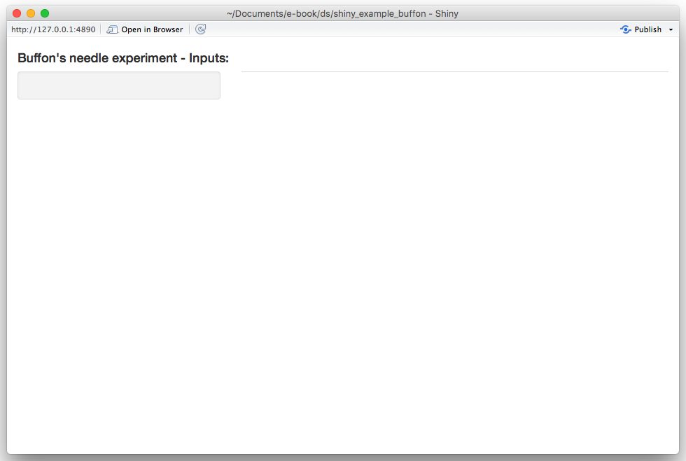
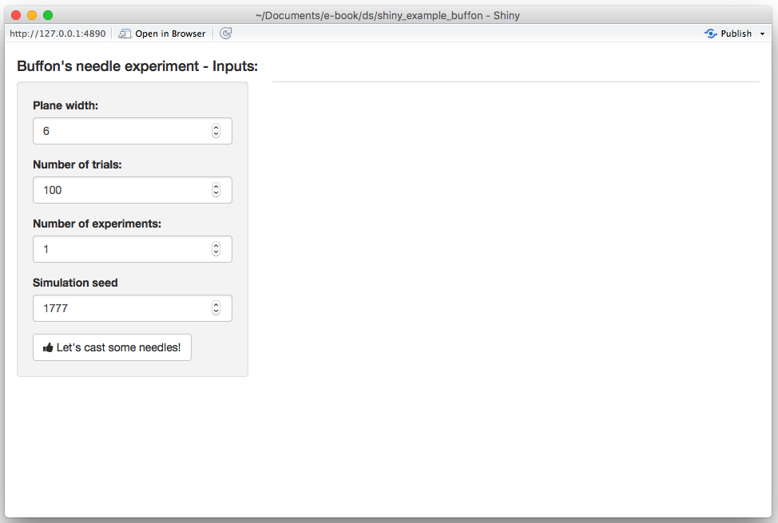
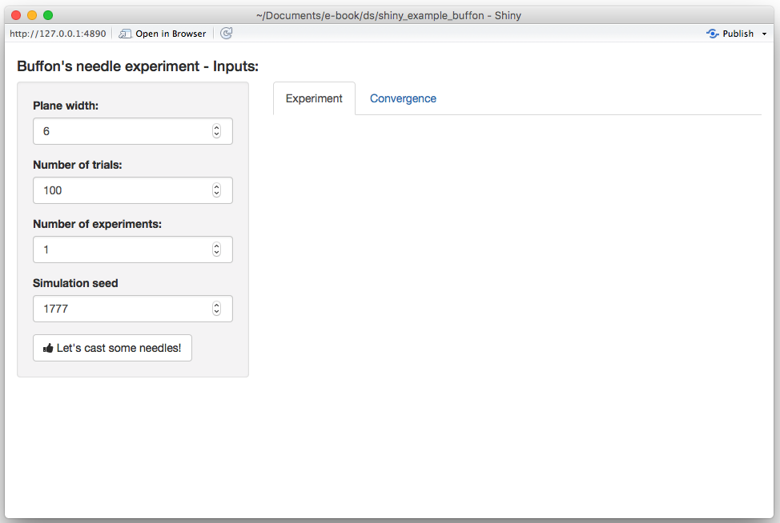
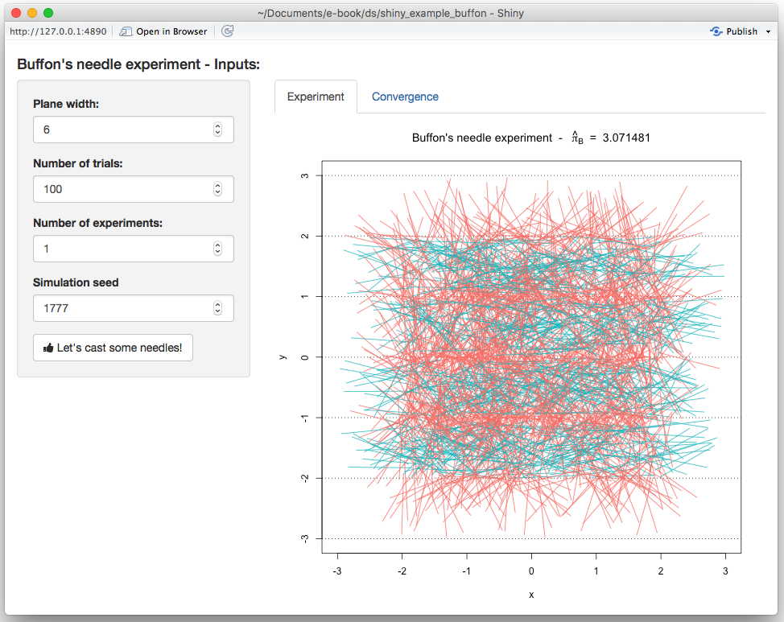

# (PART) Extending {-}

# Shiny Web Applications

Shiny is an R package that makes it easy to build interactive web apps through R. It made avaialble directly through RStudio and can be employed loading the corresponding library (i.e. `library(shiny)`).

## Introduction 

In order to build an application, we first need to understand its structure as well as the elements it needs to work. The idea is to take some input (such as parameters) and produce an output based on some code that will not be visible to the user and will connect the input and output. In this chapter we will describe how to build a Shiny application for which a brief tutorial can be found below.

```{r, echo = FALSE}
knitr::include_url("https://www.youtube.com/embed/X5uQU5XX7iU")
```

In the following paragraphs, we will provide more details on how a Shiny app can be built using the example illustrated in the tutorial.

## Step 1. Defining the R Code in the backend of the Shiny app

Before we build the interface of the web application, we need to focus on the R code which, in the framework of Shiny app development, is also commonly known as the "backend" of the application. To make sure that all the intended operations work within the application, we need to make sure that the R code that serves as the skeleton of this app works smoothly. 

For instance, based on the tutorial example, we may intend to build an application that creates a histogram based on the waiting time between eruptions of the Old Faithful geyser in Yellowstone National Park (that can be found in the R dataset `faithful`), allowing the user to specify the number of bins. Using the second column in the dataset (representing the waiting times), if we were to use the default values for the histogram function in R we would obtain the following plot.

```{r}
x <- faithful[, 2] 
hist(x)
```

However, the representation and interpretation of the data can sometimes change considerably if using different visualization parameters. Indeed, among others, the `hist()` function includes an option called `breaks` that allows the user to specify a vector giving the number of breakpoints between histogram cells. An example of how this is used and changes the representation of the data can be found below. 

```{r}
par(mfrow = c(1,2))

# Histogram with 9 bins
bins <- seq(min(x), max(x), length.out = 10)
hist(x, breaks = bins)

# Histogram with 19 bins
bins <- seq(min(x), max(x), length.out = 20)
hist(x, breaks = bins)
```

As you may notice, the number of bins created by using this option is always one unit less than the length of the specified vector (i.e. 9 and 19). Therefore, if we intend to deliver an app that allows the user to directly specify the number of bins, we should take this into account and add one unit to the input that the user has given within the `length.out` option. Ideally, we would be looking to implement a function which includes the following steps:

```{r}
input <- 10

# Histogram with input bins
bins <- seq(min(x), max(x), length.out = input + 1)
hist(x, breaks = bins)
```

where the value given to the `input` object (which is 10 in the above example) is the only value required and can be assigned by the user through the app interface. The next step will explain how to do so.

## Step 2: User Interface (UI) / Frontend 

Once we have determined the structure of the code we can now start creating the Shiny app by firstly developing the UI (or frontend) with which the user will interact. To address this part, let us take the tutorial example as a guide and inspect the part of the code related to the UI.

```{r, eval=FALSE}
# Define UI for application that draws a histogram
ui <- fluidPage(
   
   # Application title
   titlePanel("Old Faithful Geyser Data"),
   
   # Sidebar with a slider input for number of bins 
   sidebarLayout(
      sidebarPanel(
         sliderInput("bins",
                     "Number of bins:",
                     min = 1,
                     max = 50,
                     value = 30)
      ),
      
      # Show a plot of the generated distribution
      mainPanel(
         plotOutput("distPlot")
      )
   )
)
```

As can be seen, all the code that will be dedicated to creating the UI is assigned to an object called `ui` through a function called `fluidPage()` (see `?fluidPage` for more information). The two main elements of this function are the panel dedicated to the title that will appear for the app (`titlePanel()`) and the layout to give to web page which in this example is a layout with a sidebar for the user to enter their inputs and a main panel in which the outputs will be visualized (`sidebarLayout()`). In the next paragraphs we will provide more details on the possible contents to be presented in the app interface, as well as the options that can be employed to allow the user to enter the needed inputs and the options for visualizing the outputs.

### Content Creation {-}

We want to design the application in the way that it is comprehensive and also easy to interpret. Below are some often-used options of content creation that will be beneficial to know.

| Function        | Description                              |
|-----------------|------------------------------------------|
| titlePanel()    | The title of the application             |
| sidebarLayout() | Creates a sidebar layout for fluidPage() |
| sidebarPanel()  | Makes a sidebar menu                     |
| mainPanel()     | Main content area for different outputs  |


### Input Controls {-}

We also want to provide spaces so that the client can change any desired parameter. For example, in the above example, this would be the number of bins. Below are some input controls the developer can use.

| Function        | Description               |
|-----------------|---------------------------|
| numericInput()  | Number entry input        |
| radioButtons()  | Radio button selection    |
| selectInput()   | Dropdown menu             |
| sliderInput()   | Range slider (1/2 values) |
| submitButton()  | Submission button         |
| textInput()     | Text input box            |
| checkboxInput() | Single checkbox input     |
| dateInput()     | Date Selection input      |
| fileInput()     | Upload a file to Shiny    |
| helpText()      | Describe input field      |


### Output Render Controls {-}

The different type of output that is shown can be designed depending on what the developer intends it to be. Examples of these options are shown below. We advise you to follow the videos and research different options that fit the desired output. 

| Function             | Description             |
|----------------------|-------------------------|
| plotOutput()         | Display a rendered plot |
| tableOutput()        | Display in Table        |
| textOutput()         | Formatted Text Output   |
| uiOutput()           | Dynamic UI Elements     |
| verbatimTextOutput() | "as is"" Text Output"   |
| imageOutput()        | Render an Image         |
| htmlOutput()         | Render Pure HTML        |


## Step 3: Implementing the backend (server)

This step consists in adapting the structure of the code seen in Step 1 to the requirements of the Shiny app structure. This is done by creating a function which, as arguments, has an `input` and an `output` as can be seen below always using the example given in the tutorial.

```{r, eval=FALSE}
server <- function(input, output) {
   
   output$distPlot <- renderPlot({
      # generate bins based on input$bins from ui.R
      x    <- faithful[, 2] 
      bins <- seq(min(x), max(x), length.out = input$bins + 1)
      
      # draw the histogram with the specified number of bins
      hist(x, breaks = bins, col = 'darkgray', border = 'white')
   })
}
```

In this example, the function is called `server()` and contains only one object called `output` with a corresponding element called `distPlot` (`output$distPlot`). It must be underlined that the latter name must correspond to the name given for the output in the UI setup (i.e. the `distPlot` name inserted in `plotOutput("distPlot")`, see Step 2). The content of the output in this example is a plot and we therefore use the `renderPlot()` function in which we can include the code that we developed in Step 1 (with some added graphical parameters for the color of the bins and their borders). Of course, this output will depend on the input provided by the user which is used when defining the `bins` object (i.e. `bins <- seq(min(x), max(x), length.out = input$bins + 1)`). Just like for the `output` object, also in this case the `input` object has an element whose name must correspond to the name given for the input when building the UI (i.e. `sliderInput("bins",...)`).


## Step 4: Connecting frontend and backend 

Once we have developed the structure and defined the functions and objects for the UI (frontend) and backend environments, all that needs to be done is to ensure that they can communicate with each other. Using the Shiny environment, this can be quickly and easily done by using the `shinyApp()` function which takes the object defining the UI interface (`ui` in our example, see Step 2) and the function that takes the input and delivers the output (`server` in our example, see Step 3).

```{r, eval=FALSE}
shinyApp(ui = ui, server = server)
```

Therefore, having completed the UI and backend code, to launch the Shiny Web app you simply need to execute this code (or push the "Run App" button at the top of your Shiny app code).

## Step 5: Customize 


We can confidently say that shiny can be heavily customized, like how webpage applications are customized, even without explicitly using complex javascript or HTML elements. 

One of such examples are a `submitButton(...)`, in which we can run responsive output from input data using a button to initiate. More can be read from [here](https://shiny.rstudio.com/reference/shiny/1.0.4/submitButton.html). 

Another of such example is controlling the content creation process other than the default. 


## Example: Monte-Carlo Integration

<!-- STEF: To determine the structure and content of this section. -->

```{r, echo = FALSE}
knitr::include_url("https://www.youtube.com/embed/0zlWcHDKCFw")
```


## Example: Buffon's needle

In 1777, the French nobleman Georges-Louis Leclerc, Compte de Buffon (Count of Buffon) posed the following problem to the Royal Academy of Sciences in Paris [@buffon1777essai]:

> Suppose that you drop a needle of unit length on a plane ruled by the lines $y = m \; (m = 0, \pm 1, \pm 2, ...)$ - what is then the probability that the needle comes to lie in a position where it crosses one of the lines?

Compte de Buffon also provided the answer and showed that the needle will intersect lines with a predictable probability. In mathematical terms, his solution (still known today as the Buffon principle) can be stated as follows:

\begin{equation} 
\mathbb{P}(\text{intersection}) = \frac{2}{\pi}.
(\#eq:probbuffon)
\end{equation} 

If you are curious about the derivation of this result, click on the button below.

<button id="hidebutton2">Derivation - Equation (7.1)</button>
<div id="hideclass2">
```{block2, type='rmdtip'}
This proof is based on the solution of Example 4.5.8 of @grimmett2001probability. We start by letting $(X, Y)$ denote the coordinates of the point at the center of the needle and let $\Theta$ be the angle, modulo $\pi$, that lies between the needle and the horizontal lines. Next, we define the distance from the needle's center to the nearest line beneath it as $Z = Y -  \lfloor Y \rfloor$, where $\lfloor Y \rfloor$ denotes the "floor" of $Y$, i.e. the greatest integer not greater than $Y$. Since the needle is randomly casted, we have that the joint density of $(Z, \Theta)$ is given by:

\[
f_{Z, \Theta} (z, \theta) = f_{Z} (z) f_{\Theta} (\theta) = \frac{1}{\pi},
\]

for $0 \leq z \leq 1$ and $0 \leq \theta \leq \pi$. By drawing a diagram one can see that an interception occurs if and only if $(Z, \Theta) \in \mathcal{B}$, where

\[
\mathcal{B} = \left\{(z, \theta)\,: \;\; z \leq \frac{1}{2} \sin (\theta)  \;\; \text{or} \;\; 1-z \leq \frac{1}{2} \sin(\theta)\right\}.
\]

Therefore, we obtain

\[
\mathbb{P}(\text{intersection}) = \iint_\mathcal{B} \; f_{Z, \Theta} (z, \theta)\, dz \, d\theta = \frac{1}{\pi} \int_0^\pi \left(\int_0^{\frac{1}{2}\sin(\theta)} dz + \int_{1 - \frac{1}{2}\sin(\theta)}^{1} dz \right) d\theta = \frac{2}{\pi},
\]

which verifies Equation \@ref(eq:probbuffon) and concludes the proof.
```
</div>
\newline

Georges-Louis Leclerc's motivation behind this problem was to design an experiment to estimate the value of $\pi$. Indeed, if you fling a needle a large number $B$ times onto a ruled plane and count the number of times $S_B$ that the needle intersects a line, we might be able to approximate $\mathbb{P}(\text{intersection})$ and therefore $\pi$. From Equation \@ref(eq:probbuffon), we know that the proportion $S_B/B$ will be "close" to the probability $\mathbb{P}(\text{intersection})$. In fact the (weak) law of large number garantees that $S_B/B$ converges (in probability) to $2/\pi$, i.e. for any given $\varepsilon > 0$,

\[
\lim_{B \rightarrow \infty} \; \mathbb{P}\left( \left| \frac{S_B}{B} - \frac{2}{\pi} \right|  > \varepsilon \right) = 0.
\]

Thus, the estimator

\[
\hat{\pi}_B = \frac{2B}{S_B},
\]

is a plausible estimator of $\pi$. The Continous Mapping Theorem [see e.g. Theorem 1.14 of @dasgupta2008asymptotic] can (among others) be used to show that $\hat{\pi}$ is a **consistent** estimator of $\pi$ (i.e. $\hat{\pi}$ converges in probability to $\pi$). In 1777, Georges-Louis Leclerc investigated this problem and computed $\hat{\pi}_B$ by flinging a needle 2084 times, which may consitute the first recorded example of a Monte-Carlo method (simulation?) in use.

To illustrate the convergence of our estimator we could fling a needle $B$ times and compute the following estimators:

\[
\hat{\pi}_j = \frac{2j}{S_j}, \;\; j = k,\, ...., \,B
\]

where $k \ll B$. Once this is done, we could create a graph with $j$ on the horizontal axis and $\hat{\pi}_j$ on the vertical axis. Since $\hat{\pi}_B$ is a consistent estimator we should see that $\hat{\pi}_j$ tends to get closer and closer to $\pi$ as $j$ increases. In this graph we could also superimpose several experiments (recasting the needle $B$ times several times) to reinforce our argument.

The goal of this example is to create a Shiny app to visualize and illustrate Buffon's needle experiment. For this purpose, we will use the following steps:

1) **Step 1: Backend**: Create all the functions needed for the backend of our app. A possible approach is to create the following functions:
    a) `cast_needle()`: this function randomly casts a needle on plane and returns its coordinates as well as a binary variable to indicate if the needle crossed a line;
    b) `buffon_experiment()`: this function performs a Monte-Carlo experiment by flinging a large number of needles using the function `cast_needle()`;
    c) `plot.buffon_experiment()`: to visualize the experiment (i.e. show all the needles randomly dropped) and compute the estimator $\hat{\pi}_B$ for the experiment at hand;
d) `converge()`: to illustrate the convergence of the estimator by creating the graph mentioned at the end of the previous paragraph.
2)  **Step 2: Frontend**: Create widgets to collect all inputs needed by the backend:
    a) dimension of the plane on which the needles are dropped;
    b) the number of needles being used, i.e. $B$;
    c) number of experiments which is needed to illustrate the convergence of the estimator; 
    d) the seed to allow "replicable" experiments.
Aside from allowing the user to enter these variables, we will need to create two output "tabs". In the first one, we will "print" the result(s) of the experiment and in the second one we will illustrate the convergence of the estimator. Finally, we will need a button to "run" a new experiment.

3) **Step 3: Connecting frontend and backend**: In this third step we will need to connect the inputs with the outputs. Indeed, we will use the `input` list created by the widget defined in the previous step (Step 2) to create the graphs to be displayed in the two output tabs. We will also need to "activate" the button (i.e. connect the inputs to the appropriate functions) in order to run a new experiment and update the "seed" after every new experiment.

To summarize, our approach should follow the steps presented in the chart below:

<center>

</center>

In the next sections, we will discuss in detail how to program each step.

### Step 1: Backend

Let us start with the function `cast_needle()`. This function has a single input, i.e. the width of the (square) plane on which the needle is cast and returns a `list` containing:

- `$start`: the coordinates of one end of the needle;
- `$end`: the coordinates of the other end of the needle;
- `$cross`: a binary variable to indicate if the needle intercepts a line.

```{block2, type='rmdnote'}
An additional input could be added consisting in the length of the needle. However, in this example we only consider needles of unit length.
```

A possible implementation of this function is given below:

```{r}
cast_needle <- function(plane_width = 20){
  available_range <- plane_width/2 - 1 # where 1 is the length of the needle (unit)
  x_start <- runif(2, -available_range, available_range)
  angle <- runif(1, 0, 2*pi)
  x_end <- c(cos(angle), sin(angle)) + x_start # where the angles are multiplied by the needle length which is 1 in this example
  cross <- floor(x_start[2]) != floor(x_end[2])
  out <- list(start = x_start, end = x_end, cross = cross)
  out
}
```

Here is an example of the output of this function:

```{r}
needle <- cast_needle(plane_width = 4)
needle
```

and we could now for example provide the following graphical representation of this random cast:

```{r, fig.align='center', fig.width=5.5, fig.height=5.2}
plot(NA, xlim = c(-2, 2), ylim = c(-2, 2), xlab = "x", ylab = "y")
abline(h = -2:2, lty = 3)
lines(c(needle$start[1], needle$end[1]), c(needle$start[2], needle$end[2]))
```

Next, we consider the function `buffon_experiment()`. This function is based on the previous function and contains the following inputs:

- `B`: the number of needles being casted;
- `plane_width`: the width of the (square) plane on which the needles are casted;
- `seed`: the "seed" used by the random number generator (allows to replicate results);

and returns a `list` containing:

- `$start`: a $B \times 2$ matrix containing the coordinates of one end of the $B$ needles;
- `$end`: a $B \times 2$ matrix containing the coordinates of the other end of the $B$ needles;
- `$cross`: a vector of length $B$ containing boolean variables to indicate whether a needle crosses a line or not;
- `$plane`: the width of the (square) plane.

A possible implementation of this function is provided below:

```{r}
buffon_experiment <- function(B = 2084, plane_width = 10, seed = NULL){
  
  if (!is.null(seed)){
    set.seed(seed)
  }
  
  X_start <- X_end <- matrix(NA, B, 2) 
  cross <- rep(NA, B)
  
  for (i in 1:B){
    inter <- cast_needle(plane_width = plane_width)
    X_start[i, ] <- inter$start
    X_end[i, ] <- inter$end
    cross[i] <- inter$cross
  }
  
  out <- list(start = X_start, end = X_end, cross = cross, plane = plane_width)
  class(out) <- "buffon_experiment"
  out
}
```

For example, if we consider an experiment where four needles are cast, we could obtain:

```{r}
experiment <- buffon_experiment(B = 4, plane_width = 4)
experiment
```

which could be represented as

```{r, fig.align='center', fig.width=5.5, fig.height=5.2}
plot(NA, xlim = c(-2, 2), ylim = c(-2, 2), xlab = "x", ylab = "y")
abline(h = -2:2, lty = 3)
for (i in 1:4){
  lines(c(experiment$start[i,1], experiment$end[i,1]), 
        c(experiment$start[i,2], experiment$end[i,2]))
}
```

We can now write a custom `plot()` function for the output of the function `buffon_experiment()`. This function will provide a way to visualize the experiment and will compute $\hat{\pi}_B$, which will be shown in the title. A possible function is provided below:

```{r}
plot.buffon_experiment <- function(obj){
  cross <- obj$cross
  X_start <- obj$start
  X_end <- obj$end
  B <- length(cross)
  cols <- rev(hcl(h = seq(15, 375, length = 3), l = 65, c = 100)[1:2])
  
  title_part1 <- 'Buffon\'s needle experiment  -  '
  title_part2 <- ' = '
  pi_hat <- round(2/mean(obj$cross), 6)
  
  title <- bquote(.(title_part1) ~ hat(pi)[B] ~ .(title_part2) ~ .(pi_hat))
  
  plot(NA, xlab = "x", ylab = "y", xlim = c(-obj$plane/2, obj$plane/2), 
       ylim = c(-obj$plan/2, obj$plan/2), 
       main = title)
  abline(h = (-obj$plan):obj$plan, lty = 3)
  
  for (i in 1:B){
    lines(c(X_start[i,1], X_end[i,1]), c(X_start[i,2], X_end[i,2]), 
          col = cols[cross[i] + 1])
  }
}
```

Therefore, we could now run the same experiment as Georges-Louis Leclerc by flinging 2084 needles almost instanteously (which is the default value in the `buffon_experiment()` function we created):

```{r, fig.align='center', fig.width=5, fig.height=5.2}
experiment <- buffon_experiment(B = 2084)
plot(experiment)
```

Finally, we can consider the function `converge()`. Similarly to `buffon_experiment()`, the function `converge()` has the following inputs:

- `B`: the number of needles being cast;
- `plane_width`: the width of the (square) plane on which the needles are cast;
- `seed`: the "seed" used by the random number generator (allows to replicate results);
- `M`: the number of experiments.

The function returns the graph mentioned at the end of the previous section. A possible implementation of this function is provided below:

```{r}
converge <- function(B = 2084, plane_width = 10, seed = 1777, M = 12){
  
  if (B < 10){
    warning("B was changed to 10")
    B <- 10
  }
  
  pi_hat <- matrix(NA, B, M)
  trials <- 1:B
  cols <- rev(hcl(h = seq(15, 375, length = (M+1)), 
                 l = 65, c = 100, alpha = 1)[1:M])
  set.seed(seed)
  
  for (i in 1:M){
    cross <- buffon_experiment(B = B, plane_width = plane_width)$cross
    pi_hat[,i] <- 2*trials/cumsum(cross)
  }
  
  plot(NA, xlim = c(1,B), ylim = pi + c(-3/4, 3/4), type = "l", col = "darkblue",
       ylab = bquote(hat(pi)[j]),
       xlab = "j", main = "Buffon\'s needle experiment")
  grid()
  
  for (i in 1:M){
    lines(trials, pi_hat[,i], col = cols[i])
  }
  
  abline(h = pi, lwd = 2, lty = 2)
}
```

Therefore, if we were to repeat the original experiment of Georges-Louis Leclerc 20 times and compute $\hat{\pi}_j$ for each experiment we would obtain:

```{r, fig.align='center', fig.width=6, fig.height=5.2}
converge(B = 2084, M = 20, seed = 10)
```

which provides some illustrations on the convergence of the estimator.

### Step 2: Frontend

We start by constructing an "empty" Shiny app, i.e.

```{r, eval = FALSE}
# Define UI for application
ui <- fluidPage(
  
  # Application title
  titlePanel(h4("Buffon\'s needle experiment - Inputs:")),
  
  sidebarLayout(
    sidebarPanel(
      # Add inputs here!
    ),
    
    mainPanel(
      tabsetPanel(
        # Add tabs here!
      )
    )
  )
)

# Define server
server <- function(input, output) {
}

# Run the application 
shinyApp(ui = ui, server = server)
```

If you run this empty app you should obtain the result below:

<center>

</center>

We will start by adding the required input widgets by modifying the `ui` function as follows:

```{r, eval = FALSE}
# Define UI for application
ui <- fluidPage(
  
  # Application title
  titlePanel(h4("Buffon\'s needle experiment - Inputs:")),
  
  sidebarLayout(
    sidebarPanel(
      numericInput("plane", "Plane width:", 10, 6, 100),
      numericInput("B", "Number of trials:", 100, 20, 10^6),
      numericInput("M", "Number of experiments:", 1, 1, 100),
      numericInput("seed", "Simulation seed", 1777, 1, 1000000),
      actionButton("cast", "Let's cast some needles!", icon = icon("thumbs-up"))
    ),
    
    mainPanel(
      tabsetPanel(
        # Add tabs here!
      )
    )
  )
)
```

By running this update you should now obtain:

<center>

</center>

Next, we create two output tabs in which we will find the previously mentioned graphs. This can be done by again modifying the `ui`function as follows:

```{r, eval = FALSE}
# Define UI for application
ui <- fluidPage(
  
  # Application title
  titlePanel(h4("Buffon\'s needle experiment - Inputs:")),
  
  sidebarLayout(
    sidebarPanel(
      numericInput("plane", "Plane width:", 10, 6, 100),
      numericInput("B", "Number of trials:", 100, 20, 10^6),
      numericInput("M", "Number of experiments:", 1, 1, 100),
      numericInput("seed", "Simulation seed", 1777, 1, 1000000),
      actionButton("cast", "Let's cast some needles!", icon = icon("thumbs-up"))
    ),
    
    mainPanel(
      tabsetPanel(
        tabPanel("Experiment", plotOutput("exp")),
        tabPanel("Convergence", plotOutput("conv"))
      )
    )
  )
)
```

The app should now look like this:

<center>

</center>

At this point, we have completed the `ui` function and will modify the `server` in the next section.

### Step 3: Connecting frontend and backend

In this section, we will focus on the `server` function to produce the desired output. Let us start by "connecting" our output tabs defined in the `ui` function with the output in the server function. Since both outputs are graphs, we will use the function `renderPlot()` as follows:

```{r, eval = FALSE}
server <- function(input, output) {
  output$exp <- renderPlot({
    # Add graph 1 here!
  }, height = 620)
  
  output$conv <- renderPlot({
    # Add graph 2 here!
  }, height = 620)
}
```

If you re-run the app at this point our changes will have no visible effect. Next, we will focus on the first graph based on the functions `buffon_experiment()` and `plot.buffon_experiment()`. The first thing we will need is to (re-)run the `buffon_experiment()` when the user clicks on the "action" button. This can be done by adding the following lines to the `server` function:

```{r, eval = FALSE}
cast <- eventReactive(input$cast, {
    buffon_experiment(B = input$B, plane_width = input$plane, 
                      seed = input$seed)
  })
```

When this function is (re-)evaluated we want to update/create the first plot, which can be done by replacing the following part of the `server` function

```{r, eval = FALSE}
output$exp <- renderPlot({
    # Add graph 1 here!
}, height = 620)
```

with

```{r, eval = FALSE}
output$exp <- renderPlot({
    plot(cast())
}, height = 620)
```

Therefore, your `server` function should now be:

```{r, eval = FALSE}
server <- function(input, output) {
  
  # Fling some needles!
  cast <- eventReactive(input$cast, {
    buffon_experiment(B = input$B, plane_width = input$plane, 
                      seed = input$seed)
  })
  
  output$exp <- renderPlot({
    plot(cast())
  }, height = 620)
  
  output$conv <- renderPlot({
    # Add graph 2 here!
  }, height = 620)
}
```

and when reloading the app you should now see:

<center>

</center>

Similarly, we do the same thing for the second graph by adding the following lines to our `server` function:

```{r, eval = FALSE}
conv <- eventReactive(input$cast, {
    converge(B = input$B, plane_width = input$plane, 
             seed = input$seed, M = input$M)
})
```

and replacing 

```{r, eval = FALSE}
output$conv <- renderPlot({
    # Add graph 2 here!
}, height = 620)
```

with 

```{r, eval = FALSE}
output$conv <- renderPlot({
    conv()
}, height = 620)
```

After these changes, your `server` function should look like this:

```{r, eval = FALSE}
server <- function(input, output) {
  
  # Fling some needles!
  cast <- eventReactive(input$cast, {
    buffon_experiment(B = input$B, plane_width = input$plane, 
                      seed = input$seed)
  })
  
  conv <- eventReactive(input$cast, {
    converge(B = input$B, plane_width = input$plane, 
             seed = input$seed, M = input$M)
  })
  
  output$exp <- renderPlot({
    plot(cast())
  }, height = 620)
  
  output$conv <- renderPlot({
    conv()
  }, height = 620)
}
```

and when reloading the app you should now see on the second tab:

<center>

</center>

Our next step is now to update the seed every time the "action" button is pushed. To do so, we will first need to add an additional input to the `server` function called `session` which will allow us to **dynamically** update the input directly from the `server` function. Therefore, in order to randomly generate a new seed each time the user clicks on the "action" button, we can do the following:

```{r, eval = FALSE}
observeEvent(input$cast,{
    updateNumericInput(session, "seed", 
                       value = round(runif(1, 1, 10^4)))
})
```

Therefore, your final `server` function is now:

```{r, eval = FALSE}
server <- function(input, output, session) {
  
  observeEvent(input$cast,{
    updateNumericInput(session, "seed", 
                       value = round(runif(1, 1, 10^4)))
  })
  
  # Fling some needles!
  cast = eventReactive(input$cast, {
    buffon_experiment(B = input$B, plane_width = input$plane, 
                      seed = input$seed)
  })
  
  conv = eventReactive(input$cast, {
    converge(B = input$B, plane_width = input$plane, 
             seed = input$seed, M = input$M)
  })
  
  output$exp <- renderPlot({
    plot(cast())
  }, height = 620)
  
  output$conv <- renderPlot({
    conv()
  }, height = 620)
}
```

With this change, you will now observe that the seed is updated each time the "action" button is clicked. The final version of the app we have just created can be found [here](http://shiny.science.psu.edu/szg279/buffon/).

<script type="text/javascript" src="http://ajax.googleapis.com/ajax/libs/jquery/1.3.2/jquery.min.js"></script>
<script type="text/javascript">
    $("#hideclass1").hide();
    $("#hideclass2").hide();
    $("#hidebutton1").click(function(){
      $("#hideclass1").toggle();
    });
    $("#hidebutton2").click(function(){
      $("#hideclass2").toggle();
    });
</script>

