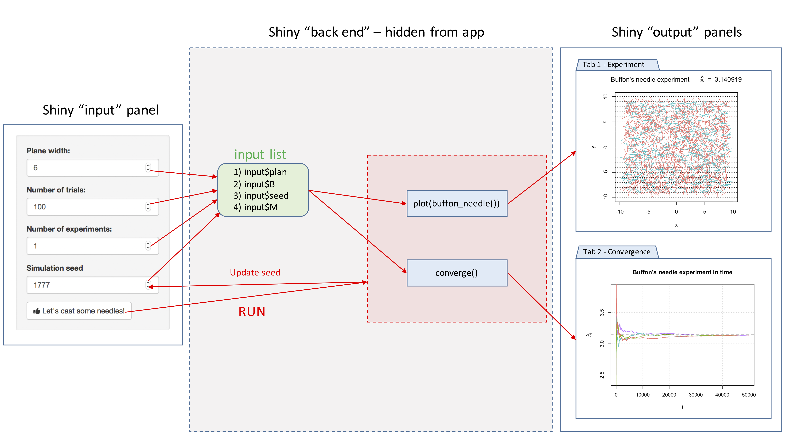

```{r setup, cache = F, echo=F}
knitr::opts_chunk$set(error = TRUE)
```

# Shiny

Shiny is an R package that makes it easy to build interactive web apps straight from R. 

## Introduction 

Before building the application, we want to know to build our application, and think more like a software engineer. We want to take some input, such as parameters, and produce output. In this chapter we will build the shiny applicaion building procedure. 

## Step 1. R Code / Server / Backend

Before we start thinking of the web application, we want to focus on the R Code, or also commonly known as the "backend" of the application. For all the intended operations to work in the application we need to make sure that the R code that serves as the skeleton operates in the way the developer want it to be. 

For example, perhaps we are trying to build an application that builds a histogram from the waiting time of the default R dataset, Old Faithful Geyser Dataset. We also want to add an option for controlling the number of bins. 

For this to work, we want to build the histogram in R and test out to see if the output is what was desired initially. Below we create the default histogram. 

```{r}
x <- faithful[, 2] 
hist(x)
```

Now we want to make sure to later add the option of creating more bins so the graph is customizable. In the `hist()` function, we see an option `breaks` that we can use to take in different inputs based on what the client wants. 

```{r}
par(mfrow = c(1,2))

# Compare the differences! 
bins <- seq(min(x), max(x), length.out = 10)
hist(x, breaks = bins)

bins <- seq(min(x), max(x), length.out = 20)
hist(x, breaks = bins)
```

## Step 2: User Interface (UI) / Frontend 

The previous information goes into a part called the "server" in the shiny application. Now we want to focus on the frontend of the application, the things we "see" and options we can interact with when we open the app. 

### Content Creation {-}

We want to design what the application so that it is comprehensive and easy to interpret. Below are some often used options of content creation that will be beneficial to know. 

| Function        | Description                              |
|-----------------|------------------------------------------|
| titlePanel()    | The title of the application             |
| sidebarLayout() | Creates a sidebar layout for fluidPage() |
| sidebarPanel()  | Makes a sidebar menu                     |
| mainPanel()     | Main content area for different output   |

### Input Controls {-}

We also want to provide space so the client can change any desired parameter. In the example explained above, this would be the number of bins. Below are some input controls the developer can use.

| Function        | Description               |
|-----------------|---------------------------|
| numericInput()  | Number entry input        |
| radioButtons()  | Radio button selection    |
| selectInput()   | Dropdown menu             |
| sliderInput()   | Range slider (1/2 values) |
| submitButton()  | Submission button         |
| textInput()     | Text input box            |
| checkboxInput() | Single checkbox input     |
| dateInput()     | Date Selection input      |
| fileInput()     | Upload a file to Shiny    |
| helpText()      | Describe input field      |

### Output Render Controls {-}

The different type of output that is shown can be designed depending on what the developer intends it to be. Examples of these options are shown below. We advise you to follow the videos and research different options that fit the desired output. 

| Function             | Description             |
|----------------------|-------------------------|
| plotOutput()         | Display a rendered plot |
| tableOutput()        | Display in Table        |
| textOutput()         | Formatted Text Output   |
| uiOutput()           | Dynamic UI Elements     |
| verbatimTextOutput() | "as is"" Text Output"   |
| imageOutput()        | Render an Image         |
| htmlOutput()         | Render Pure HTML        |

## Step 3: Connecting frontend and backend 

Once we have the elements of user interface (UI) and server, we build the application so they come together. Look at the video for more details on this process. 

## Step 4: 


## Example: Monte Carlo 


## Example: Buffon's needle


In 1777, the French nobleman Georges-Louis Leclerc, Compte de Buffon posed the following problem to the Royal Academy of Sciences in Paris (ADD REF HERE):

> Suppose that you drop a short needle on a ruled paper - what is then the probability that the needle comes to lie in a position where it crosses one of the lines?

Compte de Buffon also provided the answer and showed that the needle will intersect lines with a predictable probability. In mathematical terms, his solution (still known today as the Buffon principle) can be stated as follows (for $l \leq d$):

\[
\mathbb{P}(\text{intersection}) = \frac{2}{\pi} \times \frac{l}{d},
\]

where $l$ and $d$ denote, respectively, the length of the needle and the distance between the lines on the ruled paper. If you are curious about the derivation of this result, click on the button below.

ADD PROOF HERE

For simplicity, let us suppose that $l = d$, i.e. the length of the needle is the same as distance between the lines on the ruled paper. In this case, we obtain

\[
\mathbb{P}(\text{intersection}) = \frac{2}{\pi}.
\]

SOMETHING ABOUT MC

Therefore, we obtain

\[\hat{\pi} = \frac{2 n}{S_n}\]

One can show that $\[\hat{\pi}$ converge in probability of $\pi$, i.e.
for all $\varepsilon > 0$:

\[
\lim_{n \rightarrow \infty} \; \mathbb{P}\left( |\hat{\pi} - {\pi} | > \varepsilon \right) = 0.
\]

If you are curious click on the button below

TO DO

In the function below, we cast a needle:

```{r}
cast_needle = function(plan = 10, needle_length = 1){
  available_range = plan - needle_length
  x_start = runif(2, -available_range, available_range)
  angle = runif(1, 0, 2*pi)
  x_end = needle_length*c(cos(angle), sin(angle)) + x_start
  cross = floor(x_start[2]) != floor(x_end[2])
  out = list(start = x_start, end = x_end, cross = cross)
  out
}
```

Next, let's do many and compute $\hat{\pi}$:

```{r}
buffon_needle = function(B = 2084, plan = 10, needle_length = 1, seed = NULL){
  
  if (!is.null(seed)){
    set.seed(seed)
  }
  
  X_start = X_end = matrix(NA, B, 2) 
  cross = rep(NA, B)
  for (i in 1:B){
    inter = cast_needle(plan = plan, needle_length = needle_length)
    X_start[i, ] = inter$start
    X_end[i, ] = inter$end
    cross[i] = inter$cross
  }
  out = list(start = X_start, end = X_end, cross = cross, plan = plan)
  class(out) = "buffon_needle"
  out
}
```

Let's construct a plot function: 

```{r}
plot.buffon_needle = function(obj){
  cross = obj$cross
  X_start = obj$start
  X_end = obj$end
  B = length(cross)
  cols = rev(hcl(h = seq(15, 375, length = 3), l = 65, c = 100)[1:2])
  
  titre_part1 = 'Buffon\'s needle experiment  -  '
  titre_part2 = ' = '
  pi_hat = round(2/mean(obj$cross), 6)
  
  titre = bquote(.(titre_part1) ~ hat(pi) ~ .(titre_part2) ~ .(pi_hat))
  
  plot(NA, xlab = "x", ylab = "y", xlim = c(-obj$plan, obj$plan), 
       ylim = c(-obj$plan, obj$plan), 
       main = titre)
  abline(h = (-obj$plan):obj$plan, lty = 3)
  
  for (i in 1:B){
    lines(c(X_start[i,1], X_end[i,1]), c(X_start[i,2], X_end[i,2]), 
          col = cols[cross[i] + 1])
  }
}
```

This looks like:

```{r, fig.align='center', fig.width=5, fig.height=5.2}
experiment = buffon_needle()
plot(experiment)
```

Finally, we can illustarte the converge in prob

```{r}
converge = function(B = 2084, plan = 10, needle_length = 1, seed = 1777, M = 12){
  
  if (B < 10){
    warning("B was changed to 10")
    B = 10
  }
  pi_hat = matrix(NA, B, M)
  trials = 1:B
  cols = rev(hcl(h = seq(15, 375, length = (M+1)), l = 65, c = 100, alpha = 1)[1:M])
  
  set.seed(seed)
  
  for (i in 1:M){
    cross = buffon_needle(B = B, plan = plan, needle_length = needle_length)$cross
    pi_hat[,i] = 2*trials/cumsum(cross)
  }
  
  
  plot(NA, xlim = c(1,B), ylim = pi + c(-3/4, 3/4), type = "l", col = "darkblue",
       ylab = bquote(hat(pi)[i]),
       xlab = "i", main = "Buffon\'s needle experiment in time")
  grid()
  
  for (i in 1:M){
    lines(trials, pi_hat[,i], col = cols[i])
  }
  
  abline(h = pi, lwd = 2, lty = 2)
}
```


```{r, fig.align='center', fig.width=6, fig.height=5.2}
converge(B = 5*10^4, M = 4, seed = 10)
```


What we want:

- inputs
- 2 tabs
- buttom to draw + update seed

<center>

</center>