# R Packages

In this chapter we introduce one of the most useful tools for R programming as well as for statistical programming in general. Indeed, one of the main goals for statistical programming is to then be able to share all the code and functions that have been implemented in order to respond to a specific task. The latter may often be quite *messy* to do given that different files and functions can be present in various directories or repositories and, for example, some codes may use functions from other codes but do not load the same libraries, thereby producing execution errors.

In order to avoid the above complications (and to program in a healthy and organized manner), R allows you to create *packages* that are software platforms that collect functions as well as other files which, among others, describe these functions and provide users with documentation that allow them to understand and efficiently use these functions. Moreover, when sharing a package (or making it available within a repository) all the user needs to do is to install and load the package within an R session which then makes available the entire environment needed for all the functions included in the package to work. In a nutshell, whenever creating functions to answer a specific research interest or professional task, it is always good to do so by first creating a package within which these functions can be stored and documented.

In this chapter we will describe and explain the steps necessary to create an R package using RStudio. There are other ways and other procedures to produce an R package but in this chapter we will describe one possible way which is consistent with the approach to statistical programming that is presented in this book. As in the previous chapters, we will make use of an example to guide the reader through the different aspects of package building and, for this purpose, let us assume we want to build a package that allows a user to perform Monte-Carlo integration for any user-specificed function as well as produce plots that represent these functions as well as the integrated area. In this case, we have an extremely simple setting where, based on code used in the previous chapters, we only have the following two functions to be included in the package:

```{r}
mc_int = function(x_range, fun, B, seed = 1291){
  # A few checks
  # Check x_range
  if (length(x_range) != 2 || x_range[1] >= x_range[2]){
    stop("x_range is incorrectly specified")
  }

  # Check fun
  if (class(fun) != "character"){
    stop("fun is incorrectly specified and should be a character")
  }

  x = mean(x_range)
  test_fun = try(eval(parse(text = fun)), silent = TRUE)
  if (class(test_fun) == "try-error"){
    stop("fun cannot be evaluated")
  }

  # Check B
  if (B < 1){
    error("B is incorrectly specified")
  }

  # Set seed
  set.seed(seed)

  # Compute the length of the interval, i.e. (b-a)
  interval_length = diff(x_range)

  # Let's draw some uniforms to get Ui and Xi
  Ui = runif(B)
  Xi = x_range[1] + Ui*interval_length

  # Compute \hat{I}
  x = Xi
  I_hat = interval_length*mean(eval(parse(text = fun)))

  # Compute \hat{I}_2
  I2_hat = interval_length*mean((eval(parse(text = fun)))^2)
  var_I_hat = (interval_length*I2_hat - I_hat^2)/B

  # Output list
  out = list(I = I_hat, var = var_I_hat,
             fun = fun, x_range = x_range, B = B)
  class(out) = "MCI"
  out
}

plot.MCI = function(x, ...){
  obj = x
  x_range = obj$x_range
  fun = obj$fun

  Delta = diff(x_range)
  x_range_graph = c(x_range[2] - 1.15*Delta, x_range[1] + 1.15*Delta)
  x = seq(from = x_range_graph[1], to = x_range_graph[2], length.out = 10^3)
  f_x = eval(parse(text = fun))
  plot(NA, xlim = range(x), ylim = range(f_x), xlab = "x", ylab = "f(x)")
  grid()
  title(paste("Estimated integral: ", round(obj$I,4),
              " (", round(sqrt(obj$var),4),")", sep = ""))
  lines(x, f_x)
  x = seq(from = x_range[1], to = x_range[2], length.out = 10^3)
  f_x = eval(parse(text = fun))
  cols = hcl(h = seq(15, 375, length = 3), l = 65, c = 100, alpha = 0.4)[1:3]
  polygon(c(x, rev(x)), c(rep(0, length(x)), rev(f_x)),
          border = NA, col = cols[1])
  abline(v = x_range[1], lty = 2)
  abline(v = x_range[2], lty = 2)
}
```

Hence, the package will contain: 

- the `mc_int()` function: that computes an approximation of the integral of the function `fun` with respect to `x` within the range `x_range` via Monte-Carlo integration using uniform sampling;
- the `plot.MCI()` function: a class function that will plot the object that is created as an output of the `mc_int()` function. 

An example of use of these functions and their output is the following:

```{r}
obj = mc_int(x_range = c(0,1), fun = "x^2*sin(x^2/pi)", B = 10^3)
plot(obj)
```

Now let us suppose that we want to make these functions available to the general user who may be looking for tools that allow them to perform Monte-Carlo intergration. Although we only have two functions, it would be appropriate to provide a single platform containing these functions along with documentation that describes the contents and use of these functions. Therefore, in the following sections we will describe the process to develop an R package for these functions which is consquently valid for any collection of functions needed to perform a specific task.

## Basic steps

As mentioned earlier, the process to develop an R package that is described in this chapter is not strict or unique since there are many different ways of structuring and building them. However, in this book we will describe one way of building a package which is consistent with the approach to statistical programming that has been described thus far. Keeping this in mind, below the reader can find the basic steps to build an R package. 

### Step 1: Create an "empty" R package

The first step to create an R package using RStudio is to build the *skeleton* of the package which contains the basic folders and files that are needed. To do so, within RStudio you should select to create a "New Project..." from the File menu within RStudio as shown below. 

<center>
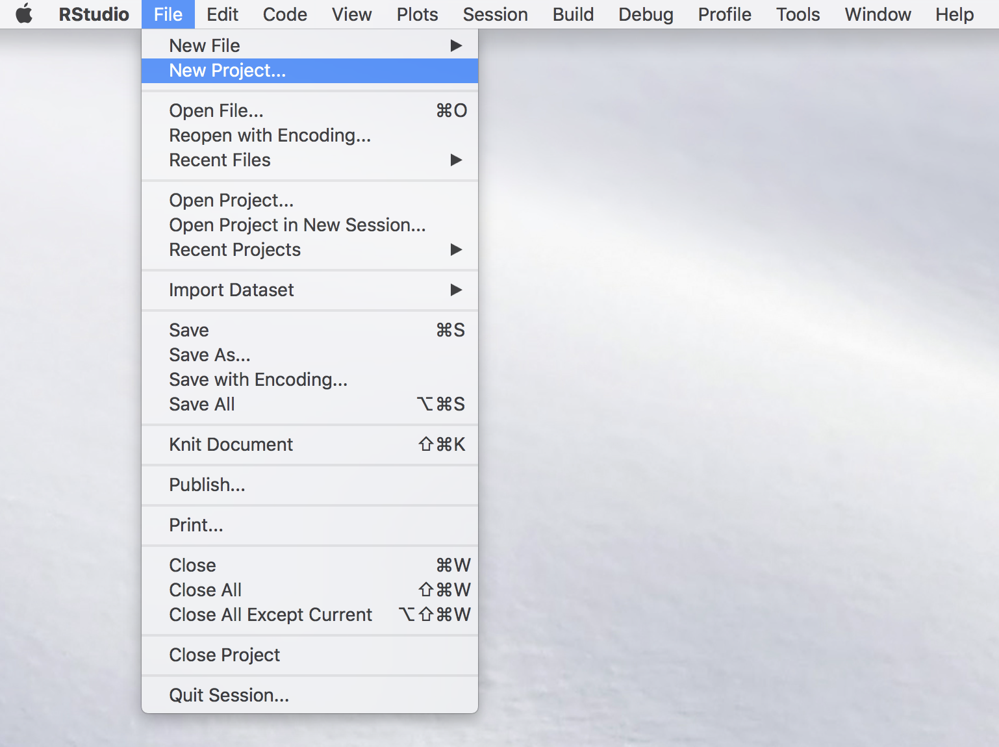
</center>

Once this is done you will see a new window with different options (see image below) among which you select "New Directory" (unless you wish to create the package within an existing directory which is usually not convenient for purpose of organization).

<center>
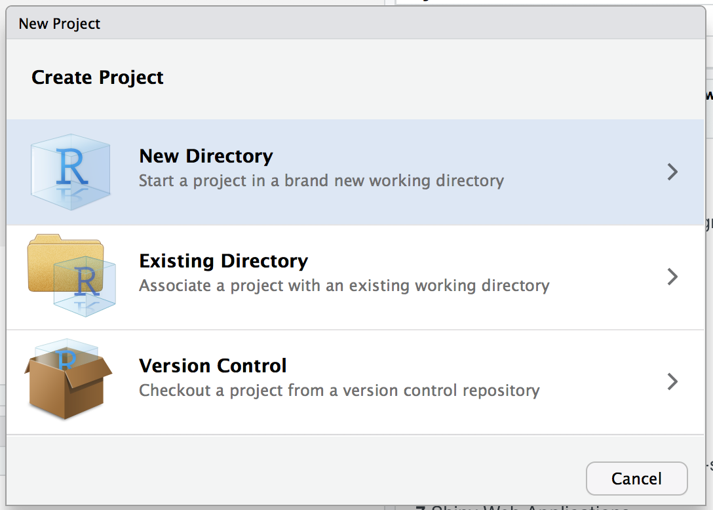

Again, another window will appear in which RStudio asks you for the type of project you wish to create and, quite intuitively, you should select the "R Package" option as shown below.
</center>

<center>
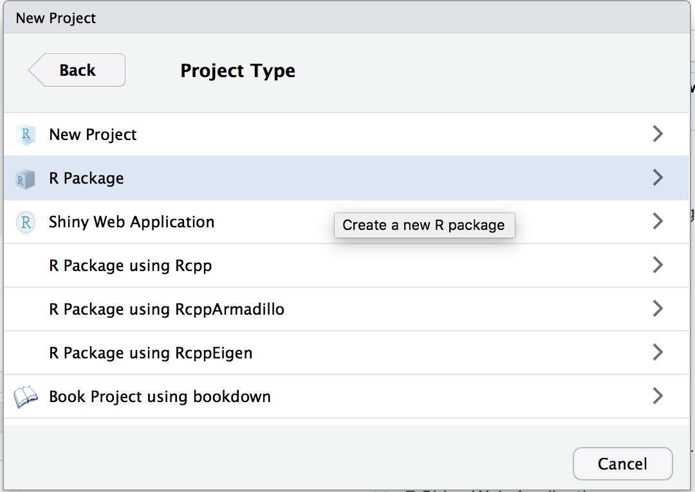
</center>

By doing so you prompt a successive window in which it is possible to name our package which, in the example below, will be `demo`. In the context of this chapter we will not consider the other options that are made available to the user (for more details you can check [this link](http://r-pkgs.had.co.nz/)).

<center>
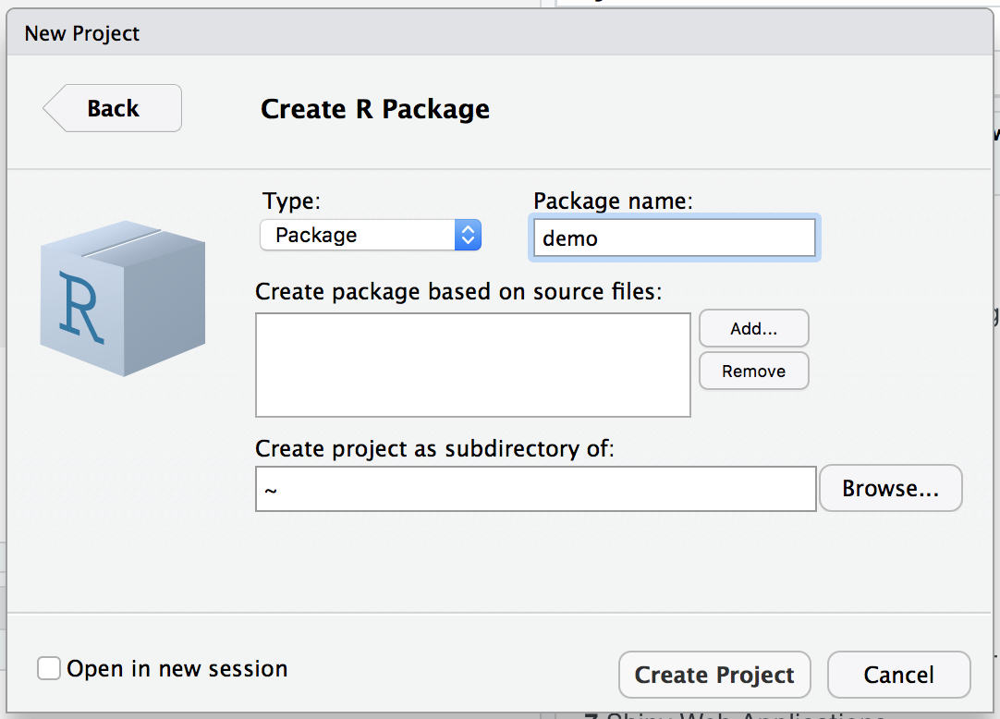
</center>

Once the package has been named, you can select "Create Project" and another window will be prompted in which the basic files and folders needed for a package will be visualized within an overall repository with the same name as the package (i.e. "demo") as shown below.

<center>
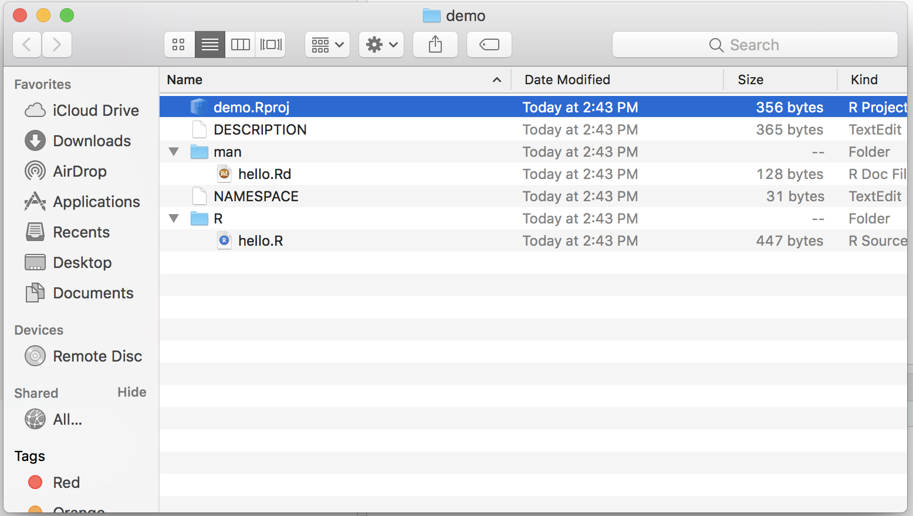
</center>

Within the logic of this chapter which provides one possible procedure (out of various) to build an R package, we will proceed to removing the following files from this folder:

- NAMESPACE
- man/hello.Rd
- R/hello.R

These files are default functions and documentation that are created to provide a basis for the user who can then modify them using their own descriptions and functions. However, for the procedure described in this chapter their presence is redundant (as seen further on) and consequently we invite the reader to remove them if they decide to follow the steps described in this chapter. 

### Step 2: Edit description file

This first step hence creates the skeleton of the package and, in the following steps, we can focus on giving body to this skeleton, starting from the file which contains a summary description of the structure and contents of the package which is to be found in the "DESCRIPTION" file. Once this is opened the user will notice different parts to this file in which various information on the package is contained such as the package name, author information, license and imports. Although there are other pieces of information, we will quickly discuss the latter three in the following paragraphs. 

#### Author Roles {-}

Authors are usually written in this format:

```{r, eval = FALSE}
Authors@R: c(
    person("Justin", "Lee", email = "justinlee@psu.edu", role = c("aut","cre")),
    person("Stephane", "Guerrier", role = "aut"),
    person("Roberto", "Molinari", role = "aut"),
    person("Matthew", "Beckman", role = "aut")
    )
```

Feel free to add or subtract any information above, as they will impact how it is displayed later in the rendered package website. The `aut` above represents *author* and the `cre` represents *creator*. 

#### License {-}

The most common license is the GNU General Public License, which is a widely used free software license that guarantees end users the freedom to run, study, share and modify the software. We can run through this [list](https://cran.r-project.org/web/licenses/) and choose the license that fits our needs. 

#### Imports {-}

Imports are also essential for building a package. For every function that we use from an external package, we either need to add a dependency or import, or our package will not know where to locate the function. Make sure to double check. 

### Step 3: Move your script into R file in R folder

Once we have the tasks completed above, we need to start writing the *meat* portion of our package: the functions. First, group functions together per theme in different files. In other words, if we have functions that perform different tasks, we should group them into different R files so that we can come back to them to fix any errors. Packages can still work under a single R file, but things will get messy once we add more and more functions. 

We can test our `.R` files by running each file seperately using `source('~/demo/R/<name of your file>.R')` and eventually debug if any error occurs.

### Step 4: Documentation

The next essential factor of a package is its documentation, and is one of the most important aspects. Documentation enables users to know how to use our package. Essentially, when users use the `demo` package, they should know how to use its functions as well like `?mc_int`. The most common form of R package documentation is generating `.Rd` files by using `devtools::document()` or `roxygen2::roxygenize`.

Here is an example of documentation for our `demo` funtions:

```{r, eval = FALSE}
#' @title Simple Monte-Carlo integration
#'
#' @description Compute an approximation of the integral of the function f(x)
#' with respect to dx in the range [a, b] by Monte-Carlo integration using
#' uniform sampling.
#' @param x_range A \code{vector} of dimension 2 used to denote the integration
#' region of interest, i.e. [a, b].
#' @param fun A \code{string} containing the function to integrated. It
#' is assumed that \code{x} is used as the variable of interest.
#' @param B A \code{numeric} (integer) used to denote the number of simulation.
#' @param seed A \code{numeric} used to control the seed of the random number
#' generated by this function.
#' @return A \code{list} containing the following attributes:
#' \describe{
#'      \item{I}{Estimated value of the integral}
#'      \item{var}{Estimated variance of the estimator}
#' }
#' @author Stephane Guerrier
#' @importFrom stats runif
#' @export
#' @examples
#' mc_int(x_range = c(0,1), fun = "x^2", B = 10^5)
#' mc_int(x_range = c(0,1), fun = "x^2*sin(x^2/pi)", B = 10^5)
mc_int = function(x_range, fun, B, seed = 1291){
  # A few checks
  # Check x_range
  if (length(x_range) != 2 || x_range[1] >= x_range[2]){
    stop("x_range is incorrectly specified")
  }

  # Check fun
  if (class(fun) != "character"){
    stop("fun is incorrectly specified and should be a character")
  }

  x = mean(x_range)
  test_fun = try(eval(parse(text = fun)), silent = TRUE)
  if (class(test_fun) == "try-error"){
    stop("fun cannot be evaluated")
  }

  # Check B
  if (B < 1){
    error("B is incorrectly specified")
  }

  # Set seed
  set.seed(seed)

  # Compute the length of the interval, i.e. (b-a)
  interval_length = diff(x_range)

  # Let's draw some uniforms to get Ui and Xi
  Ui = runif(B)
  Xi = x_range[1] + Ui*interval_length

  # Compute \hat{I}
  x = Xi
  I_hat = interval_length*mean(eval(parse(text = fun)))

  # Compute \hat{I}_2
  I2_hat = interval_length*mean((eval(parse(text = fun)))^2)
  var_I_hat = (interval_length*I2_hat - I_hat^2)/B

  # Output list
  out = list(I = I_hat, var = var_I_hat,
             fun = fun, x_range = x_range, B = B)
  class(out) = "MCI"
  out
}
```

All functions you want to be able to use MUST have `#' @export`. This enables the users to call the function after building the package. Other parts of the documentation can be further seen from [here](http://r-pkgs.had.co.nz/man.html#man-functions). 

<center>
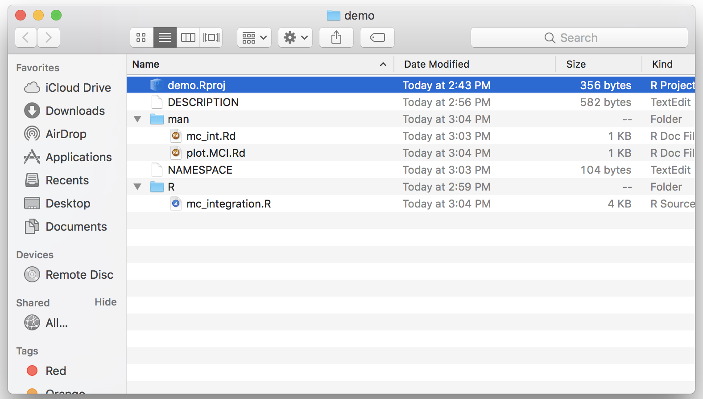
</center>

After, build documentation by using `devtools::document()`. If everyhting is working properly, we should have one Rd document for everything function that is exported within the package. Check by using `?yourfunction`.

<center>
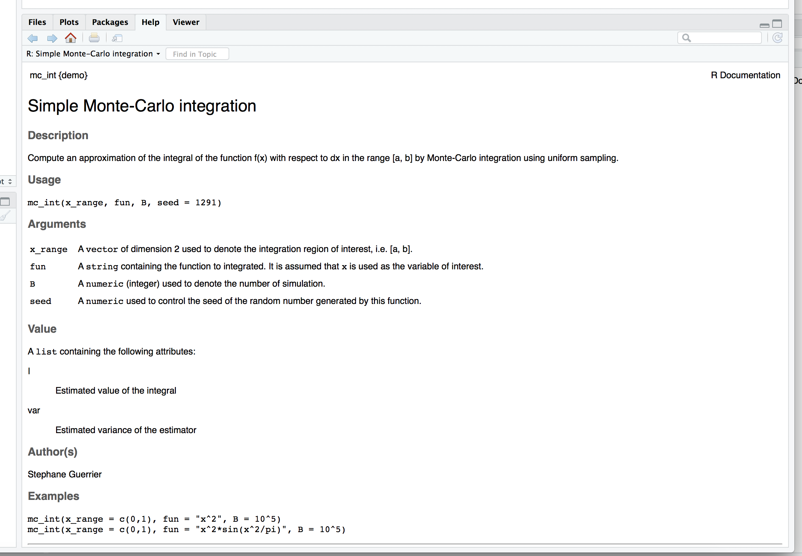
</center>

### Step 5: Test your package

- Build your package - part6-1
- Test if it works - by creating a "test" file in main and run everything it you change something major to the package to see if the behavious remains unchanged. -> part6-2

<center>
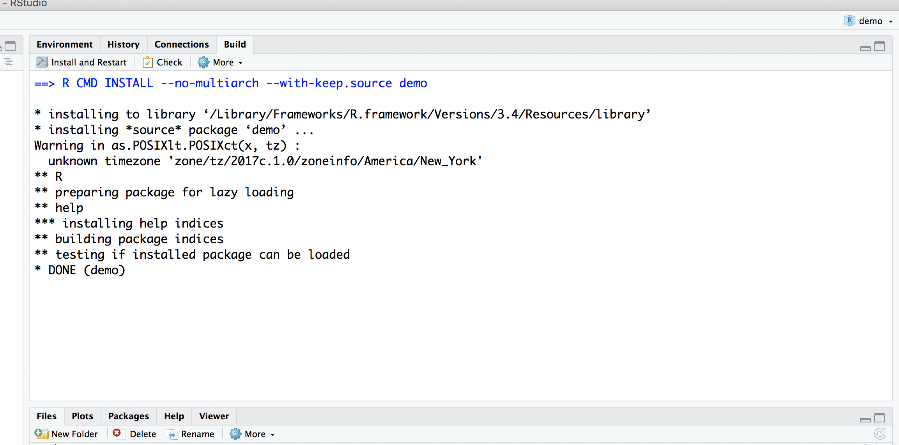
</center>

<center>
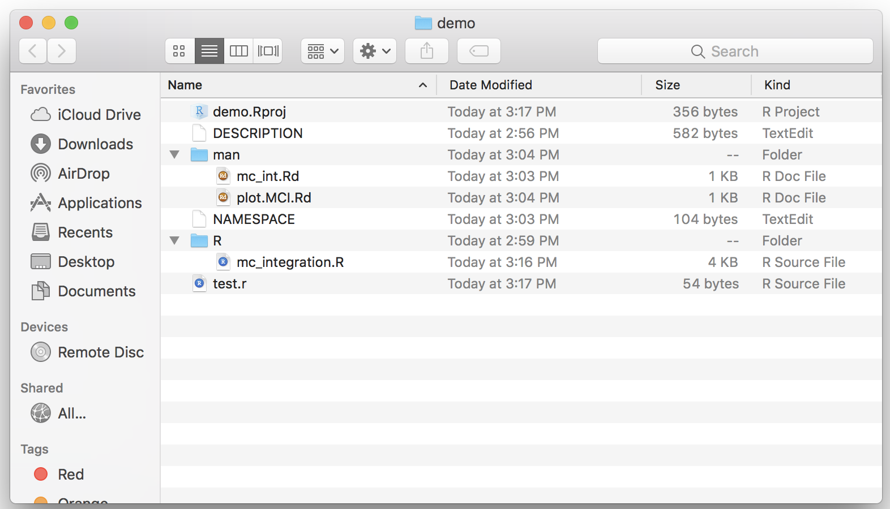
</center>

- Run check

### Step 6: Add a "README.Rmd" file

Showcase what your package is doing in this RMD file, you can add video, code example,....


```{eval=FALSE}
---
output: github_document
---

# Add a title
  
Explain what your package is doing here
```

Compile it with pkgdown (install: `devtools::install_github("hadley/pkgdown")`): `pkgdown::build_site()`

Result should look like: part7 - 1

<center>
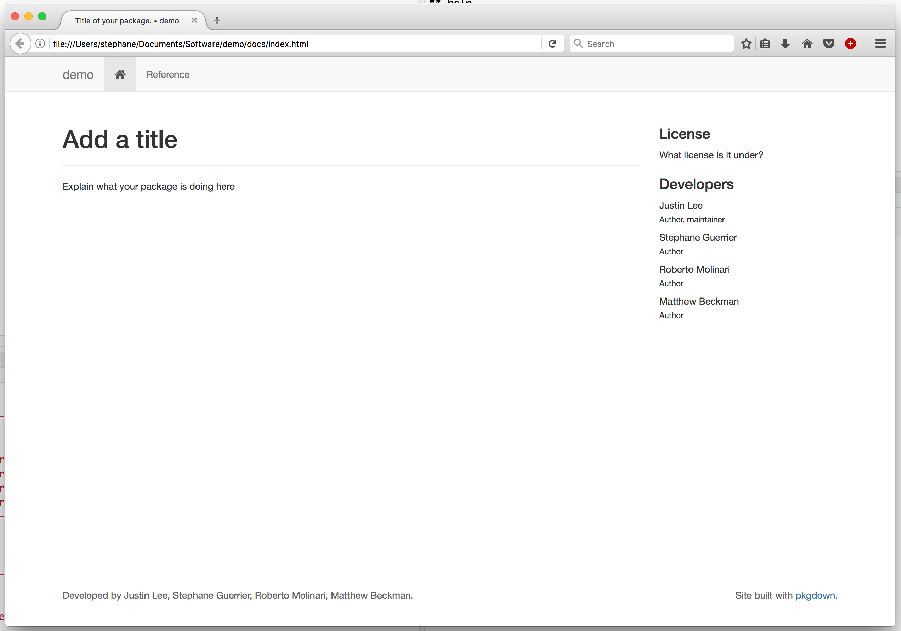
</center>


### Step 7: Create a github repo - possibly with the same name as package

- Sync should look like:

<center>
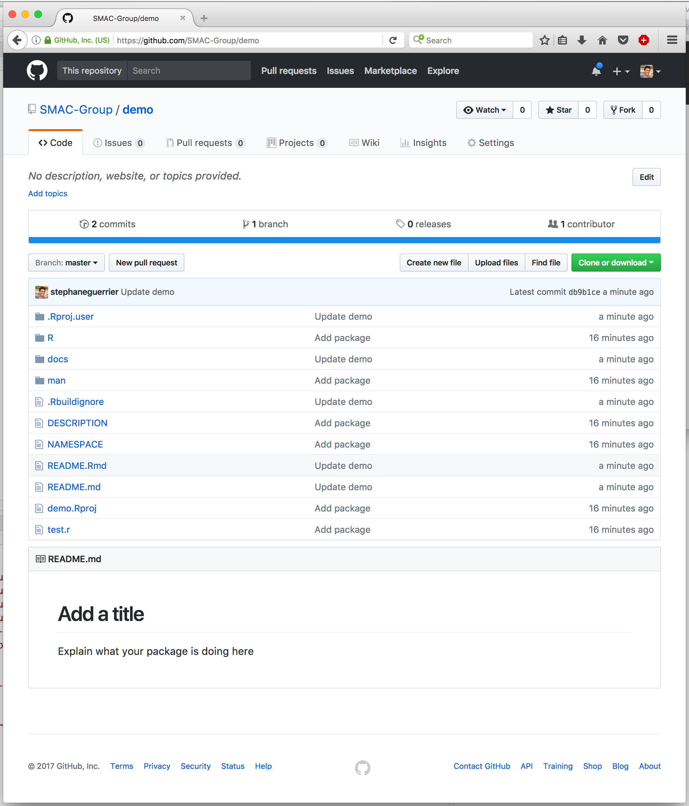
</center>

Make website -> github page

<center>
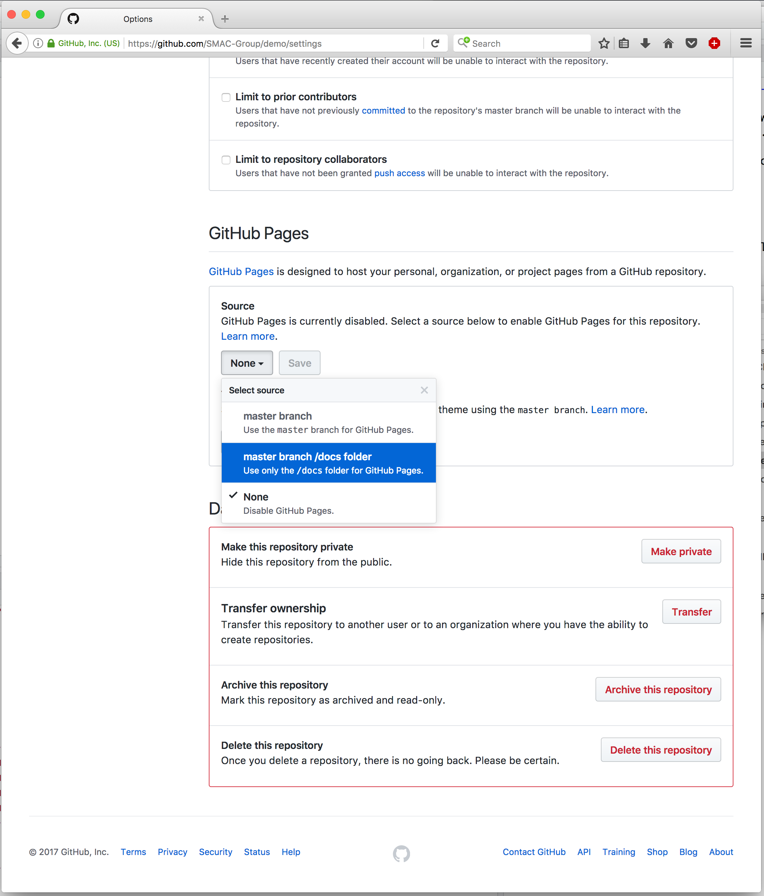
</center>

Then your website is only... The address is `https://<your github id>.github.io/<your repo name>/`

## Advanced

### Adding a shiny app

- make folder called `inst`
- In `inst` put shiny app folder
- Make r file call it, called it for example `run_shiny.r`, here is an example:

```{r, eval = FALSE}
#' @export
MC_gui = function(){
  appDir = system.file("MC_int", package = "demo")
  shiny::runApp(appDir, display.mode = "normal")
}
```

- Run: `devtools::document()` + rebuild
- Test: `MC_gui()`

<center>
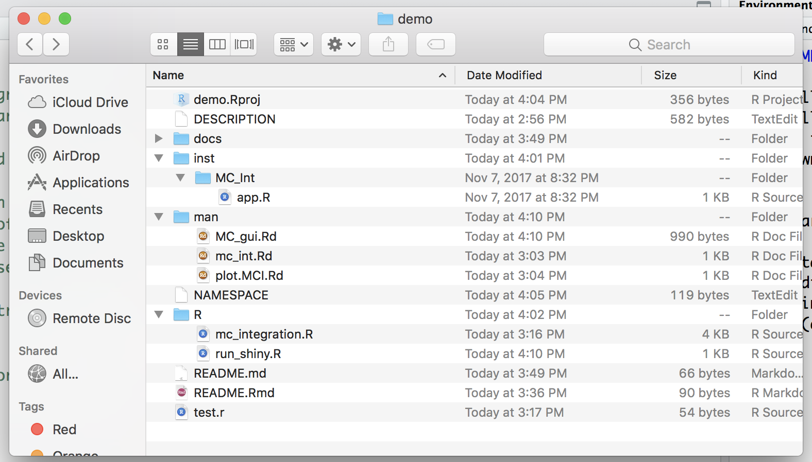
</center>

### Custom website

Justin to do, theme , badge, tabs,....


EXAMPLE: smac-group/demo


