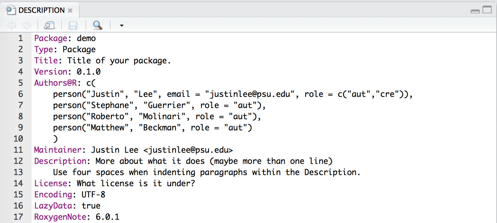
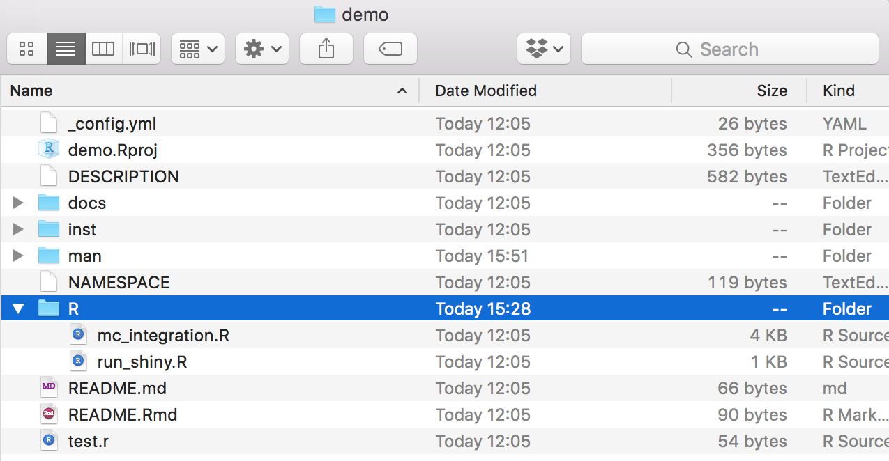
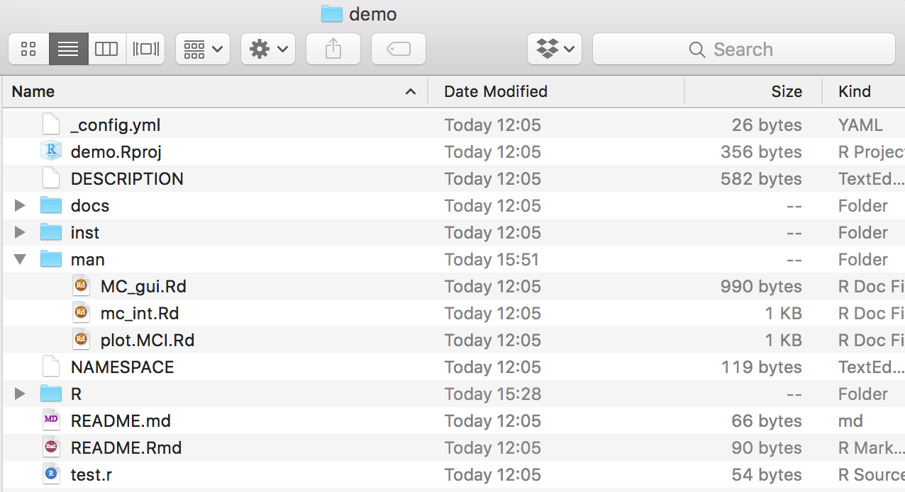
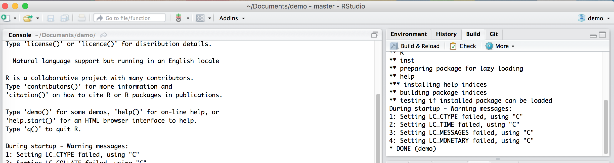
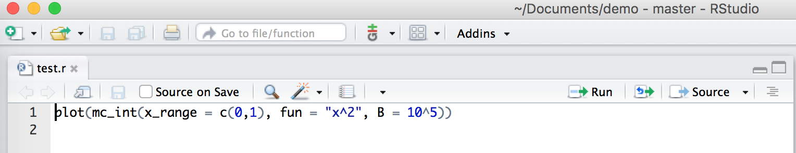
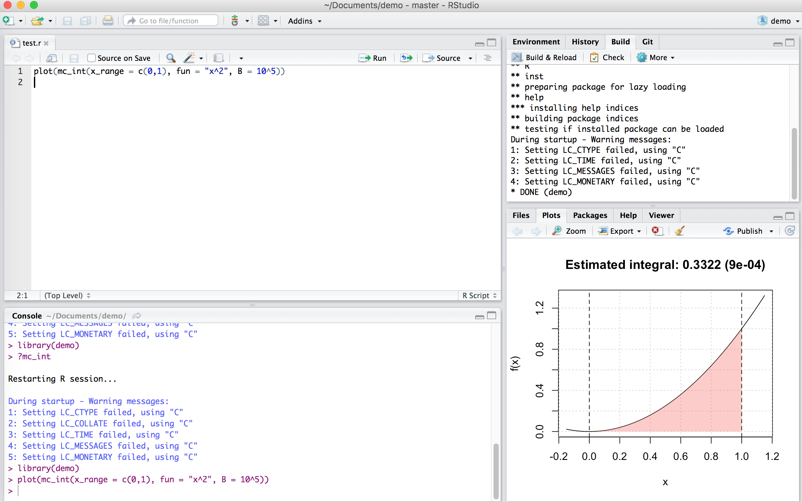

# R Packages

In this chapter we introduce one of the most useful tools for R programming as well as for statistical programming in general. Indeed, one of the main goals for statistical programming is to then be able to share all the code and functions that have been implemented in order to respond to a specific task. The latter may often be quite *messy* to do given that different files and functions can be present in various directories or repositories and, for example, some codes may use functions from other codes but do not load the same libraries, thereby producing execution errors.

In order to avoid the above complications (and to program in a healthy and organized manner), R allows you to create *packages* that are software platforms that collect functions as well as other files which, among others, describe these functions and provide users with documentation that allow them to understand and efficiently use these functions. Moreover, when sharing a package (or making it available within a repository) all the user needs to do is to install and load the package within an R session which then makes available the entire environment needed for all the functions included in the package to work. In a nutshell, whenever creating functions to answer a specific research interest or professional task, it is always good to do so by first creating a package within which these functions can be stored and documented.

In this chapter we will describe and explain the steps necessary to create an R package using RStudio. There are other ways and other procedures to produce an R package but in this chapter we will describe one possible way which is consistent with the approach to statistical programming that is presented in this book. As in the previous chapters, we will make use of an example to guide the reader through the different aspects of package building and, for this purpose, let us assume we want to build a package that allows a user to perform Monte-Carlo integration for any user-specificed function as well as produce plots that represent these functions as well as the integrated area. In this case, we have an extremely simple setting where, based on code used in the previous chapters, we only have the following two functions to be included in the package:

```{r}
mc_int = function(x_range, fun, B, seed = 1291){
  # A few checks
  # Check x_range
  if (length(x_range) != 2 || x_range[1] >= x_range[2]){
    stop("x_range is incorrectly specified")
  }

  # Check fun
  if (class(fun) != "character"){
    stop("fun is incorrectly specified and should be a character")
  }

  x = mean(x_range)
  test_fun = try(eval(parse(text = fun)), silent = TRUE)
  if (class(test_fun) == "try-error"){
    stop("fun cannot be evaluated")
  }

  # Check B
  if (B < 1){
    error("B is incorrectly specified")
  }

  # Set seed
  set.seed(seed)

  # Compute the length of the interval, i.e. (b-a)
  interval_length = diff(x_range)

  # Let's draw some uniforms to get Ui and Xi
  Ui = runif(B)
  Xi = x_range[1] + Ui*interval_length

  # Compute \hat{I}
  x = Xi
  I_hat = interval_length*mean(eval(parse(text = fun)))

  # Compute \hat{I}_2
  I2_hat = interval_length*mean((eval(parse(text = fun)))^2)
  var_I_hat = (interval_length*I2_hat - I_hat^2)/B

  # Output list
  out = list(I = I_hat, var = var_I_hat,
             fun = fun, x_range = x_range, B = B)
  class(out) = "MCI"
  out
}

plot.MCI = function(x, ...){
  obj = x
  x_range = obj$x_range
  fun = obj$fun

  Delta = diff(x_range)
  x_range_graph = c(x_range[2] - 1.15*Delta, x_range[1] + 1.15*Delta)
  x = seq(from = x_range_graph[1], to = x_range_graph[2], length.out = 10^3)
  f_x = eval(parse(text = fun))
  plot(NA, xlim = range(x), ylim = range(f_x), xlab = "x", ylab = "f(x)")
  grid()
  title(paste("Estimated integral: ", round(obj$I,4),
              " (", round(sqrt(obj$var),4),")", sep = ""))
  lines(x, f_x)
  x = seq(from = x_range[1], to = x_range[2], length.out = 10^3)
  f_x = eval(parse(text = fun))
  cols = hcl(h = seq(15, 375, length = 3), l = 65, c = 100, alpha = 0.4)[1:3]
  polygon(c(x, rev(x)), c(rep(0, length(x)), rev(f_x)),
          border = NA, col = cols[1])
  abline(v = x_range[1], lty = 2)
  abline(v = x_range[2], lty = 2)
}
```

Hence, the package will contain: 

- the `mc_int()` function: that computes an approximation of the integral of the function `fun` with respect to `x` within the range `x_range` via Monte-Carlo integration using uniform sampling;
- the `plot.MCI()` function: a class function that will plot the object that is created as an output of the `mc_int()` function. 

An example of use of these functions and their output is the following:

```{r}
obj = mc_int(x_range = c(0,1), fun = "x^2*sin(x^2/pi)", B = 10^3)
plot(obj)
```

Now let us suppose that we want to make these functions available to the general user who may be looking for tools that allow them to perform Monte-Carlo intergration. Although we only have two functions, it would be appropriate to provide a single platform containing these functions along with documentation that describes the contents and use of these functions. Therefore, in the following sections we will describe the process to develop an R package for these functions which is consquently valid for any collection of functions needed to perform a specific task.

## Basic steps

As mentioned earlier, the process to develop an R package that is described in this chapter is not strict or unique since there are many different ways of structuring and building them. However, in this book we will describe one way of building a package which is consistent with the approach to statistical programming that has been described thus far. Keeping this in mind, below the reader can find the basic steps to build an R package. 

### Step 1: Create an "empty" R package

The first step to create an R package using RStudio is to build the *skeleton* of the package which contains the basic folders and files that are needed. To do so, within RStudio you should select to create a "New Project..." from the File menu within RStudio as shown below. 

<center>

</center>

Once this is done you will see a new window with different options (see image below) among which you select "New Directory" (unless you wish to create the package within an existing directory which is usually not convenient for purpose of organization).

<center>

</center>

Again, another window will appear in which RStudio asks you for the type of project you wish to create and, quite intuitively, you should select the "R Package" option as shown below.

<center>

</center>

By doing so you prompt a successive window in which it is possible to name our package which, in the example below, will be `demo`. In the context of this chapter we will not consider the other options that are made available to the user (for more details you can check [this link](http://r-pkgs.had.co.nz/)).

<center>

</center>

Once the package has been named, you can select "Create Project" and another window will be prompted in which the basic files and folders needed for a package will be visualized within an overall repository with the same name as the package (i.e. "demo") as shown below.

<center>

</center>

Within the logic of this chapter which provides one possible procedure (out of various) to build an R package, we will proceed to removing the following files from this folder:

- NAMESPACE
- man/hello.Rd
- R/hello.R

These files are default functions and documentation that are created to provide a basis for the user who can then modify them using their own descriptions and functions. However, for the procedure described in this chapter their presence is redundant (as seen further on) and consequently we invite the reader to remove them if they decide to follow the steps described in this chapter. 

### Step 2: Edit description file

This first step hence creates the skeleton of the package and, in the following steps, we can focus on giving body to this skeleton, starting from the file which contains a summary description of the structure and contents of the package which is to be found in the "DESCRIPTION" file. Once this is opened the user will notice different parts to this file in which various information on the package is contained such as the package name, author information, license and imports. Although there are other pieces of information (see [this link](http://r-pkgs.had.co.nz/description.html)), we will quickly discuss the latter three in the following paragraphs. 

#### Author Roles {-}

One of the lines of information in the description file corresponds to the authors of the package. This therefore corresponds to the list of persons who have actively contributed to the development of code and functions that are included in the package. When there is more than author, the line corresponding to the author can be replaced by a format like the following:

```{r, eval = FALSE}
Authors@R: c(
    person("Justin", "Lee", email = "justinlee@psu.edu", role = c("aut","cre")),
    person("Stephane", "Guerrier", role = "aut"),
    person("Roberto", "Molinari", role = "aut"),
    person("Matthew", "Beckman", role = "aut")
    )
```

This information is important also because it will impact how it is displayed later in the rendered package website (see further on). As you can notice it possible to also specify the role that the author has in relation to the package using the option `role =`, followed by codes for the type of role. In the above examples we can see two types of role that correspond to `aut` which indicates an *author* of the package while `cre` stands for *creator* who is the person in charge of maintaining the package and receiving information as well as bug reports or suggestions. There are other two possible roles available which are `ctb` and `cph` that correspond to *contributor* and *copyright holder* respectively, where the contributor is a person who has provided some minor contributions to the package while the copyright holder is the person or company who holds the copyright of the package.

#### License {-}

The package license determines to what extent and under what conditions the package (and its contents) can be shared and accessed by users. The most common license is the GNU General Public License which is a widely used free software license that guarantees end-users the possibility to run, study, share and modify the software. A complete list of all the possible licenses can be found at this [link](https://cran.r-project.org/web/licenses/) and you are free to choose the license that best fits your requirements. 

#### Imports {-}

It is often the case that your code and functions will depend on functions that are made available from other packages in R. In order to make sure that these packages are available to the user when they install your package, it is important to specify on which external packages yours relies on. In this sense, the `Imports` line in the DESCRIPTION file allows you to do just this so it is important to remember to check whether external packages are correctly specified in this section of the file. 

Our example on Monte-Carlo integration only depends on the base functions in R and therefore there is no need to specify external packages for this case. Therefore, our "demo" package DESCRIPTION file ends up looking as follows:

<center>

</center>

### Step 3: Move your R scripts into the R folder

Having completed the description of the package we can now focus on adding the truly essential part of the package: the functions that deliver the outputs required by the user. In order for the functions to be considered as part of the package, the scripts containing these functions need to be moved into the R folder that is created as part of the package skeleton as seen earlier (therefore replacing the "hello.R" script that we chose to delete).

The organization of the code that collects the functions is subjective and can be included all in one single R script or in various scripts. It is usually suggested to group these functions into separate scripts according to their relative themes or specific tasks they are created for, especially when there is a considerable number of functions in the package. This approach allows to more easily find and fix any errors that are present in the functions as opposed to going through thousands of lines of code to find the function you're interested in. 

In our example we only have two functions so there is no need to separate them and, consequently, we include them in a single R script that we call "mc_integration.R" which is included in the R folder for our demo package.

<center>

</center>

As you may notice, there is another file called "run_shiny.R" which, as we will see later, contains the code to create a Shiny app that is part of the package.

### Step 4: Documentation

The next essential component of a package is its documentation which enables users to know how to use it. Indeed, when users access the `demo` package, they should essentially know how to use its functions by gaining access to help files through the use of commands like `?mc_int` for example. A possible (and efficient) way of creating package documentation is by using a specific syntax before each function in your R scripts which will then be used to automatically generate the necessary `.Rd` files by using the commands `devtools::document()` or `roxygen2::roxygenize`.

We will use the `mc_int()` function from our demo package as an example to show the syntax that can be used before each function which is intended for the user:

```{r, eval = FALSE}
#' @title Simple Monte-Carlo integration
#'
#' @description Compute an approximation of the integral of the function f(x)
#' with respect to dx in the range [a, b] by Monte-Carlo integration using
#' uniform sampling.
#' @param x_range A \code{vector} of dimension 2 used to denote the integration
#' region of interest, i.e. [a, b].
#' @param fun A \code{string} containing the function to be integrated. It
#' is assumed that \code{x} is used as the variable of interest.
#' @param B A \code{numeric} (integer) used to denote the number of simulations.
#' @param seed A \code{numeric} used to control the seed of the random number
#' generator used by this function.
#' @return A \code{list} containing the following attributes:
#' \describe{
#'      \item{I}{Estimated value of the integral}
#'      \item{var}{Estimated variance of the estimator}
#' }
#' @author Stephane Guerrier
#' @importFrom stats runif
#' @export
#' @examples
#' mc_int(x_range = c(0,1), fun = "x^2", B = 10^5)
#' mc_int(x_range = c(0,1), fun = "x^2*sin(x^2/pi)", B = 10^5)
mc_int = function(x_range, fun, B, seed = 1291){
  # A few checks
  # Check x_range
  if (length(x_range) != 2 || x_range[1] >= x_range[2]){
    stop("x_range is incorrectly specified")
  }

  # Check fun
  if (class(fun) != "character"){
    stop("fun is incorrectly specified and should be a character")
  }

  x = mean(x_range)
  test_fun = try(eval(parse(text = fun)), silent = TRUE)
  if (class(test_fun) == "try-error"){
    stop("fun cannot be evaluated")
  }

  # Check B
  if (B < 1){
    error("B is incorrectly specified")
  }

  # Set seed
  set.seed(seed)

  # Compute the length of the interval, i.e. (b-a)
  interval_length = diff(x_range)

  # Let's draw some uniforms to get Ui and Xi
  Ui = runif(B)
  Xi = x_range[1] + Ui*interval_length

  # Compute \hat{I}
  x = Xi
  I_hat = interval_length*mean(eval(parse(text = fun)))

  # Compute \hat{I}_2
  I2_hat = interval_length*mean((eval(parse(text = fun)))^2)
  var_I_hat = (interval_length*I2_hat - I_hat^2)/B

  # Output list
  out = list(I = I_hat, var = var_I_hat,
             fun = fun, x_range = x_range, B = B)
  class(out) = "MCI"
  out
}
```

As can be seen, all the syntax which contributes to the documentation of the function is preceded by the syntax `#' ` and is immediately followed (with no spacing) by the code of the function itself. Focussing on the contents of this documentation, the `@title` and `@description` entries will constitute respectively the title describing the function in a succint manner and the text providing a more detailed description of what the function does. We then find the `@param` syntax that is repeated for each parameter considered by the function in which a brief description of what the parameter is and what type of input is needed for it from the user. Finally we find the `@return` section where there is a description of the outputs of the function and eventual indications as to how these should be interpreted. Additional information can be provided such as the author(s) who specifically contributed to creating the function (`@author`), the packages or functions needed for the function to be employed (`@importFrom`) and examples that can show the user how to use this function in practice (`@examples`).

A final note should be given to the `@export` syntax which MUST absolutely be specified if you want the function you're documenting to be made available to the user. Indeed, there may be functions that are simply created to be used within other functions that are made available to the user and these therefore don't need to have this option specified. However, if the function needs to be made available to the user, then it is essential that this option is specified within the function documentation. Additional information on package documentation can be found [here](http://r-pkgs.had.co.nz/man.html#man-functions). 

Once all the necessary functions have been documented, it is possible to compile this documentation by using the commands `devtools::document()` or `roxygen2::roxygenize` (as mentioned earlier) or by directly building the package. Having done so, an `.Rd` file for each function will appear in the "man" folder (from which we earlier deleted the `hello.Rd` file). Below is an example of the `.Rd` files created for the functions in our example (with an added documentation for a function called `MC_gui` which is related to the code created for the Shiny app).

<center>

</center>

It is possible to check whether the documentation has been correctly compiled by using the command `?yourfunction`. Indeed, if we compiled our example documentation properly, this is what we get by using `?mc_int`:

<center>

</center>


### Step 5: Test your package

The previous steps are all that is necessary to complete the main components that are essential for an R package. Once these have correctly been completed, it is possible to build your package, meaning that you can combine all functions and documentation into a single software platform which can then be made available to the user. This can be done directly through the RStudio IDE where the "Environment, History, ..." pane contains a label named "Build". When selecting this label different options will appear just beneath it, including one called "Build & Reload" which, if selected, will allow you to build the package and load it in your work session. If everything has worked smoothly, then the mentioned pane should report some logs that end with `* DONE (nameofpackage)` (see example below).

<center>

</center>

It is at this point that you can start testing whether the documentation and the functions work as they are supposed to. For this reason, it is always appropriate to create a test script to be placed in the main directory of the package folder that can be run to check if the functions behave the same and that no errors are output after some major changes are made to the package. 

<center>

</center>

In our example, given that we can check both functions with one command, our test file can be as follows:

<center>

</center>

After making possible changes to the functions, we can run the test script and always expect to obtain the following output:

<center>

</center>

If this output is not the same or does not appear at all, then we need to go back to the functions to find where an error was made.

### Step 6: Add a "README.Rmd" file

It is always helpful to create additional material to ensure that your package can be understood and used in the widest manner possible. For this purpose it is possible to create an additional "README.Rmd" file which, as an RMarkdown document, can be used to add descriptions, examples and videos that showcase the usage of your package through a web-page. An example of how to structure this file is given below:

```{eval=FALSE}
---
output: github_document
---

# Add a title
  
Explain what your package is doing here
```

Having saved this file within the main folder of your package, you can compile this document using the `pkgdown` package (this can be installed by executing the following command in your console: `devtools::install_github("hadley/pkgdown")`). When the latter package is installed and loaded, all you need to do is execute the command `pkgdown::build_site()` to obtain the following web-page:

<center>

</center>

In order to publish this web-page, it is possible to do so by creating a GitHub repository dedicated to your package which constitutes the final basic step.

### Step 7: Create a github repo - possibly with the same name as package

The basic idea of creating a package is to share a set of functions with collaborators and users. As we saw in Chapter 2, a convenient tool to share code and projects is GitHub and, in this case as well, you can create a repository dedicated to your package. In this case, it would be convenient to name the repository with the same name of your package so that users can more easily find and access the package that you make available through GitHub.

Once you have created a repository and loaded your package on GitHub, for our example you should obtain something similar to the following case:

<center>

</center>

As you can see, the GitHub repository takes the content of the .Rmd file and presents its content just below the list of folders and files that compose the package. However, it is possible to also create a separate and dedicated web-page (using the contents of the .Rmd file) by using GitHub Pages. To do so, select the "Settings" label within your GitHub repository and scroll down to the GitHub Pages section where you can select the "master branch/docs folder" option under the "Source" area (as can be seen below).

<center>

</center>

Once this is done, you can eventually personalize the web-page a little more by selecting a particular theme for it (more details further on). Having done so, the page is already made available through the following address: `https://<your github id>.github.io/<your repo name>/`. For our example, this is available at [https://smac-group.github.io/demo/](https://smac-group.github.io/demo/). 

## Advanced

Up to now we have described the basic steps that are necessary to build, share and describe an R package. However, it is always possible to add features to the package itself or to the documentation used to explain and promote it. In the following paragraphs we just describe a few of them to allow the reader to get a further idea of the extent to which one can develop packages.

### Adding a shiny app

A feature which can be useful to make your package accessible to the general user (as well as to promote it) can be the possibility of including a Shiny app as an interface to your package. To do so, you will have to include a new folder called "inst" within your package main folder and in which an additional folder is then included with a name of your choice (let us say "MC_int" for the example we have used throughout this chapter). Within the latter you can then include the R script(s) to run the Shiny app (say "app.R") which makes use of the functions made available within the package. An example of the content of such a script is the following:

```{r, eval=FALSE}
# Define UI for application that draws a plot of the approximate integral
ui <- fluidPage(

   # Application title
   titlePanel("Monte-Carlo Integration"),

   # Sidebar with text input for the function to integrate, numeric inputs for the range of integration and number of Monte-Carlo replications
   sidebarLayout(
      sidebarPanel(
        textInput("fun", "Function to integrate:","sin(10*x)*exp(cos(x))"),
        numericInput("low", "Integral lower bound:", 0, min = -100, max = 100),
        numericInput("up", "Integral upper bound:", 1, min = -100, max = 100),
        numericInput("B", "Number of Monte-Carlo replications:", 10^5,
                     min = 100, max = 10^9),
        actionButton("button", "Compute Integral")
      ),

      # Show a plot of the integrated area under the function
      mainPanel(
         plotOutput("distPlot")
      )
   )
)

# Define server logic required to draw the integration plot
server <- function(input, output) {

  a <- eventReactive(input$button, {
    mc_int(x_range = c(input$low, input$up),
          fun = input$fun, B = input$B)
  })

  output$distPlot <- renderPlot({
      plot(a())
  })

}

# Run the application
shinyApp(ui = ui, server = server)
```

Once this is done, an additional R script needs to included within the "R" folder. This R script will contain a function that allows the user to generate a Shiny app (based on the contents of "app.R" for example) and consequently to use the app interface to make use of the package functions. Following from our example, suppose that the latter script, which we will call "run_shiny.r" for this example, contains the following function:

```{r, eval = FALSE}
#' @export
MC_gui = function(){
  appDir = system.file("MC_int", package = "demo")
  shiny::runApp(appDir, display.mode = "normal")
}
```

Given these steps, our main package folder should look like this:

<center>

</center>

After having created the above mentioned folders and correctly written and placed the functions within these folders, all you need to do to make this feature available to the user is to execute the command `devtools::document()` and successively build the package again. Having done so, the only command that the user needs to use to access the Shiny app is to run the function `MC_gui()` in the console.

### Custom website

Below is a video about customizing the website.

```{r, echo = FALSE}
knitr::include_url("https://www.youtube.com/embed/HO54ZoGtzzQ")
```


EXAMPLE: smac-group/demo


