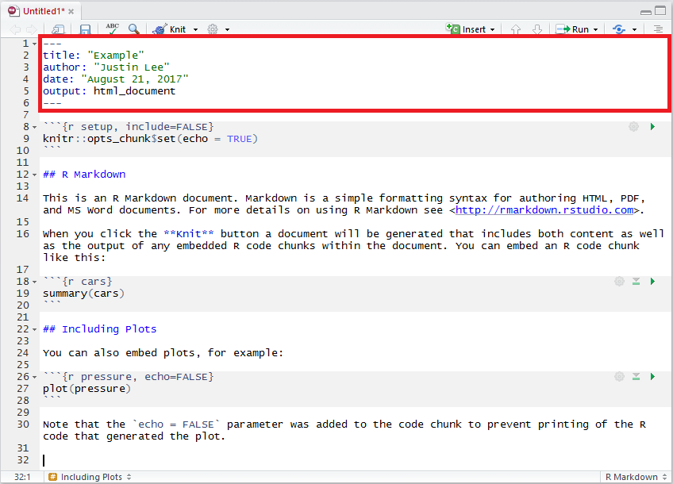

# RMarkdown

RMarkdown is a framework that provides a literate programming format for data science. It can be used to save and execute R code within RStudio, and also is a simple formatting syntax for authoring HTML, PDF, ODT, RTF, and MS Word documents.

What is **literate** programming? 

Literate programming is the notion for programmers to add narrative context with code to produce documententation for the program simultaneously. We can follow code with explanations so that any viewer can follow through the presentation. RMarkdown offers a simple tool that allows to create rapports or presentation slides in a reproducible manner. We can avoid repetitive tasks such changing all figures when new data are available. 

What is **reproducible** research?

Reproducible research or reproducible analysis is the notion that an experiment's whole process, including collecting data, performing analysis, and producing output can be reproduced the same way by another person or body. Building non-reproducible experiments has been a problem both in research and in the industry, and having such an issue highly decreases the credibility of the author's findings and eventually, the author. In essense, someone will run code and get the same exact results. RMarkdown is commonly used to solve this issue. 

We will later enforce this notion by utilizing `set.seed()` in the following chapters. 

**JUSTIN: maybe we should add something on what literate programming is? Also, I think we should add something on reproducible analysis (research). Basically, RMarkdown offers a simple tool that allows to create rapports or presentation slides in a reproducible manner. At a higher level this means reproducible research which is a real problem now a days. Also, literate programming tools such as RMarkdown avoids repetitive tasks such changing all figures when new data are available. It could be nice to add a sketch to show what is going in RMarkdown (maybe data -> RMarkdown -> output, under RMarkdown show that data importation/cleaning, analysis, writing slide/repport content is done, output show the kind of output, from slides, html, this book, latex document (sweave) and so on). Finally, we could add a video somewhere in the intro to present RMarkdown in RStudio. What do you think?**


An RMarkdown is a plain text file that contains three different aspects:

- YAML metadata
- Text 
- Code Chunks 

## YAML Metadata 

YAML stands for *YAML Ain't Markup Language*, and is used to specify document configurations and properties such as name, date, output format, etc. The (optional) YAML header surrounded by ---s.



You can also include additional formatting [options](http://rmarkdown.rstudio.com/html_document_format.html), such as a table of contents, or even custom CSS which can utilized to further enhance presentation. For the purpose of the class, the default options should be sufficient. Below is an example knit output of the above RMarkdown file. 


The default output above is an html_document format. However, this can be specified as well, such as `pdf_document`. Before, you must install a TeX distribution such as [MikTeX](https://miktex.org/2.9/setup). You can also include raw LaTeX and even define LaTeX macros.

### Subsections {-}

To make your sections numbered as sections and subsections, make sure you specify `number_sections: yes` as part of YAML Metadata. 


## Text 

**JUSTIN wouldn't it make more sense to move some subsections like tables, bullet points (if we keep it) in this section? To me they are move "text" than "code". What do you think? Up to you of course!**

In addition, due to its literate nature, text will be an essential part in explaining your analysis. With RMarkdown, we can specify custom text formatting, such as with emphasis such as *italics*, **bold**, or even a `code style`. To understand how to format text, our previous would be as follows in RMarkdown:

```{r, eval = FALSE, highlight = FALSE}
[...] such as with emphasis such as *italics*, **bold**, or even a `code style`.
```


### Headers {-}

As seen above, headings are preceded with a #. To output smaller headings, simply add more #! 


### Lists {-}

**Justin what do you think about saying something about bullet points? If so feel to move it where you want...**

In RMarkdown, we can add and modify lists.  

```{r, eval = FALSE, highlight = FALSE}
* You can create bullet points by using symbols such as *, +, or -. 
+ simply add an indent or four preceding spaces to indent a list. 
    + You can manipulate the number of spaces or indents to your liking. 
        - Like this. 
    * Here we go back to the first indent. 
1. To make the list ordered, use numbers. 
1. We can use one again to continue our ordered list. 
2. Or we can add the next consecutive number. 
```

* You can create bullet points by using symbols such as *, +, or -. 
+ Simply add an indent or four preceding spaces to indent a list. 
    + You can manipulate the number of spaces or indents to your liking. 
        - Like this. 
    * Here we go back to the first indent. 
1. To make the list ordered, use numbers instead of symbols. 
2. Here we write the next consecutive number to continue.
    - Add more content by indenting like before. 

### Hyperlinks {-}

To add hyperlinks with the full link, (ex: <https://google.com/>) follow the syntax below: 

```{r, eval = FALSE, highlight = FALSE}
<https://google.com/>
```

To add hyperlinks with a custom link title, (ex: [Google](https://google.com)) follow the syntax below: 

```{r, eval = FALSE, highlight = FALSE}
[Google](https://google.com)
```

### Blockquotes {-}

**Same thing for citation... What do you think?**

> Use the > character in front of a line, *just like in email*.
> Use it if you're quoting a person, a song or whatever.
>> Add another > if you want to quote within a quote.


### Pictures {-}

To add a picture with captions, follow the syntax below:

```{r, eval = FALSE, highlight = FALSE}

```


Else, to add a picture without any captions, follow the syntax below:

```{r, eval = FALSE, highlight = FALSE}}

```


### Cache {-}

**Justin: Maybe something on caching**

For example:

```{r computeA, cache = TRUE}
a = 2
```

```{r, cache = TRUE, dependson = "computeA"}
(d = 2*a)
```


### LaTeX {-}

**JUSTIN: maybe add something on what is latex? WHat do you think?**

What is **LaTeX**?

LaTeX is a document preparation system, that uses plain text in comparison to formatted text used for applications like Microsoft Word. It is widely used in academia, as a standard for the publication of scientific documents. It has control over large documents containing sectioning, cross-references, tables and figures. 

#### LaTeX in RMarkdown {-}

Unlike a highly formatted word processor, we cannot produce equations by clicking on symbols. As data scientists, we need to explain distributions and equations to explain our ideas. Within the text section of RMarkdown, you can include LaTeX format to output equation format. 

Inline mathematical expressions can be added using the syntax: `$math expression$`. For example, if we want to write: "where $\alpha$ is in degrees" we would write:

```{r, eval = FALSE, highlight = FALSE}
"where $\alpha$ is in degres"
```

Using a slightly different syntax (i.e. `$$math expression$$`) centered mathematical expressions can be obtained. For example, the binomial probability in LaTeX

`$$f(y|N,p) = \frac{N!}{y!(N-y)!}\cdot p^y \cdot (1-p)^{N-y} = {{N}\choose{y}} \cdot p^y \cdot (1-p)^{N-y}$$`

converts to...

$$f(y|N,p) = \frac{N!}{y!(N-y)!}\cdot p^y \cdot (1-p)^{N-y} = {{N}\choose{y}} \cdot p^y \cdot (1-p)^{N-y}$$

A basic introduction to LaTeX format can be found [here](http://www.math.harvard.edu/texman/) if you want to learn more about the basics. An alternative can be to insert custom LaTeX formulas using a graphical interface such as [codecogs](https://www.codecogs.com/latex/eqneditor.php). 

### Cross-referencing Sections {-}

You can also use the same syntax `\@ref(label)` to reference sections, where label is the section ID. By default, Pandoc will generate IDs for all section headers, e.g., `# Hello World` will have an ID `hello-world`. To call header `hello-world` as a header, we type `\@ref(hello-world)` to cross-reference the section. In order to avoid forgetting to update the reference label after you change the section header, you may also manually assign an ID to a section header by appending {#id} to it.


### Citations and Bibliography {-}

**JUSTIN I think it would be cool to add something on bibliography. When I reviewed James slides for STAT 385 I suggested to to show student how bib files can be imported directely from google scholar so it might a good idea to do the same here. What do you think?**

### Tables {-}

For simple tables, we can be manually insert values as such, 

```
+---------------+---------------+--------------------+
| Fruit         | Price         | Advantages         |
+===============+===============+====================+
| *Bananas*     | $1.34         | - built-in wrapper |
|               |               | - bright color     |
+---------------+---------------+--------------------+
| Oranges       | $2.10         | - cures scurvy     |
|               |               | - **tasty**        |
+---------------+---------------+--------------------+
```

to produce... 

+---------------+---------------+--------------------+
| Fruit         | Price         | Advantages         |
+===============+===============+====================+
| *Bananas*     | $1.34         | - built-in wrapper |
|               |               | - bright color     |
+---------------+---------------+--------------------+
| Oranges       | $2.10         | - cures scurvy     |
|               |               | - **tasty**        |
+---------------+---------------+--------------------+

Or we can use the easy graphical user interface [online](http://www.tablesgenerator.com/markdown_tables). For more extensive tables, we create dataframe objects and project them using `knitr::kable()`, which we will explain later. 

### Additional References {-}

There are many more elements to creating a useful report using RMarkdown, and we encourage you to use the [Rmarkdown Cheatsheet](https://www.rstudio.com/wp-content/uploads/2015/02/rmarkdown-cheatsheet.pdf) as a reference. 

## Code Chunks 

This is where you enter your code. 

You can quickly insert chunks like these into your file with

- the keyboard shortcut Ctrl + Alt + I (OS X: Cmd + Option + I)
- the Add Chunk command in the editor toolbar
- by typing the chunk delimiters **\`\`\`\{\r\}** and **\`\`\`**.


### Code Chunk Options

Like third code chunk above, we can also set up chunk options. Note that the `echo = FALSE` parameter was added to the code chunk to prevent printing of the R code that generated the plot. This is a useful way to embed figures. More options can be referred from the [Rmarkdown Cheatsheet](https://www.rstudio.com/wp-content/uploads/2015/02/rmarkdown-cheatsheet.pdf) and Yihui's notes on knitr [options](https://yihui.name/knitr/options/). Here are some explanations of the most commonly used chunk options exerted from above: 

- eval: (TRUE; logical) whether to evaluate the code chunk
- echo: (TRUE; logical or numeric) whether to include R source code in the output file
- warning: (TRUE; logical) whether to preserve warnings (produced by warning()) in the output like we run R code in a terminal (if FALSE, all warnings will be printed in the console instead of the output document)
- cache: (FALSE; logical) whether to cache a code chunk;

Plot figure options: 

- fig.path: ('figure/'; character) prefix to be used for figure filenames (fig.path and chunk labels are concatenated to make filenames)
- fig.keep: ('high'; character) how plots in chunks should be kept
- fig.show: ('asis'; character) how to show/arrange the plots
- fig.width, fig.height: (both are 7; numeric) width and height of the plot, to be used in the graphics device (in inches) and have to be numeric
- fig.align: ('default'; character) alignment of figures in the output document (possible values are left, right and center


### In-line R {-}

**Justin: not sure how to call this but see example below! :) Maybe a good to mention it. What do you think?**

The variables we store in a RMarkdown will stay within the environment. This means that we can call and manipulate them anywhere within the document. In addition, we can also reference the variable in-line in the text section using the \`r something\` syntax. 

```{r}
a = 2
```

Above, we stored the value 2 into `a`. 

```{r, eval = FALSE, highlight = FALSE}
The value of $a$ is `r a`. 
```

This translates in R Markdown to "The value of $a$ is `r a`."


## Render Output 

After you are done, run `rmarkdown::render()` or click the `knit HTML` button at the top of the RStudio scripts pane to save the output in your working directory. 


Click on the links below for more information on RMarkdown:

- <a href='downloads/example_rmd_document.Rmd' download>RMarkdown Example File</a>
- [RStudio RMarkdown tutorial](http://rmarkdown.rstudio.com/authoring_quick_tour.html)
- [R-blogger's RMarkdown tutorial](https://www.r-bloggers.com/r-markdown-and-knitr-tutorial-part-1/)


