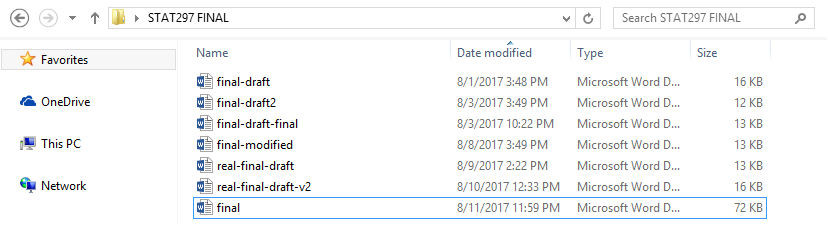
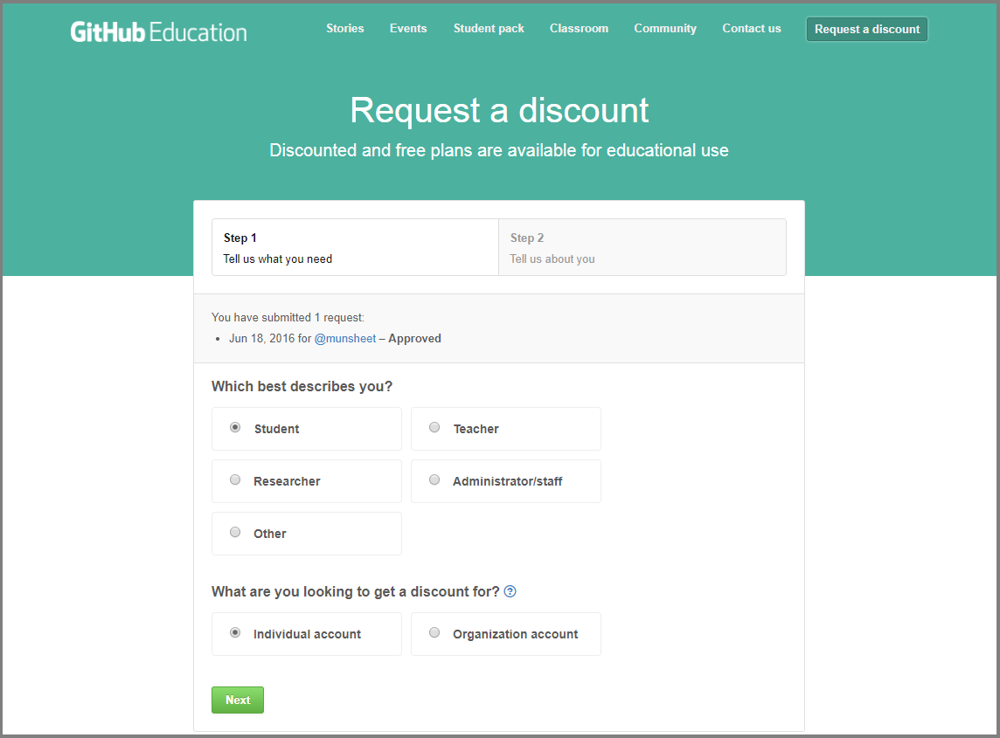

# GitHub 

You may have experienced a moment like this once in your life: 



After plenty hours of hard work, you only find yourself saving the same file over and over - even losing track of what changes you made. Version control is a software that keeps track of your changes for you. You know which saves you made where, and can even go back in time to revert to those changes. (Awesome!)


## Version Control 

Version control is a system that records changes to a file or a set of files over time, so that you can save changes over time. It allows you to: 

- keep the entire history of a file 
- revert to a specific version of the file 
- collaborate on the same platform with other people 
- make changes without modifying the main file 


## Git and GitHub

Among version control platform, Git is a powerful tool that is commonly used. GitHub is a commercial website that uses Git and stores local files into a "album" called a repository. For the purposes of this course, we will be using this platform. 

In addition, your GitHub profile will also serve as your data science *resume* that contain future projects that you save and commit so that employers know what you're made of. 


## Git Setup 

To install Git, go to the [website](https://git-scm.com/downloads) and choose the platform you are using. (eg. Windows/Mac/Linux/Solaris)


## Configuration 

The first thing you should do when you install Git is to set your user name and email address. This is important because every Git commit uses this information, and it’s immutably baked into the commits you start creating:

```
$ git config --global user.name "John Doe"
$ git config --global user.email johndoe@example.com
```

Again, you need to do this only once if you pass the --global option, because then Git will always use that information for anything you do on that system. If you want to override this with a different name or email address for specific projects, you can run the command without the --global option when you’re in that project.

Many of the GUI tools will help you do this when you first run them.


## GitHub Setup 

To begin, head over to GitHub and sign up with your PSU email address. (don't worry, you can change your Username/Email anytime after this course!) 


On `Step 2: Choose your plan` choose the default plan (Unlimited public repositories for free.) and click `Continue`. You can either submit your information or skip `Step 3: Tailor your experience`. 

Once you have set up your profile, make sure you verify your email address. Also, send me your GitHub user ID (eg. jjl170) to `jjl170@psu.edu`. 

## Student Developer Pack

Once you have set up your profile, go to this [link](https://education.github.com/discount_requests/new) and follow the steps below to set up a student developer pack discount request to GitHub. You will need this to make your own private repositories for free. 



I will add a tutorial to how to submit your homework and assignments using GitHub. 

