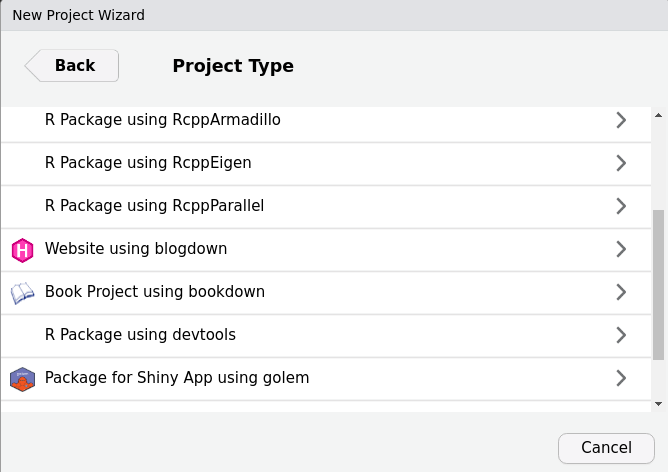
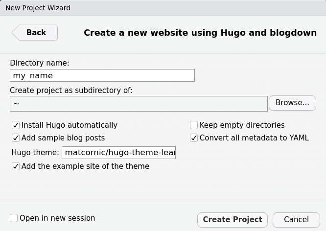
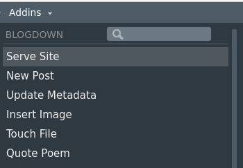
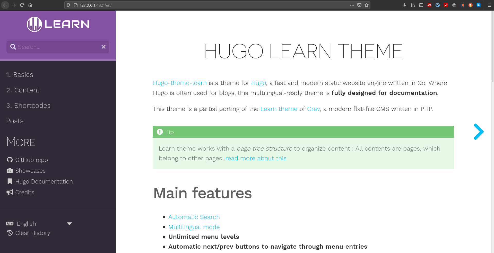
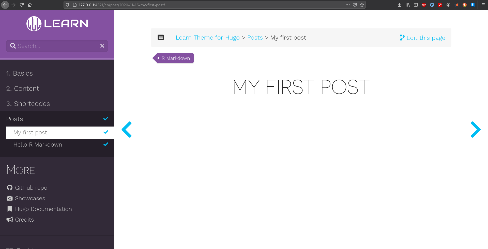

# Blogdown: websites and blogs creation

Now that you are a confident `R` programmer and a budding data scientist, how are going to show such accomplishments to the rest of world? People love talking, but you, you know that you must provide _data_. Why not creating a website to showcase your work? You know from the previous chapters that `R/Rstudio` provides a wide set of tools, you may have heard that it is possible to build a website, but it seems so complicated. Is it? Well, let's find out.

## Static website overview

A convenient solution to create a website is to use the `R` package [blogdown](https://bookdown.org/yihui/blogdown/). By default, blogdown is based on the static site generator [Hugo](https://gohugo.io/). A static web page is a document (often HTML) stored as a file for which its content (text, image, videos, ...) does not dynamically change according to the context of the user. For Hugo, when you build a static web page, the HTML file is rendered locally on your computer as opposite to a hosting server ^[[The benefits of Hugo](https://gohugo.io/about/benefits/)]. As a result, usually static sites offer better performances. Among different static site generator, Hugo has the reputation the be the fastest ^[[Top ten static website generators. ](https://www.netlify.com/blog/2016/05/02/top-ten-static-website-generators/)]. Note that if your interest narrows to making a website for an `R` package, then you may want to turn to [pkgdown](https://pkgdown.r-lib.org/) which will require less investment of your time, but certainly also less reward.

## Getting started

You need to install the `blogdown` package the usual way:
```{r, eval=FALSE}
install.packages("blogdown")
```
Note that the package has addins functionalities for `Rstudio` and a project type that we are going to use.

Create a new project selecting `Website using blogdown`. 

```{r, echo = FALSE}
    
```

## Choosing a theme
The choice of the theme is essential: different themes have different ways to create content, structures, functionalities and maybe most importantly when you get started, different level of details for user documentation. By default, `blogdown` proposes the [hugo-lithium](https://github.com/yihui/hugo-lithium) theme, Yihui Xie's minimal example ^[[Blogdown default theme](https://bookdown.org/yihui/blogdown/themes.html#the-default-theme)]. The complete list of themes is at <https://themes.gohugo.io/>. The [showcase](https://gohugo.io/showcase/) section is also a good indication of what may be achieved. You can find themes with rich user documentation under the tag `documentation`, check [here](https://themes.gohugo.io/tags/documentation/). Some Hugo templates I considered:   

- [Learn](https://themes.gohugo.io/hugo-theme-learn/): This a great and simple theme. It is perfect if the goal is to create documentation. This is for example the one I used for one of my classes, see [here](https://ptds.samorso.ch/). It has a dedicated website for the [documentation](https://learn.netlify.app/en/). This is why I pick it for this chapter.

- [Academic](https://themes.gohugo.io/academic/): this a very complete theme for academic résumé. It is commonly used in academia  (there is a tool to import your BibTeX bibliography!) so there is quite a community behind it, meaning also more support. It has many options and features including `widgets` to build pages. It is however probably an overkill when getting started.

- [Tranquilpeak](https://themes.gohugo.io/hugo-tranquilpeak-theme/): a beautiful and neat theme for blogging. It comes with a complete [documentation](https://github.com/kakawait/hugo-tranquilpeak-theme/blob/master/docs/user.md).   

Once you've picked a theme up, you need to specify under `Hugo theme:` the `USER_NAME/REPOSITORY_NAME` from the GitHub repository of the theme. For example, the `Learn` theme is at <https://github.com/matcornic/hugo-theme-learn> so we enter:

```{r, echo = FALSE}
    
```

## Rendering the website

One attractive feature of Hugo is that you can render your site live locally (on your computer) so that you can observe directly the modifications taking place. With `blogdown`, type in your console:

```{r, eval=FALSE}
blogdown::serve_site()
```

Or alternatively, use directly the `Rstudio` `Addins`.

```{r, echo = FALSE}

```


It creates the website in the viewer panel.

```{r, echo = FALSE}
knitr::include_graphics("images/bg_viewer_panel.png")
```

I would recommend to open the website on your webrowser, for example by clicking on the `Show in new window` button `r knitr::include_graphics("images/bg_click.png")`. It will be very similar to the online version and you can directly see the modifications.

```{r, echo = FALSE}

```

In order to stop the live rendering of the website, you can either restart the `R` session, or maybe simply, by typing in your console:

```{r, eval = FALSE}
blogdown::stop_server()
```

## Creating content  

The next step is to create some content. We will create a post and illustrate some features of Hugo. 

First, you need to decide whether you want to create a plain Markdown document (`.md`) or a RMarkdown document (`.Rmd`) as there are noticeable differences ^[[RMarkdown vs. Markdown](https://bookdown.org/yihui/blogdown/output-format.html)]. A plain Markdown document is by default rendered _a posteriori_ in HTML via [Goldmark](https://github.com/yuin/goldmark/) ^[[Configure Markup in Hugo](https://gohugo.io/getting-started/configuration-markup/)] whereas RMarkdown is compiled _a priori_ using the `rmarkdown` package. A consequence of using RMarkdown is that your website might be slower to render and less clean with many HTML files. A good rule of thumb is: always write a post with plain Markdown unless you need to *run* `R` code (if only display `R` code, use plain Markdown).    

The easiest way to create a document is to click on `Addins > Blogdown > New post` which generates a windows through a shiny app. Here is an example:

```{r, echo = FALSE}
knitr::include_graphics("images/bg_new_post.png")
```

- *Archetype* is a pre-configured skeleton page. The [Learn](https://learn.netlify.app/en/) theme has two archetypes: chapter or default (see [here](https://learn.netlify.app/en/cont/archetypes/)).  

- *Format*: there is a third format, `.Rmarkdown`. This format will be compiled to a Markdown document (not HTML) so you keep the files clean, however it does not use Pandoc as the `rmarkdown` package does (see [Blogdown output format](https://bookdown.org/yihui/blogdown/output-format.html) for more details).   

The post I've generated has the following `YAML` metadata:

```{r, eval = FALSE}
title: "My first post"
author: "John Doe"
date: 2020-11-16
categories: ["R"]
tags: ["R Markdown"]
```

Note that the output format has not been specified as it is HTML by default.

We can immediately have a look at the changes on the website.

```{r, echo = FALSE}

```

Note that the address `http://127.0.0.1:4321` is local.

Alternatives to create content are as follows:

1. Click on `Addins > Blogdown > New post` as we have just seen. 

2. Equivalently, you can type in your console 

```{r, eval = FALSE}
blogdown::new_post()
```

3. As an alternative, you can directly create the document (e.g. `File > New file > R Markdown`). In addition, you will need to know where to store the file (explained in the next section) and adapt the metadata of the file (you can for example have a look at the already existing posts).

4. Eventually, you can use command lines in the terminal as for example shown [here](https://learn.netlify.app/en/cont/archetypes/).

Second, you can now write some content in your file. Since I want to illustrate some of Hugo's features, I create a new Markdown file named `test.md` in the `post` folder (remember that R Mardown are compiled via `rmarkdown`, so it will not understand Hugo shortcodes). The header of the file is simply:

```{r, eval = FALSE}
---
title: Test
---
```

Note that you can also add other variables such as: `date`, `weight`, `description`. `weight` for example is important for organizing the posts. You can find [here](https://gohugo.io/content-management/front-matter/) a complete list of variables. 

Most of the content you create is generally in Markdown format, and we let you refer to [Chapter 2](https://smac-group.github.io/ds/section-rmarkdown.html). Note that since your Markdown file is rendered using Goldmark, there are some differences compared to Pandoc (as used with the library `rmarkdown`), one noticeable is that you cannot run R code as already discussed. One of the gain of using the Markdown format is that you can use Hugo shortcodes. As stated on Hugo's website:  

> Hugo loves Markdown because of its simple content format, but there are times when Markdown falls short. Often, content authors are forced to add raw HTML (e.g., video iframe’s) to Markdown content. We think this contradicts the beautiful simplicity of Markdown’s syntax.
>
> [What a shortcode is](https://gohugo.io/content-management/shortcodes/)

The idea of shortcodes is to circumvent some of Markdown's limitations. For example, if you want to embed a Youtube video, say

```{r, eval=FALSE}
https://www.youtube.com/watch?v=w7Ft2ymGmfc
```

you can simply use the following syntax

```{r, eval = FALSE}

```

Here is how it looks on the website:

```{r, echo = FALSE}
knitr::include_graphics("images/bg_yt.png")
```

You have other Hugo's built-in shortcodes useful for example figures, Instagram, Tweeter, Vimeo,... Check this [link](https://gohugo.io/content-management/shortcodes/#use-hugos-built-in-shortcodes). There is also the possibility to create custom shortcodes. For example, the [Learn](https://learn.netlify.app/en/shortcodes/) theme proposes several. For instance, we can add an info notice using 

```{r, eval = FALSE}
{}
An information disclaimer
{}
```

## Website structure and content organization
If you've followed the above steps, you should have something similar to this tree for your website structure:

```{r, eval = FALSE}
my-website/
├─ my-website.Rproj
├─ config.toml
├─ index.Rmd
├─ LICENSE.md
├─ content/
│  ├─ _index.en.md
│  ├─ _index.fr.md
│  ├─ basics/
│  ├─ cont/
│  ├─ post/
│  │  ├─ 2015-07-23-r-rmarkdown.html
│  │  ├─ 2015-07-23-r-rmarkdown.Rmd
│  │  ├─ test.md
│  │  ├─ 2020-11-16-my-first-post.html
│  │  ├─ 2020-11-16-my-first-post.Rmd
│  ├─ shortcodes/
├─ layouts/
├─ public/
├─ static/
│  ├─ css/
│  ├─ fonts/
│  ├─ images/
│  │  ├─ showcase/
│  │  │  ├─ inteliver_docs.png
│  │  │  ├─ tat.png
│  │  │  ├─ tshark_dev.png
│  ├─ post/
├─ themes/
│  ├─ hugo-theme-learn/
```

- `config.toml` is where you have configuration directives. Some themes such as Academic have `config/` directory. These directives could also be stored in `JSON` or `YAML` syntax.   

- `index.Rmd` is specific to `blogdown`.

- The `content/` folder is where you will add all the content for your website (although not absolute, see [Toha](https://themes.gohugo.io/toha/) theme for such an exception). Hugo follows the same logic as this folder to construct the website. The organization between different pages at the same level can be specified using the `weight` variable.  Usually a section begins with a `_index.md` file (see this [link](https://gohugo.io/content-management/sections/)). In the tree above, there is in addition the distinction between languages. For example, the `_index.md` file in the `basics/` (not shown in the tree) folder has a weight of 5, whereas it is 10 font `cont/` so `basics/` appears first.  

- The `layouts/` folder contains templates in HTML.  If empty, it uses the theme defaults. You need to copy such a file from the theme before modifying it, it is a bad habit to modify files from the `theme/` directory.   

- `static/` stores all the static content such as CSS, JavaScript, ... This content is served as-is, meaning without modification to the website. For example, the image in `static > images > showcase > tat.png` can be directly accessed at <https://learn.netlify.app/images/showcase/tat.png>. Note that there is a `static > post` directory that contains your R Markdown extra files. 

See this [link](https://gohugo.io/getting-started/directory-structure/) for other directories and further information.

## Customizing the theme

Customization depends on the theme you've chosen. For example, with the [Learn](https://learn.netlify.app/en/) theme, you can easily modify the color variants (see [here](https://learn.netlify.app/en/basics/style-customization/#theme-variant)), but is is limited to 3 colors. To create your own variant, you will have to create a CSS file in `static > css` with your own setup following [this example](https://learn.netlify.app/en/basics/style-customization/#yours-variant). You can also modify the [logo](https://learn.netlify.app/en/basics/style-customization/#change-the-logo) and the [favicon](https://learn.netlify.app/en/basics/style-customization/#change-the-favicon).

Other common customizations include:   

- Modify the menu, this is generally easily achieved, check [this](https://learn.netlify.app/en/basics/configuration/).

- With `blogdown`, it is recommended to ignore some files by adding

```{r, eval = FALSE}
ignoreFiles = ["\\.Rmd$", "\\.Rmarkdown$", "_files$", "_cache$"]
```

to your `config.toml` file. See this [link](https://bookdown.org/yihui/blogdown/configuration.html#options) for further explanations. 

- **Google analyitcs**: simply add `googleAnalytics: UA-XXX-YY` in your `config.toml` file using your Google Analytics tracking identifier. Apparently the tracking works also when working locally using `blogdown::server_site()`, this [blog](http://estebanmoro.org/post/2019-02-04-setting-up-your-blog-with-rstudio-and-blogdown-iii-modify-your-theme/#google-analytics) offers a solution.  

- **Disqus**: add the popular commenting system by adding `disqusShortname: yourdiscussshortname` to your `config.toml` file.   

- Add a **Robots.txt** to your website (see [this](https://gohugo.io/templates/robots/)). Review last chapter on [webscraping](https://smac-group.github.io/ds/section-web-scraping-in-r.html) if you don't remember what it is.    

- **LaTeX** equations. If you use `.Rmd`, then you can render math equations (see [Chapter 2](https://smac-group.github.io/ds/section-rmarkdown.html#section-latex)). For `.md` file, a solution is to use [MathJax](https://www.mathjax.org) but you will need some tweaks following for example this [blog](https://geoffruddock.com/math-typesetting-in-hugo/).


See <https://gohugo.io/templates/internal/> for other templates.  

## Deployment

Once your website on a GitHub repository (follow our [Chapter 3](https://smac-group.github.io/ds/section-github.html)), it is easy, quick and free of charge to publish your website online using for example the service of [Netlify](https://netlify.app/). You need to register to Netlify, for example using your GitHub credentials, and then authorize Netlify to access to the relevant repository. The website then will be deployed automatically. You may want to modify the name (usually fantasist by default) and the version of Hugo to compile your website. See [Blogdown: deployment with netlify](https://bookdown.org/yihui/blogdown/netlify.html) for more details.

## See also

See the following blogs of [Dr. Mowinckel's](https://drmowinckels.io/blog/2020-05-25-changing-you-blogdown-workflow/) and [Esteban Moro](http://estebanmoro.org/post/2019-02-02-setting-up-your-blog-with-rstudio-and-blogdown-i-creating-the-blog/) for recent and alternative explanations.  