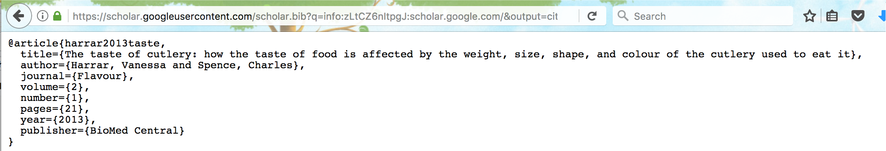
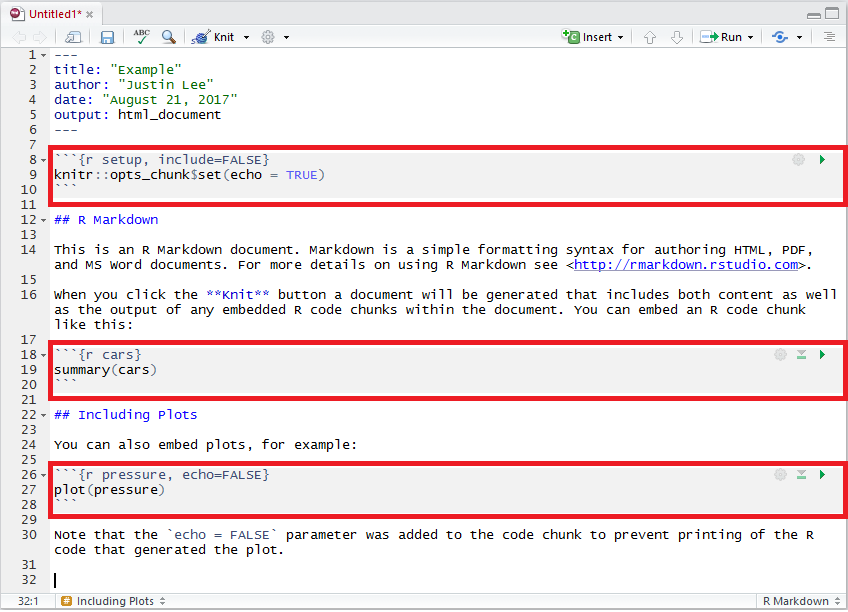

--- 
title: "An Introduction to Statistical Programming Methods with R"
author: "Matthew Beckman, Stéphane Guerrier, Justin Lee & Roberto Molinari"
date: "`r Sys.Date()`"
site: bookdown::bookdown_site
output: bookdown::gitbook
documentclass: book
bibliography: [book.bib, packages.bib]
biblio-style: "acm"
link-citations: yes
github-repo: smac-group/ds
description: "This book is under construction and serves as a reference for students or other interested readers who intend to learn the basics of statistical programming using the R language. The book will provide the reader with notions of data management, manipulation and analysis as well as of reproducible research, result-sharing and version control."
includes:
      in_header: style.css
---

# Introduction

This book is currently under development and has been designed as a support for students who are following (or are interested in) courses that provide the basic knowledge to master "statistical programming" with R. By the latter we mean that area of computer programming which focuses on the implementation of methods that not only manage data but also extract meaningful information from it. The importance of this area of research comes from the increased collection of data from different sources such as academic research, public institutions and private companies that has required a corresponding increase in data management and analysis tools. Consequently, the need to develop applications and methods that are able to deliver these tools has led to a surge in the demand for expertise not only in computer programming but also in statistical and numerical analysis. Indeed, while it is essential to master the basics of programming to build the necessary software, it is now also paramount to understand the programming tools that can effectively respond to the need of finding, extracting, and analyzing the information to achieve the required goals.

Within the above framework, the statistical software `R` has seen a rise in use due to its flexibility as an efficient language that builds a bridge between software development and data analysis. There are of course many other programming languages that have different advantages over `R` but, as you will see, one strength of `R` is the facility to develop and quickly adapt to the different needs coming from the data management and analysis community while at the same time making use of other languages in order to deliver computationally efficient solutions (as well as other interesting features described below). This book intends to present the basic tools to statistical programming and software development using the wide variety of tools made available through `R`, from method-specific packages to version control programs. The general goals of the book are therefore the following:

* understand data structures in order to appropriately manage data, computer memory and computations;
* manipulate data structures through controls, instructions, and tailored functions in order to achieve a desired output;
* create new software tools (packages and web applications) that accommodate a previously unmet need;
* learn how to manage software development via version control tools (e.g., GitHub) and create documentation for this software (with embedded code) to allow others to make use of the software.

All these goals are common to any basic programming course, however all these will be heavily focused on the use and development of statistical tools. In fact, as highlighted earlier, it has become increasingly important to include statistical methodologies within the programming framework thereby allowing software to not only manage data efficiently but also to extract and analyse data in an appropriate manner while doing so. The rest of this introductory chapter will present the R software by explaining why it is used for this book and describing the basic notations and tools that need to be known in order to better grasp its contents.

```{block2,  type='rmdimportant'}
This document is **under development** and it is therefore preferable to always access the text online to be sure you are using the most up-to-date version. Due to its current development, you may encounter errors ranging from broken code to typos or poorly explained topics. If you do, please let us know! Simply add an issue to the GitHub repository used for this document (which can be accessed here https://github.com/SMAC-Group/ds/issues) and we will make the changes as soon as possible. In addition, if you know RMarkdown and are familiar with GitHub, make a pull request and fix an issue yourself, otherwise, if you're not familiar with these tools, they will be explained later on in the book itself.
```

<center></center>

To demonstrate our goals, we will try to implement the process that is mentioned in the diagram above. Most cases, there is input that an audience provides, in which we then process and manipulate in R. Exploratory data analysis is performed using R, R Markdown, and Shiny applications as we preprocess, visualize, and model our data/input. We then communicate our results through websites, rapports, slides, we can use a narrative report using R Markdown with R as the backend. To communicate through a website, we can output interactive Shiny applications that take in multiple parameters and options. We can even use both. Some cases, after we communicate, we may find something new, and move back to the exploring stage. 

## `R` and `RStudio`

The statistical computing language `R` has become commonplace for many applications in industry, government, and academia. Having started as an open-source language to make available different statistics and analytical tools to researchers and the public, it steadily developed into one of the major software languages which not only allows to develop up-to-date, sound, and flexible analytical tools, but also to include these tools within a framework which is well-integrated with other important programming languages, communication, and version-control features. The latter is also possible thanks to the development of the `RStudio` interface which provides a pleasant and functional user-interface for `R` as well as an efficient Integrated Development Environment (IDE) in which different programming languages, web-applications and other important tools are available to the user.  In order to illustrate the relationship between R & RStudio in statistical programming, one might think of a car analogy in which R would be like the engine and RStudio might be like leather seats.  R is doing the work (for the most part), and RStudio generally is making you more comfortable while you use R.

### Why `R`?

There are many reasons to use `R`. Two compelling reasons are that R is both free as in "free pizza", and free as in "free speech").  Free--like "free pizza"--means that there is never a need to pay for any part of the R software, or contributed packages (i.e. add-on modules).  Free--like "free speech"--means that there are very few restrictions on how R can be used or barriers to those who would like to contribute packages (i.e. add-on modules).

The fact that is a free and open-source software which *per se* does not necessarily imply that it is a good software (although it is also that). The reason why this is an important feature consists in the fact that the results of any code or program developed in the `R` environment can easily be replicated therefore ensuring accessibility and transparency for the general user. More importantly however, this replicability of results is also accompanied by a wide variety of packages that are made available through the `R` environment in which users can find a diversity of codes, functions and features that are designed to tackle a large amount of programming and analytical tasks. Moreover, these packages are relatively simple to create and are extremely useful for code-sharing purposes since they enclose the codes, functions and external dependencies that allow anyone to install any of these features all at once in easy and efficient manner.

In addition to its accessibility and code-sharing features, `R` has acquired visibility and importance mainly due to the cutting-edge tools that it makes available to the general user. Indeed, a growing area of research both in academia and in industry is Statistics and Machine Learning through which it is possible to find, extract and make an efficient use of the increasing amount of data and information being collected. All the latest methods and approaches going from data-mining techniques to predictive analysis are available in `R` and, due to its nature, all future methods and approaches will be made available to all users through `R`. For this reason, any individual, company or organization has a keen interest in acquiring and developing expertise in `R` since it makes available the most appropriate tools for any data-based analysis and decision-making process.

Like any other software, there are of course some drawbacks with using `R`. First, the presence of an extended amount of user-contributed packages can make its usage and bug-reporting problematic. Although this does not represent a major problem since many forums exist and solutions are usually quickly fixed, there can be many issues concerning package updates or deletions that can create problems for other existing packages that depend on them. This is fairly rare, but there can consequently be problems in the use of packages that become obsolete and need to be fixed due to dependency issues. Another drawback consists in the extensive use of computer memory that `R` entails through its commands which generally give little relevance to this issue. However, many different solutions are being developed which deal with this problem along with the increased memory made available by current operating systems.

In the perspective of improving the usage of computer memory, `R` has been developing efficient and "seemless" connections with high-performance languages which allow functions and packages to make use of them thereby greatly lightening and accelerating computations made through `R`. An important example of this is given by the connections made available to the `C++` language. In this book we will discuss the connections with this language that are particularly well implemented, but other high-performance languages can be used such as `C` and `FORTRAN`.

### Getting started with `R`

As mentioned earlier, `R` can be thought of as a programming language as well as a software environment for statistical programming. Since it is a free and open-source software, all you will need to do is to download it from the following link:

- [`R`](https://cran.r-project.org/)

Once you've downloaded and installed `R` on your computer you will be able to start using the programming language and packages that the `R` environment provides. Nevertheless, to make full use of the latest developments and features of this software, in this book we recommend using the IDE called `RStudio` which can be downloaded from the following link:

- [RStudio](https://www.rstudio.com/)

```{block2,  type='rmdimportant'}
You cannot use `RStudio` without having installed `R` on your computer.
```

### About RStudio

`RStudio` is a customizable IDE for the `R` enviornment where the user can have easy access to plots, data, help, files, objects and many other features that are useful to work efficiently with `R`. For the most part, `RStudio` provides everything the `R` user will need in a self-contained, and well-organized environment.  Moreover, it is possible to create "projects" in which it is possible to create a dedicated environment space for sets of specific functions and files aimed to deal with various tasks.

Below is short video demonstrating a basic introduction of RStudio and some of its elements. 

```{r, echo=FALSE}
knitr::include_url("https://www.youtube.com/embed/mU9KSgiom5g")
```

In addition, `RStudio` provides embedded functionality to utilize collaborative version-control software including GitHub & Subversion as well as a set of powerful tools to save and communicate results (whether they be simulations, data analysis, or presenting and making available a new package to other users). Some examples of these tools are `Rmarkdown` which can be used respectively to integrate written narrative with embedded `R` code and other content, as well as and `Shiny Web Apps` which can provide an interactive user-friendly interface that permits a user to actively engage with a wide variety of tools built in `R` without the need to encounter raw `R` code. GitHub and `Rmarkdown` will be the object of a more in-depth description in the first chapters of this book in order to provide the reader with the version-control and annotation tools that can be useful for the following chapters of this book.

### Conventions

Throughout this book, `R` code will be typeset using a `monospace` font which is syntax highlighted. For example:

```{r, eval = FALSE}
a = pi
b = 0.5
sin(a*b)
```


Similarly, `R` output lines (that usally appear in your Console) will begin with `##` and will not be syntax highlighted. The output of the above example is the following:

```{r, echo = FALSE}
a = pi
b = 0.5
sin(a*b)
```

Aside from `R` code and its outputs, this book will also insert some boxes that will draw the reader's attention to  important, curious, or otherwise informative details. An example of these boxes was seen at the beginning of this introduction where an important aspect was pointed out to the reader regarding the "under construction" nature of this book. Therefore the following boxes and symbols can be used to represent information of different nature:

```{block2,  type='rmdimportant'}
This is an important piece of information.
```

```{block2, type='rmdnote'}
This is some additional information that could be useful to the reader.
```

```{block2, type='rmdcaution'}
This is something that the reader should pay caution to but should not create major problems if not considered. 
```

```{block2, type='rmdwarning'}
This is a warning which should be heeded by the reader to avoid problems of different nature.
```

```{block2, type='rmdtip'}
This is a tip for the reader when following or developing something based on this book.
```

### Simple calculations

A basic aspect to underline about the `R` environment is that it serves as an advanced calculator which therefore allows also for simple calculations. In the table below we show a few examples of such calculations where the first column gives a mathematical expression (calculation), the second gives the equivalent of this expression in `R` and finally in the third column we can find the result that is output from `R`.

| Math.              |R                   | Result      |
|:-------------------|:-------------------|:------------|
| 2+2                | `2+2`              | `4`         |
| $\frac{4}{2}$      | `4/2`              | `2`         |
| $3 \cdot 2^{-0.8}$ | `3*2^(-0.8)`       | `1.723048`  |
| $\sqrt{2}$         | `sqrt(2)`          | `1.414214`  |
| $\pi$              | `pi`               | `3.141593`  |
| $\ln(2)$           | `log(2)`           | `0.6931472` |
| $\log_{3}(9)$      | `log(9, base = 3)` | `2`         |
| $e^{1.1}$          | `exp(1.1)`         | `3.004166`  |
| $\cos(\sqrt{0.9})$ | `cos(sqrt(0.9))`   | `0.5827536` |


### Getting help

In the previous section we presented some examples on how `R` can be used as a calculator and we have already seen several functions such as `sqrt()` or `log()`. To obtain documentation about a function in `R`, simply put a question mark in front of the function name (or just type `help()` around the function name), or use the search bar on the "Help" tab in your RStudio window, and its documentation will be displayed. For example, if you are interested in learning about the function `log()` you could simply type:

```{r, eval = FALSE}
?log
```

which will display something similar to:


The `R` documentation is written by the author of the package.  For mainstream packages in widespread use, the documentation is almost always quite good, but in some cases it can be quite technical, difficult to interpret, and possibly incomplete. In these cases, the best solution to understand a function is to search for help on any search engine.  Often a simple search like "side by side boxplots in R" or "side by side boxplots in ggplot2" will produce many useful results. The search results often include user forums such as "CrossValidated" or "StackExchange" in which the questions you have about a function have probably already been asked and answered by many other users. 

```{block2, type='rmdtip'}
You can often use the error message to search for answers about a problem you may have with a function.
```

### Installing packages

`R` comes with a number of built-in functions but one of its main strengths is that there is a large number of packages on an ever-increasing range of subjects available for you to install. These packages provide additional functions, features and data to the R environement. If you want to do something in `R` that is not available by default, there is a good chance that there are packages that will respond to your needs. In this case, an appropriate way to find a package in `R` is to use the search option in the CRAN repository which is the official network of file-transfer protocols and web-servers that store updated versions of code and documentation for `R` (see CRAN website). Another general approach to find a package in `R` is simply to use a search engine in which to type the keywords of the tools you are looking for followed by "R package".

`R` packages can be installed in various ways but the most widely used approach is through the `install.packages()` function. Another way is to use the "Tools -> Install Packages..." path from the dropdown menus in `RStudio` or clicking on the "install" button in the "Packages" pane in the RStudio environment. The `install.packages()` function is very straight-forward and transcends any platform for the `R` environment. It is noteworthy that this approach assumes that the desired package(s) are available within the CRAN repository. This is very often the case, but there is a growing number of packages that are under-development or completed and are made available through other repositories. In the latter setting, Chapter 02 will show other ways of installing packages from a commonly used repository called "GitHub". 

Sticking momentarily to the packages available in the CRAN repository, the use of the `install.packages()` is quite simple. For example, if you want to install the package `devtools` you can simply write:

```{r, eval = FALSE}
install.packages("devtools")
```

Once a package is installed it is not directly usable within your `R` session. To do so you will have to "load" the package into your current `R` session which is generally done through the function `library()`. For example, after having installed the `devtools` package, in order to use it within your session you would write:

```{r, eval = FALSE}
library(devtools)
```

Once this is done, all the functions and documentation of this package are available and can be used within your current session. However, once you close your `R` session, all loaded packages will be closed and you will have to load them again if you want to use them in a new `R` session.

```{block2, type='rmdnote'}
Please notice that although packages need to be loaded at each session if you want to use them, they need to be installed only once. The only exception to this rule is when you need to update the package or reinstall it for some reason.
```

One of the main packages that is required for this class would be our STAT 297 package, that contains all the necessary packages and functions that will be utilized in this course. Run the following code to install the package directly from GitHub. 

```{r, eval = FALSE}
install_github("SMAC-Group/stat297")
```


### Additional References

There are many more elements in RStudio, and we encourage you to use the [RStudio Cheatsheet](https://www.rstudio.com/wp-content/uploads/2016/01/rstudio-IDE-cheatsheet.pdf) as a reference. 

## Basic Probability and Statistics with `R`

The `R` environment provides an up-to-date and efficient programming language to develop different tools and applications. Nevertheless, its main functionality lies in the core statistical framework and tools that consistute the basis of this language. Indeed, this book aims at introducing and describing the methods and approaches of statistical programming which therefore require a basic knowledge of Probability and Statistics in order to grasp the logic and usefulness of the features presented in this book.

For this reason, we will briefly take the reader through some of the basic functions that are available within `R` to obtain probabilities based on parametric distributions, compute summary statistics and understand basic data structures. The latter is just an introduction and a more in-depth description of different data structures will be given in a future chapter.

### Probability Distributions 

Probability distributions can be uniquely characterized by different functions such as, for example, their density or distribution functions. Based on these it is possible to compute theoretical quantiles and also randomly sample observations from them. Replacing the `R` syntax for a given probability distribution with the general syntax `name`, all these functions and calculations are made available in `R` through the built-in functions: 

- `dname` calculates the value of the density function (pdf);
- `pname` calculates the value of the distribution function (cdf);
- `qname` calculates the value of the theoretical quantile;
- `rname` generates a random sample from a particular distribution.

Note that, when using these functions in practice, `name` is replaced with the syntax used in `R` to denote a specific probability distribution. For example, if we wish to deal with a Uniform probability distribution, then the syntax `name` is replaced by `unif` and, furthering the example, to randomly generate observations from a uniform distribution the function to use will be therefore `runif`. `R` allows to make use of these functions for a wide variety of probability distributions that include, but are not limited to: Gaussian (or Normal), Binomial, Chi-square, Exponential, F-distribution, Geometric, Poisson, Student-t and Uniform. In order to get an idea of how these functions can be used, below is an example of a problem that can be solved using them.

#### Example: Normal Test Scores of College Entrance Exam

Assume that the test scores of a college entrance exam follows a Normal distribution. Furthermore, suppose that the mean test score is 70 and that the standard deviation is 15. How would we find the percentage of students scoring 90 or more in this exam?

In this case, we consider a random variable $X$ that is normally distributed as follows: $X \sim N(\mu=70, \sigma^2=225)$ where $\mu$ and $\sigma^2$ represent the mean and variance of the distribution respectively. Since we are looking for the probability of students scoring higher than 90, we are interested in finding $\mathbb{P}(X > x=90)$ and therefore we look at the upper tail of the Normal distribution. To find this probability we need the distribution function (`pname`) for which we therefore replace `name` with the `R` syntax for the Normal distribution: `norm`. The distribution function in `R` has various parameters to be specified in order to compute a probability which, at least for the Normal distribution, can be found by typing `?pnorm` in the Console and are:

- `q`: the quantile we are interested in (e.g. 90);
- `mean`: the mean of the distribution (e.g. 70);
- `sd`: the standard deviation of the distribution (e.g. 15);
- `lower.tail`: a boolean determining whether to compute the probability of being smaller than the given quantile (i.e. $\mathbb{P}(X \leq x)$) which requires the default argument `TRUE` or larger (i.e. $\mathbb{P}(X > x)$) which requires to specify the argument `FALSE`.

Knowing these arguments, it is now possible to compute the probability we are interested in as follows:

```{r}
pnorm(q = 90, mean = 70, sd = 15, lower.tail = FALSE) 
```

As we can see from the output, there is roughly a 9% probability of students scoring 90 or more on the exam.

### Summary Statistics
 
While the previous functions deal with theoretical distributions, it is also necessary to deal with real data from which we would like to extract information. Supposing--as is often the case in applied statistics--we don't know from which distribution it is generated, we would be interested in understanding the behavior of the data in order to eventually identify a distribution and estimate its parameters.

The use of certain functions varies according to the nature of the inputs since these can be, for example, numerical or factors.

#### Numerical Input

A first step in analysing numerical inputs is given by computing summary statistics of the data which, in this section, we can generally denote as `x` (we will discuss the structure of this data more in detail in the following chapters). For central tendency or spread statistics of a numerical input, we can use the following `R` built-in functions:

- `mean` calculates the mean of an input `x`;
- `median` calculates the median of an input `x`;
- `var` calculates the variance of an input `x`;
- `sd` calculates the standard deviation of an input `x`;
- `IQR` calculates the interquartile range of an input `x`;
- `min` calculates the minimum value of an input `x`;
- `max` calculates the maximum value of an input `x`; 
- `range` returns a vector containing the minimum and maximum of all given arguments;
- `summary` returns a vector containing a mixture of the above functions (i.e. mean, median, first and third quartile, minimum, maximum).

#### Factor Input 

If the data of interest is a factor with different categories or levels, then different summaries are more appropriate. For example, for a factor input we can extract counts and percentages to summarize the variable by using `table`. Using functions and data structures that will be described in the following chapters, below we create an example dataset with 90 observations of three different colors: 20 being `Yellow`, 10 being `Green` and 50 being `Blue`. We then apply the `table` function to it:

```{r}
table(as.factor(c(rep("Yellow", 20), rep("Green", 10), rep("Blue", 50))))
```

By doing so we obtain a frequency (count) table of the colors.

#### Dataset Inputs

In many cases, when dealing with data we are actually dealing with datasets (see Chapter 03) where variables of different nature are aligned together (usually in columns). For datasets there is another convenient way to get simple summary statistics which consists in applying the function `summary` to the dataset itself (instead of simply a numerical input as seen earlier). 

As an example, let us explore the [Iris](https://en.wikipedia.org/wiki/Iris_flower_data_set) flower dataset contained in the `R` built-in `datasets` package. The data set consists of 50 samples from each of three species of Iris (Setosa, Virginica and Versicolor). Four features were measured from each sample consisting in the length and the width (in centimeters) of the both sepals and petals. This dataset is widely used as an example since it was used by Fisher to develop a linear discriminant model based on which he intended to distinguish the three species from each other using combinations of these four features.

Using this dataset, let us use the `summary` function on it to output the minimum, first quartile and thrid quartile, median, mean and maximum statistics (for the numerical variables in the dataset) and frequency counts (for factor inputs).

```{r}
summary(iris)
```

## Main References 

This is not the first (or the last) book that has been written explaining and describing statistical programming in `R`. Indeed, this can be seen as a book that brings together and reorganizes information and material from other sources structuring and tailoring it to a course in basic statistical programming. The main references (which are far from being an exhaustive review of literature) that can be used to have a more in-depth view of different aspects treated in this book are:

- @wickham2014advanced : a more technical and advanced introduction to `R`;
- @wickham2015packages : basic building blocks of building packages in `R`; 
- @xie2015 : an overview of document generation in `R`;

## License

You can redistribute it and/or modify this book under the terms of the Creative Commons Attribution-NonCommercial-ShareAlike 4.0 International License (CC BY-NC-SA) 4.0 License.

<a href="http://creativecommons.org/licenses/by-nc-sa/4.0/"></a>
<br><br><br>


<!--chapter:end:index.Rmd-->

# (PART) Foundation {-}

# RMarkdown 

RMarkdown is a framework that provides a literate programming format for data science. It can be used to save and execute R code within RStudio and also as a simple formatting syntax for authoring HTML, PDF, ODT, RTF, and MS Word documents as well as seamless transitions between available formats. The name "markdown" is an intentional contrast to other "markup" languages--e.g., hypertext markup language (HTML)--which require syntax that can be quite difficult to decipher for the uninitiated. One aim of the markdown paradigm is a syntax that is as human-readable as possible. "RMarkdown" is an implementation of the "markdown" language designed to accommodate embedded `R` code.

### What is **literate** programming? {-}

Literate programming is the notion for programmers of adding narrative context with code to produce documentation for the program simultaneously. Consequently, it is possible to read through the code with explanations so that any viewer can follow through the presentation. RMarkdown offers a simple tool that allows to create reports or presentation slides in a reproducible manner with collateral advantages such as avoiding repetitive tasks by, for example, changing all figures when data are updated. 

### What is **reproducible** research? {-}

Reproducible research or reproducible analysis is the notion that an experiment's whole process, including collecting data, performing analysis and producing output can be reproduced the same way by someone else. Building non-reproducible experiments has been a problem both in research and in the industry, and having such an issue highly decreases the credibility of the authors' findings and, potentially, the authors themselves. In essence, allowing for reproducible research implies that anyone could run the code (knit the document, etc.) and obtain the same exact results as the original research and RMarkdown is commonly used to address this issue. 

Below is a short video showing a basic overview of R Markdown.  

```{r, echo = FALSE}
knitr::include_url("https://www.youtube.com/embed/Fti30-mZkC0")
```

Below, we have created a framework application that you can use to test out different R Markdown functions. Experiment with different R Markdown elements and utilize it to practice building and knitting HTML output. 

```{r, echo=FALSE}
knitr::include_app("http://shiny.science.psu.edu/szg279/rmd_mini/", height = "650px")
```

You can access the online versions here: 

- [RMarkdown Web](http://shiny.science.psu.edu/szg279/rmd/)
- [RMarkdown Mobile](http://shiny.science.psu.edu/szg279/rmd_mini/)

or simply run it within the `stat297` package by using either

```{r, eval = FALSE}
# RMarkdown Web
stat297::runShiny('rmd')

# RMarkdown Mobile
stat297::runShiny('rmd_mini')
```

## Create an R Markdown file in RStudio

Within RStudio, click `File` → `New File` → `R Markdown`. Give the file a title and the author 
(your name) and select the default output, HTML. We can change this later so don't worry about it for the moment. 

<center></center>

An RMarkdown is a plain text file that contains three different aspects:

- YAML metadata
- Text 
- Code Chunks

## YAML Metadata 

YAML stands for *YAML Ain't Markup Language* and is used to specify document configurations and properties such as name, date, output format, etc. The (optional) YAML header is surrounded before and after by "---" on a dedicated line.

<center></center>

You can also include additional formatting [options](http://RMarkdown.rstudio.com/html_document_format.html) such as a table of contents or even a custom CSS style template which can be used to further enhance the presentation. For the purpose of this book, the default options should be sufficient. Below is an example knit output of the above RMarkdown file. 

<center></center>

The default output above is an html_document format but this format can be modified using, for example, `pdf_document` to output a pdf. However, the pdf format requires additional installation and configuration of a TeX distribution such as [MikTeX](https://miktex.org/2.9/setup). Once available, the user can also include raw LaTeX and even define LaTeX macros in the RMarkdown document if necessary (we'll discuss more about LaTeX further on).


### Subsections 

To make your sections numbered as sections and subsections, make sure you specify `number_sections: yes` as part of the YAML Metadata as shown below. 

<center></center>


## Text 

Due to its literate nature, text will be an essential part in explaining your analysis. With RMarkdown, we can specify custom text formatting with emphases such as *italics*, **bold**, or `code style`. To understand how to format text, our previous sentence would be typed out as follows in RMarkdown:

```
With RMarkdown, we can specify custom text formatting with emphases such as *italics*, **bold**, or `code style
```

<center></center>


### Headers

As seen above, headers are preceded by a #. A single `#` produces the largest heading text while, to produce smaller headings, you simply need to add more `#`s! Heading level also impacts section and subsection nesting in documents and tables of contents, as well as slide breaks in presentation formats.

### Lists 

Lists can be extremely convenient to make text more readable or to take course notes during class. RMarkdown allows to create different list structures as shown in the code below:  

```{r, eval = FALSE, highlight = FALSE}
* You can create bullet points by using symbols such as *, +, or -. 
+ simply add an indent or four preceding spaces to indent a list. 
    + You can manipulate the number of spaces or indents to your liking. 
        - Like this. 
    * Here we go back to the first indent. 
1. To make the list ordered, use numbers. 
1. We can use one again to continue our ordered list. 
2. Or we can add the next consecutive number. 
```

which delivers the following list structure:

* You can create bullet points by using symbols such as *, +, or -. 
+ simply add an indent or four preceding spaces to indent a list. 
    + You can manipulate the number of spaces or indents to your liking. 
        - Like this. 
    * Here we go back to the first indent. 
1. To make the list ordered, use numbers. 
1. We can use one again to continue our ordered list. 
2. Or we can add the next consecutive number. 

### Hyperlinks 

To add hyperlinks with the full link, (ex: <https://google.com/>) you can follow the syntax below: 

```{r, eval = FALSE, highlight = FALSE}
<https://google.com/>
```

whereas to add hyperlinks with a custom link title, (ex: [Google](https://google.com)) follow the syntax below: 

```{r, eval = FALSE, highlight = FALSE}
[Google](https://google.com)
```

### Blockquotes

Use the > character in front of a line, *just like in email* to produce blockquotes which styles the text in a way to use if we quote a person, a song or another entity. 

> "To grow taller, you should shave your head. Remember to bring the towels!"
>
> Justin Lee 

### Pictures 

To add a picture with captions, follow the syntax below:

```{r, eval = FALSE, highlight = FALSE}

```

which will produce:

<center></center>

Otherwise, to add a picture without any captions, follow the syntax below:

```{r, eval = FALSE, highlight = FALSE}

```

which delivers:

<center>{ width=50%}</center>


### LaTeX 

LaTeX is a document preparation system that uses plain text as opposed to formatted text that is used for applications such as Microsoft Word. It is widely used in academia as a standard for the publication of scientific documents. It has control over large documents containing sectioning, cross-references, tables and figures. 

#### LaTeX in RMarkdown 

Unlike a highly formatted word processor, we cannot produce equations by clicking on symbols. As data scientists there is often the need to explain distributions and equations that are behind the methods we present. Within the text section of an RMarkdown document you can include LaTeX format text to output different forms of text, mainly equations and mathematical expressions. 

Inline mathematical expressions can be added using the syntax: `$math expression$`. For example, if we want to write "where $\alpha$ is in degrees" we would write:

```{r, eval = FALSE, highlight = FALSE}
"where $\alpha$ is in degrees".
```

Using a slightly different syntax (i.e. `$$math expression$$`) we can obtain centered mathematical expressions. For example, the binomial probability distribution in LaTeX is written as

`$$f(y|N,p) = \frac{N!}{y!(N-y)!}\cdot p^y \cdot (1-p)^{N-y} = {{N}\choose{y}} \cdot p^y \cdot (1-p)^{N-y}$$`

which is output as:

$$f(y|N,p) = \frac{N!}{y!(N-y)!}\cdot p^y \cdot (1-p)^{N-y} = {{N}\choose{y}} \cdot p^y \cdot (1-p)^{N-y}$$

An introduction to the LaTeX format can be found [here](http://www.math.harvard.edu/texman/) if you want to learn more about the basics. An alternative can be to insert custom LaTeX formulas using a graphical interface such as [codecogs](https://www.codecogs.com/latex/eqneditor.php). 

### Cross-referencing Sections 

You can also use the same syntax `\@ref(label)` to reference sections, where label is the section identifier (ID). By default, Pandoc will generate IDs for all section headers, e.g., `# Hello World` will have an ID `hello-world`. To call header `hello-world` as a header, we type `\@ref(hello-world)` to cross-reference the section. In order to avoid forgetting to update the reference label after you change the section header, you may also manually assign an ID to a section header by appending {#id} to it.

### Citations and Bibliography 

Citations and bibliographies can automatically be generated with RMarkdown. In order to use this feature we first need to create a "BibTex" database which is a simple plain text file (with the extension ".bib") where each reference you would like to cite is entered in a specific manner. 

To illustrate how this is done, let us take the example of a recent paper where two researchers from Oxford University investigated the connection between the taste of food and various features of cutlery such as weight and color (calling this phenomenon the "taste of cutlery"). The BibTeX "entry" for this paper is given below:

```
@article{harrar2013taste,
  title={The taste of cutlery: how the taste of food is affected by the weight, size,
   shape, and colour of the cutlery used to eat it},
  author={Harrar, Vanessa and Spence, Charles},
  journal={Flavour},
  volume={2},
  number={1},
  pages={21},
  year={2013},
  publisher={BioMed Central}
}
```

This may look like a complicated format to save a reference but there is an easy way to obtain this format without having to manually fill in the different slots. To do so, go online and search for "Google Scholar" which is a search engine specifically dedicated to academic or other types of publications. In the latter search engine you can insert keywords or the title and/or authors of the publication you are interested in and find it in the list of results. In our example we search for "The taste of cutlery" and the publication we are interested in is the first in the results list.

<center></center>

Below every publication in the list there is a set of options among which the one we are interested in is the "Cite" option that should open a window in which a series of reference options are available. Aside from different reference formats that can be copied and pasted into your document, at the bottom of the window you can find another set of options (with related links) that refer to different bibliography managers.

<center></center>

For ".bib" files we are interested in the "BibTeX" option and by clicking on it we will be taken to another tab in which the format of the reference we want is provided. All that needs to be done at this point is to copy this format (that we saw earlier in this section) and paste in the ".bib" file you created and save the changes.

<center></center>

However, your RMarkdown document does not know about the existence of this bibliography file and therefore we need to insert this information in the YAML metadata at the start of our document. To do so, let us suppose that you named this file "biblio.bib" (saved in the same location as your RMarkdown document). All that needs to be done is to add another line in the YAML metadata with `bibliography: biblio.bib` and your RMarkdown will now be able to recognize the references within your ".bib" file. 

<center></center>

There are also a series of other options that can be specified for the bibliography such as its format or the way references can be used within the text (see links at the end of this section).

Once the ".bib" file has been created and has been linked to your RMarkdown document through the details in the YAML metadata, you can now start using the references you have collected in the ".bib" file. To insert these references within your document at any point of your text you need to use the name that starts the reference field in your ".bib" file and place it immediately after the `@` symbol (without spaces). So, for example, say that we wanted to cite the publication on the "taste of cutlery": in your RMarkdown all you have to do is to type `@harrar2013taste` at the point where you want this citation in the text and you will obtain: @harrar2013taste. Moreover, it is often useful to put a citation in braces and for example if you want to obtain [see e.g. @harrar2013taste] you can simply write `[see e.g. @harrar2013taste]`.

```{block2, type='rmdnote'}
The user can also change the name that is used to call the desired reference as long as the same name is used to cite it in the RMarkdown document and that this name is not the same as another reference. 
```

```{block2, type='rmdcaution'}
The references in the ".bib" file will not appear in the references that are output from the RMarkdown compiling procedure unless they are specifically used within the RMarkdown document.
```

Additional information on BibTeX and reference in RMarkdown can be found in the links below:

- [Introduction to bibtex](https://www.economics.utoronto.ca/osborne/latex/BIBTEX.HTM)
- [Reference in RMarkdown](http://RMarkdown.rstudio.com/authoring_bibliographies_and_citations.html)


### Tables 

For simple tables, we can be manually insert values as such follows: 

```
+---------------+---------------+--------------------+
| Fruit         | Price         | Advantages         |
+===============+===============+====================+
| *Bananas*     | $1.34         | - built-in wrapper |
|               |               | - bright color     |
+---------------+---------------+--------------------+
| Oranges       | $2.10         | - cures scurvy     |
|               |               | - **tasty**        |
+---------------+---------------+--------------------+
```

to produce:

+---------------+---------------+--------------------+
| Fruit         | Price         | Advantages         |
+===============+===============+====================+
| *Bananas*     | $1.34         | - built-in wrapper |
|               |               | - bright color     |
+---------------+---------------+--------------------+
| Oranges       | $2.10         | - cures scurvy     |
|               |               | - **tasty**        |
+---------------+---------------+--------------------+

As an alternative we can use the simple graphical user interface [online](http://www.tablesgenerator.com/markdown_tables). For more extensive tables, we create dataframe objects and project them using `knitr::kable()` which we will explain later on this book. 

### Additional References 

There are many more elements to creating a useful report using RMarkdown, and we encourage you to use the [RMarkdown Cheatsheet](https://www.rstudio.com/wp-content/uploads/2015/02/rmarkdown-cheatsheet.pdf) as a reference. 


## Code Chunks 

Code chunks are those parts of the RMarkdown document where it is possible to embed R code within your output. To insert these chunks within your RMarkdown file you can use the following shortcuts:

- the keyboard shortcut Ctrl + Alt + I (OS X: Cmd + Option + I)
- the Add Chunk command in the editor toolbar
- by typing the chunk delimiters **\`\`\`\{\r\}** and **\`\`\`**.

The following example highlights the code chunks in the example RMarkdown document we saw at the start of this chapter:

<center></center>

### Code Chunk Options

A variety of options can be specified to manage the code chunks contained in the document. For example, as can be seen in the third code chunk in the example above, we specify an argument that reads `echo = FALSE` which is a parameter that was added to the code chunk to prevent printing the R code that generated the plot. This is a useful way to embed figures. More options can be found from the [RMarkdown Cheatsheet](https://www.rstudio.com/wp-content/uploads/2015/02/rmarkdown-cheatsheet.pdf) and Yihui's notes on knitr [options](https://yihui.name/knitr/options/). Here are some explanations of the most commonly used chunk options taken from these references: 

- `eval`: (TRUE; logical) whether to evaluate the code chunk;
- `echo`: (TRUE; logical or numeric) whether to include R source code in the output file;
- `warning`: (TRUE; logical) whether to preserve warnings (produced by warning()) in the output like we run R code in a terminal (if FALSE, all warnings will be printed in the console instead of the output document);
- `cache`: (FALSE; logical) whether to "*cache*" a code chunk. This option is particularly important in practice and is discussed in more details in Section \@ref(cache).

Plot figure options: 

- `fig.path`: ('figure/'; character) prefix to be used for figure filenames (fig.path and chunk labels are concatenated to make filenames);
- `fig.show`: ('asis'; character) how to show/arrange the plots;
- `fig.width`, `fig.height`: (both are 7; numeric) width and height of the plot, to be used in the graphics device (in inches) and have to be numeric;
- `fig.align`: ('default'; character) alignment of figures in the output document (possible values are left, right and center;
- `fig.cap`: (NULL; character) figure caption to be used in a figure environment.

### Comments

Adding comments to describe the code is extremely useful (if not essential) during every coding and programming process. It helps **you** take notes and remember what is going on and why you made use of these functions, as well as helping others understand your code. Forgetting to comment or document your code often becomes a larger problem in the future when, among numerous lines of code, you have forgotten the reason for using certain functions or algorithms. 

> "Don't document bad code – rewrite it."
> The Elements of Programming Style, Kernighan & Plauger

```{r}
# Comment your code by preceding text with a # 
# Keep it brief but comprehensible, so you can return to it 
```

### In-line R

The variables we store in an RMarkdown document will stay within the environment they were created in. This means that we can call and manipulate them anywhere within the document. For example, supposing we have a variable called `x` to which we assign a specific value, then in RMarkdown we can reference this variable by using ` r x`: this will affix the value of the variable directly in a sentence. Here is a practical example: 

```{r}
a = 2
```

where we have stored the value 2 in a variable called `a`. We can use the value of `a` as follows:

```{r, eval = FALSE, highlight = FALSE}
The value of $a$ is `r a`. 
```

This translates in R Markdown to "The value of $a$ is `r a`."

### Cache {#cache}

Depending on the complexity of calculations in your embedded R code, it may be convenient to avoid re-running the computations (which could be lengthy) each time you knit the document together. For this purpose, it possible to specify an additional argument for your embedded R code which is the `cache` argument. By default this argument is assigned the value `FALSE` and therefore the R code is run every time your document is compiled. However, if you specify this argument as `cache = TRUE`, then the code is only run the first time the document is compiled while the following times it simply stores and presents the results of the computations when the document was first compiled.

Below is a short video introducing caching in R Markdown. 

```{r, echo = FALSE}
knitr::include_url("https://www.youtube.com/embed/9q1eJyOQQsE")
```

The RMarkdown file used for this particular example can be found here: [caching.Rmd](code_examples/caching.Rmd). 

Let us consider an example where we want to embed an R code with a very simple operation such as assigning the value of 2 to an object that we call `a` (that we saw earlier). This is clearly not the best example since this operation runs extremely quickly and there is no visible loss in document compilation time. However, we will use it just to highlight how the `cache` argument works. Therefore, if we want to avoid running this operation each time the document is compiled, then we just embed our R code as follows:

```{r computeA, cache = TRUE}
a = 2
```

which would be written in RMarkdown as:

````r
`r ''````{r computeA, cache = TRUE}
a = 2
```
````

You will notice that we called this chunk of embedded R code `computeA` and the reason for this will become apparent further on. Once we have done this we can compile the document that will run this operation and store its result. Now, if we compile the document again (independently from whether we made changes to the rest of the document or not) this operation will not be run and the result of the previous (first) compiling will be presented. However, if changes are made to the R code which has been "cached", then the code will be run again and this time its new result will be stored for all the following compilings until it is changed again.

This argument can therefore be very useful when computationally intensive R code is embedded within your document. Nevertheless it can suffer from a drawback which consists in dependencies of your "cached" R code with other chunks within the document. In this case, the other chunks of R code can be modified thereby outputting different results but these will not be considered by your "cached" R code. As an example, suppose we have another chunk of R code that we can "cache" and that takes the value of `a` from the previous chunk:

```{r, cache = TRUE}
(d = 2*a)
```

which would be written in RMarkdown as:

````r
`r ''````{r, cache = TRUE}
(d = 2*a)
```
````

In this case, the output of this chunk will be `## 4` since `a = 2` (from the previous chunk). What happens however if we modify the value of `a` in the previous chunk? In this case, the previous chunk will be recomputed but the value of `d` (in the following chunk) will not be updated since it has stored the value of 4 and it is not recomputed since this chunk has not been modified. To avoid this, a solution is to specify the chunks of code that the "cached" code depends on. This is why we initially gave a name to the first chunk of code ("computeA") so as to refer to it in following chunks of "cached" code that depend on it. To refer to this code you need to use the option `dependson` as follows:

```{r, cache = TRUE, dependson = "computeA"}
(d = 2*a)
```

which we would write as:

````r
`r ''````{r, cache = TRUE, dependson = "computeA"}
(d = 2*a)
```
````

In this manner, if the value of `a` changes in the first chunk, the value of `d` will also change but will be stored until either the `computeA` chunk or the latter chunk is modified. 


## Render Output 

After you are done, run `RMarkdown::render()` or click the `Knit` button at the top of the RStudio scripts pane to save the output in your working directory. 


The use of RMarkdown makes it possible to generate any file format such as HTML, pdf and Word processor formats using `pandoc`. Pandoc is a free software that understands and converts useful markdown syntax, such as the code mentioned above, into a readable and clean format. 

## Addition Information

Click on the links below for more information on RMarkdown:

- [RStudio RMarkdown tutorial](http://RMarkdown.rstudio.com/authoring_quick_tour.html)
- [R-blogger's RMarkdown tutorial](https://www.r-bloggers.com/r-markdown-and-knitr-tutorial-part-1/)
- [RMarkdown Cheatsheet](https://www.rstudio.com/wp-content/uploads/2015/02/rmarkdown-cheatsheet.pdf)

<!--chapter:end:01-rmd.Rmd-->

# GitHub 

When working on a report or a project, it is often the case that you keep separate versions either to keep track of the changes (in case you want to go back to a previous version) or to have a version for each person working on different parts of the project. As a result of this approach, you may have experienced a moment like this at least once in your life:

<center>

</center>

In these cases, after having modified and changed different parts of a report, you probably find yourself saving the same file over and over again while losing track of what changes you made. To respond to this problem, software has been developed to keep track of your changes by informing you on the saves you made and allowing you to go back to previous versions in order to revert those changes. This software is generally called "version control" and this chapter discusses the features of this software as well as introducing a specific version control platform called "GitHub". The latter includes a series of highly useful tools that can be extremely helpful, not only for the projects developed based on this book, but also for any personal or collaborative project you may undertake in the future. 


## Version Control 

As mentioned above, *version control* is a system that records changes to a file or a set of files in order to keep track and possibly revert to or modify those changes over time. More specifically, it allows you to: 

- record the entire history of a file;
- revert to a specific version of the file;
- collaborate on the same platform with other people;
- make changes without modifying the main file and add them once you feel comfortable with them. 

All these features are highly important when projects start becoming more complex and/or different collaborators contribute to it. In the next section we present a version control platform called "GitHub" that is commonly used among programmers and software developers thereby allowing them also to make their work visible and available to the general public. 


## Git and GitHub

Among the different version control platforms, Git is a commonly used and powerful tool that is made more accessible through GitHub which is a commercial website. The latter uses the Git platform and stores local files into a flexible folder called a "repository". For the purposes of this course, we will be using this platform and in the following sections we will briefly describe how to install and get started with this version control platform.

Below is a video introducing GitHub. 

<center>
```{r, echo=FALSE}
knitr::include_url("https://www.youtube.com/embed/SB5YkjB9FWc")
```
</center>

### Git Setup 

To install Git, go to the [website](https://git-scm.com/downloads) and select the version which is compatible with the OS of your computer (e.g. Windows/Mac/Linux/Solaris). Once you've downloaded and installed Git, the first thing you should do is to configure it by setting your username and email address. This is important because each time you interact with the platform and upload (commit) your changes to Git, this information is used to synchronize versions and keep track of project evolution. 


#### Tell Git Who You Are

Once you have installed Git, run the `Git Bash` software and type the following code below. 

```
$ git config --global user.name "John Doe"
$ git config --global user.email johndoe@example.com
```

This is the initial configuration of your author name and email address for your commits. You may need to do this before you begin pushing and pulling with your current account information. This operation only needs to be done once when using the "--global" option because, in this case, Git will always use that information for anything you do on that system. If you want to override this with a different name or email address for specific projects, you can run the command without the "--global" option while working on those projects.


### GitHub Setup 

In order to set up GitHub, go to the [GitHub website](https://github.com/) and, for the purposes of the course, the first step is to sign up with your University email address.

```{block2, type='rmdnote'}
Your username and email can be changed at any time so, if you want to change it, you can easily do so once this course is over.
```

<center>

</center>

Once this is done, you reach `Step 2: Choose your plan` where you can choose the default plan ("Unlimited public repositories for free") and click `Continue`. The last (optional) step is `Step 3: Tailor your experience` which allows you to submit your information but this can also be skipped. 

```{block2, type='rmdnote'}
Your GitHub profile can also serve as a *resume* of your data science skills that will be highlighted by possible future projects that you save and commit.
```

### Student Developer Pack

As a student, it is possible to benefit from specific advantages when using GitHub. Indeed, once you have set up your profile you can go to this [link](https://education.github.com/discount_requests/new) and follow the steps below to set up a "student developer pack" discount request to GitHub. Through this setup it will be possible for you not only to have free *public* repositories but also to make your own *private* repositories for free. 

<center>

</center>


## GitHub Workflow 

Here is a video demonstrating the basic GitHub workflow in GitHub Desktop (initializing, committing, pushing and pulling) that we will follow for our assignments and projects. 

<center>
```{r, echo = FALSE}
knitr::include_url("https://www.youtube.com/embed/-cLn7Uk-Zo0")
```
</center>

In addition, here is a video demonstrating the basic GitHub workflow within RStudio. 
<center>
```{r, echo = FALSE}
knitr::include_url("https://www.youtube.com/embed/VOIQgViCyTo")
```
</center>

While the main features and actions to manage the workflow in GitHub are desribed in the above videos, the following paragraphs give some extra details that can be helpful to consider when working with this version-control platform.

### Branching 

In the previous section we discussed the workflow as a means of directly making changes in the so-called *master* branch which is where our original and up-to-date work is stored. However, when working with different collaborators for example, it may be appropriate to create separate branches that will avoid modifying the original one until you're sure of the changes. In this perspective, *branching* is essentially creating an environment in which we can change anything without obstructing our original document. As mentioned, this idea is very useful for group-based activities where different people are working on the same files. Once we have made all our changes and are sure of the changes, we can merge the changes to the main `master` branch. You can learn more about branching [here](https://git-scm.com/book/en/v1/Git-Branching-Basic-Branching-and-Merging) and [here](https://gist.github.com/vlandham/3b2b79c40bc7353ae95a). 


### Pull 

Before starting (or continuing) to work on your project, make sure to always review changes that another collaborator has made. Once this is done you can make sure there are no merge conflicts and you can pull (or synchronize) your local branch with the most recent version of the repository. If merge conflicts were to happen, these can still be solved but it would be preferable to avoid them generating confusion. 


### Commits 

After we have created the branch, we can start modifying the documents (add, edit, or delete) within the repository. Once these changes are made, you need to `commit` them with an informative message, explaining why a particular change is being made. These specific messages allow you to backtrack on these changes later if you decide to look at the history of any of these files and find a bug. This information is extremely important since otherwise there's little point in using version control like GitHub. [^1]

<center></center>


#### Pull Request 

If you are directly working on the master branch, please disregard this section. Else, a `pull request` may be made by the person working on the branch, so that other collaborators can discuss about the commits made in the branch. Also, there are options for conversation in which they can review and comment directly onto the code as well. 


### Push or Merge 

Once you have either made the commits on your master branch or have the pull request confirmed by other collaborators, you can merge or push the changes into the remote master branch. This means that the version of the repository online will have your updated code and documents. This will be the final step to the cycle of the workflow after which we can clear and repeat the above procedure.  

### Merge Conflicts 

Merge conflicts often occur when two different collaborators make different changes to the same line of a file, and also can happen when a file that is meant to be modified is deleted (although these may not be the only situations). To resolve these conflicts, we must directly edit the documents making sure potential conflicts are discussed before merging or pushing to the master branch, since merge conflicts often occur from miscommunication within groups. 


## GitHub Workflow on Command Line / Git Bash 

Here are commands that we can use within `Git Bash` if we are more comfortable working on the command line. 

| Command                        | Function                                      |
|--------------------------------|-----------------------------------------------|
| git init                       | Create a **local** repository                 |
| git branch "newbranch"         | Create a new branch with given name           |
| git checkout "newbranch"       | Switch to specified branch                    |
| git status                     | List all the files that you have modified     |
| git add -A                     | Add **all** files to staging                  |
| git commit -m "commit message" | Commit staged changes to **local** repository |
| git push                       | Commit saved changes to **remote** repository |
| git pull                       | Update changes from the **remote** repository |

However, it is better for us to startby using more graphical user-interface options since they allow us to better understand what is going on. You **do not** want to follow this example[^2]...

<center></center>

It is always important to know what is happening when we create, change, push, branch and pull from a repository.


## Issues 

*Issues* are a very good way to keep track of group tasks, bugs and announcements for your projects within GitHub. Below is a basic video introducing `issues` in GitHub. 

<center>
```{r, echo = FALSE}
knitr::include_url("https://www.youtube.com/embed/HRikDvXEpVM")
```
</center>


## Slack Integration 

Slack is a platform created to communicate between group members, allowing for both direct individual messages as well as group messages. More information on how to use Slack can be found in this [Slack Tutorial](https://get.slack.help/hc/en-us/articles/218080037-Getting-started-for-new-members).

An added benefit of using Slack is that it can be integrated with GitHub in such a way that notifications will be posted to the group whenever someone pushes or makes a pull request. More information on GitHub integration with Slack can be found [here](https://get.slack.help/hc/en-us/articles/232289568-Use-GitHub-with-Slack). 

A more detailed video providing a demonstration on the use of Slack in a real-life setting can be found below.

<center>
```{r, echo = FALSE}
knitr::include_url("https://www.youtube.com/embed/PpnFCp4Wr_g")
```
</center>


## Additional References 

Below are some supplemental references that can support you in a better use of GitHub.

- [GitHub Introduction with RStudio](https://www.r-bloggers.com/rstudio-and-github/)
- [GitHub Workflow](https://guides.github.com/introduction/flow/)
- [GitHub on Command Line (video)](https://www.youtube.com/watch?v=oFYyTZwMyAg)

[^1]: https://xkcd.com/1296/
[^2]: https://xkcd.com/1597/

<!--chapter:end:02-github.Rmd-->

# (PART) Introduction to R {-}

# Data Structures {#data}

There are different data types that are commonly used in R among which the most important ones are the following:

- **Numeric** (or double): these are used to store real numbers. Examples: -4, 12.4532, 6.

- **Integer**: examples: 2L, 12L.

- **Logical** (or boolean): examples: `TRUE`, `FALSE`.

- **Character**: examples: `"a"`, `"Bonjour"`. 

In R there are five types of data structures in which elements can be stored. A data structure is said to *homogeneous* if it only contains elements of the same type (for example it only contains character or only numeric values) and *heterogenous* if it contains elements of more than one type. The five types of data structures are commonly summarized in a table similar to the one below [see e.g. @wickham2014advanced]:

Table: (\#tab:ds) Five most common types of data structures used in R [@wickham2014advanced].

Dimension      Homogenous    Heterogeneous
------------- ------------- ----------------
1               Vector        List
2               Matrix        Data Frame
n               Array

Consider a simple data set of the top five male single tennis players presented below:


Table: (\#tab:tennis) Five best male single tennis players as ranked by ATP  (07-15-2017).

 Name              Date of Birth         Born                Country            ATP Ranking     Prize Money    Win Percentage   Grand Slam Wins
----------------  ---------------  ---------------------- -------------------  ---------------  -------------- ---------------- ------------------
Andy Murray        15 May 1987     Glasgow, Scotland       Great Britain            1             60,449,649         78.07               9
Rafael Nadal       3 June 1986     Manacor, Spain           Spain                   2            85,920,132         82.48               15
Stan Wawrinka      28 March 1985   Lausanne, Switzerland    Switzerland             3            30,577,981         63.96              5
Novak Djokovic    22 May 1987       Belgrade, Serbia          Serbia                4            109,447,408        82.77              12
Roger Federer      8 August 1981    Basel, Switzerland      Switzerland            5            104,445,185        81.80              18

Notice that this data set contains a variety of data types; in the next sections we will use this data to illustrate how to work with five common data structures.


## Vectors 

A vector has three important properties:

```{block2, note-text, type='rmdimportant'}
- The **Type** of objects contained in the vector. The function `typeof()` returns a description of the type of objects in a vector.
- The **Length** of a vector indicates the number of elements in the vector. This information can be obtained using the function `length()`.
- **Attributes** are metadata attached to a vector. The functions `attr()` and `attributes()` can be used to store and retrieve attributes (more details can be found in Section \@ref(vectattr))
```

`c()` is a generic function that combines arguments to form a vector. All arguments are coerced to a common type (which is the type of the returned value) and all attributes except names are removed. For example, consider the number of grand slams won by the five players considered in the eighth column of Table \@ref(tab:tennis): 

```{r}
grand_slam_win <- c(9, 15, 5, 12, 18)
```

To display the values stored in `grand_slam_win` we could simply enter the following in the R console:

```{r}
grand_slam_win
```

Alternatively, we could have created and displayed the value by using `()` around the definition of the object itself as follows:

```{r}
(grand_slam_win <- c(9, 15, 5, 12, 18))
```

Various forms of "nested concatenation" can be used to define vectors. For example, we could also define `grand_slam_win` as

```{r}
(grand_slam_win <- c(9, c(15, 5, c(12, c(18)))))
```

This approach is often used to assemble vectors in various ways.

It is also possible to define vectors with characters, for example we could define a vector with the player names as follows:

```{r}
(players <- c("Andy Murray", "Rafael Nadal", "Stan Wawrinka", 
             "Novak Djokovic", "Roger Federer"))
```

### Type 

We can evaluate the kind or type of elements that are stored in a vector using the function `typeof()`. For example, for the vectors we just created we obtain:

```{r}
typeof(grand_slam_win)
typeof(players)
```

This is a little surprising since all the elements in `grand_slam_win` are integers and it would seem natural to expect this as an output of the function `typeof()`. This is because R considers any number as a "double" by default, except when adding the suffix `L` after an integer. For example:

```{r}
typeof(1)
typeof(1L)
```

Therefore, we could express `grand_slam_win` as follows:

```{r}
(grand_slam_win_int <- c(9L, 15L, 5L, 12L, 18L))
typeof(grand_slam_win_int)
```

In general, the difference between the two is relatively unimportant.

### Coercion

As indicated earlier, a vector has a homogeneous data structure meaning that it can only contain a single type among all the data types. Therefore, when more than one data type is provided, R will *coerce* the data into a "shared" type. To identify this "shared" type we can use this simple rule:

\begin{equation*}
 \text{logical} < \text{integer} < \text{numeric} < \text{character},
\end{equation*}

which simply means that if a vector has more than one data type, the "shared" type will be that of the "largest" type according to the progression shown above. For example:

```{r}
# Logical + numeric
(mix_logic_int <- c(TRUE, 12, 0.5))
typeof(mix_logic_int)

# Numeric + character
(mix_int_char <- c(14.3, "Hi"))
typeof(mix_int_char)
```


### Subsetting

Naturally, it is possible to "subset" the values of in our vector in many ways. Essentially, there are four main ways to subset a vector. Here we'll only discuss the first three:

- **Positive Index**: We can *access* or *subset* the $i$-th element of a vector by simply using `grand_slam_win[i]` where $i$ is a positive number between 1 and the length of the vector.

```{r}
# Accessing the first element
grand_slam_win[1]

# Accessing the third and first value
grand_slam_win[c(3, 1)]

# Duplicated indices yield duplicated values
grand_slam_win[c(1, 1, 2, 2, 3, 4)]
```

- **Negative Index**: We *remove* elements in a vector using negative indices:

```{r}
# Removing the second observation
grand_slam_win[-2]

# Removing the first and fourth observations
grand_slam_win[c(-1, -4)]
```

- **Logical Indices**: Another useful approach is based on *logical* operators:

```{r}
# Access the first and fourth observations
grand_slam_win[c(TRUE, FALSE, FALSE, TRUE, FALSE)]
```

```{block2, type='rmdcaution'}
Note that it is not permitted to "mix" positive and negative indices. For example, `grand_slam_win[c(-1, 2)]` would produce an error message.
```

### Attributes {#vectattr}

Let's suppose that we conduct an experiment under specific conditions, say a date and place that are stored as attributes of the object containing the results of this experiment. Indeed, objects can have arbitrary additional attributes that are used to store metadata on the object of interest. For example:

```{r}
attr(grand_slam_win, "date") <- "07-15-2017"
attr(grand_slam_win, "type") <- "Men, Singles"
```

To display the vector with its attributes

```{r}
grand_slam_win
```

To only display the attributes we can use

```{r}
attributes(grand_slam_win)
```

It is also possible to extract a specific attribute

```{r}
attr(grand_slam_win, "date")
```

### Adding Labels {#addlab}

In some cases, it is useful to characterize vector elements with labels. For example, we could define the vector `grand_slam_win` and associate the name of each corresponding athlete as a label, i.e.

```{r}
(grand_slam_win <- c("Andy Murray" = 9, "Rafael Nadal" = 15, 
                   "Stan Wawrinka" = 5, "Novak Djokovic" = 12, 
                   "Roger Federer" = 18))
```

The main advantage of this approach is that the number of grand slams won can now be referred to by the player's name. For example:

```{r}
grand_slam_win["Andy Murray"]
grand_slam_win[c("Andy Murray","Roger Federer")]
```

All labels (athlete names in this case) can be obtained with the function `names()`, i.e.

```{r}
names(grand_slam_win)
```

### Working with Dates

When working with dates it is useful to treat them as real dates rather than character strings that *look* like dates (to a human) but don't otherwise *behave* like dates. For example, consider a vector of three dates: `c("03-21-2015", "12-13-2011", "06-27-2008")`. 

The `sort()` function returns the elements of a vector in ascending order, but since these dates are actually just character strings that *look* like dates (to a human), R sorts them in alphanumeric order (for characters) rather than chronological order (for dates):

```{r}
# The `sort()` function sorts elements in a vector in ascending order
sort(c("03-21-2015", "12-31-2011", "06-27-2008", "01-01-2012"))
```

Converting the character strings to "yyyy-mm-dd" would solve our sorting problem, but perhaps we also want to calculate the number of days between two events that are several months or years apart. 

The `as.Date()` function is one straight-forward method for converting character strings into dates that can be used as such.  The typical syntax is of the form:

```{r, eval = FALSE}
as.Dates(<vector of dates>, format = <your format>)
```

Considering the dates of birth presented in Table \@ref(tab:tennis) we can save them in an appropriate format using:

```{r}
(players_dob <- as.Date(c("15 May 1987", "3 Jun 1986", "28 Mar 1985", 
                         "22 May 1987", "8 Aug 1981"), 
                       format = "%d %b %Y"))
```

Note the syntax of `format = "%d %b %Y"`.  The following table shows common format elements for use with the `as.Date()` function: 

Table: (\#tab:dateFormats) Common date formatting elements for use with `as.Date()` reproduced from [http://www.statmethods.net/](http://www.statmethods.net/input/dates.html).

Symbol   Meaning                    Example 
------- -------------------------- -------------
%d        day as a number (0-31)     01-31
%a        abbreviated weekday        Mon
%A	      unabbreviated weekday      Monday
%m        month (00-12)	             00-12
%b        abbreviated month          Jan
%B        unabbreviated month	       January
%y        2-digit year               07
%Y        4-digit year               2007


There are many advantages to using the `as.Date()` format (in addition to proper sorting). For example, the subtraction between two dates becomes more meaningful and yields the difference in days between them. As an example, the number of days between Rafael Nadal's and Andy Murray's dates of birth can be obtained as

```{r}
players_dob[1] - players_dob[2]
```

In addition, subsetting becomes also more intuitive and, for example, to find the players born after 1 January 1986 we can simply run: 

```{r}
players[players_dob > "1986-01-01"]
```

There are many other reasons for using this format (or other date formats). A more detailed discussion on this topic can, for example, be found in [Cole Beck's notes](http://biostat.mc.vanderbilt.edu/wiki/pub/Main/ColeBeck/datestimes.pdf).

### Useful Functions with Vectors

The reason for extracting or creating vectors often lies in the need to collect information from them. For this purpose, a series of useful functions are available that allow to extract information or arrange the vector elements in a certain way which can be of interest to the user. Among the most commonly used functions we can find the following ones 

`length()` `sum()` `mean()` `order()` and `sort()` 

whose name is self-explanatory in most cases. For example we have

```{r}
length(grand_slam_win)
sum(grand_slam_win)
mean(grand_slam_win)
```

To sort the players by number of grand slam wins, we could use the function `order()` which returns the *position* of the elements of a vector sorted in an ascending order,

```{r}
order(grand_slam_win)
```

Therefore, we can sort the players in ascending order of wins as follows

```{r}
players[order(grand_slam_win)]
```

which implies that Roger Federer won most grand slams. Another related function is `sort()` which simply sorts the elements of a vector in an ascending manner. For example,

```{r}
sort(grand_slam_win)
```

which is compact version of

```{r}
grand_slam_win[order(grand_slam_win)]
```

It is also possible to use the functions `sort()` and `order()` with characters and dates. For example, to sort the players' names alphabetically (by first name) we can use:

```{r}
sort(players)
```

Similarly, we can sort players by age (oldest first)

```{r}
players[order(players_dob)]
```

or in an reversed manner (oldest last):

```{r}
players[order(players_dob, decreasing = TRUE)]
```

There are of course many other useful functions that allow to deal with vectors which we will not mention in this section but can be found in a variety of references [see e.g. @wickham2014advanced].


### Creating sequences

When using R for statistical programming and data analysis it is very common to create sequences of numbers. Here are three common ways used to create such sequences:

- `from:to`: This method is quite intuitive and very compact. For example:

```{r}
1:3
(x <- 3:1)
(y <- -1:-4)
(z <- 1.3:3)
```

- `seq_len(n)`: This function provides a simple way to generate a sequence from 1 to an arbitrary number `n`. In general, `1:n` and `seq_len(n)` are equivalent with the notable exceptions where `n = 0` and `n < 0`. The reason for these exceptions will become clear in Section \@ref(forloop). Let's see a few examples:

```{r}
n <- 3
1:n
seq_len(n)

n <- 0
1:n
seq_len(n)
```

- `seq(a, b, by/length.out = d)`: This function can be used to create more "complex" sequences. It can either be used to create a sequence from `a` to `b` by increments of `d` (using the option `by`) or of a total length of `d` (using the option `length.out`). A few examples:

```{r}
(x <- seq(1, 2.8, by = 0.4))
(y <- seq(1, 2.8, length.out = 6))
```

This can be combined with the `rep()` function to create vectors with repeated values or sequences, for example:

```{r}
rep(c(1,2), times = 3, each = 1)
rep(c(1,2), times = 1, each = 3)
rep(c(1,2), times = 2, each = 2)
```

where the option `times` allows to specify how many times the object needs to be repeated and `each` regulates how many times each element in the object is repeated.

It is also possible to generate sequences of dates using the function `seq()`. For example, to generate a sequence of 10 dates between the dates of birth of Andy Murray and Rafael Nadal we can use

```{r}
seq(from = players_dob[1], to = players_dob[2], length.out = 10)
```

Similarly, we can create a sequence between the two dates by increments of one week (backwards)

```{r}
seq(players_dob[1], players_dob[2], by = "-1 week")
```

or by increments of one month (forwards)

```{r}
seq(players_dob[2], players_dob[1], by = "1 month")
```

### Example: Apple Stock Price 

Suppose that someone is interested in analyzing the behavior of Apple's stock price over the last three months. The first thing needed to perform such analysis is to recover (automatically) today's date. In R, this can be obtained as follows

```{r}
(today <- Sys.Date())
```

Once this is done, we can obtain the date which is exactly three months ago by using

```{r}
(three_months_ago <- seq(today, length = 2, by = "-3 months")[2])
```

With this information, we can now download Apple's stock price and represent these stocks through a candlestick chart which summarizes information on daily opening and closing prices as well as minimum and maximum prices. These charts are often used with the hope of detecting trading patterns over a given period of time.

```{r candleAAPL, message = FALSE, fig.height = 5, fig.width = 6, fig.align = "center", warning = FALSE, results = 'hide', fig.cap = "Candlestick chart for Apple's stock price for the last three months."}
library(quantmod)
getSymbols("AAPL", from = three_months_ago, to = today)
candleChart(AAPL, theme='white', type='candles')
```

Using the price contained in the object we downloaded (i.e. `AAPL`), we can compute Apple's arithmetic returns which are defined as follows

\begin{equation}
  R_t = \frac{S_t - S_{t-1}}{S_{t-1}},
    (\#eq:returns)
\end{equation}

where $R_t$ are the returns at time *t* and $S_t$ is the stock price. This is implemented in the function `ClCl()` within the `quantmod` package. For example, we can create a vector of returns as follows 

```{r}
AAPL_returns <- na.omit(ClCl(AAPL))
```

where `na.omit()` is used to remove missing values in the stock prices vector since, if we have $n+1$ stock prices, we will only have $n$ returns and therefore the first return cannot be computed. We can now compute the mean and median of the returns over the considered period.

```{r}
mean(AAPL_returns)
median(AAPL_returns)
```

However, a statistic that is of particular interest to financial operators is the Excess Kurtosis which, for a random variable that we denote as $X$, can be defined as

\begin{equation}
  \text{Kurt} = \frac{{\mathbb{E}}\left[\left(X - \mathbb{E}[X]\right)^4\right]}{\left({\mathbb{E}}\left[\left(X - \mathbb{E}[X]\right)^2\right]\right)^2} - 3.
\end{equation}

The reason for defining this statistic as *Excess* Kurtosis lies in the fact that the standardized kurtosis is compared to that of a Gaussian distribution (whose kurtosis is equal to 3) which has exponentially decaying tails. Consequently, if the Excess Kurtosis is positive, this implies that the distribution has heavier tails than a Gaussian and therefore has higher probabilities of extreme events occurring. To understand why the Excess Kurtosis is equal to 0 for a Gaussian distribution click on the button below:

<button id="hidebutton1">Excess Kurtosis Derivation</button>
<div id="hideclass1">

```{block2, type='rmdnote'}
Assuming $X$ to be Gaussian, we have $X \sim \mathcal{N}(\mu, \sigma^2)$. Then, we define $Z$ as $Z \sim \mathcal{N}(0,1)$ and $Y$ as $Y = Z^2 \sim \chi^2_1$. Remember that a random variable following a $\chi^2_1$ distribution has the following properties: $\text{Var}[Y] = 2$ and $\mathbb{E}[Y] = 1$. Using these definitions and properties, we obtain:

\begin{equation}
  \begin{aligned}
\text{Kurt}  &= \frac{{\mathbb{E}}\left[\left(X - \mathbb{E}[X]\right)^4\right]}{\left({\mathbb{E}}\left[\left(X - \mathbb{E}[X]\right)^2\right]\right)^2} - 3 = \frac{{\mathbb{E}}\left[\left(X - \mathbb{E}[X]\right)^4\right]}{\left[\text{Var} \left(X\right)\right]^2} - 3 = \frac{{\mathbb{E}}\left[\left(X - \mathbb{E}[X]\right)^4\right]}{\sigma^4}  - 3\\
&= {\mathbb{E}}\left[\left(\frac{X - \mathbb{E}[X]}{\sigma}\right)^4\right] - 3 = \mathbb{E}\left[Z^4\right] - 3 = \text{Var}[Z^2] + \mathbb{E}^2\left[Z^2\right]  - 3\\
&= \text{Var}[Y] + \mathbb{E}^2\left[Y\right]  - 3 = 0.
  \end{aligned}
\end{equation}

This implies that the theoretical value of the excess Kurtosis for a normally distributed random variable is $0$. 
```
</div>

\newline


Given this statistic, it is useful to compute this on the observed data and for this purpose a common estimator of the excess Kurtosis is

\begin{equation}
  k = \frac{\frac{1}{n} \sum_{t = 1}^{n} \left(R_t -\bar{R}\right)^4}{\left(\frac{1}{n} \sum_{t = 1}^{n} \left(R_t -\bar{R}\right)^2 \right)^2} - 3,
\end{equation}

where $\bar{R}$ denotes the sample average of the returns, i.e.

\begin{equation*}
  \bar{R} = \frac{1}{n} \sum_{i = 1}^n R_i.
\end{equation*}

In R, this can simply be done as follows:

```{r}
mu <- mean(AAPL_returns)
(k <- mean((AAPL_returns - mu)^4)/(mean((AAPL_returns - mu)^2))^2 - 3)
```
 
Therefore, we observe an estimated Excess Kurtosis of `r round(k,2)` which is quite high and tends to indicate that the returns have heavier tails than the normal distribution. In Chapter \@ref(#control), we will revisit this example and investigate if there is **enough evidence** to conclude that Apple's stock has Excess Kurtosis larger than zero.


## Matrices

Matrices are a common data structure in R which have two dimensions to store multiple vectors of the same length combined as a unified object. The `matrix()` function can be used to create a matrix from a vector:

```{r}
(mat <- matrix(1:12, ncol = 4,  nrow = 3))
```

Notice that the first argument to the function is a vector (in this case the sequence 1 to 12) which is then transformed into a matrix with four columns (`ncol = 4`) and three rows (`nrow = 3`). 

```{block2, type='rmdtip'}
By default, the vectors are transformed into matrices by placing the elements by column (i.e. top to the bottom of ech column in sequence until all columns are full). If you wish to fill the matrix by row, all you need to do is specify the argument `byrow = T`.

```

```{r}
# Compare with the matrix above
matrix(1:12, ncol = 4,  nrow = 3, byrow = T)
```

```{block2, type='rmdwarning'}
Usually the length of the vector (i.e. number of elements in the vector) is the result of the multiplication between the number of columns and number of rows. What happens if the vector has fewer elements for the same matrix dimension? What happens if the vector has more elements? 
```

It is often the case that we already have equi-dimensional vectors available and we wish to bundle them together as matrix. In these cases, two useful functions are `cbind()` to combine vectors as vertical **c**olumns side-by-side, and `rbind()` to combine vectors as horizontal **r**ows. An example of `cbind()` is shown here:

```{r}
players <- c("Andy Murray", "Rafael Nadal", "Stan Wawrinka", 
             "Novak Djokovic", "Roger Federer")
grand_slam_win <- c(9, 15, 5, 12, 18)
win_percentage <- c(78.07, 82.48, 63.96, 82.77, 81.80)
(mat <- cbind(grand_slam_win, win_percentage))
```

The result in this case is a $5 \times 2$ matrix (with `rbind()` it would have been a $2 \times 5$ matrix). Once the matrix is defined, we can assign names to its rows and columns by using `rownames()` and `colnames()`, respectively. Of course, the number of names must match the corresponding matrix dimension. In the following example, each row corresponds to a specific player (thereby using the `players` vector) and each column corresponds to a specific statistic of the players.

```{r}
rownames(mat) <- players
colnames(mat) <- c("GS win", "Win rate")
mat
```

### Subsetting

As with vectors, it is possible to subset the elements of a matrix. Since matrices are two-dimensional data structures, it is necessary to specify the position of the elements of interest in both dimensions. For this purpose we can use `[ , ]` immediately following the named matrix.  Note the use of `,` within the square brackets in order to specify both row and column position of desired elements within the matrix (e.g. `matrixName[row, column]`).  Consider the following examples:

```{r}
# Subset players "Stan Wawrinka" and "Roger Federer" in matrix named "mat"
mat[c("Stan Wawrinka", "Roger Federer"), ]
# Subset includes row 1 and 3 for all columns 
mat[c(1, 3), ]
# Subset includes all rows for column 2  
mat[ , 2]
# Subset includes rows 1, 2, & 3 for column 1  
mat[1:3, 1]
```


It can be noticed that, when a space is left blank before or after the comma, this means that respectively all the rows or all the columns are considered.

### Matrix Operators in R 

As with vectors, there are some useful functions that can be used with matrices. A first example is the function `dim()` that allows to determine the dimension of a matrix. For example, consider the following $4 \times 2$ matrix

\begin{equation*}
\mathbf{A} = \left[
\begin{matrix}
1 & 5\\
2 & 6\\
3 & 7\\
4 & 8
\end{matrix}
\right]
\end{equation*}

which can be created in R as follows:
```{r}
(A <- matrix(1:8, 4, 2))
```

Therefore, we expect `dim(A)` to return the vector `c(4, 2)`. Indeed, we have

```{r}
dim(A)
```

Next, we consider the function `t()` that allows transpose a matrix. For example, $\mathbf{A}^T$ is equal to:

\begin{equation*}
\mathbf{A}^T = \left[
\begin{matrix}
1 & 2 & 3 & 4\\
5 & 6 & 7 & 8
\end{matrix}
\right],
\end{equation*}

which is a $2 \times 4$ matrix. In R, we achieve this as follows

```{r}
(At <- t(A))
dim(At)
```

Aside from playing with matrix dimensions, matrix algebraic operations have specific commands. For example, the operator `%*%` is used in R to denote matrix multiplication while, as opposed to scalar objects, the regular product operator `*` performs the element by element product (or Hadamard product) when applied to matrices. For example, consider the following matrix product:

\begin{equation*}
  \mathbf{B} = \mathbf{A}^T \mathbf{A} =   \left[
\begin{matrix}
30 & 70\\
70 & 174
\end{matrix}
\right],
\end{equation*}

which can be done in R as follows:

```{r}
(B <- At %*% A)
```

Other common matrix operations include finding the determinant of a matrix and finding its inverse. These are often used, for example, when computing the likelihood function for a variable following a Gaussian distribution or when simulating time series or spatial data. The functions that perform these operations are `det()` and `solve()` that respectively find the determinant and the inverse of a matrix (which necessarily has to be square). The function `det()` can be used to compute the determinant of a square matrix. In the case of a $2 \times 2$ matrix, there exists a simple solution for the determinant which is

\begin{equation*}
\text{det} \left( \mathbf{D} \right) = \text{det} \left( \left[
\begin{matrix}
d_1 & d_2\\
d_3 & d_4
\end{matrix}
\right] \right) = d_1 d_4 - d_2 d_3.
\end{equation*}

Consider the matrix $\mathbf{B}$, we have

\begin{equation*}
  \text{det} \left( \mathbf{B}\right) = 30 \cdot 174 - 70^2 = 320.
\end{equation*}

In R, we can simply do

```{r}
det(B)
```

The function `solve()` is also an important function when working with matrices as it allows to inverse a matrix. It is worth remembering that a square matrix that is not invertible (i.e. $\mathbf{A}^{-1}$ doesn't exist) is called *singular* and the determinant offers a way to "check" if this is the case for a given matrix. Indeed, a square matrix is singular if and only if its determinant is 0. Therefore, in the case of $\mathbf{B}$, we should be able to compute its inverse. As for the determinant, there exists a formula to compute the inverse of $2 \times 2$ matrices, i.e.

\begin{equation*}
 \mathbf{D}^{-1} = \left[
\begin{matrix}
d_1 & d_2\\
d_3 & d_4
\end{matrix}
\right]^{-1} = \frac{1}{\text{det}\left( \mathbf{D} \right)} \left[
\begin{matrix}
\phantom{-}d_4 & -d_2\\
-d_3 & \phantom{-}d_1
\end{matrix}
\right].
\end{equation*}

Considering the matrix $\mathbf{B}$, we obtain

\begin{equation*}
 \mathbf{B}^{-1} = \left[
\begin{matrix}
30 & 70\\
70 & 174
\end{matrix}
\right]^{-1} = \frac{1}{320}\left[
\begin{matrix}
  \phantom{-}174 & -70\\
-70 & \phantom{-}30
\end{matrix}
\right] = \left[
\begin{matrix}
  \phantom{-}0.54375 & -0.21875\\
-0.21875 & \phantom{-}0.09375
\end{matrix}
\right] 
\end{equation*}

```{r}
(B_inv <- solve(B))
```

Finally, we can verify that 

\begin{equation*}
\mathbf{G} = \mathbf{B} \mathbf{B}^{-1},
\end{equation*}

should be equal to the identity matrix,

```{r}
(G <- B %*% B_inv)
```

The result is of course extremely close but $\mathbf{G}$ is not exactly equal to the identity matrix due to rounding and other numerical errors.

Another function of interest is the function `diag()` that can be used to extract the diagonal of a matrix. For example, we have

\begin{equation*}
\text{diag} \left( \mathbf{B} \right) = \left[30 \;\; 174\right],
\end{equation*}

which can be done in R as follows:

```{r}
diag(B)
```

Therefore, the function `diag()` computes the trace of matrix (i.e. the sum of the diagonal elements). For example,

\begin{equation*}
\text{tr} \left( \mathbf{B} \right) = 204,
\end{equation*}

or in R:

```{r}
sum(diag(B))
```

Another use of the function `diag()` is to create diagonal matrices. Indeed, if the argument of this function is a vector, its behavior is the following:

\begin{equation*}
  \text{diag} \left(\left[a_1 \;\; a_2 \;\; \cdots \;\; a_n\right]\right) = \left[
\begin{matrix}
a_1     & 0       & \cdots & 0  \\
0       & a_2     & \cdots & 0  \\
\vdots  & \vdots  & \ddots       & \vdots    \\
0       & 0       &   \cdots     & a_n
\end{matrix}
\right].
\end{equation*}

Therefore, this provides a simple way of creating an identity matrix by combining the functions `diag()` and `rep()` (discussed in the previous section) as follows:

```{r}
n = 4
(ident <- diag(rep(1, n)))
```

### Example: Summary Statistics with Matrix Notation


A simple example of the operations we discussed in the previous section is given by many common statistics that can be re-expressed using matrix notation. As an example, we will consider three common statistics that are the sample mean, variance and covariance. Let us consider the following two samples of size $n$

\begin{equation*}
  \begin{aligned}
    \mathbf{x} &= \left[x_1 \;\; x_2 \; \;\cdots \;\; x_n\right]^T\\
    \mathbf{y} &= \left[y_1 \;\;\; y_2 \; \;\;\cdots \;\;\; y_n\right]^T.
  \end{aligned}
\end{equation*}

The sample mean of $\mathbf{x}$ is

\begin{equation*}
  \bar{x} = \frac{1}{n} \sum_{i = 1}^{n} x_i,
\end{equation*}

and its sample variance is

\begin{equation*}
  s_x^2 = \frac{1}{n} \sum_{i = 1}^n \left(x_i - \bar{x}\right)^2.
\end{equation*}

The sample covariance between $\mathbf{x}$ and $\mathbf{y}$ is

\begin{equation*}
  s_{x,y} = \frac{1}{n} \sum_{i = 1}^n \left(X_i - \bar{x}\right) \left(Y_i - \bar{y}\right),
\end{equation*}

where $\bar{y}$ denotes the sample mean of $\mathbf{y}$.

Consider the sample mean, this statistic can be expressed in matrix notation as follows

\begin{equation*}
  \bar{x} = \frac{1}{n} \sum_{i = 1}^{n} x_i =  \frac{1}{n} \mathbf{x}^T \mathbf{1},
\end{equation*}

where $\mathbf{1}$ is a column vector of $n$ ones.

\begin{equation*}
  \begin{aligned}
    s_x^2 &= \frac{1}{n} \sum_{i = 1}^n \left(x_i - \bar{x}\right)^2 = \frac{1}{n} \sum_{i = 1}^n x_i^2 - \bar{x}^2 = \frac{1}{n} \mathbf{x}^T \mathbf{x} - \bar{x}^2\\
    &= \frac{1}{n} \mathbf{x}^T \mathbf{x} - \left(\frac{1}{n} \mathbf{x}^T \mathbf{1}\right)^2 = \frac{1}{n} \left(\mathbf{x}^T \mathbf{x} - \frac{1}{n} \mathbf{x}^T \mathbf{1} \mathbf{1}^T \mathbf{x}\right)\\
    &= \frac{1}{n}\mathbf{x}^T \left( \mathbf{I} - \frac{1}{n} \mathbf{1} \mathbf{1}^T \right) \mathbf{x} = \frac{1}{n}\mathbf{x}^T \mathbf{H} \mathbf{x},
  \end{aligned}
\end{equation*}

where $\mathbf{H} = \mathbf{I} - \frac{1}{n} \mathbf{1} \mathbf{1}^T$. This matrix is often called the *centering* matrix. Similarly, for the sample covariance we obtain

\begin{equation*}
  \begin{aligned}
    s_{x,y} &= \frac{1}{n} \sum_{i = 1}^n \left(x_i - \bar{x}\right) \left(y_i - \bar{y}\right) = \frac{1}{n}\mathbf{x}^T \mathbf{H} \mathbf{y}.
  \end{aligned}
\end{equation*}

In the code below we verify the validity of these results through a simple simulated example where we compare the values of the three statistics based on the different formulas discussed above.

```{r demo_cov_summary}
# Sample size
n <- 100

# Simulate random numbers from a zero mean normal distribution with
# variance equal to 4.
x <- rnorm(n, 0, sqrt(4))

# Simulate random numbers from normal distribution with mean 3 and
# variance equal to 1.
y <- rnorm(n, 3, 1)

# Note that x and y are independent.

# Sample mean
one <- rep(1, n)
x_bar <- 1/n*sum(x)
x_bar_mat <- 1/n*t(x)%*%one

# Sample variance of x
H <- diag(rep(1, n)) - 1/n * one %*% t(one)
s_x <- 1/n * sum((x - x_bar)^2)
s_x_mat <- 1/n*t(x) %*% H %*% x

# Sample covariance
y_bar <- 1/n*sum(y)
s_xy <- 1/n*sum((x - x_bar)*(y - y_bar))
s_xy_mat <- 1/n*t(x) %*% H %*% y
```

To compare, let's construct a matrix of all the results that we calculated. 

```{r}
cp_matrix = matrix(c(x_bar, x_bar_mat, s_x, s_x_mat, s_xy, s_xy_mat), ncol = 2, byrow = T)
row.names(cp_matrix) = c("Sample Mean", "Sample Variance", "Sample Covariance")
colnames(cp_matrix) = c("Scalar", "Matrix")
cp_matrix
```

Therefore, using the previously obtained results we can construct the following *empirical* covariance matrix

\begin{equation} 
  \widehat{\text{Cov}}(X, Y) =  \left[
\begin{matrix}
s_x^2        & s_{x,y}    \\
s_{x,y}      & s_y^2
\end{matrix}
\right].
\end{equation}

In R, this can be done as

```{r demo_cov_summary2}
# Sample variance of y
s_y_mat <- 1/n*t(y) %*% H %*% y

# Covariance matrix
(V <- matrix(c(s_x_mat, s_xy_mat, s_xy_mat, s_y_mat), 2, 2))
```

This result can now be compared to 

```{r}
cov(cbind(x, y))
```

We can see that the results are slightly different from what we expected. This is because the calculation of `cov()` within the default R `stats` package is based on an unbiased estimator which is not the one we used. To obtain the same result, we can go back to our estimation by calculating via the below method

```{r}
(n-1)/n*cov(cbind(x, y))
```


### Example: Portfolio Optimization

Suppose that you are interested in investing your money in two stocks, say Apple and Amazon. However, you are wondering how much of each stock you should buy. To make it simple let us assume that you will invest $\omega W$ in Apple (AAPL) and $(1-\omega) W$ in Netflix (NFLX), where $W$ denotes the amount of money you would like to invest, and $\omega \in [0, \, 1]$ dictates the proportion allocated to each investment. Let $R_A$ and $R_N$ denote, respectively, the daily return (see Equation \@ref(eq:returns) if you don't remember what returns are) of Apple and Netflix. To make things simple we assume that the returns $R_A$ and $R_N$ are jointly normally distributed so we can write

\[
\mathbf{R} \stackrel{iid}{\sim} \mathcal{N} \left(\boldsymbol{\mu}, \boldsymbol{\Sigma}\right),
\]

where

\[
\mathbf{R} = \left[
\begin{matrix}
 R_A\\
 R_N
\end{matrix} 
\right], \;\;\;\; \boldsymbol{\mu} = \left[
\begin{matrix}
 \mu_A\\
 \mu_N
\end{matrix} 
\right], \;\; \text{and}\;\; \boldsymbol{\Sigma} = \left[
\begin{matrix}
 \sigma_A^2 & \sigma_{AN}\\
 \sigma_{AN} & \sigma_N^2
\end{matrix} 
\right].
\]

Using these assumptions, the classical portfolio optimization problem, which would allow you to determine a "good" value of $\omega$, can be stated as follows: Given our initial wealth $W$, the investment problem is to decide how much should be invested in our first asset (Apple) and in our second asset (Netflix). As mentioned earlier, we assume that $\omega \in [0,\,1]$, implying that it is only possible to buy the two assets (i.e. *short positions* are not allowed). Therefore, to solve our investment problem we must choose the value of $\omega$ which would maximize your personal *utility*. Informally speaking, the utility represents a measurement of the "usefulness" that is obtained from your investment. To consider a simple case, we will assume that you are a particularly *risk averse* individual (i.e. you are looking for an investment that is as sure and safe as possible) and as such you want to pick the value of $\omega$ providing you with the smallest investment risk. We can then determine the optimal value of $\omega$ as follows. First, we construct a new random variable, say $Y$, which denotes the return of your portfolio. Since you invest $\omega W$ in Apple and $(1 - \omega) W$ in Netflix, it is easy to see that

\[Y = \left[\omega R_A + (1 - \omega) R_N \right]W.\]

In general the risk and variance of an investment are two different things but in our case we assume that the return $\mathbf{R}$ is normally distributed and in this case the variance can perfectly characterize the risk of our investment. Therefore, we can define the risk of our investment as the following function of $\omega$

\[f(\omega) = \text{Risk}(Y) = \text{Var} (Y) =  \left[\omega^2 \sigma_A^2 + (1 - \omega)^2 \sigma_N^2 + 2 \omega (1 - \omega) \sigma_{AN}\right]W^2.\]

The function $f(\omega)$ is minimized for the value $\omega^*$ which is given by

\begin{equation}
  \omega^* = \frac{\sigma^2_N - \sigma_{AN}}{\sigma^2_A + \sigma^2_N - 2\sigma_{AN}}.
  (\#eq:omega)
\end{equation}

If you are interested in understanding how Equation \@ref(eq:omega) was obtained, click on the button below:

<button id="hidebutton2">Minimum Variance Portfolio Derivation</button>
<div id="hideclass2">

```{block2, type='rmdnote'}
To obtain $\omega^*$ we first differentiate the function $f(\omega)$ with respect to $\omega$, which gives

\begin{equation}
  \frac{\partial}{\partial \omega} \, f(\omega) = \left[2 \omega \sigma_A^2 - 2 (1 - \omega) \sigma_N^2 + 2  (1 - 2\omega) \sigma_{AN}\right]W^2
\end{equation}

Then, we define $\omega^*$ as

\begin{equation}
  \omega^* \; : \frac{\partial}{\partial \omega} \, f(\omega) = 0.
\end{equation}

Therefore, we obtain

\begin{equation}
  \omega^* \left(\sigma_A^2 + \sigma_N^2 - 2 \sigma_{AN}\right) = \sigma_N^2 - \sigma_{AN},
\end{equation}

which simplifies to

\begin{equation}
  \omega^*  = \frac{\sigma_N^2 - \sigma_{AN}}{\sigma_A^2 + \sigma_N^2 - 2 \sigma_{AN}}. 
\end{equation}

Finally, we verify that our result is a minimum by considering the second derivative, i.e.

\begin{equation}
  \frac{\partial^2}{\partial \omega^2} \, f(\omega) = 2W\left[\sigma_A^2 + \sigma_N^2 - 2\sigma_{AN} \sigma_{AN}\right].
\end{equation}

Since $W$ is strictly positive, all that remains to conclude our derivation is to verify that $\sigma_A^2 + \sigma_N^2 - 2\sigma_{AN} \sigma_{AN} \leq 0$. In fact, this is a well known inequality which is a direct consequence of the Tchebychev inequality. However, here is a simpler argument to understand why this is the case. Indeed, it is obvious that $\text{Var}(R_A - R_N) \leq 0$ and we also have $\text{Var}(R_A - R_N) = \sigma_A^2 + \sigma_N^2 - 2\sigma_{AN}$. Thus, we obtain

\[\text{Var}(R_A - R_N) = \sigma_A^2 + \sigma_N^2 - 2\sigma_{AN} \leq 0,\]

which verifies that our result is a minimum.
```
</div>
\newline


Using \@ref(eq:omega), we obtain that the expected value and variance of our investment are given by

\[
\begin{aligned}
\text{Expected Value Investment} &=\left[\omega^* \mu_A + (1 - \omega^*) \mu_N\right] W,\\
\text{Variance Investment} &=  \left[(\omega^*)^2 \sigma_A^2 + (1 - \omega^*)^2 \sigma_N^2 + 2 \omega^* (1 - \omega^*) \sigma_{AN}\right]W^2.
\end{aligned}
\]

In practice, the vector $\boldsymbol{\mu}$ and the matrix $\boldsymbol{\Sigma}$ are unknown and must be estimated using historical data. In the code below, we compute the optimal value of $\omega$ based on \@ref(eq:omega) by using the last five years of historical data for the two stocks considered. For simplicity we set $W$ to one but note that $W$ plays no role in determining $\omega^*$.
  
```{r downloadaaplandamaz, message = FALSE, warning = FALSE, results = 'hide'}
# Load quantmod
library(quantmod)

# Download data
today <- Sys.Date()
five_years_ago <- seq(today, length = 2, by = "-5 year")[2]
getSymbols("AAPL", from = five_years_ago, to = today)
getSymbols("NFLX", from = five_years_ago, to = today)

# Compute returns
Ra <- na.omit(ClCl(AAPL))
Rn <- na.omit(ClCl(NFLX)) 

# Estimation of mu and Sigma
Sigma <- cov(cbind(Ra, Rn))
mu <- c(mean(Ra), mean(Rn))

# Compute omega^*
omega_star = (Sigma[2, 2] - Sigma[1, 2])/(Sigma[1, 1] + Sigma[2, 2] - 2*Sigma[1, 2])

# Compute investment expected value and variance
mu_investment = omega_star*mu[1] + (1 - omega_star)*mu[2]
var_investment = omega_star^2*Sigma[1,1] + (1 - omega_star)^2*Sigma[2,2] + 
  2*omega_star*(1 - omega_star)*Sigma[1,2]
```

From this code, we obtain $\omega^* \approx$ `r round(100*omega_star, 2)`%. In the table below we compare the empirical expected values and variances of the stocks as well as those of our investment:

```{r tableprtexample2, eval = FALSE}
investment_summary = matrix(NA, 2, 3)
dimnames(investment_summary)[[1]] = c("Expected value", "Variance")
dimnames(investment_summary)[[2]] = c("Apple", "Netflix", "Investment")
investment_summary[1, ] = c(mu, mu_investment)
investment_summary[2, ] = c(diag(Sigma), var_investment)
knitr::kable(investment_summary)
```

```{r tableprtexample, echo = FALSE}
investment_summary = matrix(NA, 2, 3)
dimnames(investment_summary)[[1]] = c("Expected value", "Variance")
dimnames(investment_summary)[[2]] = c("Apple", "Netflix", "Investment")
investment_summary[1, ] = c(mu, mu_investment)
investment_summary[2, ] = c(diag(Sigma), var_investment)
knitr::kable(investment_summary, caption = "Expected value and variance of stocks and our investment")
```

In Table \@ref(tab:tableprtexample) and the plot below we can observe that Netflix has high risk and high return. Apple seems like a safer investment in terms of risk but lower in expected return. Our portfolio optimization investment, however, seems to be in a good area, meaning that it has low risk and a return that is between the two stocks mentioned above. Finally, we provide a graphical representation of the obtained results in the figure below. 

```{r, echo = FALSE, fig.height = 5, fig.width = 6, fig.align = "center", warning = FALSE, results = 'hide', fig.cap = "Graphical representation of Apple, Netflix and min-variance portfolio based on these two assets."}
plot(sqrt(investment_summary[2, ]), investment_summary[1, ], ylab = "Daily Expected Value of Investement", xlab = "Daily Investement Standard Deviation", pch = 19, cex = 1, lty = "solid", lwd = 2, xlim = c(min(sqrt(investment_summary[2, ])), max(sqrt(investment_summary[2, ])+3e-03)), col = c(4,2,3))
grid()
text(sqrt(investment_summary[2, ]), investment_summary[1, ], labels = names(investment_summary[1, ]), cex= 0.7, pos = 4)
```

In the next chapter we will revisit this example where we will use new programming tools to consider a more flexible solution to this investment problem.

## Array {#array}

Arrays allow to construct **multidimensional** objects. Indeed, vectors and matrices are respectively objects in one and two dimensions while arrays can in be in an arbitrary $n$ dimension. Essentially, matrices are a special case of arrays which is only in two dimensions. Matrices are commonly used in Statistics while arrays are much rarer but nevertheless worth being aware of. To consider a simple using arrays we will revisit an example presented in the previous section where we constructed a matrix containing the number of Grand Slam won and the win rate of the five players considered in Table \@ref(tab:tennis). This matrix was constructed as follows:

```{r}
players <- c("Andy Murray", "Rafael Nadal", "Stan Wawrinka", 
             "Novak Djokovic", "Roger Federer")
grand_slam_win <- c(9, 15, 5, 12, 18)
win_percentage <- c(78.07, 82.48, 63.96, 82.77, 81.80)
mat <- cbind(grand_slam_win, win_percentage)
rownames(mat) <- players
colnames(mat) <- c("GS win", "Win rate")
mat
```

The data used to construct this matrix we collected in mid-July 2017 and suppose that we now would like to add to this existing the object the updated numbers from mid-September 2017. This can be done by constructing an array as shown in the example below.

```{r}
# Constuct "empty" array
my_array <- array(NA, dim = c(5, 2, 2))
dimnames(my_array)[[1]] <- players
dimnames(my_array)[[2]] <- c("GS win", "Win rate")
dimnames(my_array)[[3]] <- c("07-15-2017", "09-13-2017")

# Construct matrix
my_array[,,1] <- mat
my_array[,,2] <- cbind(c(9, 16, 5, 12, 19), 
                       c(78.07, 82.49, 63.96, 82.77, 81.80))
my_array
```

Like what we experimented with matrices, we can extract and manipulate information. 

```{r}
length(my_array)    # length is 20, i.e. 5x2x2 = 20
dim(my_array)       # dimensions are 5x2x2
is.array(my_array)  # yes it is an array!
```

Subsetting the elements of an array works similarly to what we already discussed with matrices. Below are a few examples:

```{r}
my_array[,,1]
my_array[1,,2]
my_array[,1,]
```

Finally, we can assess if some our five won any Grand Slam between mid-July and mid-September 2017 by using the code below:

```{r}
players[my_array[,1,2] > my_array[,1,1]]
```

## List

A list is one of the commonly used **heterogeneous** data structures, which depicts a generic "vector" containing other object types. For example, we can create a list containing numeric character and logical vectors as well as matrices. Here we can create a list that contains different element types. (numeric, character, logical, matrix)

```{r list_eg1}
# List elements
num_vec <- c(188, 140)
char_vec <- c("Height", "Weight", "Length")
logic_vec <- rep(TRUE, 8)
my_mat <- matrix(0, nrow = 5, ncol = 5)

# List initialization 
(my_list <- list(num_vec, char_vec, logic_vec, my_mat))
```

Alternatively, it is possible to add named labels to the elements of your list. For example,

```{r list_eg2}
# List initialization with custom names 
(my_list <- list(number = num_vec, character = char_vec, 
                 logic = logic_vec, matrix = my_mat))
```

Subsetting is very similar to what we have already discussed. Indeed, we have

```{r list_sub}
# Extract the first and third element 
my_list[c(1, 3)]

# Compare these two subsets  
my_list[1]
my_list[[1]]

# Using labels to subset 
my_list$number
my_list$matrix
my_list$matrix[,3] # Extract third column of matrix 
```


It is interesting to notice the difference between `my_list[1]` and `my_list[[1]]`. To understand this difference suppose that we are interested in retrieving the second element of the vector `num_vec` which is stored in list `my_list`. In general most people use of the two ways presented below:

```{r list_sub2}
# These mean the same thing! 
my_list[[1]][2]
my_list$number[2]
```

Simply including one bracket like `my_list[1]` will return the first element of the list, but will retain the `list` structure. `my_list` is a list, and `my_list[1]` is also a list. In other words, one bracket retains the class information, while using two brackets simplifies the list into a numeric vector.

```{r}
# type of object 
typeof(my_list)
typeof(my_list[1])
```

Therefore, `my_list[1][2]` **does not work** and if you wish to use `my_list[1]` you will have to a syntax similar to the ones presented below:

```{r list_sub3}
my_list[1][[1]][2]
my_list[1]$number[2]
```

Most people generally uses `[[` to select any single element, whereas `[` returns a list of the selected elements.  


## Dataframe
 
A data frame is a **heterogeneous** data structure used for storing data tables. A data frame is the most common way of storing data in R, and it has a 2D structure and shares properties of both the matrix and the list. The table contains lists of equal-length, same-type vectors, and most datasets will have a data frame format. 

We can create a data frame using data.frame() 

```{r}
### Creation

players <- c("Andy Murray", "Rafael Nadal", "Stan Wawrinka", 
             "Novak Djokovic", "Roger Federer")

grand_slam_win <- c(9, 15, 5, 12, 18)

date_of_birth <- c("15 May 1987", "3 June 1986", "28 March 1985", 
                  "22 May 1981", "8 August 1981")

country = c("Great Britain", "Spain", "Switzerland", 
            "Serbia", "Switzerland")
ATP_ranking <- c(1, 2, 3, 4, 5)

prize_money <- c(60449649, 85920132, 30577981, 109447408, 104445185)

tennis <- data.frame(date_of_birth, grand_slam_win, country, 
                    ATP_ranking, prize_money)

dimnames(tennis)[[1]] <- players
tennis
```

Notice that each column has its own type. We can check if we have achieved our goal by using:

```{r}
is.data.frame(tennis)
```

### Combination

Data frames can also be combined. Let say we want to add some information to the table above (e.g. the player's height) and if he is right-handed or left-handed. 

We can do so by using `cbind()` - column bind and `rbind()` - row bind:

```{r}
height <- c(1.90, 1.85, 1.83, 1.88, 1.85)
hand <- c("R","L","R","R","R")

(tennis <- cbind(tennis, data.frame(height, hand)))
```

### Subsetting

Like for vectors, it is also possible to subset the values that we have stored in our data frames. Since data frames possess the characteristics of both lists and matrices: if you subset with a single vector, they behave like lists; if you subset with two vectors, they behave like matrices.

Let us say we want only want to know the country and date of birth of the players.

```{r}
# There are two ways to select columns from a data frame
# Like a list:
tennis[c("country", "date_of_birth")]

# Like a matrix
tennis[, c("country", "date_of_birth")]
```

We can extract column names of dataframes by using `names`. 

```{r}
names(tennis)

# To access a single element, let say the date of birth, 
# you can also use:
tennis$date_of_birth
```

We can change the ordering of the columns outputted by simply changing the order within the `c()` subsetting. 

```{r}
# Note the difference between 
tennis[, c(1, 3)]

# and 
tennis[, c(3, 1)]
```

Let us say we want only want to know right-handed players. We can subset `rows` using similar syntax as above. 

```{r}
# We will talk more about == in the next chapter
# This represents all players with hand equal to "R"
tennis[hand=="R",]

# Note what this returns 
hand=="R"
```

Often data are better view when it is sorted. The function `order` helps do this, which can be utilized with subsetting to output a custom sorted dataframe based on a column(s). 

Below we will order the tennis players by the number of grand slam wins. Set `decreasing=TRUE` to order the rows in descreasing order. 

```{r}
# increasing order
tennis[order(tennis[,"grand_slam_win"]),]

# descreasing order
tennis[order(tennis[,"grand_slam_win"], decreasing = TRUE),]
```

### Example: Maps 

Dataframe objects can be optimized for different applications, as many packages use dataframes as input or output objects. For example, we will use a package, `ggmap` to map simple cities. We will talk more about the functionality of the package later. We can extract the latitude - longitude information of the specific cities of the tennis players using `geocode` within `ggmap`. 

```{r, message = FALSE, cache = TRUE}
library(ggmap)
birth_place <- c("Glasgow, Scotland", "Manacor, Spain", "Lausanne, Switzerland",
                "Belgrade, Serbia", "Basel, Switzerland")
birth_coord <- geocode(birth_place)
```

Furthermore, we can create new columns of dataframes using vectors that we created before. 

```{r}
birth_coord$Players <- players
birth_coord$GS <- grand_slam_win
birth_coord
is.data.frame(birth_coord)
```

Let's represent this information graphically. We haven't seen how to make graph yet so don't worry too much about the details of how this graph is made. 

```{r, message = FALSE, fig.align = "center", fig.height = 5, fig.width = 7.5, cache = TRUE}
library(mapproj)
map <- get_map(location = 'Switzerland', zoom = 4)
ggmap(map) + geom_point(data = birth_coord, 
             aes(lon, lat, col = Players, size = GS)) + 
             scale_size(name="Grand Slam Wins") + 
             xlab("Longitude") + ylab("Latitude")
```

As we see, we can produce various output using dataframe objects. 


<script type="text/javascript" src="http://ajax.googleapis.com/ajax/libs/jquery/1.3.2/jquery.min.js"></script>
<script type="text/javascript">
    $("#hideclass1").hide();
    $("#hideclass2").hide();
    $("#hidebutton1").click(function(){
      $("#hideclass1").toggle();
    });
    $("#hidebutton2").click(function(){
      $("#hideclass2").toggle();
    });
</script>

 

<!--chapter:end:03-data.Rmd-->

# Control Structures {#control}

## Introduction

When you're building a larger or more complex program than the examples we considered previously, we need to use various **control structures** to control the "flow" of our actions. Essentially, a control structure is a "block" of code that analyzes variables and chooses a direction in which to go based on given parameters. These pieces of code represent the most basic decision-making processes in computing. 

There exist essentially two kinds of control structures. 

- The first one allows to determine whether a given condition is satisfied and select an appropriate response. A simple analogy to our day-to-day life would be "**if** it's raining outside, **then** take an umbrella" (we will come back to this example later in this chapter). 
- The second kind of control structure allows to repeat of a block of code multiple times. For example, such an approach can be used to convert a color image to a gray-scale by applying the same operation(s) (i.e. same code) to each pixel of the image. In this chapter, we will first discuss the two kinds of control structures previously mentioned and then present various examples to help build our intuition.

<!-- Just like in our daily life, we need to place conditions in which we manipulate our behavior. Statistical programming also fundamentally works in the same way. We program specific behaviors for the program to follow to obtain the statistics that we may need for various tasks like regression and bootstrapping. -->


## Selection Operators

Suppose that we are interested in creating a simple code to check if it rained over the last hour and, if this is the case, lead us to decide whether we should take an umbrella today. To write such a code we essentially need three things:

1) Find out how much it rained in the last hour at our location. Such information is now easily accessible through various websites and we can for example used the R package `rwunderground` to access this information. Note that you will need to create an account and request an API key before being able to use it (see [package documentation](https://cran.r-project.org/web/packages/rwunderground/rwunderground.pdf) for more details). Then, the amount of precipitation (in inches) in the last hour can be retrieved using the code below: 

```{r, warning=FALSE, message=FALSE}
library(rwunderground)
(rain <- conditions(set_location(zip_code = "16802"), message = FALSE)$precip_1hr)
```

2) Construct a logical (or Boolean) variable created from the variable `rain` to assess whether or not an umbrella is needed. For example, we can say that if we see signs of rain in the last hour, then we should take an umbrella. This can be done using the code below and in Section \@ref(logical_operators) we will discuss how to construct logical variables in more detail.

```{r}
(umbrella <- rain > 0)
```

3) Finally, we need to select operators based on the logical variables constructed in the previous step to bring everything together. For example, we could use the `if/else` statement presented below. This simple code will print "*You should probably take an umbrella*" if the logical variable `umbrella` is `TRUE` and print "*An umbrella is probably not necessary*", otherwise.

```{r}
if (umbrella){
  print("You should probably take an umbrella")
}else{
  print("An umbrella is probably not necessary")
}
```


### Logical Operators {#sec_logical}

Logical operators are very commonly used in programming to create (or return) logical (boolean) variables. In general, logical operations take place by comparing one or more variables following specific rules. The table below summarizes the commonly used logical operators:

| Command     | Description                |   Example                           |    Result                             |
|-------------|----------------------------|-------------------------------------|---------------------------------------|
| x `>` y     | x greater than y           | `4 > 3`                             | `r 4 > 3`                             |
| x `>=` y    | x greater or equals to y   | `1 >= 1`                            | `r 1 >= 1`                            |
| x `<` y     | x less than y              | `c(12 < 20, 1 < 1)`                 | `r c(12 < 20, 1 < 1)`                 |
| x `<=` y    | x less than or equals to y | `12 <= 1`                           | `r 12 <= 1`                           |
| x `==` y    | x equal to y               | `c(2 == 2, 1 == 2)`                 | `r c(2 == 2, 1 == 2)`                 |
| x `!=` y    | x not equal to y           | `c(2 != 2, F != T)`                 | `r c(2 != 2, FALSE != TRUE)`          |
| `!`x        | Not x                      | `c(!(2 > 1), !FALSE)`               | `r c(!(2 > 1), !FALSE)`               |
| x `|| `y    | x or y (not vectorized)    | `(1 > 1) || (2 < 3)`                | `r (1 > 1) || (2 < 3)`                |
| x `| `y     | x or y (vectorized)        | `c(1 > 1, F) || c(T, 2 < 3)`        | `r c(1 > 1, F) || c(T, 2 < 3)`        |
| x `&&` y    | x and y (not vectorized)   | `TRUE && TRUE`                      | `r TRUE && TRUE`                      |
| x `&` y     | x and y (vectorized)       | `c(TRUE, T) & c(TRUE, F)`           | `r c(TRUE, T) & c(TRUE, F)`           |
| xor(x,y)    | test if only one is TRUE   | `xor(TRUE, TRUE)`                   | `r xor(TRUE, TRUE)`                   |
| `all`(x)    | test if all are TRUE       |  `all(c(T, F, F))`                  | `r all(c(T, F, F))`                   |
| `any`(x)    | test if one or more is TRUE|  `any(c(T, F, F))`                  | `r any(c(T, F, F))`                   |


```{block2, type='rmdnote'}
There is a subtle difference between `||`and `|` (or `&&` and `&`). Indeed, when using `x && y` or `x || y` it implicitly assumes that `x` and `y`are of length 1 and when these are applied to vectors **only the first elements** of each vector will be considered. For example, `c(TRUE,FALSE) || c(FALSE, FALSE)` is equivalent to `TRUE || FALSE` and will only return `TRUE`. On the other hand, `&` and `|` can be applied to vectors and `c(TRUE,FALSE) || c(FALSE, FALSE)` is equivalent to `c(TRUE || FALSE, FALSE || FALSE)` and will return `TRUE FALSE`. It is also worth mentioning that `TRUE | c(FALSE, FALSE)` is equivalent to `c(TRUE || FALSE, TRUE || FALSE)` (i.e. the `TRUE` is used twice) and will return `TRUE TRUE`. These differences are a common source of bugs. 
```

```{block2, type='rmdnote'}
When using `&` or `|` to create/return logical variables we have to be aware of something called **short-circuit evaluation** which can create bugs that may be difficult to find. Indeed, suppose that we interested in using an expression such as `x & y` and that if the variable `x` is `FALSE` then `y` will not be evaluated. The idea behind this evaluation is that, regardless of the value of `y`, the expression `x & y` should be `TRUE`. However, this implicitly assumes that `y` does not contain any mistakes and if this were indeed to be the case, this could create bugs that would be hard to find. For example, consider the expression `y = x && 2 == NULL`, then if `x` is `FALSE` `y` will be `FALSE` while if `x` is `TRUE` `y` will be `NA`, which obviously is likely to be problematic. Similarly, when considering an expression such as `x | y`, the variable `y` will only be evaluated if `x` is `FALSE`.
```


<!--
```{r}
x = c(3,6,3,4,5)
y = c(2,3,4,5,6)
x>y
```

This method outputs a vector of boolean TRUE and FALSE values that perform element-wise comparisons. Note, this is called a vectorized method, which we will further mention in more details later. `isTRUE()` checks if all the elements within the object is `TRUE`. 

```{r}
isTRUE(TRUE)
isTRUE(x>y)
```
-->

### Selection Operators 

Selection operators govern the flow of code. We can observe if/else statements everywhere, no matter what language. 

#### `if` Statements

The most basic selection operator is called an `if` statement. Essentially, an `if` statement tells R to do a certain task for a certain case. In plain English it would correspond to something like, "If this is true, do that" or as in our motivating example "If it rains take an umbrella". In R, you would say:

```{r, eval = FALSE}
if (<this is TRUE>){
  <do that>
}
```

or

```{r, eval = FALSE}
if (<it rains>){
  <take an umbrella>
}
```

In general, we can represent an `if` statement using the following diagram:

<center>

</center>

The `<conditon>` denotes a **logical** variable that is used determine if the code inside of `{ }` will be evaluated. For example, if `<condition>` is `FALSE` then our program will run `Code block A` and then `Code block C`. On the other hand, if `<condition>` is `TRUE` our program will run `Code block A`, `Code block B` and finally `Code block C`.

Below we present two examples where two `if` statements are used. In the first example, we use an `if` statement to compute the absolute value of a variable called `x`:

```{r}
x <- 4

if (x < 0){
  x <- -x
}

x
```

Now we change `x` to a negative value:

```{r}
x <- -4

if (x < 0){
  x <- -x
}

x
```

In the second example, we use an `if` statement to assess if `x` is an even number and, if this is the case, we print a simple message.

```{r}
if (x %% 2 == 0){
  print(paste(x, "is an even number"))
}
```

```{r}
x <- 3

if (x %% 2 == 0){
  print(paste(x, "is an even number"))
}
```


#### `if/else` Statements

Often when we write a program we want to tell R what to do when our condition is `TRUE` and also what to do when it is `FALSE`. Of course, we could do something like:

```{r, eval = FALSE}
if (condition){
  plan A
}

if (!condition){
  plan B
}
```

However, the above syntax is somewhat clumsy and one generally would prefer to use an `if/else` statement. In plain English it would correspond to something like, "If this is true, then do plan A otherwise do plan B". In R we would write:

```{r, eval=FALSE}
if (condition){
  plan A
}else{
  plan B
}
```

Similarly to an `if` statement, we can represent an `if/else` statement using the diagram below:

<center>

</center>

Therefore, when `<condition>` is `TRUE` our program will run `Code block A`, `Code block B` and then `Code block D` while when `<condition>` is `FALSE` it will run `Code block A`, `Code block B` and finally `Code block D`. Using this new tool we can revisit our previous example on even numbers to include a custom message in the case of an odd number. This can be done as follows:

```{r}
x <- 2

if (x %% 2 == 0){
  print(paste(x, "is an even number"))
}else{
  print(paste(x, "is an odd number"))
}
```

```{r}
x <- 3

if (x %% 2 == 0){
  print(paste(x, "is an even number"))
}else{
  print(paste(x, "is an odd number"))
}
```

#### `if/elseif/else` Statements

<center>

</center>

#### `switch` Statements


<!--chapter:end:04-control.Rmd-->

`r if (knitr:::is_html_output()) '# References'`

<!--chapter:end:05-references.Rmd-->

