--- 
title: "An Introduction to Statistical Programming Methods with R"
author: "Matthew Beckman, Stéphane Guerrier, Justin Lee, Roberto Molinari, Samuel Orso & Iegor Rudnytskyi"
date: "`r Sys.Date()`"
site: bookdown::bookdown_site
knit: "bookdown::render_book"
documentclass: krantz
bibliography: [book.bib, packages.bib, manuals.bib]
biblio-style: apalike
link-citations: yes
colorlinks: yes
lot: yes
lof: yes
fontsize: 12pt
monofont: "Source Code Pro"
monofontoptions: "Scale=0.7"
github-repo: smac-group/ds
description: "This book is under construction and serves as a reference for students or other interested readers who intend to learn the basics of statistical programming using the R language. The book will provide the reader with notions of data management, manipulation and analysis as well as of reproducible research, result-sharing and version control."
url: 'https\://smac-group.github.io/ds/'
---

# Introduction

This book is an early version of an ongoing project to equip students with the basic knowledge to master "statistical programming" with R. 

The statistical software `R` has come into prominence due to its flexibility as an efficient language that builds a bridge between software development and data analysis. For example, one strength of `R` is the facility to develop and quickly adapt to the different needs coming from the data management and analysis community while at the same time making use of other languages in order to deliver computationally efficient solutions. This book intends to present an approachable framework to statistical programming and software development using the wide variety of tools made available through `R`, from method-specific packages to version control programs. The general goals of the book are therefore the following:

* introduce tools and workflow for reproducible research (R/RStudio, Git/GitHub, etc.); 
* introduce principles of tidy data and tools for data wrangling; 
* exploit data structures to appropriately manage data, computer memory and computations;
* data manipulation through controls, instructions, and tailored functions;
* develop new software tools including functions, Shiny applications, and packages;
* manage software development process including version control, documentation (with embedded code), and dissemination for other users.

The rest of this introductory chapter will present the R software by explaining why it is used for this book and describing the basic notations and tools that need to be known in order to better grasp its contents.

```{block2,  type='rmdimportant'}
This document is **under development** and it is therefore preferable to always access the text online to be sure you are using the most up-to-date version. Due to its current development, you may encounter errors ranging from broken code to typos or poorly explained topics. If you do, please let us know! Simply add an issue to the GitHub repository used for this document (accessed here https://github.com/SMAC-Group/ds/issues) and we will make the changes as soon as possible. In addition, once you have learned RMarkdown and GitHub, feel free to make a pull request to offer bug fixes or corrections!
```

<center></center>

To demonstrate our goals, we will try to implement the process that is mentioned in the diagram above. In many cases, an input (e.g. data source) is provided, and then we process, explore, and/or manipulate the data with R. We then may communicate our findings through websites, reports, slides, etc. using some combination of RMarkdown, R, and/or Shiny. This process is not always sequential as we often have new ideas or observations at any stage and begin exploring again. 

## `R` and `RStudio`

The statistical computing language [`R`](https://cran.r-project.org/) has become commonplace for many applications in industry, government, and academia. Having started as an open-source language to make available different statistics and analytical tools to researchers and the public, it steadily developed into one of the major software languages which not only allows to develop up-to-date, sound, and flexible analytical tools, but also to include these tools within a framework which is well-integrated with other important tools. The latter is amplified thanks to the development of the [RStudio](https://www.rstudio.com/) interface which provides a pleasant and functional user-interface for `R` as well as an efficient Integrated Development Environment (IDE) in which different programming languages, web-applications and other important tools are readily available to the user.  In order to illustrate the relationship between R & RStudio in statistical programming, one might think of a car analogy in which R would be the drivetrain and chassis while RStudio adds comfortable seats and air conditioning.  R is doing most of the work, and the user can basically get where they want to go using R without RStudio.  RStudio is generally is making you more comfortable while you use R, but you won't get very far using RStudio without R.  

### Getting started with `R`

Since `R` is a free and open-source software, you may simply download it from the following link:

- [`R`: https://cran.r-project.org/](https://cran.r-project.org/)

While `R` certainly can be used "as is" for many purposes, we strongly recommend using an IDE called RStudio.  There are several versions of RStudio for different users (RStudio Desktop, Commercial, Server, etc.).  The free RStudio Desktop version is sufficient for our purposes.  RStudio can downloaded from the following link:

- [RStudio: https://www.rstudio.com/](https://www.rstudio.com/)

```{block2,  type='rmdimportant'}
You cannot use `RStudio` without having installed `R` on your computer.
```


### Why `R`?

There are many reasons to use `R`. Two compelling reasons are that R is both free as in "free pizza", and free as in "free speech".  Free--like "free pizza"--means that there is never a need to pay for any part of the R software, or contributed packages (i.e. add-on modules).  Free--like "free speech"--means that there are very few restrictions on how R can be used or barriers to those who would like to contribute packages (i.e. add-on modules).

The fact that is a free and open-source software does not necessarily imply that it is a good software (although it is also that). The reason why this is an important feature consists in the fact that the results of any code or program developed in the `R` environment can easily be replicated therefore ensuring accessibility and transparency for the general user. More importantly however, this replicability of results is also accompanied by a wide variety of packages that are made available through the `R` environment in which users can find a diversity of codes, functions, and features that are designed to tackle a large amount of programming and analytical tasks. Moreover, new packages are relatively simple to create and are extremely useful for code-sharing purposes since they enclose the codes, functions, and external dependencies that allow anyone to  easily and efficiently install these features.  Additionally, these accessibility and code-sharing features have established `R` as a platform for development and dissemination of cutting-edge tools directly from the developer to the end-user. 


### About RStudio

`RStudio` is a customizable IDE for the `R` enviornment where the user can have easy access to plots, data, help, files, objects and many other features that are useful to work efficiently with `R`. For the most part, `RStudio` provides nearly everything the `R` user will need in a self-contained, and well-organized environment.  Moreover, it is possible to create "projects" in which it is possible to create a dedicated environment space for sets of specific functions and files aimed to deal with various tasks.

Below is short video demonstrating a basic introduction of RStudio and some of its elements. 

```{r, echo=FALSE}
knitr::include_url("https://www.youtube.com/embed/mU9KSgiom5g")
```

In addition, `RStudio` provides embedded functionality to utilize collaborative version-control software including GitHub & Subversion as well as a set of powerful tools to save and communicate results (whether they be simulations, data analysis, or presenting and making available a new package to other users). Some examples of these tools are `Rmarkdown` which can be used respectively to integrate written narrative with embedded `R` code and other content, as well as and `Shiny Web Apps` which can provide an interactive user-friendly interface that permits a user to actively engage with a wide variety of tools built in `R` without the need to encounter raw `R` code. GitHub and `Rmarkdown` will be the object of a more in-depth description in the first chapters of this book in order to provide the reader with the version-control and annotation tools that can be useful for the following chapters of this book.

### Conventions

Throughout this book, `R` code will be typeset using a `monospace` font which is syntax highlighted. For example:

```{r, eval = FALSE}
a <- pi
b <- 0.5
sin(a*b)
```


Similarly, `R` output lines (that usally appear in your Console) will begin with `##` and will not be syntax highlighted. The output of the above example is the following:

```{r, echo = FALSE}
a <- pi
b <- 0.5
sin(a*b)
```

Aside from `R` code and output, this book will also insert boxes in order to draw the reader's attention to important, curious, or otherwise informative details. An example of these boxes was seen at the beginning of this introduction where an important aspect was pointed out to the reader regarding the "under construction" nature of this book. Therefore the following boxes and symbols can be used to represent information of different nature:

```{block2, type='rmdnote'}
This is a **note** that could be interesting or useful to the reader.
```

```{block2, type='rmdtip'}
This is a **tip** for implementing content from this book.
```

```{block2,  type='rmdimportant'}
This highlights **important information**.
```

```{block2, type='rmdcaution'}
This is a **caution** to help the reader avoid minor problems. 
```

```{block2, type='rmdwarning'}
This is a **warning** to help the reader avoid significant problems.
```


### Getting help

In the previous section we presented some examples on how `R` can be used as a calculator and we have already seen several functions such as `sqrt()` or `log()`. To obtain documentation about a function in `R`, simply put a question mark in front of the function name (or just type `help()` around the function name), or use the search bar on the "Help" tab in your RStudio window, and its documentation will be displayed. For example, if you are interested in learning about the function `log()` you could simply type:

```{r, eval = FALSE}
?log
```

which will display something similar to:


The `R` documentation is written by the author of the package.  For mainstream packages in widespread use, the documentation is almost always quite good, but in some cases it can be quite technical, difficult to interpret, and possibly incomplete. In these cases, the best solution to understand a function is to search for help on any search engine.  Often a simple search like "side by side boxplots in R" or "side by side boxplots in ggplot2" will produce many useful results. The search results often include user forums such as "CrossValidated" or "StackExchange" in which the questions you have about a function have probably already been asked and answered by many other users. 

```{block2, type='rmdtip'}
You can often use the error message to search for answers about a problem you may have with a function.
```

### Installing packages

`R` comes with a number of built-in functions but one of its main strengths is that there is a large number of packages on an ever-increasing range of subjects available for you to install. These packages provide additional functions, features and data to the R environement. If you want to do something in `R` that is not available by default, there is a good chance that there are packages that will respond to your needs. In this case, an appropriate way to find a package in `R` is to use the search option in the CRAN repository which is the official network of file-transfer protocols and web-servers that store updated versions of code and documentation for `R` (see CRAN website). Another general approach to find a package in `R` is simply to use a search engine in which to type the keywords of the tools you are looking for followed by "R package".

`R` packages can be installed in various ways but the most widely used approach is through the `install.packages()` function. Another way is to use the "Tools -> Install Packages..." path from the dropdown menus in `RStudio` or clicking on the "install" button in the "Packages" pane in the RStudio environment. The `install.packages()` function is very straight-forward and transcends any platform for the `R` environment. It is noteworthy that this approach assumes that the desired package(s) are available within the CRAN repository. This is very often the case, but there is a growing number of packages that are under-development or completed and are made available through other repositories. In the latter setting, Chapter 02 will show other ways of installing packages from a commonly used repository called "GitHub". 

Sticking momentarily to the packages available in the CRAN repository, the use of the `install.packages()` is quite simple. For example, if you want to install the package `devtools` you can simply write:

```{r, eval = FALSE}
install.packages("devtools")
```

Once a package is installed it is not directly usable within your `R` session. To do so you will have to "load" the package into your current `R` session which is generally done through the function `library()`. For example, after having installed the `devtools` package, in order to use it within your session you would write:

```{r, eval = FALSE}
library(devtools)
```

Once this is done, all the functions and documentation of this package are available and can be used within your current session. However, once you close your `R` session, all loaded packages will be closed and you will have to load them again if you want to use them in a new `R` session.

```{block2, type='rmdnote'}
Please notice that although packages need to be loaded at each session if you want to use them, they need to be installed only once. The only exception to this rule is when you need to update the package or reinstall it for some reason.
```

One of the main packages that is required for this class would be our STAT 297 package, that contains all the necessary packages and functions that will be utilized in this book. Run the following code to install the package directly from GitHub. 

```{r, eval = FALSE}
install_github("SMAC-Group/introDS")
```


```{block2, type='rmdwarning'}
The introDS package is required for use of many features in this book.  
```


### Additional References

There are many more elements in RStudio, and we encourage you to use the [RStudio Cheatsheet](https://www.rstudio.com/wp-content/uploads/2016/01/rstudio-IDE-cheatsheet.pdf) as a reference. 


## Basic Probability and Statistics with `R`

The `R` environment provides an up-to-date and efficient programming language to develop different tools and applications. Nevertheless, its main functionality lies in the core statistical framework and tools that consistute the basis of this language. Indeed, this book aims at introducing and describing the methods and approaches of statistical programming which therefore require a basic knowledge of Probability and Statistics in order to grasp the logic and usefulness of the features presented in this book.

For this reason, we will briefly take the reader through some of the basic functions that are available within `R` to obtain probabilities based on parametric distributions, compute summary statistics and understand basic data structures. The latter is just an introduction and a more in-depth description of different data structures will be given in a future chapter.


### Simple calculations

Since the `R` environment can serve as an advanced calculator, it is worth noting this also allows for simple calculations. In the table below we show a few examples of such calculations where the first column gives a mathematical expression (calculation), the second gives the equivalent of this expression in `R` and finally in the third column we can find the result that is output from `R`.

| Math.              |R                   | Result      |
|:-------------------|:-------------------|:------------|
| 2+2                | `2+2`              | `4`         |
| $\frac{4}{2}$      | `4/2`              | `2`         |
| $3 \cdot 2^{-0.8}$ | `3*2^(-0.8)`       | `1.723048`  |
| $\sqrt{2}$         | `sqrt(2)`          | `1.414214`  |
| $\pi$              | `pi`               | `3.141593`  |
| $\ln(2)$           | `log(2)`           | `0.6931472` |
| $\log_{3}(9)$      | `log(9, base = 3)` | `2`         |
| $e^{1.1}$          | `exp(1.1)`         | `3.004166`  |
| $\cos(\sqrt{0.9})$ | `cos(sqrt(0.9))`   | `0.5827536` |


### Probability Distributions 

Probability distributions can be uniquely characterized by different functions such as, for example, their density or distribution functions. Based on these it is possible to compute theoretical quantiles and also randomly sample observations from them. Replacing the `R` syntax for a given probability distribution with the general syntax `name`, all these functions and calculations are made available in `R` through the built-in functions: 

- `dname` calculates the value of the density function (pdf);
- `pname` calculates the value of the distribution function (cdf);
- `qname` calculates the value of the theoretical quantile;
- `rname` generates a random sample from a particular distribution.

Note that, when using these functions in practice, `name` is replaced with the syntax used in `R` to denote a specific probability distribution. For example, if we wish to deal with a Uniform probability distribution, then the syntax `name` is replaced by `unif` and, furthering the example, to randomly generate observations from a uniform distribution the function to use will be therefore `runif`. `R` allows to make use of these functions for a wide variety of probability distributions that include, but are not limited to: Gaussian (or Normal), Binomial, Chi-square, Exponential, F-distribution, Geometric, Poisson, Student-t and Uniform. In order to get an idea of how these functions can be used, below is an example of a problem that can be solved using them.

#### Example: Normal Test Scores of College Entrance Exam

Assume that the test scores of a college entrance exam follows a Normal distribution. Furthermore, suppose that the mean test score is 70 and that the standard deviation is 15. How would we find the percentage of students scoring 90 or more in this exam?

In this case, we consider a random variable $X$ that is normally distributed as follows: $X \sim N(\mu=70, \sigma^2=225)$ where $\mu$ and $\sigma^2$ represent the mean and variance of the distribution respectively. Since we are looking for the probability of students scoring higher than 90, we are interested in finding $\mathbb{P}(X > x=90)$ and therefore we look at the upper tail of the Normal distribution. To find this probability we need the distribution function (`pname`) for which we therefore replace `name` with the `R` syntax for the Normal distribution: `norm`. The distribution function in `R` has various parameters to be specified in order to compute a probability which, at least for the Normal distribution, can be found by typing `?pnorm` in the Console and are:

- `q`: the quantile we are interested in (e.g. 90);
- `mean`: the mean of the distribution (e.g. 70);
- `sd`: the standard deviation of the distribution (e.g. 15);
- `lower.tail`: a boolean determining whether to compute the probability of being smaller than the given quantile (i.e. $\mathbb{P}(X \leq x)$) which requires the default argument `TRUE` or larger (i.e. $\mathbb{P}(X > x)$) which requires to specify the argument `FALSE`.

Knowing these arguments, it is now possible to compute the probability we are interested in as follows:

```{r}
pnorm(q = 90, mean = 70, sd = 15, lower.tail = FALSE) 
```

As we can see from the output, there is roughly a 9% probability of students scoring 90 or more on the exam.

### Summary Statistics
 
While the previous functions deal with theoretical distributions, it is also necessary to deal with real data from which we would like to extract information. Supposing--as is often the case in applied statistics--we don't know from which distribution it is generated, we would be interested in understanding the behavior of the data in order to eventually identify a distribution and estimate its parameters.

The use of certain functions varies according to the nature of the inputs since these can be, for example, numerical or factors.

#### Numerical Input

A first step in analysing numerical inputs is given by computing summary statistics of the data which, in this section, we can generally denote as `x` (we will discuss the structure of this data more in detail in the following chapters). For central tendency or spread statistics of a numerical input, we can use the following `R` built-in functions:

- `mean` calculates the mean of an input `x`;
- `median` calculates the median of an input `x`;
- `var` calculates the variance of an input `x`;
- `sd` calculates the standard deviation of an input `x`;
- `IQR` calculates the interquartile range of an input `x`;
- `min` calculates the minimum value of an input `x`;
- `max` calculates the maximum value of an input `x`; 
- `range` returns a vector containing the minimum and maximum of all given arguments;
- `summary` returns a vector containing a mixture of the above functions (i.e. mean, median, first and third quartile, minimum, maximum).

#### Factor Input 

If the data of interest is a factor with different categories or levels, then different summaries are more appropriate. For example, for a factor input we can extract counts and percentages to summarize the variable by using `table`. Using functions and data structures that will be described in the following chapters, below we create an example dataset with 90 observations of three different colors: 20 being `Yellow`, 10 being `Green` and 50 being `Blue`. We then apply the `table` function to it:

```{r}
table(as.factor(c(rep("Yellow", 20), rep("Green", 10), rep("Blue", 50))))
```

By doing so we obtain a frequency (count) table of the colors.

#### Dataset Inputs

In many cases, when dealing with data we are actually dealing with datasets (see Chapter 03) where variables of different nature are aligned together (usually in columns). For datasets there is another convenient way to get simple summary statistics which consists in applying the function `summary` to the dataset itself (instead of simply a numerical input as seen earlier). 

As an example, let us explore the [Iris](https://en.wikipedia.org/wiki/Iris_flower_data_set) flower dataset contained in the `R` built-in `datasets` package. The data set consists of 50 samples from each of three species of Iris (Setosa, Virginica and Versicolor). Four features were measured from each sample consisting in the length and the width (in centimeters) of the both sepals and petals. This dataset is widely used as an example since it was used by Fisher to develop a linear discriminant model based on which he intended to distinguish the three species from each other using combinations of these four features.

Using this dataset, let us use the `summary` function on it to output the minimum, first quartile and thrid quartile, median, mean and maximum statistics (for the numerical variables in the dataset) and frequency counts (for factor inputs).

```{r}
summary(iris)
```

## Main References 

This is not the first (or the last) book that has been written explaining and describing statistical programming in `R`. Indeed, this can be seen as a book that brings together and reorganizes information and material from other sources structuring and tailoring it to a course in basic statistical programming. The main references (which are far from being an exhaustive review of literature) that can be used to have a more in-depth view of different aspects treated in this book are:

- @wickham2014advanced : a more technical and advanced introduction to `R`;
- @wickham2015packages : basic building blocks of building packages in `R`; 
- @xie2015 : an overview of document generation in `R`;

## License

You can redistribute it and/or modify this book under the terms of the Creative Commons Attribution-NonCommercial-ShareAlike 4.0 International License (CC BY-NC-SA) 4.0 License.

<a href="http://creativecommons.org/licenses/by-nc-sa/4.0/"></a>
<br><br><br>


<!--chapter:end:index.Rmd-->

# (PART) Foundation {-}

# RMarkdown 

RMarkdown is a framework that provides a literate programming format for data science. It can be used to save and execute R code within RStudio and also as a simple formatting syntax for authoring HTML, PDF, ODT, RTF, and MS Word documents as well as seamless transitions between available formats. The name "markdown" is an intentional contrast to other "markup" languages--e.g., hypertext markup language (HTML)--which require syntax that can be quite difficult to decipher for the uninitiated. One aim of the markdown paradigm is a syntax that is as human-readable as possible. "RMarkdown" is an implementation of the "markdown" language designed to accommodate embedded `R` code.

### What is **literate** programming ? {-} 

Literate programming is the notion for programmers of adding narrative context with code to produce documentation for the program simultaneously. Consequently, it is possible to read through the code with explanations so that any viewer can follow through the presentation. RMarkdown offers a simple tool that allows to create reports or presentation slides in a reproducible manner with collateral advantages such as avoiding repetitive tasks by, for example, changing all figures when data are updated. 

### What is **reproducible** research ? {-}

Reproducible research or reproducible analysis is the notion that an experiment's whole process, including collecting data, performing analysis and producing output, can be reproduced the same way by someone else. Building non-reproducible experiments has been a problem both in research and in the industry, and having such an issue highly decreases the credibility of the authors' findings and, potentially, the authors themselves. In essence, allowing for reproducible research implies that anyone could run the code (knit the document, etc.) and obtain the same exact results as the original research and RMarkdown is commonly used to address this issue. 

Below is a short video showing a basic overview of RMarkdown.  

```{r, echo = FALSE}
knitr::include_url("https://www.youtube.com/embed/Fti30-mZkC0")
```

We have created a framework application that you can use to test out different RMarkdown functions. Simply run the following code within the `stat297` package by using either

```{r, eval = FALSE}
# RMarkdown Web
introDS::runShiny('rmd')

# RMarkdown Mobile
introDS::runShiny('rmd_mini')
```

Then a shiny app window will pop out for you to access the application like the following:

<center></center>

As you can see, the toolbar on the left hand side allows you to try different RMarkdown functions. On the right hand side, `Raw code` shows the original R code that generates the output, `Compiled html` shows the compiled output based on the `Raw code`, and `BibTex file` shows the formatting lists of references. 

For example, let's try to compile some R code within RMarkdown. Click on the `Code` in the toolbar for some example code:

<center></center>

Then when we click on the `Compiled html`, we can see the following output:

<center>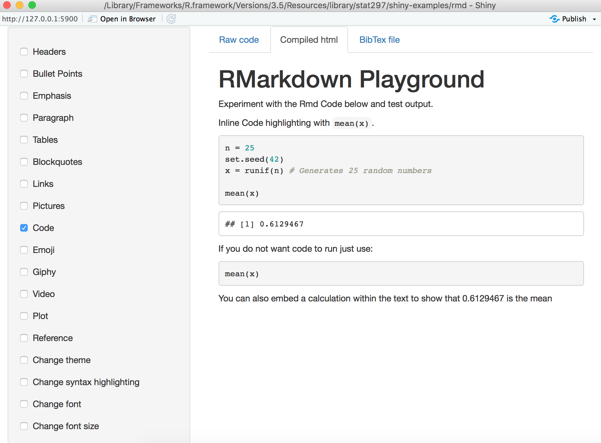</center>

You can also try multiple functions at the same time. For example, let's click both `Code` and `Emoji` in the toolbar, we can see the following R code used:

<center></center>

The above code generates the following output:

<center>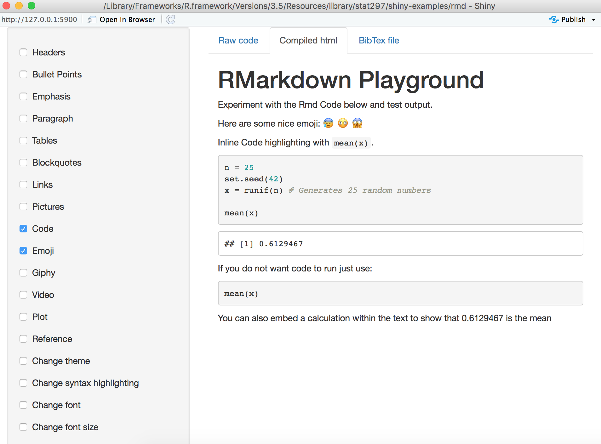</center>

Now you are ready to experiment different RMarkdown functions and test the corresponding outputs! `r emo::ji('wink')`

## Create an R Markdown file in RStudio

Within RStudio, click `File` → `New File` → `R Markdown`. Give the file a title and the author 
(your name) and select the default output, HTML. We can change this later so don't worry about it for the moment. 

<center>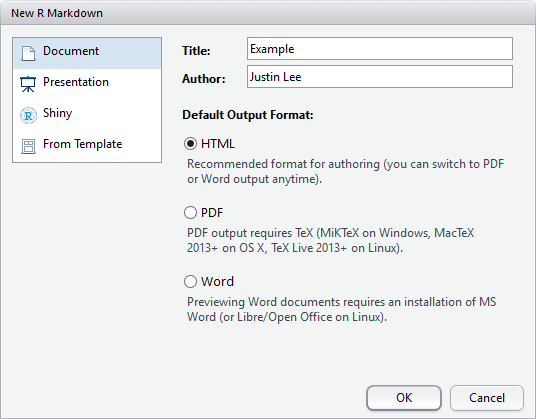</center>

An RMarkdown is a plain text file that contains three different aspects:

- YAML metadata
- Text 
- Code Chunks

## YAML Metadata 

YAML stands for *YAML Ain't Markup Language* and is used to specify document configurations and properties such as name, date, output format, etc. The (optional) YAML header is surrounded before and after by "---" on a dedicated line.

<center></center>

You can also include additional formatting [options](http://RMarkdown.rstudio.com/html_document_format.html) such as a table of contents or even a custom CSS style template which can be used to further enhance the presentation. For the purpose of this book, the default options should be sufficient. Below is an example knit output of the above RMarkdown file. 

<center></center>

The default output above is an html_document format but this format can be modified using, for example, `pdf_document` to output a pdf. However, the pdf format requires additional installation and configuration of a TeX distribution such as [MikTeX](https://miktex.org/2.9/setup). Once available, the user can also include raw LaTeX and even define LaTeX macros in the RMarkdown document if necessary (we'll discuss more about LaTeX further on).


### Subsections 

To make your sections numbered as sections and subsections, make sure you specify `number_sections: yes` as part of the YAML Metadata as shown below. 

<center>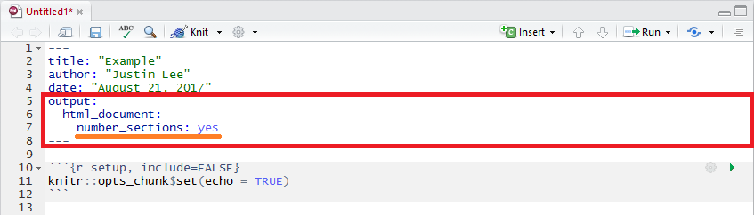</center>


## Text 

Due to its literate nature, text will be an essential part in explaining your analysis. With RMarkdown, we can specify custom text formatting with emphases such as *italics*, **bold**, or `code style`. To understand how to format text, our previous sentence would be typed out as follows in RMarkdown:

```
With RMarkdown, we can specify custom text formatting with emphases such as *italics*, **bold**, or `code style
```

<center></center>


### Headers

As seen above, headers are preceded by a #. A single `#` produces the largest heading text while, to produce smaller headings, you simply need to add more `#`s! Heading level also impacts section and subsection nesting in documents and tables of contents, as well as slide breaks in presentation formats.

### Lists 

Lists can be extremely convenient to make text more readable or to take course notes during class. RMarkdown allows to create different list structures as shown in the code below:  

```{r, eval = FALSE, highlight = FALSE}
* You can create bullet points by using symbols such as *, +, or -. 
+ simply add an indent or four preceding spaces to indent a list. 
    + You can manipulate the number of spaces or indents to your liking. 
        - Like this. 
    * Here we go back to the first indent. 
1. To make the list ordered, use numbers. 
1. We can use one again to continue our ordered list. 
2. Or we can add the next consecutive number. 
```

which delivers the following list structure:

* You can create bullet points by using symbols such as *, +, or -. 
+ simply add an indent or four preceding spaces to indent a list. 
    + You can manipulate the number of spaces or indents to your liking. 
        - Like this. 
    * Here we go back to the first indent. 
1. To make the list ordered, use numbers. 
1. We can use one again to continue our ordered list. 
2. Or we can add the next consecutive number. 

### Hyperlinks 

To add hyperlinks with the full link, (ex: <https://google.com/>) you can follow the syntax below: 

```{r, eval = FALSE, highlight = FALSE}
<https://google.com/>
```

whereas to add hyperlinks with a custom link title, (ex: [Google](https://google.com)) follow the syntax below: 

```{r, eval = FALSE, highlight = FALSE}
[Google](https://google.com)
```

### Blockquotes

Use the > character in front of a line, *just like in email* to produce blockquotes which styles the text in a way to use if we quote a person, a song or another entity. 

> "To grow taller, you should shave your head. Remember to bring the towels!"
>
> Justin Lee 

### Pictures 

To add a picture with captions, follow the syntax below:

```{r, eval = FALSE, highlight = FALSE}

```

which will produce:

<center></center>

Otherwise, to add a picture without any captions, follow the syntax below:

```{r, eval = FALSE, highlight = FALSE}

```

which delivers:

<center>{ width=50%}</center>


### LaTeX 

LaTeX is a document preparation system that uses plain text as opposed to formatted text that is used for applications such as Microsoft Word. It is widely used in academia as a standard for the publication of scientific documents. It has control over large documents containing sectioning, cross-references, tables and figures. 

#### LaTeX in RMarkdown 

Unlike a highly formatted word processor, we cannot produce equations by clicking on symbols. As data scientists there is often the need to explain distributions and equations that are behind the methods we present. Within the text section of an RMarkdown document you can include LaTeX format text to output different forms of text, mainly equations and mathematical expressions. 

Inline mathematical expressions can be added using the syntax: `$math expression$`. For example, if we want to write "where $\alpha$ is in degrees" we would write:

```{r, eval = FALSE, highlight = FALSE}
"where $\alpha$ is in degrees".
```

Using a slightly different syntax (i.e. `$$math expression$$`) we can obtain centered mathematical expressions. For example, the binomial probability distribution in LaTeX is written as

`$$f(y|N,p) = \frac{N!}{y!(N-y)!}\cdot p^y \cdot (1-p)^{N-y} = {{N}\choose{y}} \cdot p^y \cdot (1-p)^{N-y}$$`

which is output as:

$$f(y|N,p) = \frac{N!}{y!(N-y)!}\cdot p^y \cdot (1-p)^{N-y} = {{N}\choose{y}} \cdot p^y \cdot (1-p)^{N-y}$$

An introduction to the LaTeX format can be found [here](http://www.math.harvard.edu/texman/) if you want to learn more about the basics. An alternative can be to insert custom LaTeX formulas using a graphical interface such as [codecogs](https://www.codecogs.com/latex/eqneditor.php). 

### Cross-referencing Sections 

You can also use the same syntax `\@ref(label)` to reference sections, where label is the section identifier (ID). By default, Pandoc will generate IDs for all section headers, e.g., `# Hello World` will have an ID `hello-world`. To call header `hello-world` as a header, we type `\@ref(hello-world)` to cross-reference the section. In order to avoid forgetting to update the reference label after you change the section header, you may also manually assign an ID to a section header by appending {#id} to it.

### Citations and Bibliography 

Citations and bibliographies can automatically be generated with RMarkdown. In order to use this feature we first need to create a "BibTex" database which is a simple plain text file (with the extension ".bib") where each reference you would like to cite is entered in a specific manner. 

To illustrate how this is done, let us take the example of a recent paper where two researchers from Oxford University investigated the connection between the taste of food and various features of cutlery such as weight and color (calling this phenomenon the "taste of cutlery"). The BibTeX "entry" for this paper is given below:

```
@article{harrar2013taste,
  title={The taste of cutlery: how the taste of food is affected by the weight, size,
   shape, and colour of the cutlery used to eat it},
  author={Harrar, Vanessa and Spence, Charles},
  journal={Flavour},
  volume={2},
  number={1},
  pages={21},
  year={2013},
  publisher={BioMed Central}
}
```

This may look like a complicated format to save a reference but there is an easy way to obtain this format without having to manually fill in the different slots. To do so, go online and search for "Google Scholar" which is a search engine specifically dedicated to academic or other types of publications. In the latter search engine you can insert keywords or the title and/or authors of the publication you are interested in and find it in the list of results. In our example we search for "The taste of cutlery" and the publication we are interested in is the first in the results list.

<center></center>

Below every publication in the list there is a set of options among which the one we are interested in is the "Cite" option that should open a window in which a series of reference options are available. Aside from different reference formats that can be copied and pasted into your document, at the bottom of the window you can find another set of options (with related links) that refer to different bibliography managers.

<center></center>

For ".bib" files we are interested in the "BibTeX" option and by clicking on it we will be taken to another tab in which the format of the reference we want is provided. All that needs to be done at this point is to copy this format (that we saw earlier in this section) and paste in the ".bib" file you created and save the changes.

<center></center>

However, your RMarkdown document does not know about the existence of this bibliography file and therefore we need to insert this information in the YAML metadata at the start of our document. To do so, let us suppose that you named this file "biblio.bib" (saved in the same location as your RMarkdown document). All that needs to be done is to add another line in the YAML metadata with `bibliography: biblio.bib` and your RMarkdown will now be able to recognize the references within your ".bib" file. 

<center></center>

There are also a series of other options that can be specified for the bibliography such as its format or the way references can be used within the text (see links at the end of this section).

Once the ".bib" file has been created and has been linked to your RMarkdown document through the details in the YAML metadata, you can now start using the references you have collected in the ".bib" file. To insert these references within your document at any point of your text you need to use the name that starts the reference field in your ".bib" file and place it immediately after the `@` symbol (without spaces). So, for example, say that we wanted to cite the publication on the "taste of cutlery": in your RMarkdown all you have to do is to type `@harrar2013taste` at the point where you want this citation in the text and you will obtain: @harrar2013taste. Moreover, it is often useful to put a citation in braces and for example if you want to obtain [see e.g. @harrar2013taste] you can simply write `[see e.g. @harrar2013taste]`.

```{block2, type='rmdnote'}
The user can also change the name that is used to call the desired reference as long as the same name is used to cite it in the RMarkdown document and that this name is not the same as another reference. 
```

```{block2, type='rmdcaution'}
The references in the ".bib" file will not appear in the references that are output from the RMarkdown compiling procedure unless they are specifically used within the RMarkdown document.
```

Additional information on BibTeX and reference in RMarkdown can be found in the links below:

- [Introduction to bibtex](https://www.economics.utoronto.ca/osborne/latex/BIBTEX.HTM)
- [Reference in RMarkdown](http://RMarkdown.rstudio.com/authoring_bibliographies_and_citations.html)


### Tables 

For simple tables, we can be manually insert values as such follows: 

```
+---------------+---------------+--------------------+
| Fruit         | Price         | Advantages         |
+===============+===============+====================+
| *Bananas*     | $1.34         | - built-in wrapper |
|               |               | - bright color     |
+---------------+---------------+--------------------+
| Oranges       | $2.10         | - cures scurvy     |
|               |               | - **tasty**        |
+---------------+---------------+--------------------+
```

to produce:

+---------------+---------------+--------------------+
| Fruit         | Price         | Advantages         |
+===============+===============+====================+
| *Bananas*     | $1.34         | - built-in wrapper |
|               |               | - bright color     |
+---------------+---------------+--------------------+
| Oranges       | $2.10         | - cures scurvy     |
|               |               | - **tasty**        |
+---------------+---------------+--------------------+

As an alternative we can use the simple graphical user interface [online](http://www.tablesgenerator.com/markdown_tables). For more extensive tables, we create dataframe objects and project them using `knitr::kable()` which we will explain later on this book. 

### Additional References 

There are many more elements to creating a useful report using RMarkdown, and we encourage you to use the [RMarkdown Cheatsheet](https://www.rstudio.com/wp-content/uploads/2015/02/rmarkdown-cheatsheet.pdf) as a reference. 


## Code Chunks 

Code chunks are those parts of the RMarkdown document where it is possible to embed R code within your output. To insert these chunks within your RMarkdown file you can use the following shortcuts:

- the keyboard shortcut Ctrl + Alt + I (OS X: Cmd + Option + I)
- the Add Chunk command in the editor toolbar
- by typing the chunk delimiters **\`\`\`\{\r\}** and **\`\`\`**.

The following example highlights the code chunks in the example RMarkdown document we saw at the start of this chapter:

<center></center>

### Code Chunk Options

A variety of options can be specified to manage the code chunks contained in the document. For example, as can be seen in the third code chunk in the example above, we specify an argument that reads `echo = FALSE` which is a parameter that was added to the code chunk to prevent printing the R code that generated the plot. This is a useful way to embed figures. More options can be found from the [RMarkdown Cheatsheet](https://www.rstudio.com/wp-content/uploads/2015/02/rmarkdown-cheatsheet.pdf) and Yihui's notes on knitr [options](https://yihui.name/knitr/options/). Here are some explanations of the most commonly used chunk options taken from these references: 

- `eval`: (TRUE; logical) whether to evaluate the code chunk;
- `echo`: (TRUE; logical or numeric) whether to include R source code in the output file;
- `warning`: (TRUE; logical) whether to preserve warnings (produced by warning()) in the output like we run R code in a terminal (if FALSE, all warnings will be printed in the console instead of the output document);
- `cache`: (FALSE; logical) whether to "*cache*" a code chunk. This option is particularly important in practice and is discussed in more details in Section \@ref(cache).

Plot figure options: 

- `fig.path`: ('figure/'; character) prefix to be used for figure filenames (fig.path and chunk labels are concatenated to make filenames);
- `fig.show`: ('asis'; character) how to show/arrange the plots;
- `fig.width`, `fig.height`: (both are 7; numeric) width and height of the plot, to be used in the graphics device (in inches) and have to be numeric;
- `fig.align`: ('default'; character) alignment of figures in the output document (possible values are left, right and center;
- `fig.cap`: (NULL; character) figure caption to be used in a figure environment.

### Comments

Adding comments to describe the code is extremely useful (if not essential) during every coding and programming process. It helps **you** take notes and remember what is going on and why you made use of these functions, as well as helping others understand your code. Forgetting to comment or document your code often becomes a larger problem in the future when, among numerous lines of code, you have forgotten the reason for using certain functions or algorithms. 

> "Don't document bad code – rewrite it."
> The Elements of Programming Style, Kernighan & Plauger

```{r}
# Comment your code by preceding text with a # 
# Keep it brief but comprehensible, so you can return to it 
```

### In-line R

The variables we store in an RMarkdown document will stay within the environment they were created in. This means that we can call and manipulate them anywhere within the document. For example, supposing we have a variable called `x` to which we assign a specific value, then in RMarkdown we can reference this variable by using ` r x`: this will affix the value of the variable directly in a sentence. Here is a practical example: 

```{r}
a <- 2
```

where we have stored the value 2 in a variable called `a`. We can use the value of `a` as follows:

```{r, eval = FALSE, highlight = FALSE}
The value of $a$ is `r a`. 
```

This translates in R Markdown to "The value of $a$ is `r a`."

### Cache {#cache}

Depending on the complexity of calculations in your embedded R code, it may be convenient to avoid re-running the computations (which could be lengthy) each time you knit the document together. For this purpose, it possible to specify an additional argument for your embedded R code which is the `cache` argument. By default this argument is assigned the value `FALSE` and therefore the R code is run every time your document is compiled. However, if you specify this argument as `cache = TRUE`, then the code is only run the first time the document is compiled while the following times it simply stores and presents the results of the computations when the document was first compiled.

Below is a short video introducing caching in R Markdown. 

```{r, echo = FALSE}
knitr::include_url("https://www.youtube.com/embed/9q1eJyOQQsE")
```

The RMarkdown file used for this particular example can be found here: [caching.Rmd](code_examples/caching.Rmd). 

Let us consider an example where we want to embed an R code with a very simple operation such as assigning the value of 2 to an object that we call `a` (that we saw earlier). This is clearly not the best example since this operation runs extremely quickly and there is no visible loss in document compilation time. However, we will use it just to highlight how the `cache` argument works. Therefore, if we want to avoid running this operation each time the document is compiled, then we just embed our R code as follows:

```{r computeA, cache = TRUE}
a <- 2
```

which would be written in RMarkdown as:

````r
`r ''````{r computeA, cache = TRUE}
a <- 2
```
````

You will notice that we called this chunk of embedded R code `computeA` and the reason for this will become apparent further on. Once we have done this we can compile the document that will run this operation and store its result. Now, if we compile the document again (independently from whether we made changes to the rest of the document or not) this operation will not be run and the result of the previous (first) compiling will be presented. However, if changes are made to the R code which has been "cached", then the code will be run again and this time its new result will be stored for all the following compilings until it is changed again.

This argument can therefore be very useful when computationally intensive R code is embedded within your document. Nevertheless it can suffer from a drawback which consists in dependencies of your "cached" R code with other chunks within the document. In this case, the other chunks of R code can be modified thereby outputting different results but these will not be considered by your "cached" R code. As an example, suppose we have another chunk of R code that we can "cache" and that takes the value of `a` from the previous chunk:

```{r, cache = TRUE}
(d <- 2*a)
```

which would be written in RMarkdown as:

````r
`r ''````{r, cache = TRUE}
(d <- 2*a)
```
````

In this case, the output of this chunk will be `## 4` since `a <- 2` (from the previous chunk). What happens however if we modify the value of `a` in the previous chunk? In this case, the previous chunk will be recomputed but the value of `d` (in the following chunk) will not be updated since it has stored the value of 4 and it is not recomputed since this chunk has not been modified. To avoid this, a solution is to specify the chunks of code that the "cached" code depends on. This is why we initially gave a name to the first chunk of code ("computeA") so as to refer to it in following chunks of "cached" code that depend on it. To refer to this code you need to use the option `dependson` as follows:

```{r, cache = TRUE, dependson = "computeA"}
(d <- 2*a)
```

which we would write as:

````r
`r ''````{r, cache = TRUE, dependson = "computeA"}
(d <- 2*a)
```
````

In this manner, if the value of `a` changes in the first chunk, the value of `d` will also change but will be stored until either the `computeA` chunk or the latter chunk is modified. 


## Render Output 

After you are done, run `RMarkdown::render()` or click the `Knit` button at the top of the RStudio scripts pane to save the output in your working directory. 


The use of RMarkdown makes it possible to generate any file format such as HTML, pdf and Word processor formats using `pandoc`. Pandoc is a free software that understands and converts useful markdown syntax, such as the code mentioned above, into a readable and clean format. 

## Addition Information

Click on the links below for more information on RMarkdown:

- [RStudio RMarkdown tutorial](http://RMarkdown.rstudio.com/authoring_quick_tour.html)
- [R-blogger's RMarkdown tutorial](https://www.r-bloggers.com/r-markdown-and-knitr-tutorial-part-1/)
- [RMarkdown Cheatsheet](https://www.rstudio.com/wp-content/uploads/2015/02/rmarkdown-cheatsheet.pdf)

<!--chapter:end:01-rmd.Rmd-->

# GitHub 

> git gets easier once you get the basic idea that branches are homeomorphic endofunctors mapping submanifolds of a Hilbert space.
> <cite> Isaac Wolkerstorfer </cite>

When working on a report or a project, it is often the case that you keep separate versions either to keep track of the changes (in case you want to go back to a previous version) or to have a version for each person working on different parts of the project. As a result of this approach, you may have created or encountered a file directory attempting to preserve multiple copies or iterations of the same files:

<center>

</center>

This behavior is basically a defensive strategy attempting to remedy one or more a real or percieved threats to progress.  For example,

- you or a collaborator may have made progress on different parts of the project in separate versions of the document
- you may want to preserve an earlier state of the document (e.g. a "clean" copy before proposing edits)

Unforutunately, this type of strategy can easily lead to frustration as users lose track of which documents have the most up-to-date content for different portions of the document.  This is effectively a problem of "version control" (sometimes called "source control"). 


To respond to this problem, software has been developed to keep track of your changes by informing you on the saves you made and allowing you to go back to previous versions in order to revert those changes. This chapter discusses the features of this software as well as introducing a specific version control tools: *Git* and *GitHub*. People often use the two somewhat interchangeably in casual discussion--or use GitHub as a surrogate for the combination.  In fact, Git is the name of the version control software, and everything that Git can accomplish is possible to do without using Git**Hub** at all. GitHub is a commercial web-based version control repository hosting service which includes some additional features to make Git more user-friendly.   


## Version Control 

As mentioned above, *version control* is a system that records changes to a file or a set of files in order to keep track and possibly revert to or modify those changes over time. More specifically, it allows you to: 

- record the entire history of a file;
- revert to a specific version of the file;
- collaborate on the same platform with other people;
- make changes without modifying the main file and add them once you feel comfortable with them. 

All these features are highly important when projects start becoming more complex and/or include multiple contributors. There are several mature software tools designed for version control including, but not limited to, Git, Subversion, Mercurial, and more. Furthermore, there are several web-based version control repository hosting services such as GitLab, GitHub, Bitbucket, and more that accomplish the same goals. In the next section, we introduce use of Git and GitHub as tools for version control and collaboration.  

Rather than save many independent copies of each file--as shown earlier when the user saved many versions of a "final" document--most version control software tools simply track incremental changes to the files under version control. Storing a complete record of just the bits that *change* from one version to the next is far more efficient than saving many copies of whole documents for which a majority of the content may be unchanged from one iteration to the next.  Moreover, with a complete record of every incremental change, it's just as easy to piece together the current state of a document or to rebuild a previous the state of a document at an earlier point recorded in it's development lifecycle.  In other words, it's like version control software effectively offers access to free a document editing *time machine*!


## Git and GitHub

Importantly, adding Git(Hub) to your workflow doesn't *necessarily* change that much of your workflow.  In fact, for many RStudio users who have properly configured RStudio and Git, the vast majority of your version control workflow can happen entirely within a convenient the RStudio interface.  We'll discuss specific details, but it's sufficient to note the "Git" tab shown in the upper right pane of the RStudio window shown.

<center>

</center>


The latter uses the Git platform and stores local files into a flexible folder called a "repository".

Git(Hub) uses *repositories* to organize your work.  If you like, you can store a bunch of files in a repository (or Repo) on the GitHub remote servers and delete them from your computer entirely.  You can replace the files with new versions or even edit some specific types of files right from the GitHub webpage.  When you are ready to get them back, you could simply locate the files through your GitHub account and retrieve them.  

More commonly, users establish a link between a file directory on their (local) computer and a Repo stored on the GitHub remote.  You edit files on your computer and save your progress as you normally would, except now that you have established a link with Git(Hub) you can periodically update the Repo on the GitHub remote with the latest progress. 

Below is a video introducing the basic look and feel of GitHub. 

<center>
```{r, echo=FALSE}
knitr::include_url("https://www.youtube.com/embed/SB5YkjB9FWc")
```
</center>

### Git & RStudio Configuration


As mentioned previously, with proper configuration a large majority of your use of Git can happen entirely within the RStudio environment.  In this section, we step through a basic configuration.  If necessary, a more comprehensive guide to configuring Git(Hub) and R/RStudio is available at <https://happygitwithr.com/> from which a substantial portion of this congifiguration guidance was originally adapted.


#### Install Git

Before begining, make sure you have installed both R and RStudio.  Some systems will already have Git installed, or will install Git automatically when prompted.  In either case, open a terminal in RStudio (RStudio >> Tools >> Terminal >> New Terminal) and then enter the following commands--one at a time--after the dollar sign prompt ($) as shown below.

```
which git
git --version
```

<center>

</center>


If git is installed, the result will indicate a where the software is located and the version you have available.  If Git has not yet been installed, go to the [website](https://git-scm.com/downloads) and select the version which is compatible with the OS of your computer (e.g. Windows/Mac/Linux/Solaris). Again, for additional support corresponding to various operating systems see <https://happygitwithr.com/install-git.html>. 


#### Tell Git Who You Are

Once Git is installed, the first thing you should do is set your name and the email address associated with your GitHub profile. This is information is used to synchronize the work on your computer with your Repo on the GitHub remote server.

Again, you will need a Terminal window in RStudio (RStudio >> Tools >> Terminal >> New Terminal) and then enter the following commands--one at a time--after the dollar sign prompt ($) as shown below.

```
git config --global user.name 'Aaron Carlson'
git config --global user.email 'abc1234@psu.edu'
git config --global --list
```

Note: the last command `git config --global --list` should verify that Git now knows you! ...or at least acknowledges your name and email address.  This operation only needs to be done once when using the "--global" option because, in this case, Git will always use that information for anything you do on that system. If you want to override this with a different name or email address for specific projects, you can run the command without the "--global" option while working on those projects.


### GitHub Setup 

In order to set up GitHub, go to the [GitHub website](https://github.com/) and, for the purposes of the course, the first step is to sign up with your University email address.


```{block2, type='rmdnote'}
Your username and email can be changed at any time so, if you want to change it, you can easily do so after the course.  

Your GitHub profile can also serve as a *resume* of your data science skills that will be highlighted by possible future projects that you save and commit.

Since your profile will be public, it's a good idea to choose a username that you would be comfortable sharing with an employer in a job interview.  Better still is a name that is *recognizable* as you as a derivative of your actual name.  For example, our sample name in the last section, Aaron Carlson, might choose "acarlson" as a username rather than "abc1234" which would not be recognizable to those outside the university.
```


Once you have a GitHub profile, log in and create a Repo for your project (or navigate to an existing Repo).  Make sure you check the box to "initialize this repository with a README." *It's generally a good idea to always initialize new Repos with a README unless you have a specific reason not to do so.*  Then, click the green button "Clone or Download" and copy the URL as shown here.

<center>

</center>


### Connecting to RStudio 

With the URL of your GitHub Repo still copied to your clipboard, go to RStudio and initate a new "Project."  You can either navigate the menus in RStudio (RStudio >> File >> New Project) or use the "Project" navigation feature in the upper right of the RStudio window a shown.


<center>

</center>

Next, RStudio will prompt you with a dialogue box to configure the new project. Select "Version Control" and then "Git" on the following screen as shown.

<center>

</center>

<center>
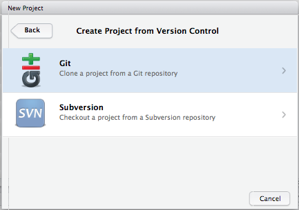
</center>


Remember when you copied the URL for your Repo from GitHub?  If not, go copy it again and we'll paste it into the line "Repository URL" in order to "Clone" the Git Repository to a file directory (i.e. folder) on your computer as shown.

- "Repository URL": Paste the URL that you previously copied from GitHub
- "Project Directory Name": This will be the name of a new folder (i.e. directory) on **your computer**. Use the same name as your GitHub Repo (e.g. mine was "Informative-Repo-Name" here). 
- "Create Project as a Subdirectory Of": This is the location on **your computer** for the new folder. For example, you may want to make a folder on your computer for each class and then put this Repo (and others for the class) together in that directory location.

<center>
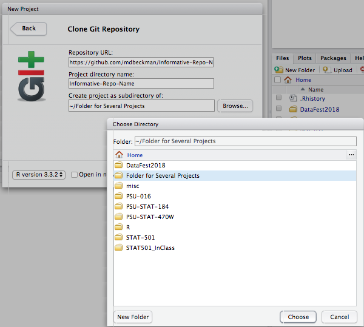
</center>


</br>

You're *in*! (hopefully)... 

The "Project" menu shown in the upper right corner of the RStudio Server Window now shows the name of your Repo/Project (e.g. mine was "Informative-Repo-Name" in this demonstration).  Also, a new "Git" tab appears and has started tracking file changes in my Repo. A few initial files will appear (e.g., ".gitignore" and something ending in ".RProj").  These basically help Git & RStudio handle logistics, just "commit" and "push" them.  


### The basic workflow

Git Basics: <https://git-scm.com/book/en/v2/Getting-Started-Git-Basics>

<center>
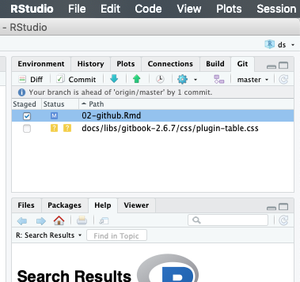
</center>

From now on, nearly everything (~90-95%) of your interactions with Git can happen in RStudio... at least in this class.  The remaining bits consist of things like initializing or cloning Repos from the GitHub website.  If you do internet searches for Git help, you'll see lots of command line terminal stuff, but you won't likely need to execute commands in the terminal for our purposes.

The basic workflow is as follows...

1. Open the RStudio Project connected to your Git(Hub) Repo
2. Work on your computer just like always
3. **Save** your work often just like always
4. When you want to preserve a **snapshot** of your project, you make a "commit"
5. When you have a few commits and want to archive them, you "push" them to the GitHub remote server
6. If you decide to work from a different computer, or want to pick up where a collaborator left off, you can "pull" the most up-to-date version of the files from the GitHub remote to your local computer and go back to step 2.

Let's unpack the workflow slightly...

1. *Open the RStudio Project connected to your Git(Hub) Repo.*  We'll come back to this when we discuss common mistakes.

2. *Work on the files just like you always do.*  Seriously.  

This certainly includes technical tasks like writing code in R, but it also includes standard operations like dragging and dropping things into the directory folder linked to your Repo.  For example, if you want to have access to a picture or a file with a data set in it, you could copy it to the directory folder for your project just like you normally would.  

When you add a new file, you may simply notice the name of that file will appear on a list in the "Git" tab in your RStudio window.  Git is basically just alerting you that it has noticed something changed in the repo, that's all.

3. * **Save** your work often just like always.*  You should save your work as you make progress just like you always would, even if Git weren't involved.  

When you save changes to an existing file, the name of that file will appear on a list in the "Git" tab in your RStudio window again.  Once again, Git is just alerting you that it has noticed something changed.  Git is *very* observant that way.

4. *When you want to preserve a **snapshot** of your project, you make a "commit."*  This is the first new bit.

A commit is quite literally a snapshot of the state of your whole project (e.g., file directory), like a photograph.  One you take a photograph, you have an exact picture of precisely how things looked at that moment in time.  You should make commits frequently as you make progress with your work.  
When you want to make a commit using the RStudio interface, you simply select a small checkbox next to the files that you want to include in the snapshot.  This is called "staging" files for the commit.  Then, when you click the "commit button, a new window will open that will attempt to summarize all the differences between the new file and the previous version.  This is called the "diff."

In order to complete each commit, you must include a commit message. It's a good idea to write informative commit messages, and Git will even force you to write *something* before executing the commit.  Remember when we described version control as a sort of time machine?  You will probably be the one reading through many dozens of commit messages to figure out where to send the time machine... They are also tremendously helpful if you have collaborators on a Repo so you can all keep up with what is changing throughout the project.[^1]  


<center>

</center>


5. *When you have a few commits and want to archive them, you "push" them to the GitHub remote server.*

This is the first step in the workflow that is **not** simply happening on your local computer.  When you "push" one or more commits to the GitHub remote server it is like archiving all of those snapshots/photographs in a permanent file cabinet.


6. *If you decide to work from a different computer, or want to pick up where a collaborator left off, you can "pull" the most up-to-date version of the files from the GitHub remote to your local computer and go back to step 2.*

Again, nearly everything you are doing with Git is happening locally *on your computer*.  If a collaborator made changes on a different computer, or if **you** made changes from a different computer somewhere, you will need to "pull" them from the GitHub remote into your local working directory. 

Actually, if you are working from several computers or with other collaborators, it's a good habit to **"pull" before you "push"** in order to make sure that you don't end up with two different versions of the same thing that are in direct conflict with one another.  This results in a "merge conflict" and can become a bit of a headache to untangle.


#### Common mistakes in the Git/RStudio Workflow

**Commits in the wrong Repo**.  It's a common mistake to forget to change from one RStudio Project to the next.  If you forget, it may look like your changes aren't tracked by Git.  In reality, Git will still monitor changes... but it is monitoring them in the correct Repo linked to the file, so you won't be able to make commits on those files until you change to the correct RStudio Project.

**Large files**.  GitHub is generously storing all sorts of things for us and (as academic users) doing so free of charge.  Having said that, storage presumably costs *them* money, so they don't like to store large files.  You'll be warned if you try and commit any single file that is more than 10 MB.  There are sensible ways to work around this, but a common strategy is to tell Git to simply "ignore" the large file... that is, don't include it in my snapshots and don't archive it on the GitHub remote.  


### Note about GitHub Student Developer Pack

As a student, it is possible to benefit from specific advantages when using GitHub. Indeed, once you have set up your profile you can go to this [link](https://education.github.com/discount_requests/new) and follow the steps below to set up a "student developer pack" discount request to GitHub. Through this setup it will be possible for you not only to have unlimited free *public* repositories.  In the past, students could access free unlimited *private* repositories only after some vetting by GitHub. This changed in 2019 shortly after GitHub was acquired by Microsoft.  At the time of this writing, free unlimited private repositories were made available to all users, and restrictions were instead based on limiting the number of **collaborators** for private Repos.  Students should still get the student developer pack, but it may not be as critical as it once was for most student users.


<center>

</center>


<!-- ## GitHub Workflow  -->

<!-- Here is a video demonstrating the basic GitHub workflow in GitHub Desktop (initializing, committing, pushing and pulling) that we will follow for our assignments and projects.  -->

<!-- <center> -->
<!-- ```{r, echo = FALSE} -->
<!-- knitr::include_url("https://www.youtube.com/embed/-cLn7Uk-Zo0") -->
<!-- ``` -->
<!-- </center> -->

<!-- In addition, here is a video demonstrating the basic GitHub workflow within RStudio.  -->
<!-- <center> -->
<!-- ```{r, echo = FALSE} -->
<!-- knitr::include_url("https://www.youtube.com/embed/VOIQgViCyTo") -->
<!-- ``` -->
<!-- </center> -->

<!-- While the main features and actions to manage the workflow in GitHub are desribed in the above videos, the following paragraphs give some extra details that can be helpful to consider when working with this version-control platform. -->

<!-- ### Branching  -->

<!-- In the previous section we discussed the workflow as a means of directly making changes in the so-called *master* branch which is where our original and up-to-date work is stored. However, when working with different collaborators for example, it may be appropriate to create separate branches that will avoid modifying the original one until you're sure of the changes. In this perspective, *branching* is essentially creating an environment in which we can change anything without obstructing our original document. As mentioned, this idea is very useful for group-based activities where different people are working on the same files. Once we have made all our changes and are sure of the changes, we can merge the changes to the main `master` branch. You can learn more about branching [here](https://git-scm.com/book/en/v1/Git-Branching-Basic-Branching-and-Merging) and [here](https://gist.github.com/vlandham/3b2b79c40bc7353ae95a).  -->


<!-- ### Pull  -->

<!-- Before starting (or continuing) to work on your project, make sure to always review changes that another collaborator has made. Once this is done you can make sure there are no merge conflicts and you can pull (or synchronize) your local branch with the most recent version of the repository. If merge conflicts were to happen, these can still be solved but it would be preferable to avoid them generating confusion.  -->


<!-- ### Commits  -->

<!-- After we have created the branch, we can start modifying the documents (add, edit, or delete) within the repository. Once these changes are made, you need to `commit` them with an informative message, explaining why a particular change is being made. These specific messages allow you to backtrack on these changes later if you decide to look at the history of any of these files and find a bug. This information is extremely important since otherwise there's little point in using version control like GitHub. [^1] -->

<!-- <center></center> -->


<!-- #### Pull Request  -->

<!-- If you are directly working on the master branch, please disregard this section. Else, a `pull request` may be made by the person working on the branch, so that other collaborators can discuss about the commits made in the branch. Also, there are options for conversation in which they can review and comment directly onto the code as well.  -->


<!-- ### Push or Merge  -->

<!-- Once you have either made the commits on your master branch or have the pull request confirmed by other collaborators, you can merge or push the changes into the remote master branch. This means that the version of the repository online will have your updated code and documents. This will be the final step to the cycle of the workflow after which we can clear and repeat the above procedure.   -->

<!-- ### Merge Conflicts  -->

<!-- Merge conflicts often occur when two different collaborators make different changes to the same line of a file, and also can happen when a file that is meant to be modified is deleted (although these may not be the only situations). To resolve these conflicts, we must directly edit the documents making sure potential conflicts are discussed before merging or pushing to the master branch, since merge conflicts often occur from miscommunication within groups.  -->


<!-- ## GitHub Workflow on Command Line / Git Bash  -->

<!-- Here are commands that we can use within `Git Bash` if we are more comfortable working on the command line.  -->

<!-- | Command                        | Function                                      | -->
<!-- |--------------------------------|-----------------------------------------------| -->
<!-- | git init                       | Create a **local** repository                 | -->
<!-- | git branch "newbranch"         | Create a new branch with given name           | -->
<!-- | git checkout "newbranch"       | Switch to specified branch                    | -->
<!-- | git status                     | List all the files that you have modified     | -->
<!-- | git add -A                     | Add **all** files to staging                  | -->
<!-- | git commit -m "commit message" | Commit staged changes to **local** repository | -->
<!-- | git push                       | Commit saved changes to **remote** repository | -->
<!-- | git pull                       | Update changes from the **remote** repository | -->

<!-- However, it is better for us to startby using more graphical user-interface options since they allow us to better understand what is going on. You **do not** want to follow this example[^2]... -->

<!-- <center></center> -->

<!-- It is always important to know what is happening when we create, change, push, branch and pull from a repository. -->


## Issues 

*Issues* are a very good way to keep track of group tasks, bugs and announcements for your projects within GitHub. Below is a basic video introducing `issues` in GitHub. 

<center>
```{r, echo = FALSE}
knitr::include_url("https://www.youtube.com/embed/HRikDvXEpVM")
```
</center>


## Slack Integration 

Slack is a platform created to communicate between group members, allowing for both direct individual messages as well as group messages. More information on how to use Slack can be found in this [Slack Tutorial](https://get.slack.help/hc/en-us/articles/218080037-Getting-started-for-new-members).

An added benefit of using Slack is that it can be integrated with GitHub in such a way that notifications will be posted to the group whenever someone pushes or makes a pull request. More information on GitHub integration with Slack can be found [here](https://get.slack.help/hc/en-us/articles/232289568-Use-GitHub-with-Slack). 

A more detailed video providing a demonstration on the use of Slack in a real-life setting can be found below.

<center>
```{r, echo = FALSE}
knitr::include_url("https://www.youtube.com/embed/PpnFCp4Wr_g")
```
</center>


## Additional References 

Below are some supplemental references that can support you in a better use of GitHub.

- <http://happygitwithr.com/>

<!-- - [GitHub Introduction with RStudio](https://www.r-bloggers.com/rstudio-and-github/) -->
<!-- - [GitHub Workflow](https://guides.github.com/introduction/flow/) -->
<!-- - [GitHub on Command Line (video)](https://www.youtube.com/watch?v=oFYyTZwMyAg) -->

[^1]: https://xkcd.com/1296/
[^2]: https://xkcd.com/1597/

<!--chapter:end:02-github.Rmd-->

# (PART) Introduction to R {-}

# Data Structures {#data}

There are different data types that are commonly used in R among which the most important ones are the following:

- **Numeric** (or double): these are used to store real numbers. Examples: -4, 12.4532, 6.

- **Integer**: examples: 2L, 12L.

- **Logical** (or boolean): examples: `TRUE`, `FALSE`.

- **Character**: examples: `"a"`, `"Bonjour"`. 

In R there are five types of data structures in which elements can be stored. A data structure is said to *homogeneous* if it only contains elements of the same type (for example it only contains character or only numeric values) and *heterogenous* if it contains elements of more than one type. The five types of data structures are commonly summarized in a table similar to the one below [see e.g. @wickham2014advanced]:

Table: (\#tab:ds) Five most common types of data structures used in R [@wickham2014advanced].

Dimension      Homogenous    Heterogeneous
------------- ------------- ----------------
1               Vector        List
2               Matrix        Data Frame
n               Array

Consider a simple data set of the top five male single tennis players presented below:


Table: (\#tab:tennis) Five best male single tennis players as ranked by ATP  (09-30-2019).

| Name | Date of Birth | Place of Birth | Place of Residence | ATP Ranking | Prize Money | Win Percentage | Grand Slam Wins | Pro Since |   
| --- | --- | --- | --- | --- | --- | --- | --- | --- |   
| Novak Djokovic | 22 May 1987 | Belgrade, Serbia | Monte Carlo, Monaco | 1 | 135,259,120 | 82.7 | 16 | 2003 |   
| Rafael Nadal | 3 June 1986 | Manacor, Spain | Manacor, Spain | 2 | 115,178,858 | 83.1 | 19 | 2001 |   
| Roger Federer | 8 August 1981 | Basel, Switzerland | Wollerau, Switzerland | 3 | 126,840,700 | 82.2 | 20 | 1998 |   
| Daniil Medvedev | 11 February 1996 | Moscow, Russia | Monte Carlo, Monaco | 4 | 8,171,483 | 63.6 | 0 | 2014 |   
| Dominic Thiem | 3 September 1993 | Wiener Neustadt, Austria | Lichtenwörth, Austria | 5 | 18,588,662 | 64.3 | 0 | 2011 |   

Notice that this data set contains a variety of data types; in the next sections we will use this data to illustrate how to work with five common data structures.


## Vectors 

A vector has three important properties:

```{block2, note-text, type='rmdimportant'}
- The **Type** of objects contained in the vector. The function `typeof()` returns a description of the type of objects in a vector.
- The **Length** of a vector indicates the number of elements in the vector. This information can be obtained using the function `length()`.
- **Attributes** are metadata attached to a vector. The functions `attr()` and `attributes()` can be used to store and retrieve attributes (more details can be found in Section \@ref(vectattr)).   

```

`c()` is a generic function that combines arguments to form a vector. All arguments are coerced to a common type (which is the type of the returned value) and all attributes except names are removed. For example, consider the number of grand slams won by the five players considered in the eighth column of Table \@ref(tab:tennis): 

```{r}
grand_slam_win <- c(16, 19, 20, 0, 0)
```

To display the values stored in `grand_slam_win` we could simply enter the following in the R console:

```{r}
grand_slam_win
```

Alternatively, we could have created and displayed the value by using `()` around the definition of the object itself as follows:

```{r}
(grand_slam_win <- c(16, 19, 20, 0, 0))
```

Various forms of "nested concatenation" can be used to define vectors. For example, we could also define `grand_slam_win` as

```{r}
(grand_slam_win <- c(16, c(19, 20, c(0, c(0)))))
```

This approach is often used to assemble vectors in various ways.

It is also possible to define vectors with characters, for example we could define a vector with the player names as follows:

```{r}
(players <- c("Novak Djokovic", "Rafael Nadal", "Roger Federer",
              "Daniil Medvedev", "Dominic Thiem"))
```

### Type 

We can evaluate the kind or type of elements that are stored in a vector using the function `typeof()`. For example, for the vectors we just created we obtain:

```{r}
typeof(grand_slam_win)
typeof(players)
```

This is a little surprising since all the elements in `grand_slam_win` are integers and it would seem natural to expect this as an output of the function `typeof()`. This is because R considers any number as a "double" by default, except when adding the suffix `L` after an integer. For example:

```{r}
typeof(1)
typeof(1L)
```

Therefore, we could express `grand_slam_win` as follows:

```{r}
(grand_slam_win_int <- c(16L, 19L, 20L, 0L, 0L))
typeof(grand_slam_win_int)
```

In general, the difference between the two is relatively unimportant.

### Coercion

As indicated earlier, a vector has a homogeneous data structure meaning that it can only contain a single type among all the data types. Therefore, when more than one data type is provided, R will *coerce* the data into a "shared" type. To identify this "shared" type we can use this simple rule:

\begin{equation*}
 \text{logical} < \text{integer} < \text{numeric} < \text{character},
\end{equation*}

which simply means that if a vector has more than one data type, the "shared" type will be that of the "largest" type according to the progression shown above. For example:

```{r}
# Logical + numeric
(mix_logic_int <- c(TRUE, 12, 0.5))
typeof(mix_logic_int)

# Numeric + character
(mix_int_char <- c(14.3, "Hi"))
typeof(mix_int_char)
```


### Subsetting

Naturally, it is possible to "subset" the values of in our vector in many ways. Essentially, there are four main ways to subset a vector. Here we'll only discuss the first three:

- **Positive Index**: We can *access* or *subset* the $i$-th element of a vector by simply using `grand_slam_win[i]` where $i$ is a positive number between 1 and the length of the vector.

```{r}
# Accessing the first element
grand_slam_win[1]

# Accessing the third and first value
grand_slam_win[c(3, 1)]

# Duplicated indices yield duplicated values
grand_slam_win[c(1, 1, 2, 2, 3, 4)]
```

- **Negative Index**: We *remove* elements in a vector using negative indices:

```{r}
# Removing the second observation
grand_slam_win[-2]

# Removing the first and fourth observations
grand_slam_win[c(-1, -4)]
```

- **Logical Indices**: Another useful approach is based on *logical* operators:

```{r}
# Access the first and fourth observations
grand_slam_win[c(TRUE, FALSE, FALSE, TRUE, FALSE)]
```

```{block2, type='rmdcaution'}
Note that it is not permitted to "mix" positive and negative indices. For example, `grand_slam_win[c(-1, 2)]` would produce an error message.
```

### Attributes {#vectattr}

Let's suppose that we conduct an experiment under specific conditions, say a date and place that are stored as attributes of the object containing the results of this experiment. Indeed, objects can have arbitrary additional attributes that are used to store metadata on the object of interest. For example:

```{r}
attr(grand_slam_win, "date") <- "09-30-2019"
attr(grand_slam_win, "type") <- "Men, Singles"
```

To display the vector with its attributes

```{r}
grand_slam_win
```

To only display the attributes we can use

```{r}
attributes(grand_slam_win)
```

It is also possible to extract a specific attribute

```{r}
attr(grand_slam_win, "date")
```

### Adding Labels {#addlab}

In some cases, it is useful to characterize vector elements with labels. For example, we could define the vector `grand_slam_win` and associate the name of each corresponding athlete as a label, i.e.

```{r}
(grand_slam_win <- c("Novak Djokovic" = 16, "Rafael Nadal" = 18, 
                     "Roger Federer" = 20, "Daniil Medvedev" = 0,
                     "Dominic Thiem" = 0))
```

The main advantage of this approach is that the number of grand slams won can now be referred to by the player's name. For example:

```{r}
grand_slam_win["Novak Djokovic"]
grand_slam_win[c("Novak Djokovic","Roger Federer")]
```

All labels (athlete names in this case) can be obtained with the function `names()`, i.e.

```{r}
names(grand_slam_win)
```

### Working with Dates

When working with dates it is useful to treat them as real dates rather than character strings that *look* like dates (to a human) but don't otherwise *behave* like dates. For example, consider a vector of three dates: `c("03-21-2015", "12-13-2011", "06-27-2008")`. 

The `sort()` function returns the elements of a vector in ascending order, but since these dates are actually just character strings that *look* like dates (to a human), R sorts them in alphanumeric order (for characters) rather than chronological order (for dates):

```{r}
# The `sort()` function sorts elements in a vector in ascending order
sort(c("03-21-2015", "12-31-2011", "06-27-2008", "01-01-2012"))
```

Converting the character strings to "yyyy-mm-dd" would solve our sorting problem, but perhaps we also want to calculate the number of days between two events that are several months or years apart. 

The `as.Date()` function is one straight-forward method for converting character strings into dates that can be used as such.  The typical syntax is of the form:

```{r, eval = FALSE}
as.Dates(<vector of dates>, format = <your format>)
```

Considering the dates of birth presented in Table \@ref(tab:tennis) we can save them in an appropriate format using:

```{r}
(players_dob <- as.Date(c("22 May 1987", "3 Jun 1986", "8 Aug 1981", 
                         "11 Feb 1996", "3 Sep 1993"), 
                       format = "%d %b %Y"))
```

Note the syntax of `format = "%d %b %Y"`.  The following table shows common format elements for use with the `as.Date()` function: 

Table: (\#tab:dateFormats) Common date formatting elements for use with `as.Date()` reproduced from statmethods.net.

Symbol   Meaning                    Example 
------- -------------------------- -------------
%d        day as a number (0-31)     01-31
%a        abbreviated weekday        Mon
%A	      unabbreviated weekday      Monday
%m        month (00-12)	             00-12
%b        abbreviated month          Jan
%B        unabbreviated month	       January
%y        2-digit year               07
%Y        4-digit year               2007


There are many advantages to using the `as.Date()` format (in addition to proper sorting). For example, the subtraction between two dates becomes more meaningful and yields the difference in days between them. As an example, the number of days between Rafael Nadal's and Andy Murray's dates of birth can be obtained as

```{r}
players_dob[1] - players_dob[2]
```

In addition, subsetting becomes also more intuitive and, for example, to find the players born after 1 January 1986 we can simply run: 

```{r}
players[players_dob > "1986-01-01"]
```

There are many other reasons for using this format (or other date formats). A more detailed discussion on this topic can, for example, be found in [Cole Beck's notes](http://biostat.mc.vanderbilt.edu/wiki/pub/Main/ColeBeck/datestimes.pdf).

### Useful Functions with Vectors

The reason for extracting or creating vectors often lies in the need to collect information from them. For this purpose, a series of useful functions are available that allow to extract information or arrange the vector elements in a certain way which can be of interest to the user. Among the most commonly used functions we can find the following ones 

`length()` `sum()` `mean()` `order()` and `sort()` 

whose name is self-explanatory in most cases. For example we have

```{r}
length(grand_slam_win)
sum(grand_slam_win)
mean(grand_slam_win)
```

To sort the players by number of grand slam wins, we could use the function `order()` which returns the *position* of the elements of a vector sorted in an ascending order,

```{r}
order(grand_slam_win)
```

Therefore, we can sort the players in ascending order of wins as follows

```{r}
players[order(grand_slam_win)]
```

which implies that Roger Federer won most grand slams. Another related function is `sort()` which simply sorts the elements of a vector in an ascending manner. For example,

```{r}
sort(grand_slam_win)
```

which is compact version of

```{r}
grand_slam_win[order(grand_slam_win)]
```

It is also possible to use the functions `sort()` and `order()` with characters and dates. For example, to sort the players' names alphabetically (by first name) we can use:

```{r}
sort(players)
```

Similarly, we can sort players by age (oldest first)

```{r}
players[order(players_dob)]
```

or in an reversed manner (oldest last):

```{r}
players[order(players_dob, decreasing = TRUE)]
```

There are of course many other useful functions that allow to deal with vectors which we will not mention in this section but can be found in a variety of references [see e.g. @wickham2014advanced].


### Creating sequences

When using R for statistical programming and data analysis it is very common to create sequences of numbers. Here are three common ways used to create such sequences:

- `from:to`: This method is quite intuitive and very compact. For example:

```{r}
1:3
(x <- 3:1)
(y <- -1:-4)
(z <- 1.3:3)
```

- `seq_len(n)`: This function provides a simple way to generate a sequence from 1 to an arbitrary number `n`. In general, `1:n` and `seq_len(n)` are equivalent with the notable exceptions where `n = 0` and `n < 0`. The reason for these exceptions will become clear in Section \@ref(forloop). Let's see a few examples:

```{r}
n <- 3
1:n
seq_len(n)

n <- 0
1:n
seq_len(n)
```

- `seq(a, b, by/length.out = d)`: This function can be used to create more "complex" sequences. It can either be used to create a sequence from `a` to `b` by increments of `d` (using the option `by`) or of a total length of `d` (using the option `length.out`). A few examples:

```{r}
(x <- seq(1, 2.8, by = 0.4))
(y <- seq(1, 2.8, length.out = 6))
```

This can be combined with the `rep()` function to create vectors with repeated values or sequences, for example:

```{r}
rep(c(1,2), times = 3, each = 1)
rep(c(1,2), times = 1, each = 3)
rep(c(1,2), times = 2, each = 2)
```

where the option `times` allows to specify how many times the object needs to be repeated and `each` regulates how many times each element in the object is repeated.

It is also possible to generate sequences of dates using the function `seq()`. For example, to generate a sequence of 10 dates between the dates of birth of Andy Murray and Rafael Nadal we can use

```{r}
seq(from = players_dob[1], to = players_dob[2], length.out = 10)
```

Similarly, we can create a sequence between the two dates by increments of one week (backwards)

```{r}
seq(players_dob[1], players_dob[2], by = "-1 week")
```

or by increments of one month (forwards)

```{r}
seq(players_dob[2], players_dob[1], by = "1 month")
```

### Example: Apple Stock Price 

Suppose that someone is interested in analyzing the behavior of Apple's stock price over the last three months. The first thing needed to perform such analysis is to recover (automatically) today's date. In R, this can be obtained as follows

```{r, cache = TRUE}
(today <- Sys.Date())
```

Once this is done, we can obtain the date which is exactly three months ago by using

```{r, cache = TRUE}
(three_months_ago <- seq(today, length = 2, by = "-3 months")[2])
```

With this information, we can now download Apple's stock price and represent these stocks through a candlestick chart which summarizes information on daily opening and closing prices as well as minimum and maximum prices. These charts are often used with the hope of detecting trading patterns over a given period of time.

```{r candleAAPL, message = FALSE, fig.height = 5, fig.width = 6, fig.align = "center", warning = FALSE, results = 'hide', fig.cap = "Candlestick chart for Apple's stock price for the last three months.", cache=TRUE}
library(quantmod)
getSymbols("AAPL", from = three_months_ago, to = today)
candleChart(AAPL, theme = 'white', type = 'candles')
```

Using the price contained in the object we downloaded (i.e. `AAPL`), we can compute Apple's arithmetic returns which are defined as follows

\begin{equation}
  R_t = \frac{S_t - S_{t-1}}{S_{t-1}},
    (\#eq:returns)
\end{equation}

where $R_t$ are the returns at time *t* and $S_t$ is the stock price. This is implemented in the function `ClCl()` within the `quantmod` package. For example, we can create a vector of returns as follows 

```{r, cache=TRUE}
AAPL_returns <- na.omit(ClCl(AAPL))
```

where `na.omit()` is used to remove missing values in the stock prices vector since, if we have $n+1$ stock prices, we will only have $n$ returns and therefore the first return cannot be computed. We can now compute the mean and median of the returns over the considered period.

```{r, cache=TRUE}
mean(AAPL_returns)
median(AAPL_returns)
```

However, a statistic that is of particular interest to financial operators is the Excess Kurtosis which, for a random variable that we denote as $X$, can be defined as

\begin{equation}
  \text{Kurt} = \frac{{\mathbb{E}}\left[\left(X - \mathbb{E}[X]\right)^4\right]}{\left({\mathbb{E}}\left[\left(X - \mathbb{E}[X]\right)^2\right]\right)^2} - 3.
\end{equation}

The reason for defining this statistic as *Excess* Kurtosis lies in the fact that the standardized kurtosis is compared to that of a Gaussian distribution (whose kurtosis is equal to 3) which has exponentially decaying tails. Consequently, if the Excess Kurtosis is positive, this implies that the distribution has heavier tails than a Gaussian and therefore has higher probabilities of extreme events occurring. To understand why the Excess Kurtosis is equal to 0 for a Gaussian distribution click on the button below:

<button id="hidebutton1">Excess Kurtosis Derivation</button>
<div id="hideclass1">

```{block2, type='rmdnote'}
Assuming $X$ to be Gaussian, we have $X \sim \mathcal{N}(\mu, \sigma^2)$. Then, we define $Z$ as $Z \sim \mathcal{N}(0,1)$ and $Y$ as $Y = Z^2 \sim \chi^2_1$. Remember that a random variable following a $\chi^2_1$ distribution has the following properties: $\text{Var}[Y] = 2$ and $\mathbb{E}[Y] = 1$. Using these definitions and properties, we obtain:

\begin{equation}
  \begin{aligned}
\text{Kurt}  &= \frac{{\mathbb{E}}\left[\left(X - \mathbb{E}[X]\right)^4\right]}{\left({\mathbb{E}}\left[\left(X - \mathbb{E}[X]\right)^2\right]\right)^2} - 3 = \frac{{\mathbb{E}}\left[\left(X - \mathbb{E}[X]\right)^4\right]}{\left[\text{Var} \left(X\right)\right]^2} - 3 = \frac{{\mathbb{E}}\left[\left(X - \mathbb{E}[X]\right)^4\right]}{\sigma^4}  - 3\\
&= {\mathbb{E}}\left[\left(\frac{X - \mathbb{E}[X]}{\sigma}\right)^4\right] - 3 = \mathbb{E}\left[Z^4\right] - 3 = \text{Var}[Z^2] + \mathbb{E}^2\left[Z^2\right]  - 3\\
&= \text{Var}[Y] + \mathbb{E}^2\left[Y\right]  - 3 = 0.
  \end{aligned}
\end{equation}

This implies that the theoretical value of the excess Kurtosis for a normally distributed random variable is $0$. 
```
</div>
\newline


Given this statistic, it is useful to compute this on the observed data and for this purpose a common estimator of the excess Kurtosis is

\begin{equation}
  k = \frac{\frac{1}{n} \sum_{t = 1}^{n} \left(R_t -\bar{R}\right)^4}{\left(\frac{1}{n} \sum_{t = 1}^{n} \left(R_t -\bar{R}\right)^2 \right)^2} - 3,
\end{equation}

where $\bar{R}$ denotes the sample average of the returns, i.e.

\begin{equation*}
  \bar{R} = \frac{1}{n} \sum_{i = 1}^n R_i.
\end{equation*}

In R, this can simply be done as follows:

```{r, cache=TRUE}
mu <- mean(AAPL_returns)
(k <- mean((AAPL_returns - mu)^4)/(mean((AAPL_returns - mu)^2))^2 - 3)
```
 
Therefore, we observe an estimated Excess Kurtosis of `r round(k,2)` which is quite high and tends to indicate that the returns have heavier tails than the normal distribution. In Chapter \@ref(control), we will revisit this example and investigate if there is **enough evidence** to conclude that Apple's stock has Excess Kurtosis larger than zero.


## Matrices

Matrices are a common data structure in R which have two dimensions to store multiple vectors of the same length combined as a unified object. The `matrix()` function can be used to create a matrix from a vector:

```{r}
(mat <- matrix(1:12, ncol = 4,  nrow = 3))
```

Notice that the first argument to the function is a vector (in this case the sequence 1 to 12) which is then transformed into a matrix with four columns (`ncol = 4`) and three rows (`nrow = 3`). 

```{block2, type='rmdtip'}
By default, the vectors are transformed into matrices by placing the elements by column (i.e. top to the bottom of ech column in sequence until all columns are full). If you wish to fill the matrix by row, all you need to do is specify the argument `byrow = T`.

```

```{r}
# Compare with the matrix above
matrix(1:12, ncol = 4,  nrow = 3, byrow = T)
```

```{block2, type='rmdwarning'}
Usually the length of the vector (i.e. number of elements in the vector) is the result of the multiplication between the number of columns and number of rows. What happens if the vector has fewer elements for the same matrix dimension? What happens if the vector has more elements? 
```

It is often the case that we already have equi-dimensional vectors available and we wish to bundle them together as matrix. In these cases, two useful functions are `cbind()` to combine vectors as vertical **c**olumns side-by-side, and `rbind()` to combine vectors as horizontal **r**ows. An example of `cbind()` is shown here:

```{r}
players <- c("Novak Djokovic", "Rafael Nadal", "Roger Federer",
             "Daniil Medvedev", "Dominic Thiem")
grand_slam_win <- c(16, 19, 20, 0, 0)
win_percentage <- c(82.7, 83.1, 82.2, 63.6, 64.3)
(mat <- cbind(grand_slam_win, win_percentage))
```

The result in this case is a $5 \times 2$ matrix (with `rbind()` it would have been a $2 \times 5$ matrix). Once the matrix is defined, we can assign names to its rows and columns by using `rownames()` and `colnames()`, respectively. Of course, the number of names must match the corresponding matrix dimension. In the following example, each row corresponds to a specific player (thereby using the `players` vector) and each column corresponds to a specific statistic of the players.

```{r}
rownames(mat) <- players
colnames(mat) <- c("GS win", "Win rate")
mat
```

### Subsetting

As with vectors, it is possible to subset the elements of a matrix. Since matrices are two-dimensional data structures, it is necessary to specify the position of the elements of interest in both dimensions. For this purpose we can use `[ , ]` immediately following the named matrix.  Note the use of `,` within the square brackets in order to specify both row and column position of desired elements within the matrix (e.g. `matrixName[row, column]`).  Consider the following examples:

```{r}
# Subset players "Dominic Thiem" and "Roger Federer" in matrix named "mat"
mat[c("Dominic Thiem", "Roger Federer"), ]
# Subset includes row 1 and 3 for all columns 
mat[c(1, 3), ]
# Subset includes all rows for column 2  
mat[ , 2]
# Subset includes rows 1, 2, & 3 for column 1  
mat[1:3, 1]
```


It can be noticed that, when a space is left blank before or after the comma, this means that respectively all the rows or all the columns are considered.

### Matrix Operators in R 

As with vectors, there are some useful functions that can be used with matrices. A first example is the function `dim()` that allows to determine the dimension of a matrix. For example, consider the following $4 \times 2$ matrix

\begin{equation*}
\mathbf{A} = \left[
\begin{matrix}
1 & 5\\
2 & 6\\
3 & 7\\
4 & 8
\end{matrix}
\right]
\end{equation*}

which can be created in R as follows:
```{r}
(A <- matrix(1:8, 4, 2))
```

Therefore, we expect `dim(A)` to return the vector `c(4, 2)`. Indeed, we have

```{r}
dim(A)
```

Next, we consider the function `t()` that allows transpose a matrix. For example, $\mathbf{A}^T$ is equal to:

\begin{equation*}
\mathbf{A}^T = \left[
\begin{matrix}
1 & 2 & 3 & 4\\
5 & 6 & 7 & 8
\end{matrix}
\right],
\end{equation*}

which is a $2 \times 4$ matrix. In R, we achieve this as follows

```{r}
(At <- t(A))
dim(At)
```

Aside from playing with matrix dimensions, matrix algebraic operations have specific commands. For example, the operator `%*%` is used in R to denote matrix multiplication while, as opposed to scalar objects, the regular product operator `*` performs the element by element product (or Hadamard product) when applied to matrices. For example, consider the following matrix product:

\begin{equation*}
  \mathbf{B} = \mathbf{A}^T \mathbf{A} =   \left[
\begin{matrix}
30 & 70\\
70 & 174
\end{matrix}
\right],
\end{equation*}

which can be done in R as follows:

```{r}
(B <- At %*% A)
```

Other common matrix operations include finding the determinant of a matrix and finding its inverse. These are often used, for example, when computing the likelihood function for a variable following a Gaussian distribution or when simulating time series or spatial data. The functions that perform these operations are `det()` and `solve()` that respectively find the determinant and the inverse of a matrix (which necessarily has to be square). The function `det()` can be used to compute the determinant of a square matrix. In the case of a $2 \times 2$ matrix, there exists a simple solution for the determinant which is

\begin{equation*}
\text{det} \left( \mathbf{D} \right) = \text{det} \left( \left[
\begin{matrix}
d_1 & d_2\\
d_3 & d_4
\end{matrix}
\right] \right) = d_1 d_4 - d_2 d_3.
\end{equation*}

Consider the matrix $\mathbf{B}$, we have

\begin{equation*}
  \text{det} \left( \mathbf{B}\right) = 30 \cdot 174 - 70^2 = 320.
\end{equation*}

In R, we can simply do

```{r}
det(B)
```

The function `solve()` is also an important function when working with matrices as it allows to inverse a matrix. It is worth remembering that a square matrix that is not invertible (i.e. $\mathbf{A}^{-1}$ doesn't exist) is called *singular* and the determinant offers a way to "check" if this is the case for a given matrix. Indeed, a square matrix is singular if and only if its determinant is 0. Therefore, in the case of $\mathbf{B}$, we should be able to compute its inverse. As for the determinant, there exists a formula to compute the inverse of $2 \times 2$ matrices, i.e.

\begin{equation*}
 \mathbf{D}^{-1} = \left[
\begin{matrix}
d_1 & d_2\\
d_3 & d_4
\end{matrix}
\right]^{-1} = \frac{1}{\text{det}\left( \mathbf{D} \right)} \left[
\begin{matrix}
\phantom{-}d_4 & -d_2\\
-d_3 & \phantom{-}d_1
\end{matrix}
\right].
\end{equation*}

Considering the matrix $\mathbf{B}$, we obtain

\begin{equation*}
 \mathbf{B}^{-1} = \left[
\begin{matrix}
30 & 70\\
70 & 174
\end{matrix}
\right]^{-1} = \frac{1}{320}\left[
\begin{matrix}
  \phantom{-}174 & -70\\
-70 & \phantom{-}30
\end{matrix}
\right] = \left[
\begin{matrix}
  \phantom{-}0.54375 & -0.21875\\
-0.21875 & \phantom{-}0.09375
\end{matrix}
\right] 
\end{equation*}

```{r}
(B_inv <- solve(B))
```

Finally, we can verify that 

\begin{equation*}
\mathbf{G} = \mathbf{B} \mathbf{B}^{-1},
\end{equation*}

should be equal to the identity matrix,

```{r}
(G <- B %*% B_inv)
```

The result is of course extremely close but $\mathbf{G}$ is not exactly equal to the identity matrix due to rounding and other numerical errors.

Another function of interest is the function `diag()` that can be used to extract the diagonal of a matrix. For example, we have

\begin{equation*}
\text{diag} \left( \mathbf{B} \right) = \left[30 \;\; 174\right],
\end{equation*}

which can be done in R as follows:

```{r}
diag(B)
```

Therefore, the function `diag()` computes the trace of matrix (i.e. the sum of the diagonal elements). For example,

\begin{equation*}
\text{tr} \left( \mathbf{B} \right) = 204,
\end{equation*}

or in R:

```{r}
sum(diag(B))
```

Another use of the function `diag()` is to create diagonal matrices. Indeed, if the argument of this function is a vector, its behavior is the following:

\begin{equation*}
  \text{diag} \left(\left[a_1 \;\; a_2 \;\; \cdots \;\; a_n\right]\right) = \left[
\begin{matrix}
a_1     & 0       & \cdots & 0  \\
0       & a_2     & \cdots & 0  \\
\vdots  & \vdots  & \ddots       & \vdots    \\
0       & 0       &   \cdots     & a_n
\end{matrix}
\right].
\end{equation*}

Therefore, this provides a simple way of creating an identity matrix by combining the functions `diag()` and `rep()` (discussed in the previous section) as follows:

```{r}
n <- 4
(ident <- diag(rep(1, n)))
```

### Example: Summary Statistics with Matrix Notation


A simple example of the operations we discussed in the previous section is given by many common statistics that can be re-expressed using matrix notation. As an example, we will consider three common statistics that are the sample mean, variance and covariance. Let us consider the following two samples of size $n$

\begin{equation*}
  \begin{aligned}
    \mathbf{x} &= \left[x_1 \;\; x_2 \; \;\cdots \;\; x_n\right]^T\\
    \mathbf{y} &= \left[y_1 \;\;\; y_2 \; \;\;\cdots \;\;\; y_n\right]^T.
  \end{aligned}
\end{equation*}

The sample mean of $\mathbf{x}$ is

\begin{equation*}
  \bar{x} = \frac{1}{n} \sum_{i = 1}^{n} x_i,
\end{equation*}

and its sample variance is

\begin{equation*}
  s_x^2 = \frac{1}{n} \sum_{i = 1}^n \left(x_i - \bar{x}\right)^2.
\end{equation*}

The sample covariance between $\mathbf{x}$ and $\mathbf{y}$ is

\begin{equation*}
  s_{x,y} = \frac{1}{n} \sum_{i = 1}^n \left(X_i - \bar{x}\right) \left(Y_i - \bar{y}\right),
\end{equation*}

where $\bar{y}$ denotes the sample mean of $\mathbf{y}$.

Consider the sample mean, this statistic can be expressed in matrix notation as follows

\begin{equation*}
  \bar{x} = \frac{1}{n} \sum_{i = 1}^{n} x_i =  \frac{1}{n} \mathbf{x}^T \mathbf{1},
\end{equation*}

where $\mathbf{1}$ is a column vector of $n$ ones.

\begin{equation*}
  \begin{aligned}
    s_x^2 &= \frac{1}{n} \sum_{i = 1}^n \left(x_i - \bar{x}\right)^2 = \frac{1}{n} \sum_{i = 1}^n x_i^2 - \bar{x}^2 = \frac{1}{n} \mathbf{x}^T \mathbf{x} - \bar{x}^2\\
    &= \frac{1}{n} \mathbf{x}^T \mathbf{x} - \left(\frac{1}{n} \mathbf{x}^T \mathbf{1}\right)^2 = \frac{1}{n} \left(\mathbf{x}^T \mathbf{x} - \frac{1}{n} \mathbf{x}^T \mathbf{1} \mathbf{1}^T \mathbf{x}\right)\\
    &= \frac{1}{n}\mathbf{x}^T \left( \mathbf{I} - \frac{1}{n} \mathbf{1} \mathbf{1}^T \right) \mathbf{x} = \frac{1}{n}\mathbf{x}^T \mathbf{H} \mathbf{x},
  \end{aligned}
\end{equation*}

where $\mathbf{H} = \mathbf{I} - \frac{1}{n} \mathbf{1} \mathbf{1}^T$. This matrix is often called the *centering* matrix. Similarly, for the sample covariance we obtain

\begin{equation*}
  \begin{aligned}
    s_{x,y} &= \frac{1}{n} \sum_{i = 1}^n \left(x_i - \bar{x}\right) \left(y_i - \bar{y}\right) = \frac{1}{n}\mathbf{x}^T \mathbf{H} \mathbf{y}.
  \end{aligned}
\end{equation*}

In the code below we verify the validity of these results through a simple simulated example where we compare the values of the three statistics based on the different formulas discussed above.

```{r demo_cov_summary}
# Sample size
n <- 100

# Simulate random numbers from a zero mean normal distribution with
# variance equal to 4.
x <- rnorm(n, 0, sqrt(4))

# Simulate random numbers from normal distribution with mean 3 and
# variance equal to 1.
y <- rnorm(n, 3, 1)

# Note that x and y are independent.

# Sample mean
one <- rep(1, n)
x_bar <- 1/n*sum(x)
x_bar_mat <- 1/n*t(x)%*%one

# Sample variance of x
H <- diag(rep(1, n)) - 1/n * one %*% t(one)
s_x <- 1/n * sum((x - x_bar)^2)
s_x_mat <- 1/n*t(x) %*% H %*% x

# Sample covariance
y_bar <- 1/n*sum(y)
s_xy <- 1/n*sum((x - x_bar)*(y - y_bar))
s_xy_mat <- 1/n*t(x) %*% H %*% y
```

To compare, let's construct a matrix of all the results that we calculated. 

```{r}
cp_matrix <- matrix(c(x_bar, x_bar_mat, s_x, s_x_mat, s_xy, s_xy_mat), ncol = 2, byrow = T)
row.names(cp_matrix) <- c("Sample Mean", "Sample Variance", "Sample Covariance")
colnames(cp_matrix) <- c("Scalar", "Matrix")
cp_matrix
```

Therefore, using the previously obtained results we can construct the following *empirical* covariance matrix

\begin{equation} 
  \widehat{\text{Cov}}(X, Y) =  \left[
\begin{matrix}
s_x^2        & s_{x,y}    \\
s_{x,y}      & s_y^2
\end{matrix}
\right].
\end{equation}

In R, this can be done as

```{r demo_cov_summary2}
# Sample variance of y
s_y_mat <- 1/n*t(y) %*% H %*% y

# Covariance matrix
(V <- matrix(c(s_x_mat, s_xy_mat, s_xy_mat, s_y_mat), 2, 2))
```

This result can now be compared to 

```{r}
cov(cbind(x, y))
```

We can see that the results are slightly different from what we expected. This is because the calculation of `cov()` within the default R `stats` package is based on an unbiased estimator which is not the one we used. To obtain the same result, we can go back to our estimation by calculating via the below method

```{r}
(n-1)/n*cov(cbind(x, y))
```


### Example: Portfolio Optimization

Suppose that you are interested in investing your money in two stocks, say Apple and Netflix. However, you are wondering how much of each stock you should buy. To make it simple let us assume that you will invest $\omega W$ in Apple (AAPL) and $(1-\omega) W$ in Netflix (NFLX), where $W$ denotes the amount of money you would like to invest, and $\omega \in [0, \, 1]$ dictates the proportion allocated to each investment. Let $R_A$ and $R_N$ denote, respectively, the daily return (see Equation \@ref(eq:returns) if you don't remember what returns are) of Apple and Netflix. To make things simple we assume that the returns $R_A$ and $R_N$ are jointly normally distributed so we can write

\[
\mathbf{R} \stackrel{iid}{\sim} \mathcal{N} \left(\boldsymbol{\mu}, \boldsymbol{\Sigma}\right),
\]

where

\[
\mathbf{R} = \left[
\begin{matrix}
 R_A\\
 R_N
\end{matrix} 
\right], \;\;\;\; \boldsymbol{\mu} = \left[
\begin{matrix}
 \mu_A\\
 \mu_N
\end{matrix} 
\right], \;\; \text{and}\;\; \boldsymbol{\Sigma} = \left[
\begin{matrix}
 \sigma_A^2 & \sigma_{AN}\\
 \sigma_{AN} & \sigma_N^2
\end{matrix} 
\right].
\]

Using these assumptions, the classical portfolio optimization problem, which would allow you to determine a "good" value of $\omega$, can be stated as follows: Given our initial wealth $W$, the investment problem is to decide how much should be invested in our first asset (Apple) and in our second asset (Netflix). As mentioned earlier, we assume that $\omega \in [0,\,1]$, implying that it is only possible to buy the two assets (i.e. *short positions* are not allowed). Therefore, to solve our investment problem we must choose the value of $\omega$ which would maximize your personal *utility*. Informally speaking, the utility represents a measurement of the "usefulness" that is obtained from your investment. To consider a simple case, we will assume that you are a particularly *risk averse* individual (i.e. you are looking for an investment that is as sure and safe as possible) and as such you want to pick the value of $\omega$ providing you with the smallest investment risk. We can then determine the optimal value of $\omega$ as follows. First, we construct a new random variable, say $Y$, which denotes the return of your portfolio. Since you invest $\omega W$ in Apple and $(1 - \omega) W$ in Netflix, it is easy to see that

\[Y = \left[\omega R_A + (1 - \omega) R_N \right]W.\]

In general the risk and variance of an investment are two different things but in our case we assume that the return $\mathbf{R}$ is normally distributed and in this case the variance can perfectly characterize the risk of our investment. Therefore, we can define the risk of our investment as the following function of $\omega$

\[f(\omega) = \text{Risk}(Y) = \text{Var} (Y) =  \left[\omega^2 \sigma_A^2 + (1 - \omega)^2 \sigma_N^2 + 2 \omega (1 - \omega) \sigma_{AN}\right]W^2.\]

The function $f(\omega)$ is minimized for the value $\omega^*$ which is given by

\begin{equation}
  \omega^* = \frac{\sigma^2_N - \sigma_{AN}}{\sigma^2_A + \sigma^2_N - 2\sigma_{AN}}.
  (\#eq:omega)
\end{equation}

If you are interested in understanding how Equation \@ref(eq:omega) was obtained, click on the button below:

<button id="hidebutton2">Minimum Variance Portfolio Derivation</button>
<div id="hideclass2">

```{block2, type='rmdnote'}
To obtain $\omega^*$ we first differentiate the function $f(\omega)$ with respect to $\omega$, which gives

\begin{equation}
  \frac{\partial}{\partial \omega} \, f(\omega) = \left[2 \omega \sigma_A^2 - 2 (1 - \omega) \sigma_N^2 + 2  (1 - 2\omega) \sigma_{AN}\right]W^2
\end{equation}

Then, we define $\omega^*$ as

\begin{equation}
  \omega^* \; : \frac{\partial}{\partial \omega} \, f(\omega) = 0.
\end{equation}

Therefore, we obtain

\begin{equation}
  \omega^* \left(\sigma_A^2 + \sigma_N^2 - 2 \sigma_{AN}\right) = \sigma_N^2 - \sigma_{AN},
\end{equation}

which simplifies to

\begin{equation}
  \omega^*  = \frac{\sigma_N^2 - \sigma_{AN}}{\sigma_A^2 + \sigma_N^2 - 2 \sigma_{AN}}. 
\end{equation}

Finally, we verify that our result is a minimum by considering the second derivative, i.e.

\begin{equation}
  \frac{\partial^2}{\partial \omega^2} \, f(\omega) = 2W\left[\sigma_A^2 + \sigma_N^2 - 2\sigma_{AN} \sigma_{AN}\right].
\end{equation}

Since $W$ is strictly positive, all that remains to conclude our derivation is to verify that $\sigma_A^2 + \sigma_N^2 - 2\sigma_{AN} \sigma_{AN} \leq 0$. In fact, this is a well known inequality which is a direct consequence of the Tchebychev inequality. However, here is a simpler argument to understand why this is the case. Indeed, it is obvious that $\text{Var}(R_A - R_N) \leq 0$ and we also have $\text{Var}(R_A - R_N) = \sigma_A^2 + \sigma_N^2 - 2\sigma_{AN}$. Thus, we obtain

\[\text{Var}(R_A - R_N) = \sigma_A^2 + \sigma_N^2 - 2\sigma_{AN} \leq 0,\]

which verifies that our result is a minimum.
```
</div>
\newline


Using \@ref(eq:omega), we obtain that the expected value and variance of our investment are given by

\[
\begin{aligned}
\text{Expected Value Investment} &=\left[\omega^* \mu_A + (1 - \omega^*) \mu_N\right] W,\\
\text{Variance Investment} &=  \left[(\omega^*)^2 \sigma_A^2 + (1 - \omega^*)^2 \sigma_N^2 + 2 \omega^* (1 - \omega^*) \sigma_{AN}\right]W^2.
\end{aligned}
\]

In practice, the vector $\boldsymbol{\mu}$ and the matrix $\boldsymbol{\Sigma}$ are unknown and must be estimated using historical data. In the code below, we compute the optimal value of $\omega$ based on \@ref(eq:omega) by using the last five years of historical data for the two stocks considered. For simplicity we set $W$ to one but note that $W$ plays no role in determining $\omega^*$.
  
```{r downloadaaplandamaz, message = FALSE, warning = FALSE, results = 'hide', cache = TRUE}
# Load quantmod
library(quantmod)

# Download data
today <- Sys.Date()
five_years_ago <- seq(today, length = 2, by = "-5 year")[2]
getSymbols("AAPL", from = five_years_ago, to = today)
getSymbols("NFLX", from = five_years_ago, to = today)

# Compute returns
Ra <- na.omit(ClCl(AAPL))
Rn <- na.omit(ClCl(NFLX)) 

# Estimation of mu and Sigma
Sigma <- cov(cbind(Ra, Rn))
mu <- c(mean(Ra), mean(Rn))

# Compute omega^*
omega_star <- (Sigma[2, 2] - Sigma[1, 2])/(Sigma[1, 1] + Sigma[2, 2] - 2*Sigma[1, 2])

# Compute investment expected value and variance
mu_investment <- omega_star*mu[1] + (1 - omega_star)*mu[2]
var_investment <- omega_star^2*Sigma[1,1] + (1 - omega_star)^2*Sigma[2,2] + 
  2*omega_star*(1 - omega_star)*Sigma[1,2]
```

From this code, we obtain $\omega^* \approx$ `r round(100*omega_star, 2)`%. In the table below we compare the empirical expected values and variances of the stocks as well as those of our investment:

```{r tableprtexample2, eval = FALSE}
investment_summary <- matrix(NA, 2, 3)
dimnames(investment_summary)[[1]] <- c("Expected value", "Variance")
dimnames(investment_summary)[[2]] <- c("Apple", "Netflix", "Investment")
investment_summary[1, ] <- c(mu, mu_investment)
investment_summary[2, ] <- c(diag(Sigma), var_investment)
knitr::kable(investment_summary)
```

```{r tableprtexample, echo = FALSE}
investment_summary <- matrix(NA, 2, 3)
dimnames(investment_summary)[[1]] <- c("Expected value", "Variance")
dimnames(investment_summary)[[2]] <- c("Apple", "Netflix", "Investment")
investment_summary[1, ] <- c(mu, mu_investment)
investment_summary[2, ] <- c(diag(Sigma), var_investment)
knitr::kable(investment_summary, caption = "Expected value and variance of stocks and our investment")
```

In Table \@ref(tab:tableprtexample) and the plot below we can observe that Netflix has high risk and high return. Apple seems like a safer investment in terms of risk but lower in expected return. Our portfolio optimization investment, however, seems to be in a good area, meaning that it has low risk and a return that is between the two stocks mentioned above. Finally, we provide a graphical representation of the obtained results in the figure below. 


<!-- ### NEED TO FIX THIS  -->

```{r, eval = TRUE, echo = FALSE, fig.height = 5, fig.width = 6, fig.align = "center", warning = FALSE, fig.cap = "Graphical representation of Apple, Netflix and min-variance portfolio based on these two assets."}
plot(sqrt(investment_summary[2, ]), investment_summary[1, ], ylab = "Daily Expected Value of Investement", xlab = "Daily Investement Standard Deviation", pch = 19, cex = 1, lty = "solid", lwd = 2, xlim = c(min(sqrt(investment_summary[2, ])), max(sqrt(investment_summary[2, ])+3e-03)), col = c(4,2,3))
grid()
text(sqrt(investment_summary[2, ]), investment_summary[1, ], labels = names(investment_summary[1, ]), cex= 0.7, pos = 4)
```

<!-- In the next chapter we will revisit this example where we will use new programming tools to consider a more flexible solution to this investment problem. -->

## Array {#array}

Arrays allow to construct **multidimensional** objects. Indeed, vectors and matrices are respectively objects in one and two dimensions while arrays can in be in an arbitrary $n$ dimension. Essentially, matrices are a special case of arrays which is only in two dimensions. Matrices are commonly used in Statistics while arrays are much rarer but nevertheless worth being aware of. To consider a simple using arrays we will revisit an example presented in the previous section where we constructed a matrix containing the number of Grand Slam won and the win rate of the five players considered in Table \@ref(tab:tennis). This matrix was constructed as follows:

```{r}
players <- c("Novak Djokovic", "Rafael Nadal", "Roger Federer", 
             "Daniil Medvedev", "Dominic Thiem")
grand_slam_win <- c(16, 19, 20, 0, 0)
win_percentage <- c(82.7, 83.1, 82.2, 63.6, 64.3)
mat <- cbind(grand_slam_win, win_percentage)
rownames(mat) <- players
colnames(mat) <- c("GS win", "Win rate")
mat
```

The data used to construct this matrix was collected in the end of September 2019. Suppose that we now would like to update this object in the end of October 2019. This can be done by constructing an array as shown in the example below.

```{r}
# Constuct "empty" array
my_array <- array(NA, dim = c(5, 2, 2))
dimnames(my_array)[[1]] <- players
dimnames(my_array)[[2]] <- c("GS win", "Win rate")
dimnames(my_array)[[3]] <- c("09-30-2019", "10-31-2019")

# Construct matrix
my_array[,,1] <- mat
my_array[,,2] <- cbind(c(16, 19, 20, 0, 0), 
                       c(82.7, 83.1, 82.2, 63.6, 64.3))
my_array
```

Like what we experimented with matrices, we can extract and manipulate information. 

```{r}
length(my_array)    # length is 20, i.e. 5x2x2 = 20
dim(my_array)       # dimensions are 5x2x2
is.array(my_array)  # yes it is an array!
```

Subsetting the elements of an array works similarly to what we already discussed with matrices. Below are a few examples:

```{r}
my_array[,,1]
my_array[1,,2]
my_array[,1,]
```

Finally, we can assess if some our five won any Grand Slam between mid-July and mid-September 2017 by using the code below:

```{r}
players[my_array[,1,2] > my_array[,1,1]]
```

## List

A list is one of the commonly used **heterogeneous** data structures, which depicts a generic "vector" containing other object types. For example, we can create a list containing numeric character and logical vectors as well as matrices. Here we can create a list that contains different element types. (numeric, character, logical, matrix)

```{r list_eg1}
# List elements
num_vec <- c(188, 140)
char_vec <- c("Height", "Weight", "Length")
logic_vec <- rep(TRUE, 8)
my_mat <- matrix(0, nrow = 5, ncol = 5)

# List initialization 
(my_list <- list(num_vec, char_vec, logic_vec, my_mat))
```

Alternatively, it is possible to add named labels to the elements of your list. For example,

```{r list_eg2}
# List initialization with custom names 
(my_list <- list(number = num_vec, character = char_vec, 
                 logic = logic_vec, matrix = my_mat))
```

Subsetting is very similar to what we have already discussed. Indeed, we have

```{r list_sub}
# Extract the first and third element 
my_list[c(1, 3)]

# Compare these two subsets  
my_list[1]
my_list[[1]]

# Using labels to subset 
my_list$number
my_list$matrix
my_list$matrix[,3] # Extract third column of matrix 
```


It is interesting to notice the difference between `my_list[1]` and `my_list[[1]]`. To understand this difference suppose that we are interested in retrieving the second element of the vector `num_vec` which is stored in list `my_list`. In general most people use of the two ways presented below:

```{r list_sub2}
# These mean the same thing! 
my_list[[1]][2]
my_list$number[2]
```

Simply including one bracket like `my_list[1]` will return the first element of the list, but will retain the `list` structure. `my_list` is a list, and `my_list[1]` is also a list. In other words, one bracket retains the class information, while using two brackets simplifies the list into a numeric vector.

```{r}
# type of object 
typeof(my_list)
typeof(my_list[1])
```

Therefore, `my_list[1][2]` **does not work** and if you wish to use `my_list[1]` you will have to a syntax similar to the ones presented below:

```{r list_sub3}
my_list[1][[1]][2]
my_list[1]$number[2]
```

Most people generally uses `[[` to select any single element, whereas `[` returns a list of the selected elements.  


## Dataframe
 
A data frame is a **heterogeneous** data structure used for storing data tables. A data frame is the most common way of storing data in R, and it has a 2D structure and shares properties of both the matrix and the list. The table contains lists of equal-length, same-type vectors, and most datasets will have a data frame format. 

We can create a data frame using data.frame() 

```{r}
### Creation

players <- c("Novak Djokovic", "Rafael Nadal", "Roger Federer",
             "Daniil Medvedev", "Dominic Thiem")

grand_slam_win <- c(16, 19, 20, 0, 0) 

date_of_birth <- c("22 May 1987", "3 June 1986", "8 August 1981",
                   "11 February 1996", "3 September 1993")

place_of_birth <- c("Serbia", "Spain", "Switzerland", "Russia", "Austria")
ATP_ranking <- c(1, 2, 3, 4, 5)

prize_money <- c(135259120, 115178858, 126840700, 8171483, 18588662)

tennis <- data.frame(date_of_birth, grand_slam_win, place_of_birth, 
                    ATP_ranking, prize_money)

dimnames(tennis)[[1]] <- players
tennis
```

Notice that each column has its own type. We can check if we have achieved our goal by using:

```{r}
is.data.frame(tennis)
```

### Combination

Data frames can also be combined. Let say we want to add some information to the table above (e.g. the player's height) and if he is right-handed or left-handed. 

We can do so by using `cbind()` - column bind and `rbind()` - row bind:

```{r}
height <- c(1.88, 1.85, 1.85, 1.98, 1.85)
hand <- c("R","L","R","R","R")

(tennis <- cbind(tennis, data.frame(height, hand)))
```

### Subsetting

Like for vectors, it is also possible to subset the values that we have stored in our data frames. Since data frames possess the characteristics of both lists and matrices: if you subset with a single vector, they behave like lists; if you subset with two vectors, they behave like matrices.

Let us say we want only want to know the country and date of birth of the players.

```{r}
# There are two ways to select columns from a data frame
# Like a list:
tennis[c("place_of_birth", "date_of_birth")]

# Like a matrix
tennis[, c("place_of_birth", "date_of_birth")]
```

We can extract column names of dataframes by using `names`. 

```{r}
names(tennis)

# To access a single element, let say the date of birth, 
# you can also use:
tennis$date_of_birth
```

We can change the ordering of the columns outputted by simply changing the order within the `c()` subsetting. 

```{r}
# Note the difference between 
tennis[, c(1, 3)]

# and 
tennis[, c(3, 1)]
```

Let us say we want only want to know right-handed players. We can subset `rows` using similar syntax as above. 

```{r}
# We will talk more about == in the next chapter
# This represents all players with hand equal to "R"
tennis[hand=="R",]

# Note what this returns 
hand=="R"
```

Often data are better view when it is sorted. The function `order` helps do this, which can be utilized with subsetting to output a custom sorted dataframe based on a column(s). 

Below we will order the tennis players by the number of grand slam wins. Set `decreasing=TRUE` to order the rows in descreasing order. 

```{r}
# increasing order
tennis[order(tennis[,"grand_slam_win"]),]

# descreasing order
tennis[order(tennis[,"grand_slam_win"], decreasing = TRUE),]
```

### Example: Maps 

```{block2,  type='rmdimportant'}
This example uses the Google API that first requires the user to register. Unfortunately, one needs a credit card for potential billing. Nonetheless, there is some free use before billing. Check this [link](https://github.com/dkahle/ggmap) for further information.
```

Dataframe objects can be optimized for different applications, as many packages use dataframes as input or output objects. For example, we will use a package, `ggmap` to map simple cities. We will talk more about the functionality of the package later. We can extract the latitude - longitude information of the specific cities of the tennis players using `geocode` within `ggmap`. 

```{r, eval = F, echo = FALSE}
library(ggmap)
register_google(key = "") # private!
```

```{r, message = FALSE, cache = TRUE, eval=F}
library(ggmap)
register_google(key = "your key")
birth_place <- c("Belgrade, Serbia", "Manacor, Spain", "Basel, Switzerland", "Moscow, Russia", "Wiener Neustadt, Austria")
birth_coord <- geocode(birth_place)
```

```{r, message = FALSE, cache = TRUE, eval=F, echo=F}
library(ggmap)
# register_google(key = "your l)
birth_place <- c("Belgrade, Serbia", "Manacor, Spain", "Basel, Switzerland", "Moscow, Russia", "Wiener Neustadt, Austria")
birth_coord <- geocode(birth_place)
```

Furthermore, we can create new columns of dataframes using vectors that we created before. 

```{r}
birth_coord$Players <- players
birth_coord$WP <- win_percentage
birth_coord
is.data.frame(birth_coord)
```

Let's represent this information graphically. We haven't seen how to make graph yet so don't worry too much about the details of how this graph is made. 


```{r, eval=F, message = FALSE, fig.align = "center", fig.height = 5, fig.width = 7.5, cache = TRUE}
library(mapproj)
map <- get_map(location = 'Switzerland', zoom = 3)
ggmap(map) + geom_point(data = birth_coord, 
             aes(lon, lat, col = Players, size = WP)) + 
             xlab("Longitude") + ylab("Latitude")
```

<center>{width=80%}</center>

As we see, we can produce various output using dataframe objects. 


<script type="text/javascript" src="http://ajax.googleapis.com/ajax/libs/jquery/1.3.2/jquery.min.js"></script>
<script type="text/javascript">
    $("#hideclass1").hide();
    $("#hideclass2").hide();
    $("#hidebutton1").click(function(){
      $("#hideclass1").toggle();
    });
    $("#hidebutton2").click(function(){
      $("#hideclass2").toggle();
    });
</script>

 

<!--chapter:end:03-data.Rmd-->

# Control Structures {#control}

## Introduction

When you're building a larger or more complex program than the examples we considered previously, we need to use various **control structures** to control the "flow" of our actions. Essentially, a control structure is a "block" of code that analyzes variables and chooses a direction in which to go based on given parameters. These pieces of code represent the most basic decision-making processes in computing. 

There exist essentially two kinds of control structures. 

- The first one allows to determine whether a given condition is satisfied and select an appropriate response. A simple analogy to our day-to-day life would be "**if** it's cold outside, **then** take a jacket" (we will come back to this example in the next section). 
- The second kind of control structure allows to repeat of a block of code multiple times. For example, such an approach can be used to convert a color image to a gray-scale by applying the same operation(s) (i.e. same code) to each pixel of the image. In this chapter, we will first discuss the two kinds of control structures previously mentioned and then present various examples to help build our intuition.

<!-- Just like in our daily life, we need to place conditions in which we manipulate our behavior. Statistical programming also fundamentally works in the same way. We program specific behaviors for the program to follow to obtain the statistics that we may need for various tasks like regression and bootstrapping. -->

## Selection control statements {#selcontrostat}

Suppose that we are interested in creating a simple code to check if it can possibly get very cold and, if this is the case, lead us to decide whether we should take a jacket today. To write such a code we essentially need three things:

1) Find out how cold it can possibly get today at our location, i.e. the minimum temperature. Such information is now easily accessible through various websites and we can for example use the R package `ROpenWeatherMap` to access this information. Note that you will need to create an account and request an API key before being able to use it (see [package documentation](https://github.com/mukul13/ROpenWeatherMap) for more details). Then, the minimum temperature of the day at our location can be retrieved using the code below:

```{r, echo=FALSE, message=FALSE, warning=FALSE, include=FALSE}
mykey = "607bc69cf2c29223a06b22580582a124"
```

```{r, warning=FALSE, message=FALSE, cache=TRUE}
library(ROpenWeatherMap)
data = get_current_weather(mykey, city="geneva")
min_temp = data$main$temp_min - 273.15  # kelvin to celsius
```

2) Construct a logical (or Boolean) variable created from the variable `min_temp` to assess whether or not a jacket is needed. For example, we can say that if the temperature can possibly drop below 5 celsius today, then we should bring a jacket with us. This can be done using the code below and in Section \@ref(logoperators) we will discuss how to construct logical variables in more details.

```{r}
(jacket = min_temp < 5)
```

3) Finally, we need to select operators based on the logical variables constructed in the previous step to bring everything together. For example, we could use the `if/else` statement presented below. This simple code will print "*You should probably bring a jacket*" if the logical variable `jacket` is `TRUE` and print "*A jacket is probably not necessary*", otherwise.

```{r}
if (jacket){
  print("You should probably bring a jacket")
}else{
  print("A jacket is probably not necessary")
}
```


### Logical Operators {#logoperators}

Logical operators are very commonly used in programming to create (or return) logical (boolean) variables. In general, logical operations take place by comparing one or more variables following specific rules. The table below summarizes the commonly used logical operators:

| Command     | Description                |   Example                           |    Result                             |
|-------------|----------------------------|-------------------------------------|---------------------------------------|
| x `>` y     | x greater than y           | `4 > 3`                             | `r 4 > 3`                             |
| x `>=` y    | x greater or equals to y   | `1 >= 1`                            | `r 1 >= 1`                            |
| x `<` y     | x less than y              | `c(12 < 20, 1 < 1)`                 | `r c(12 < 20, 1 < 1)`                 |
| x `<=` y    | x less than or equals to y | `12 <= 1`                           | `r 12 <= 1`                           |
| x `==` y    | x equal to y               | `c(2 == 2, 1 == 2)`                 | `r c(2 == 2, 1 == 2)`                 |
| x `!=` y    | x not equal to y           | `c(2 != 2, F != T)`                 | `r c(2 != 2, FALSE != TRUE)`          |
| `!`x        | Not x                      | `c(!(2 > 1), !FALSE)`               | `r c(!(2 > 1), !FALSE)`               |
| x `|| `y    | x or y (not vectorized)    | `(1 > 1) || (2 < 3)`                | `r (1 > 1) || (2 < 3)`                |
| x `| `y     | x or y (vectorized)        | `c(1 > 1, F) || c(T, 2 < 3)`        | `r c(1 > 1, F) || c(T, 2 < 3)`        |
| x `&&` y    | x and y (not vectorized)   | `TRUE && TRUE`                      | `r TRUE && TRUE`                      |
| x `&` y     | x and y (vectorized)       | `c(TRUE, T) & c(TRUE, F)`           | `r c(TRUE, T) & c(TRUE, F)`           |
| xor(x,y)    | test if only one is TRUE   | `xor(TRUE, TRUE)`                   | `r xor(TRUE, TRUE)`                   |
| `all`(x)    | test if all are TRUE       |  `all(c(T, F, F))`                  | `r all(c(T, F, F))`                   |
| `any`(x)    | test if one or more is TRUE|  `any(c(T, F, F))`                  | `r any(c(T, F, F))`                   |


```{block2, type='rmdnote'}
There is a subtle difference between `||`and `|` (or `&&` and `&`). Indeed, when using `x && y` or `x || y` it implicitly assumes that `x` and `y`are of length 1 and when these are applied to vectors **only the first elements** of each vector will be considered. For example, `c(TRUE,FALSE) || c(FALSE, FALSE)` is equivalent to `TRUE || FALSE` and will only return `TRUE`. On the other hand, `&` and `|` can be applied to vectors and `c(TRUE,FALSE) || c(FALSE, FALSE)` is equivalent to `c(TRUE || FALSE, FALSE || FALSE)` and will return `TRUE FALSE`. It is also worth mentioning that `TRUE | c(FALSE, FALSE)` is equivalent to `c(TRUE || FALSE, TRUE || FALSE)` (i.e. the `TRUE` is used twice) and will return `TRUE TRUE`. These differences are a common source of bugs. 
```

```{block2, type='rmdnote'}
When using `&` or `|` to create/return logical variables we have to be aware of something called **short-circuit evaluation** which can create bugs that may be difficult to find. Indeed, suppose that we interested in using an expression such as `x & y` and that if the variable `x` is `FALSE` then `y` will not be evaluated. The idea behind this evaluation is that, regardless of the value of `y`, the expression `x & y` should be `TRUE`. However, this implicitly assumes that `y` does not contain any mistakes and if this were indeed to be the case, this could create bugs that would be hard to find. For example, consider the expression `y = x && 2 == NULL`, then if `x` is `FALSE` `y` will be `FALSE` while if `x` is `TRUE` `y` will be `NA`, which obviously is likely to be problematic. Similarly, when considering an expression such as `x | y`, the variable `y` will only be evaluated if `x` is `FALSE`.
```


<!--
```{r}
x = c(3,6,3,4,5)
y = c(2,3,4,5,6)
x>y
```

This method outputs a vector of boolean TRUE and FALSE values that perform element-wise comparisons. Note, this is called a vectorized method, which we will further mention in more details later. `isTRUE()` checks if all the elements within the object is `TRUE`. 

```{r}
isTRUE(TRUE)
isTRUE(x>y)
```
-->

### Selection Operators 

Selection operators govern the flow of code. We can observe if/else statements everywhere, no matter what language. 

#### `if` Statements

The most basic selection operator is called an `if` statement. Essentially, an `if` statement tells R to do a certain task for a certain case. In plain English it would correspond to something like, "If this is true, do that" or as in our motivating example "If it can possibly get too cold, bring a jacket". In R, you would say:

```{r, eval = FALSE}
if (<this is TRUE>){
  <do that>
}
```

or

```{r, eval = FALSE}
if (<it can get very cold>){
  <bring a jacket>
}
```

In general, we can represent an `if` statement using the following diagram:

<center>

</center>

The `<conditon>` denotes a **logical** variable that is used determine if the code inside of `{ }` will be evaluated. For example, if `<condition>` is `FALSE` then our program will run `Code block A` and then `Code block C`. On the other hand, if `<condition>` is `TRUE` our program will run `Code block A`, `Code block B` and finally `Code block C`.

Below we present two examples where two `if` statements are used. In the first example, we use an `if` statement to compute the absolute value of a variable called `x`:

```{r}
x <- 4

if (x < 0){
  x <- -x
}

x
```

Now we change `x` to a negative value:

```{r}
x <- -4

if (x < 0){
  x <- -x
}

x
```

In the second example, we use an `if` statement to assess if `x` is an even number and, if this is the case, we print a simple message.

```{r}
if (x %% 2 == 0){
  print(paste(x, "is an even number"))
}
```

```{r}
x <- 3

if (x %% 2 == 0){
  print(paste(x, "is an even number"))
}
```


#### `if/else` Statements

Often when we write a program we want to tell R what to do when our condition is `TRUE` and also what to do when it is `FALSE`. Of course, we could do something like:

```{r, eval = FALSE}
if (condition){
  plan A
}

if (!condition){
  plan B
}
```

However, the above syntax is somewhat clumsy and one generally would prefer to use an `if/else` statement. In plain English it would correspond to something like, "If this is true, then do plan A otherwise do plan B". In R we would write:

```{r, eval=FALSE}
if (condition){
  plan A
}else{
  plan B
}
```

Similarly to an `if` statement, we can represent an `if/else` statement using the diagram below:

<center>

</center>

Therefore, when `<condition>` is `TRUE` our program will run `Code block A`, `Code block B` and then `Code block D` while when `<condition>` is `FALSE` it will run `Code block A`, `Code block B` and finally `Code block D`. Using this new tool we can revisit our previous example on even numbers to include a custom message in the case of an odd number. This can be done as follows:

```{r}
x <- 2

if (x %% 2 == 0){
  print(paste(x, "is an even number"))
}else{
  print(paste(x, "is an odd number"))
}
```

```{r}
x <- 3

if (x %% 2 == 0){
  print(paste(x, "is an even number"))
}else{
  print(paste(x, "is an odd number"))
}
```

#### `if/elseif/else` Statements

We can also control the flow of statements with multiple if/else statements, depending on the number of cases we consider. Typically, the more cases we have, the more else if statements. An example visualization is provided below.

<center>
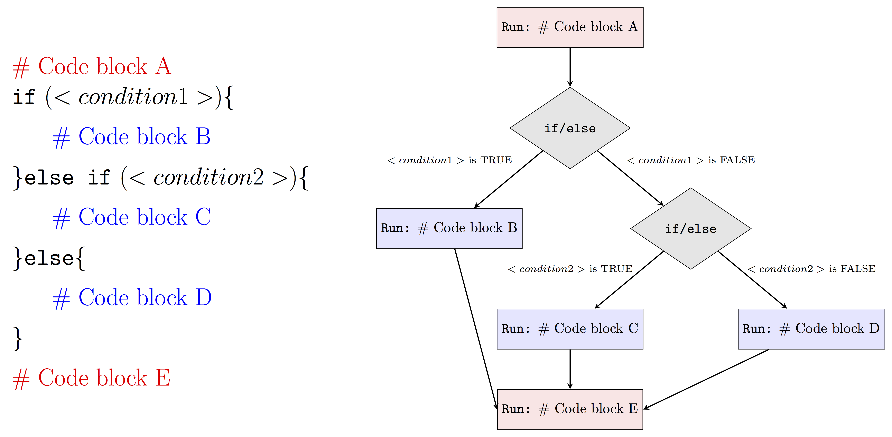
</center>

#### `switch` Statement

Earlier we mentioned that if/elseif/else statements allow us to choose between TRUE and FALSE when there are two options. With the above idea, when there are more than two options we can simply use nested if/else statements. What about when we have roughly 20 options to choose from? In this case, if we stick to using nested if/else statements, the programming logic will be very difficult to understand. The switch statement option in R programming can help us handle this type of problems more effectively.

Before we put switch statements into the case study, let's first start to understand the basic switch statement syntax in R. 

```{r, eval = FALSE}
switch (Expression,
        "Option 1" = Execute this statement when the expression result matches Option 1,
        "Option 2" = Execute this statement when the expression result matches Option 2,
        "Option 3" = Execute this statement when the expression result matches Option 3,
        ....
        ....
        "Option N" = Execute this statement when the expression result matches Option N,
        Default Statements
)
```

- The `expression` value is the condition which R will evaluate. This should be either integer or character. 
- When the `expression` value matches more than one option, the first matching statement will be returned.
- Besides the conditional statement, R also allows us to add the `default statement`, which will be returned when none of the listed options are matched.


With the above syntax in mind, let's now check a simple case study with R switch statements.
```{r, eval = FALSE}
number1 <- 20
number2 <- 5
operator = readline(prompt="Please enter any ARITHMETIC OPERATOR: ")

switch(operator,
       "+" = print(paste("Addition of two numbers is: ", number1 + number2)),
       "-" = print(paste("Subtraction of two numbers is: ", number1 - number2)),
       "*" = print(paste("Multiplication of two numbers is: ", number1 * number2)),
       "/" = print(paste("Division of two numbers is: ", number1 / number2))
)
```

When running the above code in R, we can expect results like:
<center>

</center>


In conclusion, we can visualize the R switch statement as follows: 
<center>

</center>


### Iterative Control Statements {#iter_cont_stat}

Iterative control statements are an extremly useful R  method  for  repeating  a  task multiple times. For example, pretend we are trying to build a program that solves a simple maze like the one below. 

<center>

</center>

It would be pretty easy to simply draw out the possible solutions with the naked eye. However, if you were actually inside the maze, you would need to narrow your perspective and think of a strategy, like marking paths you have already visited. Suppose that we have a strategy in mind to solve this problem. For example, we could consider the following approach at any given point in time:

- if there is space in front of you, go forward 
- else, if there is space on your right, turn right 
- else, if there is space on your left, turn left
- else, [all three sides (forward, left, right) are closed] turn around

This strategy could easily be programmed using the methods discussed in Section \@ref(selcontrostat) but to actually program it you would need to repeat this strategy until you escaped the maze. Your strategy could for example be written as:

```{r, eval = FALSE}
repeat (until "you are free"){
  if ("space in front of you"){
    go forward
  }else if ("space on your right"){
    turn right 
  }else if ("space on your left"){
    turn left
  }else{
    turn around
  }
}
```

Try to develop an algorithm to exit the maze presented above. Could you escape? Though it might take some time (and probably would not correspond to the fastest strategy) one can show that this method can solve any maze (assuming of course that a solution exists). In this section we discuss the elements necessary to actually program the "`repeat (until "you are free")`" part of our algorithm. 

#### `for` Loops {#forloop}

Let's consider the following situation:

```{r, eval = FALSE}
print(1)
print(2)
print(3)
print(4)
print(5)
print(6)
```

This seems feasible when we only need to print out the numbers from 1 to 6. What if we want to print out the numbers from 1 to 100? It is such a clumsy and tedious approach if we keep repeating `print()` line by line to do so.

For loops in R help us solve this type of problems much more effectively in only a couple lines of codes. It allows us to repeat the same part of code, or say a sequence of same instructions, under certain conditions without explicitly writing out the code everytime. For example, to do exactly the same as the above example with for loops, all we need is:

```{r}
for (number in 1:6){
  print(number)
}
```

To interpret the above for loops in plain English, we can read it as "When the number is in the sequence {1,2,3,4,5,6}, we will print this number until we exhaust all numbers in the sequence". As we can see obviously, this approach simplifies our code so much more as we only need to write the code chunk (`print()` in this case) once, not six times, not to mention when we want to print out all the numbers from 1 to 100 compared to repeating `print()` line by line for 100 times.

The basic syntax of for loops in R is as follows:
```{r, eval = FALSE}
for (some specified sequence to loop over){
  execute this statement when we still haven not reached the last item in the sequence
}
```

`Next` also helps when you want to skip for some cases in which you don't want the statement to be executed. To see how `next` works together with for loops in R, let's consider the following more mathematical example when you want to print out all the odd numbers between 1 to 10. 

```{r}
for (i in 1:10) {
  if (!i %% 2){
    next
  }
  print(i)
}
```

From the results, we notice that R automatically skip to run `print(i)` when `!i %%2` is TRUE. To interpret the above in plain English, we can read it as "if the number i cannot be divided by 2, we skip the below and consider the NEXT number in the sequence". In this case, we can still use for loops when we have some exceptional cases.

In conclusion, we can visualize the R for loops as follows: 
<center>

</center>


Up till now, we can see that for loops can simplify our work a lot when we need to execute a sequence of same instructions for multiple times. However, there are still disadvantages to use for loops in R. We may hardly notice now with only a few simple iterations to run. But indeed, R can be very slow when running iteration, especially when we need to do a lot of big iterations with big data. Sometimes we may prefer to avoid using for loops in R by using other approaches since R supports vectorization, which will allow for much faster calculations. For example, solutions that make use of loops are less efficient than vectorized solutions that make use of apply functions, such as lapply and sapply. It’s often better to use the latter. 

Apply methods are often used to make operations on some structured data. For example, let's simulate a matrix of some random samples. 

```{r}
(exp_mat = matrix(rnorm(60),ncol = 3))
```

To get the mean of each column, we can calculate each column mean separately or use a for loop. 

```{r}
# Observe what this does
mean(exp_mat)

# Calculate separately 
mean(exp_mat[,1])
mean(exp_mat[,2])
mean(exp_mat[,3])

# Using a for loop 
for(i in 1:3){
  print(mean(exp_mat[,i]))
}
```


However, using `apply`, we can do this in a very simple manner.

```{r}
apply(exp_mat, 2, mean) 
# The 2 indicates operations on columns and not rows 
```

We will see how these approaches can help accelerate our work later. 


#### `while` Statements
As an alternative of for loops, while statement in R is another approach that can help us repeat the code chunk only when specific conditions are satisfied. For example, we can use while statement to do exactly the same as above to print out all numbers from 1 to 6 as followings:

```{r}
i = 1
while (i <= 6){
  print(i)
  i = i+1
}
```

The above code can be interprented in plain English as: "Let's start with number 1. When the number i is still smaller than or equal to 6, we print it out. Then we consider the next integer of it and stop when we finish all the numbers smaller than or equal to 6."

As we can see, while statement is used to iterate until a specific condition is met. To make use of while statement in R, we introduce the basic syntax of it as following: 

```{r, eval = FALSE}
while (some specified condition)
{
   statement to execute when the above condition is satisfied
}
```

Here we evaluate the condition and if it is `TRUE`, then we execute the statement inside the code chunk. Once we finish running the statement, we evaluate the condition again and exit the loops when the condition is evaluated as `FALSE`.

In conclusion, we can visualize how the while statement works in R as following:
<center>
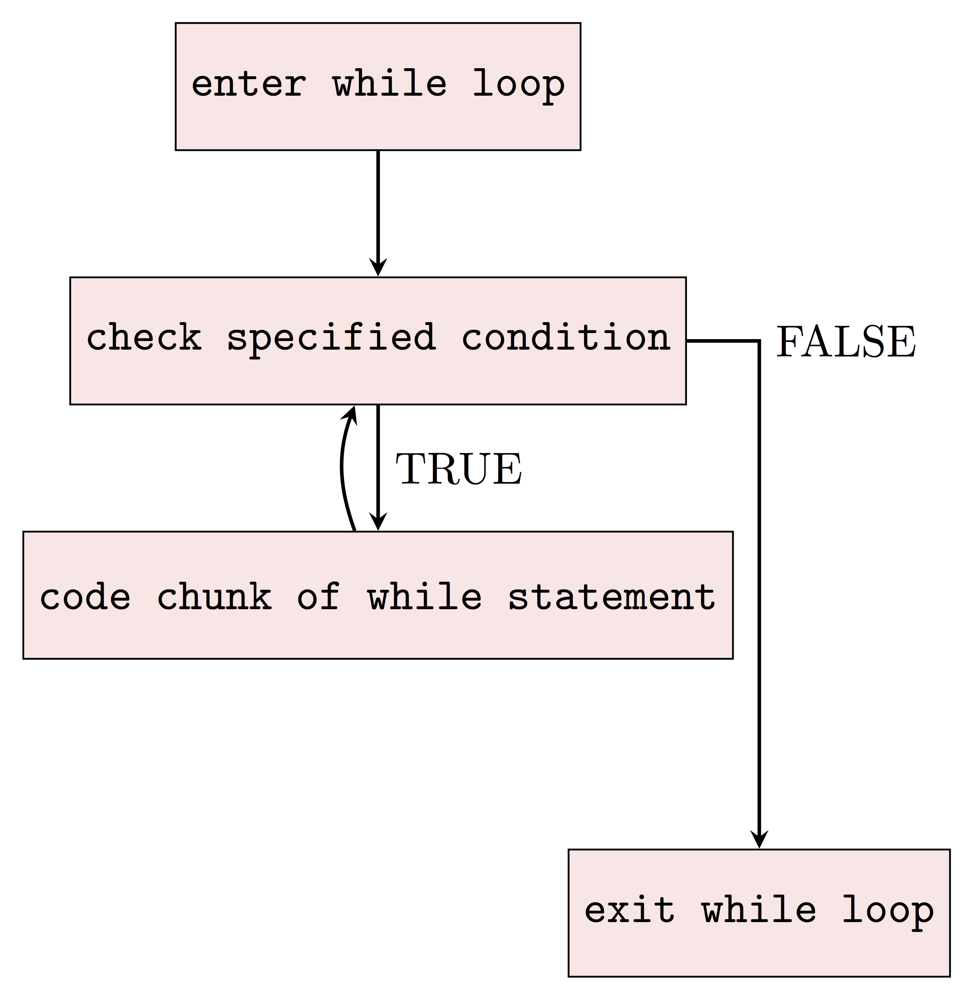
</center>

## Example: The Bootstrap

The (non-parametric) bootstrap was introduced by @efron1979bootstrap as a numerical method to provide a simple estimator of the distribution of an estimator. This method became rapidly very popular since it is completely automatic, requires no theoretical derivation and is (almost) always available no matter how complicated our estimator of interest is. Moreover, most statistical methods are based on various asymptotic approximations (often through the central limit theorem) that can however deliver poor results in finite sample settings. Bootstrap techniques generally enjoy better finite sample performance while paying a price in terms of computation burden. A formal discussion of the properties of (non-parametric) bootstrap techniques is far beyond the scope of this textbook but it's actually quite simple to understand its algorithm. To motivate this discussion, suppose that we ask 10 students how much time they work at home for their STAT 297 class. Say we obtain the following results (in hours):

```{r}
student_work <- c(0, 0, 0, 0, 0, 0.25, 0.75, 0.75, 1, 1.25, 6)
```

We can compute the mean time spent

```{r}
mean_hour <- mean(student_work)
```

Moreover, we compute a simple confidence interval of the **average number** of hours spent by a student enrolled in STAT 297. Since we have no reason to believe that the number of hours spent working at home for this class is not Gaussian, we can construct an asymtotic confidence interval using:

\[
\bar{x} \pm z_{1-\alpha/2} \frac{\hat{\sigma}}{\sqrt{n}},
\]

where $\bar{x}$ is the sample mean, $\alpha$ is the significance level which delivers $z_{1-\alpha/2}$ quantile of standard Gaussian distribution and $\hat{\sigma}$ is the sample standard deviation (we assume that estimating the standard deviation has no impact on the distribution of $\bar{x}$). In R, this interval can therefore be computed as follows:


```{r}
alpha <- 0.05
n <- length(student_work)
sd_hour <- sd(student_work)
z <- qnorm(1 - alpha/2)
mean_hour + c(-1, 1)*z*sd_hour/sqrt(n)
```

Based on this confidence interval your instructor is very disappointed since the confidence interval includes 0, indicating that it is possible that the students study on average zero hours. But does this interval makes sense? The lower bound of the interval is negative implying that students can also have negative hours of study. This of course makes no sense indicating that with this sample size the asymptotic Gaussian approximation makes little sense.

To solve this issue, the (non-parametric) bootstrap is a convenient and appropriate tool to compute more adequate finite sample confidence intervals. Letting $\mathbf{X} = \left[X_1 \;\; \ldots \;\; X_n\right]$ denote the sample (in our case `student_work`), the way the bootstrap works is as follows:

- **Step 1:** Let $i = 1$.
- **Step 2:** Construct a new sample, say $\mathbf{X}^*$, by sampling **with replacement** $n$ observations from $\mathbf{X}$.
- **Step 3:** Compute the average of $\mathbf{X}^*$ which we will denote as $\bar{X}_i$. Let $i = i + 1$ and if $i < B$ go to **Step 2** otherwise go to **Step 4**.
- **Step 4**: Compute the empirical quantiles of $\bar{X}_i$.

Here is a simple function to implement this approach:

```{r}
# Number of boostrap replications
B <- 500

# Compute the length of vector
n <- length(student_work)

# Confidence level
alpha <- 0.05

# Initialisation of 
boot_mean <- rep(NA, B)

# Step 1
for (i in 1:B){
  # Step 2
  student_work_star <- student_work[sample(1:n, replace = TRUE)]
  
  # Step 3
  boot_mean[i] <- mean(student_work_star)
}

# Step 4
quantile(boot_mean, c(alpha/2, 1 - alpha/2))
```

Based on this result your instructor is relieved since they know that, at a level of confidence of 95\%, you are spending at least more than 10 minutes on your course work.

```{block2, type='rmdnote'}
How would you modify the above code to obtain the same output using the `while` control?
```

```{block2, type = 'rmdnote'}
A researcher developed a new drug to help patients recover after a surgery. To investigate if her drug is working as expected, she starts by creating a simple test experiment on mice. In this experiment, the researcher records the survival times of 14 mice after a test surgery. Out of the 14 mice, 8 of them are given the new drug while the remaining ones are used as a control group (where no treatement is given). Her results (in days) are the following:

- **Treatement** group: 38, 76, 121, 86, 52, 69, 41 and 171;
- **Control** group: 18, 12, 52, 82, 102 and 25.

She believes that the median survival time is a "good" way to measure effectiveness of her drug. Based on this experiment, she obtains that the median survival time for the control group is 38.5 days while it is 72.5 days for the treatement group. She wonders if you could help her to find an approriate (bootstrap) confidence interval for the difference of the medians. Using this result, do you believe that the drug increases the median survial time of mice after the test surgery?
```

## Example: Random Walk

The term *random walk* was first introduced by Karl Pearson in the early nineteen-hundreds. There exist a large range of random walk processes. For example, one of the simplest forms of a random walk process can be explained as follows: suppose that you are walking on campus and your next step can either be to your left, your right, forward or backward (each with equal probability). The code illustrates how to program such a random process:

```{r RW2d, fig.height = 5, fig.width = 5.5, cache = TRUE, fig.align='center'}
# Control seed
set.seed(1992)

# Number of steps
steps <- 10^5

# Direction probability (i.e. all direction are equally likely)
probs <- c(0.25, 0.5, 0.75)

# Initial matrix
step_direction <- matrix(0, steps+1, 2)

# Start random walk
for (i in seq(2, steps+1)){
  # Draw a random number from U(0,1)
  rn = runif(1)

  # Go right if rn \in [0,prob[1])
  if (rn < probs[1]) {step_direction[i,1] = 1}

  # Go left if rn \in [probs[1], probs[2])
  if (rn >= probs[1] && rn < probs[2]) {step_direction[i,1] = -1}

  # Go forward if rn \in [probs[2], probs[3])
  if (rn >= probs[2] && rn < probs[3]) {step_direction[i,2] = 1}

  # Go backward if rn \in [probs[3],1]
  if (rn >= probs[3]) {step_direction[i,2] = -1}
}

# Cumulative steps
position = data.frame(x = cumsum(step_direction[, 1]), 
                      y = cumsum(step_direction[, 2]))
  
# Let's make a nice graph...
# Graph parameters
color = "blue4"
xlab = "X-position"
ylab = "Y-position"
pt_pch = 16
pt.cex = 2
main = paste("Simulated 2D RW with", steps, "steps", sep = " ")
hues = seq(15, 375, length = 3)
pt_col = hcl(h = hues, l = 65, c = 100)[1:2]
par(mar = c(5.1, 5.1, 1, 2.1))

# Main plot
plot(NA,  xlim = range(position[,1]), 
          ylim = range(range(position[,2])), 
          xlab = xlab, ylab = ylab, xaxt = 'n', 
          yaxt = 'n', bty = "n", ann = FALSE)
win_dim = par("usr")

par(new = TRUE)
plot(NA, xlim = range(position[,1]), ylim = c(win_dim[3], win_dim[4] + 0.09*(win_dim[4] - win_dim[3])),
       xlab = xlab, ylab = ylab, xaxt = 'n', yaxt = 'n', bty = "n")
  win_dim = par("usr")

# Add grid
grid(NULL, NULL, lty = 1, col = "grey95")

# Add title
x_vec = c(win_dim[1], win_dim[2], win_dim[2], win_dim[1])
y_vec = c(win_dim[4], win_dim[4],
            win_dim[4] - 0.09*(win_dim[4] - win_dim[3]),
            win_dim[4] - 0.09*(win_dim[4] - win_dim[3]))
polygon(x_vec, y_vec, col = "grey95", border = NA)
text(x = mean(c(win_dim[1], win_dim[2])), y = (win_dim[4] - 0.09/2*(win_dim[4] - win_dim[3])), main)

# Add axes and box
lines(x_vec[1:2], rep((win_dim[4] - 0.09*(win_dim[4] - win_dim[3])),2), col = 1)
box()
axis(1, padj = 0.3)
y_axis = axis(2, labels = FALSE, tick = FALSE)
y_axis = y_axis[y_axis < (win_dim[4] - 0.09*(win_dim[4] - win_dim[3]))]
axis(2, padj = -0.2, at = y_axis)

# Add trajectory
lines(position, type = "l", col = color, pch = 16)
  
# Start and end points
points(c(0,position[steps+1,1]), c(0,position[steps+1,2]), cex = pt.cex, col = pt_col, pch = pt_pch)
  
# Legend
leg_pos = c(min(position[,1]), max(position[,2]))
legend(leg_pos[1], leg_pos[2], c("Start","End"), 
      col = pt_col, pch = pt_pch, pt.cex = pt.cex, bty = "n")
```

Such processes inspired Karl Pearson's famous quote that

>
> "*the most likely place to find a drunken walker is somewhere near his starting point.*"
> 

Empirical evidence of this phenomenon is not too hard to find on a Friday night. 

## Example: Monte-Carlo Integration

### Introduction

Monte Carlo integration is a powerful technique for numerical integration. It is particularly useful to evaluate integrals of "high-dimension". A detailed (and formal) discussion of this method is clearly beyond the scope of this class and we shall restrict our attention to the most basic form(s) of Monte Carlo integration and briefly discuss the rational behind this method.

Originally, such Monte Carlo methods were known under various names among which *statistical sampling* was probably the most commonly used. In fact, the name *Monte Carlo* was popularized by several researchers in Physics, including Stanislaw Ulam, Enrico Fermi and John von Neumann. The name is believed to be a reference to a famous casino in Monaco where Stanislaw Ulam’s uncle would borrow money to gamble. Enrico Fermi was one of the first to use this technique which he employed to study the properties of a newly-discovered neutron in the 1930s. Later for example, these methods played a central role in many of the simulations required for the Manhattan project.

With this in mind, let us give an idea of this approach by supposing we are interested in computing the following integral: 

\[I = \int_a^b f(x) dx.\]

Of course, this integral can be approximated by a Riemann sum:

\[I \approx \Delta x \sum_{i = 1}^n f(a + (i-1) \Delta x),\]

where $\Delta x = \frac{b - a}{n}\;$ and the idea behind this approximation is that as the number of partitions $n$ increases, the Riemann sum will become closer and closer to $I$. Also (under some technical conditions), we have that

\[I = \lim_{n \to \infty} \Delta x \sum_{i = 1}^n f(a + (i-1) \Delta x).\]

In fact, the rational of a Monte Carlo integral is quite close to the Riemann sum since, in its most basic form, we approximate $I$ by averaging samples of the function $f(x)$ at uniform random points within the interval $[a, b]$. Therefore, the Monte Carlo *estimator* of $I$ is given by

\begin{equation} 
\hat{I} = \frac{b - a}{B} \sum_{i = 1}^B f(X_i), 
 (\#eq:binom)
\end{equation}

where $X_i = a + U_i (b - a)$ and $U_i \sim \mathcal{U}(0,1)$. In fact, \@ref(eq:binom) is quite intuitive since $\frac{1}{B} \sum_{i = 1}^B f(X_i)$ represents an estimation of the average value of $f(x)$ in the interval $[a, b]$ and thus $\hat{I}$ is simply the average value times the length of the interval, i.e. $(b-a)$. If you would like to learn more about the properties of Monte-Carlo integrals, click on the button below: 

<button id="hidebutton1">Properties</button>
<div id="hideclass1">

```{block2, type='rmdnote'}
A more formal argument on the validity of this approach can be found in analyzing the statistical properties of the estimator $\hat{I}$. In order to do so, we start by considering its expected value
\[
\mathbb{E}\left[ \hat{I} \right] = \frac{b - a}{B} \sum_{i = 1}^B \mathbb{E}\left[ f(X_i)  \right]
= \frac{b - a}{B} \sum_{i = 1}^B \int f(x) g(x) dx, 
\]

where $g(x)$ denotes the pdf of $X_i$. Since $X_i \sim \mathcal{U}(a, b)$ it follows that

\[
g(x) = \left\{
	\begin{array}{ll}
		\frac{1}{b - a}  & \mbox{if } x \in [a, b] \\
		0 & \mbox{if } x \not\in [a, b]
	\end{array}
\right.
\]

Therefore, we have

\[
\mathbb{E}\left[ \hat{I} \right] = \frac{b - a}{B} \sum_{i = 1}^B \int_a^b \frac{f(x)}{b-a} dx = \int_a^b f(x) dx = I, 
\]

Since $X_i$ are iid, the same can be said about $f(X_i)$ and therefore by the **Strong Law of Large Numbers** we have that $\hat{I}$ converges *almost surely* to $I$, which means that

\[
\mathbb{P}\left(\lim_{B \to \infty} \hat{I} = I    \right) = 1.
\]

This result implies that as the number of simulations $B$ goes to infinity we can guarantee that the solution will be exact. 

Unfortunately, this result doesn't give us any information on how quickly this estimate converges to a "sufficiently accurate" solution for the problem at hand. This can be done by studying the variance of $\hat{I}$ and its *rate of convergence*. Indeed, we have

\[
\begin{aligned}
\operatorname{var} \left( \hat{I} \right) &= \left(\frac{b - a}{B}\right)^2  \sum_{i = 1}^B \left\{\mathbb{E}\left[f^2(X_i)\right] - \mathbb{E}^2\left[f(X_i)\right]\right\}\\
&= \frac{1}{B^2} \sum_{i = 1}^B \left\{(b-a) \int_a^b f^2(x) dx - \left(\int_a^b f(x) dx \right)^2 \right\}\\
&= \frac{(b-a) I_2 - I^2}{B}
\end{aligned}
\]

where $I_2 = \int_a^b f^2(x) dx$. A simple estimator of this quantity is given by

\[
\hat{I}_2 = \frac{b - a}{B} \sum_{i = 1}^B f^2(X_i),
\]

and therefore using $\hat{I}$ we obtain:

\[
\widehat{\operatorname{var}} \left(\hat{I} \right) = \frac{(b-a) \hat{I}_2 - \hat{I}^2}{B} = \frac{b - a}{B^2} \sum_{i = 1}^B\left[ (b - a )f^2(X_i) - f(X_i)\right]
\]

Thus, it is easy to see that the rate of convergence of $\widehat{\operatorname{var}} \left(\hat{I} \right)$ is $B^{-1}$ and we may write ${\operatorname{var}} \left(\hat{I} \right) = \mathcal{O}(B)$. This implies that if we wish to reduce the error (or standard deviation) by half, we need to quadruple $B$. Such a phenomon is very common in many fields of research such as Statistics where this is often called the *curse of dimensionality*.
```
</div>

\newline

### Implementation

The function `mc_int()`, which is available in the `introDS` package, implements the above method. This functions has four inputs:

- `x_range`: A vector containing the integration domain, i.e. $a$ and $b$,
- `fun`: A string containing the function you wish to integrate where $x$ is used to indicate the variable of integration,
- `B`: A numeric value to denote the number of Monte-Carlo replications,
- `seed`: A numeric value to control the seed of the random number generator.

For example, if you want to estimate 

\[
\int_1^3 \frac{\exp\left(\sin(x)\right)}{x} dx,
\]

using $10^4$ Monte-Carlo replications, you can use the following command:

```{r}
library(introDS)
mc_int(x_range = c(1,3), fun = "exp(sin(x))/x", B = 10^5)
```

At this point, it is probably a good idea to try to programm this yourself and to compare your results (and code!) with the function `mc_int()`. This should be rather easy to implement but one thing that may be a little delicate is how to pass the function you wish to integrate as an input. A possible way of doing this is to use a string so that, for example, if we have to integrate the function $\sin(x)$ you could simply write `fun = sin(x)` when calling your function. This implies that we should be able to "transform" a string into a function that we can evaluate, which is something that we can achieve by combining the functions `eval` and `parse`. An example is provided below:

```{r exampleeval}
my_fun = "x^2"
x = 0:3
eval(parse(text = my_fun))
```

If you're having trouble understanding what these functions are doing have a look at their help files by writing `?eval` and `?parse`.

### Application to the Normal Distribution

Suppose that $X \sim \mathcal{N}(4, 1.25^2)$ and that we are interested in computing the following probability $\mathbb{P}\left(1 < X < 4.5 \right)$. The probability density of the normal distribution for a random variable with mean $\mu$ and variance $\sigma^2$ is given by:

\[
f(x) = \frac{1}{\sqrt{2 \pi \sigma^2}} \exp \left(- \frac{\left(x - \mu\right)^2}{2 \sigma^2}\right).
\]

Therefore, the probability we are interested in can be written as the following integral

\[
\mathbb{P}\left(1 < X < 4.5 \right) = \int_1^{4.5} \frac{1}{\sqrt{3.125 \pi}} \exp \left(- \frac{\left(x - 4\right)^2}{3.125}\right).
\]

Analytically, this is not an easy problem and of course there are many ways to solve it. However, we could try to use a Monte-Carlo integral to solve it. For example:


```{r}
my_fun = "1/sqrt(3.125*pi)*exp(-((x - 4)^2)/3.125)"
(prob = mc_int(x_range = c(1, 4.5), fun = my_fun, B = 10^7))
```

Based on this result, we can write $\mathbb{P}\left(1 < X < 4.5 \right) \approx 64.72 \%$ with a standard error of about 0.01\%. We can compare our results with what we would obtain with the function `pnorm` which provides a nearly exact result:

```{r}
pnorm(4.5, 4, 1.25) - pnorm(1, 4, 1.25)
```

This shows that our estimation is within one standard error of a near perfect result. 

### Application to Nonelementary Integrals

In layman's terms, a nonelementary integral of a given (elementary) function is an integral that cannot be expressed as an elementary function. The French mathematicien Joseph Liouville was the first to prove the existance of such a nonelementary integral. A well-known example of such integrals are the Fresnel integrals that have been used for a very wide range of applications going from the computation of electromagnetic field intensity to roller roster design. These integrals are defined as:

\[S(y) = \int_0^t \sin\left(x^2\right) dx \;\;\;\;\;\; \text{and}  \;\;\;\;\;\; 
C(y) = \int_0^y \cos \left( x^2 \right) dx.\]

In this example, we will only consider $S(y)$. In general it is believed that the most convenient way of evaluating these functions up to an arbitrary level of precision is to use a power series representation that converges for all $y$:

\[
S(y) = \sum_{i = 1}^\infty \, \left(-1\right)^n \, \frac{y^{4i + 1}}{\left(2i + 1\right) \, !\left(4i + 3\right)}.
\]

In this example, we will study the estimation of $S(\pi)$ as well as the *precision* of this estimation. 


```{r, cache = TRUE, fig.height = 5, fig.width = 6, fig.align = "center"}
B = 4^(4:13)
results = matrix(NA, length(B), 2)
for (i in 1:length(B)){
  mc_res = mc_int(c(0, 2), "sin(x^2)", B = B[i], seed = i+12)
  results[i, ] = c(mc_res$I, sqrt(mc_res$var))
}


trans_blue = hcl(h = seq(15, 375, length = 3), l = 65, c = 100, alpha = 0.15)[2]
plot(NA, xlim = range(B), ylim = range(cbind(results[, 1] + results[,2], 
      results[, 1] -results[,2])), log = "x", ylab = "Estimated Integral",
      xlab = "Number of Simulations B", xaxt = 'n')
grid()
axis(1, at = B, labels = parse(text = paste("4^", 4:13, sep = "")))
polygon(c(B, rev(B)), c(results[, 1] + results[, 2], 
                        rev(results[, 1] - results[, 2])), border = NA, col = trans_blue)
lines(B, results[, 1], type = "b", col = "blue4", pch = 16)
abline(h = 0.8048208, col = "red4", lty = 2)
legend("topright", c("Estimated value", "Standard error interval", "Good approximation (MatLab)"), bty = "n",
       pch = c(16, 15, NA), lwd = c(1, NA, 1), lty = c(1, NA, 2), 
       pt.cex = c(1, 2, NA), col = c("blue4", trans_blue, "red4"))
```

<script type="text/javascript" src="http://ajax.googleapis.com/ajax/libs/jquery/1.3.2/jquery.min.js"></script>
<script type="text/javascript">
    $("#hideclass1").hide();
    $("#hideclass2").hide();
    $("#hidebutton1").click(function(){
      $("#hideclass1").toggle();
    });
    $("#hidebutton2").click(function(){
      $("#hideclass2").toggle();
    });
</script>

<!--chapter:end:04-control.Rmd-->

```{r setup, cache = F, echo=F}
knitr::opts_chunk$set(error = TRUE)
```

# Functions

This chapter aims at highlighting the main advantages, characteristics, arguments and structure of functions in R. As you might already know, a function is a collection of logically connected commands and operations that allow the user to input some arguments and obtain a desired output (based on the given arguments) without having to rewrite the mentioned code each time that specific output is needed. Indeed, a common task in statistical research for example consists in running some simulation studies which give support (or not) to the use of a certain method of inference. In this case, it's not efficient to rewrite the code each time it is needed within a simulation study because it would lead to lengthy code and increased risk of miss-coding. 

In the following paragraphs, we will describe an example for which we will build a function that allows to respond to the related research question. Following from the previous chapter where we discussed matrix algebra in R, at the end of this chapter we will therefore implement a function that allows us to perform least-squares regression and inference using these notions of matrix algebra. Indeed, it may be interesting to understand the behavior of this estimator in different simulation settings and it would not be practical to rewrite the series of commands to obtain the least-squares estimator in each setting. For this reason, a function that implements this estimator would be more appropriate and, in fact, this function already exists in the base R functions and is called `lm()`. However, we will learn how to build our own least-squares regression function and compare its results with those of `lm()` to check if they're the same. To do so, we will consider a dataset in which linear regression is used to study the age of the universe.

**Example: The Hubble Constant**

The example dataset we will study is taken from @wood2017generalized which discusses data collected from the Hubble Space Telescope key project containing information on the velocity and relative distance of 24 galaxies. This information has been used to compute the "Hubble constant" which is a fixed parameter that links velocity and distance of celestial bodies through which it is possible to compute the age of the universe based on the "Big Bang" theory. The link is given by this simple linear relationship

\begin{equation*}
  y = \beta x ,
\end{equation*}

where $y$ represents the velocity while $x$ is the distance between galaxies. Once the Hubble constant is known, its inverse (i.e. $\beta^{-1}$) gives the age of the universe based on the big bang theory. 

Therefore we will use the abovementioned dataset to estimate Hubble's constant to then get an estimate of the age of the universe. This dataset can be found in the `gamair` package under the name `hubble` and when plotting the two variables of interest in a scatterplot there appears to be a positive linear relationship between the two variables.

```{r}
# Load gamair library and retrieve Hubble dataset
library(gamair)
data(hubble)

# Plot data
plot(y = hubble$y, x = hubble$x, col="darkblue", pch = 20, main="Distance vs. Velocity", 
     ylab = "Velocity (in km/s)", xlab = "Distance (in Megaparsecs)")
grid()
```

By the end of this chapter we will therefore be able to build a function to obtain an estimate of $\beta$ and, consequently, an estimate of the age of the universe based on the big bang theory (as well as a means of testing whether a Creationist hypothesis on the age of the universe is reasonable based on the latter theory).

## R functions

In order to build our own functions, the next sections will present the main features of functions in R by studying their main components. The following annotated example gives a brief overview of a simple function that draws a random number issued from the "spin" of an American roulette [^1]: 

<center>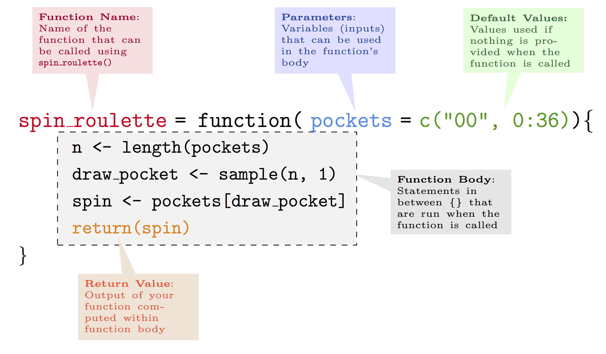{width=80%}</center>

[^1]: This scheme is inspired from diagrams by Prof. Bob Rudis and James Balamuta.

As can be noticed, we first define the name we want to give to the function. 

```{block2, type='rmdwarning'}
It is important to make sure that the function name is specific and does not correspond to other functions that may need to be used within your work session. If two functions have the same name, just as with other R objects, the function that will be used is the last one that has been defined within the R working session.
```

Once we have defined the name, we then attribute a function to this name by using the `function` syntax to which we assign some parameters (or attributes). The latter are the values or data that the user will input in order for the function to deliver the desired output. The latter is subsequently obtained through the code constituting the *body* of the function. Once the code has made the necessary computations, the function needs to know which results are to be given as an output. This can be done, for example, using the `return` syntax.

A couple of simple examples can be functions that compute the sample mean:

```{r}
my_mean <- function (x) {
  average <- sum(x, na.rm = T)/sum(!is.na(x))
  return(average)
}
```

or multiplies two numbers:

```{r}
my_prod <- function (a, b) {
  prod <- a*b
  return(prod)
}
```

Using these functions, we can compute the sample mean of the annual precipitation in US cities (that can be found in the base R dataset `precip`):

```{r}
my_mean(precip)
```

or the product of 265 and 83:

```{r}
my_prod(265, 83)
```

A particular case of function building are so-called "infix" functions that allow to create new operators that carry out specific types of computations. So, instead of defining the name of a function, you can define the symbol to be used in order to make use of that function. For example, to sum two numbers in R you can do as follows:

```{r}
1 + 2
```

which is simply a predefined infix function that can also be used as follows:

```{r}
`+`(1, 2)
```

Therefore the `+` operator is the result of a predefined infix function in R. However, all user-defined infix functions must start and end with the `%` symbol. For example, using an operator that we define as `%^%`, we can deliver the product of two numbers that is zero if the product is actually negative:

```{r}
`%^%` <- function(a, b) {
  prod = a*b
  (prod > 0)*prod
}
```

This infix function can now be used through the operator as follows:

```{r}
2 %^% 2
2 %^% -1
```

Having described the general structure of an R function, let us go more into detail by analysing the three main components to R functions:

- **body**: the code lines containing the commands and operations which deliver the desired output;
- **arguments**: the inputs the user gives to the function which will determine the value or type of output of a function;
- **environment**: every R function is built within an enviroment of reference from which to source possible input values and/or other functions necessary for it to work.

The next sections will therefore go more into detail regarding these components and describe how they contribute to the correct building of a function in R.

## Creating functions in R

As an example for the following sections, let us implement a function that takes two arguments and multiplies them according to the type of object they are (i.e. scalar, vector or matrix). To do so, we will first build a skeleton for this function:

```{r, eval=F}
gen_prod <- function (...) {
  ...
}
```

As you can see, we find a name for the function we want to build, which in this case is `gen_prod`, and specify that we are going to attribute a `function` to this name. Following this assignment, we find a set of curved brackets `(...)` followed by a set of curly brackets `{...}` which should include the *arguments* and *body* of the function respectively. The next two sections will describe these two components and then discuss the third component which is the function *environment*.

### Function arguments

Before implementing a function, we first need to ask ourselves what is the basic information that we need in order to obtain the desired output. In the case of a general product, as mentioned above, the only information that is essential to perform the operation is the first element and the second element we wish to multiply. These will therefore have to be the elements we need to provide to our function in order for it to deliver the desired product and, in R, we can provide the names we want for them (say `first_arg` and `second_arg`): 

```{r, eval=FALSE}
gen_prod <- function (first_arg, second_arg) {
  ...
}
```

We will build this function such that the first argument has a higher (or equal) dimension than the second (e.g. the first is a vector while the second is another vector or a scalar). Let us suppose that `a = matrix(1:8, 4, 2)` is a 4 $\times$ 2 matrix and `b = matrix(8:1, 2, 4)` is a 2 $\times$ 4 matrix. Given that this is a matrix multiplication, these arguments need to be entered in the correct order (such that the dimensions correspond):

```{r, eval=FALSE}
gen_prod(a, b)
```

In the above syntax, we used so-called *positional matching* where arguments to the function must be entered in the same order as they are defined in the function itself. If these are entered in the wrong order the function will either give the incorrect output or give errors since the format of the input could be incompatible with the body of the function. In general, it is therefore possible to use positional matching for the first and most important arguments of a function, but it is generally suggested to use names for the arguments. For our function, we could consequently define the arguments as follows:

```{r, eval=FALSE}
gen_prod <- function (first_arg = matrix(rnorm(9), 3, 3), 
                      second_arg = matrix(rnorm(9), 3, 3)) {
  ...
}
```

You can notice that we assigned the value `matrix(rnorm(9), 3, 3)` to both of these variables. This is their "default" value which, if not specified otherwise, is used as input for the function (which in this case would deliver a 3 $\times$ 3 matrix result of the product of the two matrices whose elements are generated randomly from a standard normal distribution).

Supposing that we leave the arguments of the functions defined as above, there are different ways to specify these arguments. When calling a function, R first matches the arguments through *perfect matching*, meaning that it searches for the arguments matching the exact name (in our case "first_arg" and "second_arg"). Failing to match the arguments by their exact name, R then searches for the arguments through *prefix matching*, meaning that it uses the first letters of the argument names to match them. For example, we could call the function in the following manner:

```{r, eval=FALSE}
gen_prod(second_arg = b, first_arg = a)
```

or even

```{r, eval=FALSE}
gen_prod(fi = a, second = b)
```

So, as long we correctly specify the beginning of the argument's name and as long as it's not ambigiuous (meaning that its name cannot be confused with that of another argument), then it is possible to provide only part of the argument's name and R will recognise and correctly associate the provided value with the corresponding variable.

Finally, failing to match arguments in any of the above cases, R uses positional matching and therefore assigns values to the variables based on the order they have been entered when calling the function. We could therefore go back to using the function like we did at the start by specifying `gen_prod(a, b)`.

```{block2, type='rmdnote'}
It is possible to also specify arguments in terms of the default value of other arguments. For example, we could define the arguments as follows `a = matrix(rnorm(9), 3, 3), b = 2*a`. There are many other interesting ways of specifying argument values and they can be seen, for example, in @wickham2014advanced .
```

A special framework in which to specify arguments for a general function is the case where the arguments are objects that belong to a specific class for which a base function can be used. A simple example is the "`ts`" class of objects in R for which a function exists such that the user simply needs to call the `plot()` function (without needing to know that the function behind is the `plot.ts()` function). Let us for example suppose that some function has created a matrix whose elements represent pixel intensities of an image and that this function has assigned a class to this matrix called `"pixel"`. In the following code we therefore simply assign this class to an object called `image`.

```{r}
image <- matrix(rgamma(100, shape = 2), 10, 10)
class(image) = "pixel"
```

If we were to plot this, we would obtain the following plot:

```{r}
plot(image)
```

which simply plots the values for given coordinates. Given that this is not what we want, let us create a function that allows the user to simply use the `plot()` function which automatically recognises the object and plots a heatmap of the pixel intensity:

```{r}
plot.pixel <- function (mat) {
  suppressWarnings(heatmap(mat, Colv=NA, Rowv=NA, labRow=NA, labCol=NA, scale='none'))
}
```

If we use the `plot()` function now, we obtain the following:

```{r}
plot(image)
```

which produces the desired output simply using the general-purpose function `plot()`.

To conclude, additional arguments can be left to be specified by the user. This is the case, for example, when there is the possibility of specifying arguments for other functions that are used within the function itself. This can be done by using the argument `...` which can be added to any function and will match user-specified arguments that do not match the predefined ones in the function. An example of this type of argument is again given by the base `plot()` function in R where the predefined arguments are `x` and `y` (representing the coordinates of the points in the plot) while other optional arguments, such as graphical parameters, can be added taking advantage of the `...` argument (e.g. the user could specify the argument `type = "l"` even though this is not included among the specified arguments of the function `plot()`). This argument is particularly useful when you want to obtain values for other function arguments but don't want to specify their names in advance.

### Function body

The body of a function is simply the set of instructions and (possible) other functions that use the arguments provided by the user and computes the desired output. In our case, we need to put into practice a series of tools we learned in the previous chapter (e.g. matrix operations) in order to implement a function that delivers multiplication of objects of different nature. Let us start by delivering the product of the objects `first_arg` and `second_arg`: 

```{r}
gen_prod <- function (first_arg = matrix(rnorm(9), 3, 3), 
                      second_arg = matrix(rnorm(9), 3, 3)) {
  first_arg%*%second_arg
}
```

If the user doesn't provide any arguments to the function, this will automatically return a 3 $\times$ 3 matrix (product of two 3 $\times$ 3 matrices built using randomly generated observations from a standard normal). Otherwise, the user can enter the elements of multiplication to obtain their output of interest. For this reason, it would be appropriate that the first and second argument given by the user had compatible dimensions. But what if the latter isn't the case? When building a function body it is important to consider the possible problems ("bugs") that could arise if the inputs the user has given cannot be managed by the body of code you have written. For example, let us suppose that the user provides two 3 $\times$ 2 matrices as the first and second arguments:

```{r}
gen_prod(matrix(rnorm(6), 3, 2), matrix(rnorm(6), 3, 2))
```

In this case we see that the function outputs an error and it would be appropriate to insert a checking procedure at the start of our function in order to consider all possible objects that can be multiplied and issue explanations that are useful to the user in order for them to realise what the problem is. We could therefore add a check procedure before we perform the multiplication:

```{r}
gen_prod <- function (first_arg = matrix(rnorm(9), 3, 3), 
                      second_arg = matrix(rnorm(9), 3, 3)) {
  if (dim(first_arg)[2] == dim(second_arg)[1]) {
    first_arg%*%second_arg
  } else {
    stop("Object dimensions are not compatible")
  }
}
```

As you can see in the example above, we have used a control statement in which we check whether the dimensions for matrix multiplication are respected. If they are, then the function returns the desired product while it returns an error message if this is not the case. The latter is done via the use of the `stop()` function which outputs the text `Error in ...: Object dimensions are not compatible` if the dimensions are not compatible:

```{r}
gen_prod(matrix(rnorm(9),3,3), matrix(rnorm(12),4,3))
```

When a problem is detected in the body of a function, there may not necessarily be the need to interrupt the execution of the function with an error message. Indeed, in the above example, we could allow the function to check if the number of columns in the second object is compatible with that of the first and, if so, transpose the second matrix in order to obtain the correct multiplication with a warning message notifying the user that this has been done:

```{r}
gen_prod <- function (first_arg = matrix(rnorm(9), 3, 3), 
                      second_arg = matrix(rnorm(9), 3, 3)) {
  if (dim(first_arg)[2] == dim(second_arg)[1]) {
    first_arg%*%second_arg
  } else {
    if (dim(first_arg)[2] == dim(second_arg)[2]) {
      warning("Second object has been transposed")
      first_arg%*%t(second_arg)
    } else {
      stop("Object dimensions are not compatible")
    }
  }
}
```

The function `warning()` therefore allows to output a result even though there can be some errors in the inputs, notifying the user of the steps made to achieve this output (please type `?message` to understand what this function allows you to do to communicate with the user). However, let us suppose that the second object entered in this function is a vector. Given our current body in the function we would get the following output:

```{r}
gen_prod(matrix(rnorm(9),3,3), rnorm(3))
```

We obtain this error because the function `dim()` only works on matrices (not vectors or scalars), therefore we can anticipate this problem by making sure that all objects are considered as matrices:

```{r}
gen_prod <- function (first_arg = matrix(rnorm(9), 3, 3), 
                      second_arg = matrix(rnorm(9), 3, 3)) {
  first_arg <- as.matrix(first_arg)
  second_arg <- as.matrix(second_arg)
  
  if (dim(first_arg)[2] == dim(second_arg)[1]) {
    first_arg%*%second_arg
  } else {
    if (dim(first_arg)[2] == dim(second_arg)[2]) {
      warning("Second object has been transposed")
      first_arg%*%t(second_arg)
    } else {
      stop("Object dimensions are not compatible")
    }
  }
}
```

which consequently gives us

```{r}
gen_prod(matrix(rnorm(9),3,3), rnorm(3))
```

Finally, a last check that can be made is whether the second argument is a scalar. Indeed, if the first argument is not scalar, our function would not perform a multiplication:

```{r}
gen_prod(matrix(rnorm(9),3,3), rnorm(1))
```

although we can always multiply a scalar by a matrix or a vector. Therefore we can add one last control statement:

```{r}
gen_prod <- function (first_arg = matrix(rnorm(9), 3, 3), 
                      second_arg = matrix(rnorm(9), 3, 3)) {
  first_arg <- as.matrix(first_arg)
  second_arg <- as.matrix(second_arg)

  if(dim(second_arg)[1]==1 & dim(second_arg)[2]==1) {
    first_arg*second_arg[1]
  } else {
    if (dim(first_arg)[2] == dim(second_arg)[1]) {
      first_arg%*%second_arg
    } else {
      if (dim(first_arg)[2] == dim(second_arg)[2]) {
        warning("Second object has been transposed")
        first_arg%*%t(second_arg)
      } else {
        stop("Object dimensions are not compatible")
      }
    }
  }
}
```

which allows us to have

```{r}
gen_prod(matrix(rnorm(9),3,3), rnorm(1))
```

```{block2,  type='rmdimportant'}
Additional check procedures should be carried out in order to understand if the first object has equal or higher dimensions compared to the second (although the user should be made aware of this in the description of the function). However we leave this exercise to the reader since it would simply be redundant in the message conveyed on programming the body of a function. 
```

As you can see, the body of a function can rapidly become lengthy and complex when adding control statements and computations to it. This can become an issue if you program a complex function and then have to share it with a collaborator or modify it after some time you haven't used it. It is therefore good practice to comment your functions and make sure that the objects consisting in the output of your function are clear to someone who reads the function. In the latter case, the `return()` function makes sure that only the objects that you're interested in are returned to the user (avoiding that eventual unassigned and unimportant values are returned).

```{r, eval=FALSE}
gen_prod <- function (first_arg = matrix(rnorm(9), 3, 3), 
                      second_arg = matrix(rnorm(9), 3, 3)) {
  
  # Make sure that all objects are considered as matrices
  first_arg <- as.matrix(first_arg)
  second_arg <- as.matrix(second_arg)
  
  # Check if second argument is a scalar and, if so, return product (prod)
  if(dim(second_arg)[1]==1 & dim(second_arg)[2]==1) {
    prod <- first_arg*second_arg[1]
  }else{
    # Check if the objects have compatible dimensions and, if so, return product (prod)
    if (dim(first_arg)[2] == dim(second_arg)[1]) {
      prod <- first_arg%*%second_arg
    }else{
      # Check if other dimensions are compatible if the initial
      # ones are not and, if so, transpose the second object and return 
      # product (prod) with warning for the user
      if (dim(first_arg)[2] == dim(second_arg)[2]) {
        warning("Second object has been transposed")
        prod <- first_arg%*%t(second_arg)
      } else {
        # Output an error message if none of the dimensions are compatible
        stop("Object dimensions are not compatible")
      }
    }
  }
  return(prod)
}
```


## Function environment

Generally speaking, an environment is a virtual space in which certain names are associated to specific objects and values. The main characterstics of an environment are the following (see [Wickham: Environments](http://adv-r.had.co.nz/Environments.html)):

* Every name in an environment is unique
* Every environment has a parent

The second characteristic means that when working within a given environment, you're also working in an environment (parent) which includes that environment. For example, in R the usual environment one works in is the "global environment" and its parent is the last package that has been loaded in the R session while the "base environment" is a special case of the global environment and is the environment of the base package (whose parent is the empty environment).

Within this structure, also functions have their own types of environments. Based on this structure, functions will look for the names of objects (and associated values) through scoping methods that start within the function's environment and then, if these are not found, proceed to looking for the names in the parent environments. The types of environments for R functions are the following:

* Enclosing: this is the environment in which the function was created (usually the global environment) and each function only has one enclosing environment
* Binding: this is the environment in which the function is associated to a given name (usually the enclosing and binding environment are the same)
* Execution: this environment is created each time a function is called and in which the objects created by this function during execution are stored
* Calling: this environment is associated with the execution environment and reports the environment in which a function was called

First of all, the enclosing environment of a function can be found by using the `environment()` function:

```{r}
environment(gen_prod)
```

With this function therefore informs the user on the enclosing environment and its main difference with the binding environment consists in the fact that the first determines how to find values (lexical scoping) while the second determines how to find the function. The reason for this separation (at least one of the main reasons) lies in the need to separate package namespaces. By the latter we mean, for example, the case where packages have the same names for different functions, allowing to preserve the name of the function in the enclosing environment unless otherwise specified. An example can be given with the `var()` function (to compute the variance) which uses the `missing()` function (in the base package) to check if a value is specified as an argument to a function (check with `?missing`). Let us suppose we compute the variance of a vector:

```{r}
x <- c(2,4,5,3,7,9)
var(x)
```

Let us now create another function called `missing` in the global environment which takes `x` as an argument but only returns 100. After this, we execute the code above again:

```{r}
missing = function (x) 100
x <- c(2,4,5,3,7,9)
var(x)
```

The result is always the same although the `var()` function would have halted execution if it had considered our own `missing()` function. This is possible thanks the to the package namespace which keeps packages independent through the separate use of enclosing and binding environments.

Finally, the execution environment allows to create a temporary environment in which the function can create its objects without affecting the environment in which it is created and called. For example, suppose that we call our `gen_prod` function but, before doing so, we define an object called `prod` and assign a value to it:

```{r}
prod <- 1
```

We know that our `gen_prod()` function creates an object with the same name and, according to standard R programming rules, the new object with the same name should overwrite the previous one:

```{r}
output <- gen_prod(matrix(rnorm(100), 10, 10), matrix(rnorm(100), 10, 10))
prod
```

As can be seen, although our `gen_prod()` function defines the object `prod`, this quantity remains in the execution environment and does not affect or modify the environment in which is it called (calling environment) and is removed once the function has completed execution.


## Example (continued): Least-squares function

To implement our linear regression function we need to understand the algebra behind least squares and make use of the matrix operations in R explained in the previous chapter. Based on the linear algebra behind least-squares regression, let us implement a function that delivers inference on the parameter vector $\boldsymbol{\beta}$ and therefore define the skeleton of this R function:

```{r, eval=FALSE}
my_lm <- function (...) {
  
  ...
  
}

```

As you can see, we find a name for the function we want to build, which in this case is `my_lm`, and specify that we are going to attribute a `function` to this name. Following this assignment, we find a set of curved brackets `(...)` followed by a set of curly brackets `{...}` which should include the *arguments* and *body* of the function respectively. While the *body* of a function simply corresponds to all the command lines (and other functions) that are used to deliver an output, the next sections will tackle function arguments as well as other important aspects such as their environment and attributes.

In the framework of linear regression the goal is to explain an $n \times 1$ vector of observations $\mathbf{y}$  (representing the response variable) through a linear combination of $p$ explanatory variables (or predictors or covariates) that are stored in an $n \times p$ matrix $\mathbf{X}$. More specifically, the framework is the following:

\[
\mathbf{y} = \mathbf{X}^T\boldsymbol{\beta} + \mathbf{\epsilon},
\]

where $\boldsymbol{\beta}$ is the $p \times 1$ parameter vector of interest that links the covariates with the response variable while $\mathbf{\epsilon}$ is the $n \times 1$ random error vector with null expectation and variance $\sigma^2$.

When we collect data for the purpose of linear regression, the unknown terms in the above setting are the parameter vector $\boldsymbol{\beta}$ and the variance parameter $\sigma^2$. In order to estimate $\boldsymbol{\beta}$, assuming that the matrix $\left(\mathbf{X}^T \mathbf{X}\right)^{-1}$ exists, the least-squares estimator for it is given by:

\begin{equation}
  \hat{\boldsymbol{\beta}} = \left(\mathbf{X}^T \mathbf{X}\right)^{-1} \mathbf{X}^T \mathbf{y}
(\#eq:lsformula)
\end{equation}

If you are interested in understanding how Eq. \@ref(eq:lsformula) is derived, click on the button. If you're not familiar with such calculations we suggest you read some introduction to linear regression [see for example @seber2012linear].

<button id="hidebutton1">Derivation of Least-Squares Estimator</button>
<div id="hideclass1">
```{block2, type='rmdtip'}
The least-square estimator $\hat{\boldsymbol{\beta}}$ is given by

\begin{equation*}
 \hat{\boldsymbol{\beta}} = \operatorname{argmin}_{\boldsymbol{\beta}} \; \left( \mathbf{y} - \mathbf{X}\boldsymbol{\beta} \right)^T \left( \mathbf{y} - \mathbf{X} \boldsymbol{\beta} \right) 
\end{equation*}

The first step of this derivation is to reexpress the term $\left( \mathbf{y} - \mathbf{X}\boldsymbol{\beta} \right)^T \left( \mathbf{y} - \mathbf{X} \boldsymbol{\beta} \right)$ as follows:

\begin{equation*}
    \left( \mathbf{y} - \mathbf{X}\boldsymbol{\beta} \right)^T \left( \mathbf{y} - \mathbf{X} \boldsymbol{\beta} \right) =  \mathbf{y}^T\mathbf{y} +  \boldsymbol{\beta}^T \mathbf{X}^T \mathbf{X} \boldsymbol{\beta} - 2 \boldsymbol{\beta}^T \mathbf{X}^T\mathbf{y}.
\end{equation*}

In case you were surprised by the term $2 \boldsymbol{\beta}^T \mathbf{X}^T \mathbf{y}$ remember that a scalar can always be transposed without changing its value and therefore we have that $\boldsymbol{\beta}^T \mathbf{X}^T \mathbf{y} =  \mathbf{y}^T \mathbf{X}  \boldsymbol{\beta}$. Now, our next step is to the following derivative 

\begin{equation*}
  \frac{\partial}{\partial \; \boldsymbol{\beta}} \; \left( \mathbf{y} - \mathbf{X}\boldsymbol{\beta} \right)^T \left( \mathbf{y} - \mathbf{X} \boldsymbol{\beta} \right).
\end{equation*}

To do this we should keep in mind the following results

\begin{equation*}
  \frac{\partial}{\partial \, \boldsymbol{\beta}} \; \boldsymbol{\beta}^T \mathbf{X}^T\mathbf{y} =   
  \mathbf{y}^T \mathbf{X},
\end{equation*}

and

\begin{equation*}
  \frac{\partial}{\partial \, \boldsymbol{\beta}} \; \boldsymbol{\beta}^T \mathbf{X}^T \mathbf{X} \boldsymbol{\beta} =  2 \boldsymbol{\beta}^T \mathbf{X}^T \mathbf{X}.
\end{equation*}

The proof of these two results can for example be found in Propositions 7 and 9 of [Prof. Barnes' notes](http://www.atmos.washington.edu/~dennis/MatrixCalculus.pdf). Using these two results we obtain

\begin{equation*}
  \frac{\partial}{\partial \, \boldsymbol{\beta}} \; \left( \mathbf{y} - \mathbf{X}\boldsymbol{\beta} \right)^T \left( \mathbf{y} - \mathbf{X} \boldsymbol{\beta} \right) = 2 \boldsymbol{\beta}^T \mathbf{X}^T \mathbf{X} - 2\mathbf{y}^T \mathbf{X}.
\end{equation*}

By solving for the first order condition (and under some technical assumptions not discussed here) we can redefine $\hat{\boldsymbol{\beta}}$ through the follwing equation

\begin{equation*}
  \hat{\boldsymbol{\beta}}^T \mathbf{X}^T \mathbf{X} = \mathbf{y}^T \mathbf{X},
\end{equation*}

which is equivalent to

\begin{equation*}
  \mathbf{X}^T \mathbf{X} \hat{\boldsymbol{\beta}} =   \mathbf{X}^T\mathbf{y}.
\end{equation*}

If $\left(\mathbf{X}^T \mathbf{X}\right)^{-1}$ exists, $\hat{\boldsymbol{\beta}}$ is therefore given by

\begin{equation*}
  \hat{\boldsymbol{\beta}} = \left(\mathbf{X}^T \mathbf{X}\right)^{-1} \mathbf{X}^T \mathbf{y},
\end{equation*}

which verifies Eq. \@ref(eq:lsformula).
```
</div>
\newline

The variance of $\hat{\boldsymbol{\beta}}$ is given by

\begin{equation}
\text{Var} \left(\hat{\boldsymbol{\beta}} \right) = \sigma^2 \left(\mathbf{X}^T \mathbf{X}\right)^{-1},
(\#eq:lsvar)
\end{equation}

and if you are interested, you can click on the button below to see how this formula was derived.

<button id="hidebutton2">Derivation - Variance of Least-Squares Estimator</button>
<div id="hideclass2">
```{block2, type='rmdtip'}
If we let $\mathbf{A} = \left(\mathbf{X}^T \mathbf{X}\right)^{-1} \mathbf{X}^T$, then we have

\begin{equation*}
\begin{aligned}
  \text{Var} \left(\hat{\boldsymbol{\beta}} \right) &= \text{Var} \left( \mathbf{A} \mathbf{y} \right) = \mathbf{A} \text{Var} \left(  \mathbf{y} \right) \mathbf{A}^T = \sigma^2 \mathbf{A} \mathbf{A}^T \\
  & = \sigma^2 \left(\mathbf{X}^T \mathbf{X}\right)^{-1} \mathbf{X}^T  \mathbf{X} \left(\mathbf{X}^T \mathbf{X}\right)^{-1} = \sigma^2 \left(\mathbf{X}^T \mathbf{X}\right)^{-1},
\end{aligned}
\end{equation*}

which verifies Eq. \@ref(eq:lsvar). To understand the above derivation it may be useful to remind and point out a few things:

- $\text{Var} \left( \mathbf{A} \mathbf{y} \right) = \mathbf{A} \text{Var} \left(  \mathbf{y} \right) \mathbf{A}^T$ since $\mathbf{A}$ is not a random variable.
- $\mathbf{A} \text{Var} \left(  \mathbf{y} \right) \mathbf{A}^T = \sigma^2 \mathbf{A} \mathbf{A}^T$ since$\text{Var} \left(  \mathbf{y} \right) = \sigma^2 \mathbf{I}$ and therefore we have $\mathbf{A} \text{Var} \left(  \mathbf{y} \right) \mathbf{A}^T = \sigma^2 \mathbf{A} \mathbf{I} \mathbf{A}^T = \sigma^2 \mathbf{A} \mathbf{A}^T$.
- The result $\mathbf{A} \mathbf{A}^T = (\mathbf{X}^T \mathbf{X})^{-1}$ is based on the fact that $(\mathbf{X}^T \mathbf{X})^{-1}$ is symmetric but this is not necessarily intuitive. Indeed, this follows from the fact that any square and invertible matrix $\mathbf{B}$ is such that the inverse and transpose operator commute, meaning that $( \mathbf{B}^T )^{-1} = ( \mathbf{B}^{-1} )^T$.
Therefore since the matrix $\mathbf{X}^T \mathbf{X}$ is square and (by assumption) invertible we have 
$[(\mathbf{X}^T \mathbf{X})^{-1}]^T = [(\mathbf{X}^T \mathbf{X})^{T}]^{-1} = ( \mathbf{X}^T \mathbf{X})^{-1}$.   

```
</div>
\newline

In general, the residual variance is unknown and needs to be estimated. A common and unbiased estimator of $\sigma^2$ is given by

\begin{equation}
  \hat{\sigma}^2 = \frac{1}{n - p}  \left( \mathbf{y} - \mathbf{X}\hat{\boldsymbol{\beta}} \right)^T \left( \mathbf{y} - \mathbf{X} \hat{\boldsymbol{\beta}}\right) 
  (\#eq:lssig2hat)
\end{equation}

<!-- DO YOU GUYS THINK WE SHOULD SHOW THE UNBIASEDNESS IN BOX HERE. THIS IS A LITTLE MORE ADVANCED AS WE NEED TO USE PROJECTION MATRICES AND THEIR PROPERTIES. LET ME KNOW. -->

<!-- ROB COMMENT: Maybe I'd ask them to show the unbiasdness as homework either theoretically or giving numerical support to the claim (e.g. the mean of different beta hats is close to the true beta) -->

<!-- JUSTIN COMMENT: I agree with Rob's suggestion :)  -->

The rest of this section aims at implementing Eq. \@ref(eq:lsformula) to \@ref(eq:lssig2hat). 

Putting aside possible problems with the data that would require a more in-depth knowledge and discussion of linear regression theory, we can proceed to estimate the Hubble constant by using the velocity as the response variable $y$ and the distance as the explanatory variable $x$. Let us therefore start by implementing  Eq. \@ref(eq:lsformula) within our function in order to get an estimate of $\beta$.

```{r, eval=FALSE}
my_lm = function(response, covariates) {
  
  # Define parameters
  n <- length(response)
  p <- dim(covariates)[2]
  df <- n - p
  
  # Estimate beta through Eq. (6.1)
  beta.hat <- solve(t(covariates)%*%covariates)%*%t(covariates)%*%response
  
  # Return the estimated value of beta
  beta.hat
}
```

```{block2,  type='rmdimportant'}
Before discussing the body and output of this function, we can first underline an important aspect of programming. Indeed, we defined the number of covariates (and length of the vector $\boldsymbol{\beta}$) as `p <- dim(covariates)[2]` where the function `dim()` presupposes that the object `covariates` is a matrix. Nevertheless, in our case the object `covariates` would correspond to `hubble$x` which is a vector and therefore this operation would return `NULL` as an output. When programming it is therefore important to think ahead and understand if there are any particular cases where parts of the body of your function may not work.
```

Taking into account the above note, it would be appropriate to make sure that the code in the body of the function works also in particular cases (e.g. the `covariates` object is a vector and not a matrix). In our case we therefore use the function `as.matrix()` which forces an object to be considered as a matrix in order for it to be used within matrix opeations.
 
```{r, eval=FALSE}
my_lm = function(response, covariates) {
  
  # Make sure data formats are appropriate
  response <- as.vector(response)
  covariates <- as.matrix(covariates)
  
  # Define parameters
  n <- length(response)
  p <- dim(covariates)[2]
  df <- n - p
  
  # Estimate beta through Eq. (6.1)
  beta.hat <- solve(t(covariates)%*%covariates)%*%t(covariates)%*%response
  
  # Return the estimated value of beta
  beta.hat
}
```

```{block2, type='rmdtip'}
Other checks can be introduced at the beginning of the function to make sure that the function is used correctly and obtain an appropriate output. In our case, for example, we could even introduce a check to understand if `response` and `covariates` have the same number of rows and interrupt the function execution and output an error message if this is not the case, making the user aware of this probem.
```

As you may notice, using the matrix operators we obtain an object we decide to call `beta.hat` and, to tell the function to return this value, we simply specify it without any other commands after it has been computed. A more appropriate way of defining the outputs of a function would however be the `return()` function that avoids ambiguous outputs due to mistakes in coding or others within the function body. By using `return()` we make sure the desired outputs are given and it improves readability of the function for other users (see the next example further on). 

With the `my_lm()` function we can now estimate the value for $\beta$ that we denote as $\hat{\beta}$. However, we don't have an estimate of its variance for which we would need to implement Equations \@ref(eq:lsvar) and \@ref(eq:lssig2hat). We can therefore add these equations to the body of our `my_lm()` function:

```{r, eval=FALSE}
my_lm = function(response, covariates) {
  
  # Make sure data formats are appropriate
  response <- as.vector(response)
  covariates <- as.matrix(covariates)
  
  # Define parameters
  n <- length(response)
  p <- dim(covariates)[2]
  df <- n - p
  
  # Estimate beta through Eq. (6.1)
  beta.hat <- solve(t(covariates)%*%covariates)%*%t(covariates)%*%response
  
  # Estimate of the residual variance (sigma2) from Eq. (6.3)
  # Compute residuals
  resid <- response - covariates%*%as.matrix(beta.hat)
  sigma2.hat <- (1/df)*t(resid)%*%resid
  
  # Estimate of the variance of the estimated beta from Eq. (1.2)
  var.beta <- sigma2.hat*solve(t(covariates)%*%covariates)
  
  # Return all estimated values
  return(list(beta = beta.hat, sigma2 = sigma2.hat, variance_beta = var.beta))
}
```

There are a couple of things to underline in the above function. Firstly, when defining the `resid` object we also used `as.matrix()` for the object `beta.hat`: this is because it can happen (as in our example) that the dimension of $\boldsymbol{\beta}$ could be equal to one (i.e. a scalar) and the matrix multiplication would not work and output an error. By using the `as.matrix()` function, we ensure that this multiplication will work also when $\boldsymbol{\beta}$ is a scalar (i.e. when there is only one covariate). A second aspect to underline is the way in which we return multiple function outputs. Indeed, in our case we decide to return not only the estimate of $\beta$ but also the estimated residual variance as well as the variance of $\hat{\beta}$. To do so, we use the `list()` function that allows to store objects of different nature (e.g. scalars, vectors, matrices) as elements of a single object while assigning names to them. For example, the estimated parameter $\beta$ will be accessible through the element name `beta` (we'll see how this done further on).

Nevertheless, in order to answer the question of our example on the Hubble constant, we would need to obtain a confidence interval for our estimated paramter $\hat{\beta}$. Although the information needed for this purpose is available to the user through the current output, it may be useful to directly provide the confidence interval since it is a piece of information which is almost always required to deliver inference on the true parameter $\beta$. Let us therefore build a confidence interval within our function for which we will assume that the estimated variance of $\hat{\beta}$ is actually the true variance (otherwise we would need to build a confidence interval based on the Student-t distribution which we will not deal with at this stage of our course). Assuming therefore that

\begin{equation*}
  \hat{\beta} \sim \mathcal{N}\left(\beta,\hat{\sigma}^2(X^TX)^{-1}\right) ,
\end{equation*}

we consequently have that the confidence interval is given by

\begin{equation}
  \left[\hat{\beta} - z_{1-\alpha/2}\sqrt{\hat{\sigma}^2(X^TX)^{-1}} \, , \, \hat{\beta} + z_{1-\alpha/2}\sqrt{\hat{\sigma}^2(X^TX)^{-1}} \right] ,
  (\#eq:cibeta)
\end{equation}

where $z_{1-\alpha/2}$ is the $(1-\alpha/2)^{th}$ quantile of the standard normal distribution.

Let us therefore add this output to our function which would require an extra argument: the confidence level. The most common confidence level used is the 95\% level which is obtained by defining the significance level $\alpha = 0.05$. We could therefore add the latter argument to our function and set its default value to 0.05.

```{r}
my_lm = function(response, covariates, alpha = 0.05) {
  
  # Make sure data formats are appropriate
  response <- as.vector(response)
  covariates <- as.matrix(covariates)
  
  # Define parameters
  n <- length(response)
  p <- dim(covariates)[2]
  df <- n - p
  
  # Estimate beta through Eq. (6.1)
  beta.hat <- solve(t(covariates)%*%covariates)%*%t(covariates)%*%response
  
  # Estimate of the residual variance (sigma2) from Eq. (6.3)
  # Compute residuals
  resid <- response - covariates%*%as.matrix(beta.hat) 
  sigma2.hat <- (1/df)*t(resid)%*%resid
  
  # Estimate of the variance of the estimated beta from Eq. (6.2)
  var.beta <- sigma2.hat*solve(t(covariates)%*%covariates)
  
  # Estimate of the confidence interval based on alpha
  quant <- 1 - alpha/2
  ci.beta <- c(beta.hat - qnorm(p = quant)*sqrt(var.beta), beta.hat + 
                 qnorm(p = quant)*sqrt(var.beta))
  
  # Return all estimated values
  return(list(beta = beta.hat, sigma2 = sigma2.hat, 
              variance_beta = var.beta, ci = ci.beta))
}
```

We now have now a general function to perform linear regression which has a series of scalar outputs as well as a vector (i.e. the confidence interval). Let us now complete this chapter by investigating how the `my_lm()` function performs compared to the base `lm()` function.

```{r}
# Linear regression with lm() function
fit_lm = lm(hubble$y~hubble$x-1)

# Linear regression with my_lm() function
fit_my_lm = my_lm(hubble$y, hubble$x)

# Compare outputs
manual_results = c(fit_my_lm$beta, fit_my_lm$sigma2)
base_results = c(fit_lm$coefficients, 
                     (1/fit_lm$df.residual)*t(fit_lm$residuals)%*%fit_lm$residuals)
results = cbind(manual_results, base_results)
row.names(results) = c("Beta", "Sigma")
results
```

As one can notice, the two procedures give the same outputs indicating that our `my_lm()` function well implements the linear regression method. We can now proceed to use our function in order to test the Creationist hypothesis on the age of the universe assuming the validity of the big bang theory. First of all, due to different measurement units we perform a unit transformation and then compute the age in years (which requires an additional transformation since the previous one gives a unit of $s^{-1}$).

```{r, eval=FALSE}
# Estimated Hubble's constant
hubble_const <- fit_my_lm$beta/3.09e19 
# Note: The estimated Hubble's constant in inverse seconds, [s^(-1)]

# Age of the universe in seconds
age_sec <- 1/hubble_const 

# Age of the universe in years
age_sec/(60^2*24*365) 
```

Based on this estimation, the age of the universe appears to be almost 13 billion years. However, we know that $\hat{\beta}$ is a random variable that therefore follows a distribution which, based on asymptotic statistical theory, is a normal distribution with expectaton $\beta$ and variance $\sigma^2(X^TX)^{-1}$. 

Now, let's suppose that we have a hypothesis on the age of the universe, for example that of Creation Scientists who claim that the universe is 6000 years old based on a reading from the Bible. Assuming the validity of the big bang theory, which is not the case for Creation Scientists, let us nevertheless test if their claim appears to be reasonable within this postulated framework.  For this purpose we can build a 95\% confidence interval for the true Hubble constant $\beta$ and understand if the Hubble constant implied by the postulated age of the universe falls within this interval. Firstly, we can determine this constant under the null hypothesis which can be defined as follows

\begin{equation*}
  H_0 \, : \, \beta = 163 \times 10^6 ,
\end{equation*}

since this value of $\beta$ would imply that the universe is roughly 6000 years old. The alternative hypothesis is that the true $\beta$ is not equal to the above quantity (i.e. $H_A \, : \, \beta \neq 163 \times 10^6$). ... Let us therefore replace the values in Eq. \@ref(eq:cibeta):

```{r}
# 95% confidence interval for the Hubble constant
fit_my_lm$ci
```

The confidence interval lies between 68 and 84 which clearly does not contain the value implied by the age of the universe postulated by the Creation Scientists. Hence, assuming the validity of the big bang theory, we can reject this hypothesis at a 95\% level. 

<script type="text/javascript" src="http://ajax.googleapis.com/ajax/libs/jquery/1.3.2/jquery.min.js"></script>
<script type="text/javascript">
    $("#hideclass1").hide();
    $("#hideclass2").hide();
    $("#hidebutton1").click(function(){
      $("#hideclass1").toggle();
    });
    $("#hidebutton2").click(function(){
      $("#hideclass2").toggle();
    });
</script>

 

<!--chapter:end:05-functions.Rmd-->

# (PART) Extending {-}

# Shiny Web Applications

Shiny is an R package that makes it easy to build interactive web apps through R. It made avaialble directly through RStudio and can be employed loading the corresponding library (i.e. `library(shiny)`).

## Introduction 

In order to build an application, we first need to understand its structure as well as the elements it needs to work. The idea is to take some input (such as parameters) and produce an output based on some code that will not be visible to the user and will connect the input and output. In this chapter we will describe how to build a Shiny application for which a brief tutorial can be found below.

```{r, echo = FALSE}
knitr::include_url("https://www.youtube.com/embed/X5uQU5XX7iU")
```

In the following paragraphs, we will provide more details on how a Shiny app can be built using the example illustrated in the tutorial.

## Step 1. Defining the R Code in the backend of the Shiny app

Before we build the interface of the web application, we need to focus on the R code which, in the framework of Shiny app development, is also commonly known as the "backend" of the application. To make sure that all the intended operations work within the application, we need to make sure that the R code that serves as the skeleton of this app works smoothly. 

For instance, based on the tutorial example, we may intend to build an application that creates a histogram based on the waiting time between eruptions of the Old Faithful geyser in Yellowstone National Park (that can be found in the R dataset `faithful`), allowing the user to specify the number of bins. Using the second column in the dataset (representing the waiting times), if we were to use the default values for the histogram function in R we would obtain the following plot.

```{r}
x <- faithful[, 2] 
hist(x)
```

However, the representation and interpretation of the data can sometimes change considerably if using different visualization parameters. Indeed, among others, the `hist()` function includes an option called `breaks` that allows the user to specify a vector giving the number of breakpoints between histogram cells. An example of how this is used and changes the representation of the data can be found below. 

```{r}
par(mfrow = c(1,2))

# Histogram with 9 bins
bins <- seq(min(x), max(x), length.out = 10)
hist(x, breaks = bins)

# Histogram with 19 bins
bins <- seq(min(x), max(x), length.out = 20)
hist(x, breaks = bins)
```

As you may notice, the number of bins created by using this option is always one unit less than the length of the specified vector (i.e. 9 and 19). Therefore, if we intend to deliver an app that allows the user to directly specify the number of bins, we should take this into account and add one unit to the input that the user has given within the `length.out` option. Ideally, we would be looking to implement a function which includes the following steps:

```{r}
input <- 10

# Histogram with input bins
bins <- seq(min(x), max(x), length.out = input + 1)
hist(x, breaks = bins)
```

where the value given to the `input` object (which is 10 in the above example) is the only value required and can be assigned by the user through the app interface. The next step will explain how to do so.

## Step 2: User Interface (UI) / Frontend 

Once we have determined the structure of the code we can now start creating the Shiny app by firstly developing the UI (or frontend) with which the user will interact. To address this part, let us take the tutorial example as a guide and inspect the part of the code related to the UI.

```{r, eval=FALSE}
# Define UI for application that draws a histogram
ui <- fluidPage(
   
   # Application title
   titlePanel("Old Faithful Geyser Data"),
   
   # Sidebar with a slider input for number of bins 
   sidebarLayout(
      sidebarPanel(
         sliderInput("bins",
                     "Number of bins:",
                     min = 1,
                     max = 50,
                     value = 30)
      ),
      
      # Show a plot of the generated distribution
      mainPanel(
         plotOutput("distPlot")
      )
   )
)
```

As can be seen, all the code that will be dedicated to creating the UI is assigned to an object called `ui` through a function called `fluidPage()` (see `?fluidPage` for more information). The two main elements of this function are the panel dedicated to the title that will appear for the app (`titlePanel()`) and the layout to give to web page which in this example is a layout with a sidebar for the user to enter their inputs and a main panel in which the outputs will be visualized (`sidebarLayout()`). In the next paragraphs we will provide more details on the possible contents to be presented in the app interface, as well as the options that can be employed to allow the user to enter the needed inputs and the options for visualizing the outputs.

### Content Creation {-}

We want to design the application in the way that it is comprehensive and also easy to interpret. Below are some often-used options of content creation that will be beneficial to know.

| Function        | Description                              |
|-----------------|------------------------------------------|
| titlePanel()    | The title of the application             |
| sidebarLayout() | Creates a sidebar layout for fluidPage() |
| sidebarPanel()  | Makes a sidebar menu                     |
| mainPanel()     | Main content area for different outputs  |


### Input Controls {-}

We also want to provide spaces so that the client can change any desired parameter. For example, in the above example, this would be the number of bins. Below are some input controls the developer can use.

| Function        | Description               |
|-----------------|---------------------------|
| numericInput()  | Number entry input        |
| radioButtons()  | Radio button selection    |
| selectInput()   | Dropdown menu             |
| sliderInput()   | Range slider (1/2 values) |
| submitButton()  | Submission button         |
| textInput()     | Text input box            |
| checkboxInput() | Single checkbox input     |
| dateInput()     | Date Selection input      |
| fileInput()     | Upload a file to Shiny    |
| helpText()      | Describe input field      |


### Output Render Controls {-}

The different type of output that is shown can be designed depending on what the developer intends it to be. Examples of these options are shown below. We advise you to follow the videos and research different options that fit the desired output. 

| Function             | Description             |
|----------------------|-------------------------|
| plotOutput()         | Display a rendered plot |
| tableOutput()        | Display in Table        |
| textOutput()         | Formatted Text Output   |
| uiOutput()           | Dynamic UI Elements     |
| verbatimTextOutput() | "as is"" Text Output"   |
| imageOutput()        | Render an Image         |
| htmlOutput()         | Render Pure HTML        |


## Step 3: Implementing the backend (server)

This step consists in adapting the structure of the code seen in Step 1 to the requirements of the Shiny app structure. This is done by creating a function which, as arguments, has an `input` and an `output` as can be seen below always using the example given in the tutorial.

```{r, eval=FALSE}
server <- function(input, output) {
   
   output$distPlot <- renderPlot({
      # generate bins based on input$bins from ui.R
      x    <- faithful[, 2] 
      bins <- seq(min(x), max(x), length.out = input$bins + 1)
      
      # draw the histogram with the specified number of bins
      hist(x, breaks = bins, col = 'darkgray', border = 'white')
   })
}
```

In this example, the function is called `server()` and contains only one object called `output` with a corresponding element called `distPlot` (`output$distPlot`). It must be underlined that the latter name must correspond to the name given for the output in the UI setup (i.e. the `distPlot` name inserted in `plotOutput("distPlot")`, see Step 2). The content of the output in this example is a plot and we therefore use the `renderPlot()` function in which we can include the code that we developed in Step 1 (with some added graphical parameters for the color of the bins and their borders). Of course, this output will depend on the input provided by the user which is used when defining the `bins` object (i.e. `bins <- seq(min(x), max(x), length.out = input$bins + 1)`). Just like for the `output` object, also in this case the `input` object has an element whose name must correspond to the name given for the input when building the UI (i.e. `sliderInput("bins",...)`).


## Step 4: Connecting frontend and backend 

Once we have developed the structure and defined the functions and objects for the UI (frontend) and backend environments, all that needs to be done is to ensure that they can communicate with each other. Using the Shiny environment, this can be quickly and easily done by using the `shinyApp()` function which takes the object defining the UI interface (`ui` in our example, see Step 2) and the function that takes the input and delivers the output (`server` in our example, see Step 3).

```{r, eval=FALSE}
shinyApp(ui = ui, server = server)
```

Therefore, having completed the UI and backend code, to launch the Shiny Web app you simply need to execute this code (or push the "Run App" button at the top of your Shiny app code).

## Step 5: Customize 


We can confidently say that shiny can be heavily customized, like how webpage applications are customized, even without explicitly using complex javascript or HTML elements. 

One of such examples are a `submitButton(...)`, in which we can run responsive output from input data using a button to initiate. More can be read from [here](https://shiny.rstudio.com/reference/shiny/1.0.4/submitButton.html). 

Another of such example is controlling the content creation process other than the default. 


## Example: Monte-Carlo Integration

<!-- STEF: To determine the structure and content of this section. -->

```{r, echo = FALSE}
knitr::include_url("https://www.youtube.com/embed/0zlWcHDKCFw")
```


## Example: Buffon's needle

In 1777, the French nobleman Georges-Louis Leclerc, Compte de Buffon (Count of Buffon) posed the following problem to the Royal Academy of Sciences in Paris [@buffon1777essai]:

> Suppose that you drop a needle of unit length on a plane ruled by the lines $y = m \; (m = 0, \pm 1, \pm 2, ...)$ - what is then the probability that the needle comes to lie in a position where it crosses one of the lines?

Compte de Buffon also provided the answer and showed that the needle will intersect lines with a predictable probability. In mathematical terms, his solution (still known today as the Buffon principle) can be stated as follows:

\begin{equation} 
\mathbb{P}(\text{intersection}) = \frac{2}{\pi}.
(\#eq:probbuffon)
\end{equation} 

If you are curious about the derivation of this result, click on the button below.

<button id="hidebutton2">Derivation - Equation (7.1)</button>
<div id="hideclass2">
```{block2, type='rmdtip'}
This proof is based on the solution of Example 4.5.8 of @grimmett2001probability. We start by letting $(X, Y)$ denote the coordinates of the point at the center of the needle and let $\Theta$ be the angle, modulo $\pi$, that lies between the needle and the horizontal lines. Next, we define the distance from the needle's center to the nearest line beneath it as $Z = Y -  \lfloor Y \rfloor$, where $\lfloor Y \rfloor$ denotes the "floor" of $Y$, i.e. the greatest integer not greater than $Y$. Since the needle is randomly casted, we have that the joint density of $(Z, \Theta)$ is given by:

\[
f_{Z, \Theta} (z, \theta) = f_{Z} (z) f_{\Theta} (\theta) = \frac{1}{\pi},
\]

for $0 \leq z \leq 1$ and $0 \leq \theta \leq \pi$. By drawing a diagram one can see that an interception occurs if and only if $(Z, \Theta) \in \mathcal{B}$, where

\[
\mathcal{B} = \left\{(z, \theta)\,: \;\; z \leq \frac{1}{2} \sin (\theta)  \;\; \text{or} \;\; 1-z \leq \frac{1}{2} \sin(\theta)\right\}.
\]

Therefore, we obtain

\[
\mathbb{P}(\text{intersection}) = \iint_\mathcal{B} \; f_{Z, \Theta} (z, \theta)\, dz \, d\theta = \frac{1}{\pi} \int_0^\pi \left(\int_0^{\frac{1}{2}\sin(\theta)} dz + \int_{1 - \frac{1}{2}\sin(\theta)}^{1} dz \right) d\theta = \frac{2}{\pi},
\]

which verifies Equation \@ref(eq:probbuffon) and concludes the proof.
```
</div>
\newline

Georges-Louis Leclerc's motivation behind this problem was to design an experiment to estimate the value of $\pi$. Indeed, if you fling a needle a large number $B$ times onto a ruled plane and count the number of times $S_B$ that the needle intersects a line, we might be able to approximate $\mathbb{P}(\text{intersection})$ and therefore $\pi$. From Equation \@ref(eq:probbuffon), we know that the proportion $S_B/B$ will be "close" to the probability $\mathbb{P}(\text{intersection})$. In fact the (weak) law of large number garantees that $S_B/B$ converges (in probability) to $2/\pi$, i.e. for any given $\varepsilon > 0$,

\[
\lim_{B \rightarrow \infty} \; \mathbb{P}\left( \left| \frac{S_B}{B} - \frac{2}{\pi} \right|  > \varepsilon \right) = 0.
\]

Thus, the estimator

\[
\hat{\pi}_B = \frac{2B}{S_B},
\]

is a plausible estimator of $\pi$. The Continous Mapping Theorem [see e.g. Theorem 1.14 of @dasgupta2008asymptotic] can (among others) be used to show that $\hat{\pi}$ is a **consistent** estimator of $\pi$ (i.e. $\hat{\pi}$ converges in probability to $\pi$). In 1777, Georges-Louis Leclerc investigated this problem and computed $\hat{\pi}_B$ by flinging a needle 2084 times, which may consitute the first recorded example of a Monte-Carlo method (simulation?) in use.

To illustrate the convergence of our estimator we could fling a needle $B$ times and compute the following estimators:

\[
\hat{\pi}_j = \frac{2j}{S_j}, \;\; j = k,\, ...., \,B
\]

where $k \ll B$. Once this is done, we could create a graph with $j$ on the horizontal axis and $\hat{\pi}_j$ on the vertical axis. Since $\hat{\pi}_B$ is a consistent estimator we should see that $\hat{\pi}_j$ tends to get closer and closer to $\pi$ as $j$ increases. In this graph we could also superimpose several experiments (recasting the needle $B$ times several times) to reinforce our argument.

The goal of this example is to create a Shiny app to visualize and illustrate Buffon's needle experiment. For this purpose, we will use the following steps:

1) **Step 1: Backend**: Create all the functions needed for the backend of our app. A possible approach is to create the following functions:
    a) `cast_needle()`: this function randomly casts a needle on plane and returns its coordinates as well as a binary variable to indicate if the needle crossed a line;
    b) `buffon_experiment()`: this function performs a Monte-Carlo experiment by flinging a large number of needles using the function `cast_needle()`;
    c) `plot.buffon_experiment()`: to visualize the experiment (i.e. show all the needles randomly dropped) and compute the estimator $\hat{\pi}_B$ for the experiment at hand;
d) `converge()`: to illustrate the convergence of the estimator by creating the graph mentioned at the end of the previous paragraph.
2)  **Step 2: Frontend**: Create widgets to collect all inputs needed by the backend:
    a) dimension of the plane on which the needles are dropped;
    b) the number of needles being used, i.e. $B$;
    c) number of experiments which is needed to illustrate the convergence of the estimator; 
    d) the seed to allow "replicable" experiments.
Aside from allowing the user to enter these variables, we will need to create two output "tabs". In the first one, we will "print" the result(s) of the experiment and in the second one we will illustrate the convergence of the estimator. Finally, we will need a button to "run" a new experiment.

3) **Step 3: Connecting frontend and backend**: In this third step we will need to connect the inputs with the outputs. Indeed, we will use the `input` list created by the widget defined in the previous step (Step 2) to create the graphs to be displayed in the two output tabs. We will also need to "activate" the button (i.e. connect the inputs to the appropriate functions) in order to run a new experiment and update the "seed" after every new experiment.

To summarize, our approach should follow the steps presented in the chart below:

<center>

</center>

In the next sections, we will discuss in detail how to program each step.

### Step 1: Backend

Let us start with the function `cast_needle()`. This function has a single input, i.e. the width of the (square) plane on which the needle is cast and returns a `list` containing:

- `$start`: the coordinates of one end of the needle;
- `$end`: the coordinates of the other end of the needle;
- `$cross`: a binary variable to indicate if the needle intercepts a line.

```{block2, type='rmdnote'}
An additional input could be added consisting in the length of the needle. However, in this example we only consider needles of unit length.
```

A possible implementation of this function is given below:

```{r}
cast_needle <- function(plane_width = 20){
  available_range <- plane_width/2 - 1 # where 1 is the length of the needle (unit)
  x_start <- runif(2, -available_range, available_range)
  angle <- runif(1, 0, 2*pi)
  x_end <- c(cos(angle), sin(angle)) + x_start # where the angles are multiplied by the needle length which is 1 in this example
  cross <- floor(x_start[2]) != floor(x_end[2])
  out <- list(start = x_start, end = x_end, cross = cross)
  out
}
```

Here is an example of the output of this function:

```{r}
needle <- cast_needle(plane_width = 4)
needle
```

and we could now for example provide the following graphical representation of this random cast:

```{r, fig.align='center', fig.width=5.5, fig.height=5.2}
plot(NA, xlim = c(-2, 2), ylim = c(-2, 2), xlab = "x", ylab = "y")
abline(h = -2:2, lty = 3)
lines(c(needle$start[1], needle$end[1]), c(needle$start[2], needle$end[2]))
```

Next, we consider the function `buffon_experiment()`. This function is based on the previous function and contains the following inputs:

- `B`: the number of needles being casted;
- `plane_width`: the width of the (square) plane on which the needles are casted;
- `seed`: the "seed" used by the random number generator (allows to replicate results);

and returns a `list` containing:

- `$start`: a $B \times 2$ matrix containing the coordinates of one end of the $B$ needles;
- `$end`: a $B \times 2$ matrix containing the coordinates of the other end of the $B$ needles;
- `$cross`: a vector of length $B$ containing boolean variables to indicate whether a needle crosses a line or not;
- `$plane`: the width of the (square) plane.

A possible implementation of this function is provided below:

```{r}
buffon_experiment <- function(B = 2084, plane_width = 10, seed = NULL){
  
  if (!is.null(seed)){
    set.seed(seed)
  }
  
  X_start <- X_end <- matrix(NA, B, 2) 
  cross <- rep(NA, B)
  
  for (i in 1:B){
    inter <- cast_needle(plane_width = plane_width)
    X_start[i, ] <- inter$start
    X_end[i, ] <- inter$end
    cross[i] <- inter$cross
  }
  
  out <- list(start = X_start, end = X_end, cross = cross, plane = plane_width)
  class(out) <- "buffon_experiment"
  out
}
```

For example, if we consider an experiment where four needles are cast, we could obtain:

```{r}
experiment <- buffon_experiment(B = 4, plane_width = 4)
experiment
```

which could be represented as

```{r, fig.align='center', fig.width=5.5, fig.height=5.2}
plot(NA, xlim = c(-2, 2), ylim = c(-2, 2), xlab = "x", ylab = "y")
abline(h = -2:2, lty = 3)
for (i in 1:4){
  lines(c(experiment$start[i,1], experiment$end[i,1]), 
        c(experiment$start[i,2], experiment$end[i,2]))
}
```

We can now write a custom `plot()` function for the output of the function `buffon_experiment()`. This function will provide a way to visualize the experiment and will compute $\hat{\pi}_B$, which will be shown in the title. A possible function is provided below:

```{r}
plot.buffon_experiment <- function(obj){
  cross <- obj$cross
  X_start <- obj$start
  X_end <- obj$end
  B <- length(cross)
  cols <- rev(hcl(h = seq(15, 375, length = 3), l = 65, c = 100)[1:2])
  
  title_part1 <- 'Buffon\'s needle experiment  -  '
  title_part2 <- ' = '
  pi_hat <- round(2/mean(obj$cross), 6)
  
  title <- bquote(.(title_part1) ~ hat(pi)[B] ~ .(title_part2) ~ .(pi_hat))
  
  plot(NA, xlab = "x", ylab = "y", xlim = c(-obj$plane/2, obj$plane/2), 
       ylim = c(-obj$plan/2, obj$plan/2), 
       main = title)
  abline(h = (-obj$plan):obj$plan, lty = 3)
  
  for (i in 1:B){
    lines(c(X_start[i,1], X_end[i,1]), c(X_start[i,2], X_end[i,2]), 
          col = cols[cross[i] + 1])
  }
}
```

Therefore, we could now run the same experiment as Georges-Louis Leclerc by flinging 2084 needles almost instanteously (which is the default value in the `buffon_experiment()` function we created):

```{r, fig.align='center', fig.width=5, fig.height=5.2}
experiment <- buffon_experiment(B = 2084)
plot(experiment)
```

Finally, we can consider the function `converge()`. Similarly to `buffon_experiment()`, the function `converge()` has the following inputs:

- `B`: the number of needles being cast;
- `plane_width`: the width of the (square) plane on which the needles are cast;
- `seed`: the "seed" used by the random number generator (allows to replicate results);
- `M`: the number of experiments.

The function returns the graph mentioned at the end of the previous section. A possible implementation of this function is provided below:

```{r}
converge <- function(B = 2084, plane_width = 10, seed = 1777, M = 12){
  
  if (B < 10){
    warning("B was changed to 10")
    B <- 10
  }
  
  pi_hat <- matrix(NA, B, M)
  trials <- 1:B
  cols <- rev(hcl(h = seq(15, 375, length = (M+1)), 
                 l = 65, c = 100, alpha = 1)[1:M])
  set.seed(seed)
  
  for (i in 1:M){
    cross <- buffon_experiment(B = B, plane_width = plane_width)$cross
    pi_hat[,i] <- 2*trials/cumsum(cross)
  }
  
  plot(NA, xlim = c(1,B), ylim = pi + c(-3/4, 3/4), type = "l", col = "darkblue",
       ylab = bquote(hat(pi)[j]),
       xlab = "j", main = "Buffon\'s needle experiment")
  grid()
  
  for (i in 1:M){
    lines(trials, pi_hat[,i], col = cols[i])
  }
  
  abline(h = pi, lwd = 2, lty = 2)
}
```

Therefore, if we were to repeat the original experiment of Georges-Louis Leclerc 20 times and compute $\hat{\pi}_j$ for each experiment we would obtain:

```{r, fig.align='center', fig.width=6, fig.height=5.2}
converge(B = 2084, M = 20, seed = 10)
```

which provides some illustrations on the convergence of the estimator.

### Step 2: Frontend

We start by constructing an "empty" Shiny app, i.e.

```{r, eval = FALSE}
# Define UI for application
ui <- fluidPage(
  
  # Application title
  titlePanel(h4("Buffon\'s needle experiment - Inputs:")),
  
  sidebarLayout(
    sidebarPanel(
      # Add inputs here!
    ),
    
    mainPanel(
      tabsetPanel(
        # Add tabs here!
      )
    )
  )
)

# Define server
server <- function(input, output) {
}

# Run the application 
shinyApp(ui = ui, server = server)
```

If you run this empty app you should obtain the result below:

<center>
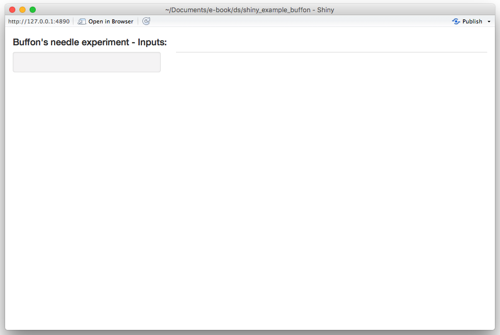
</center>

We will start by adding the required input widgets by modifying the `ui` function as follows:

```{r, eval = FALSE}
# Define UI for application
ui <- fluidPage(
  
  # Application title
  titlePanel(h4("Buffon\'s needle experiment - Inputs:")),
  
  sidebarLayout(
    sidebarPanel(
      numericInput("plane", "Plane width:", 10, 6, 100),
      numericInput("B", "Number of trials:", 100, 20, 10^6),
      numericInput("M", "Number of experiments:", 1, 1, 100),
      numericInput("seed", "Simulation seed", 1777, 1, 1000000),
      actionButton("cast", "Let's cast some needles!", icon = icon("thumbs-up"))
    ),
    
    mainPanel(
      tabsetPanel(
        # Add tabs here!
      )
    )
  )
)
```

By running this update you should now obtain:

<center>
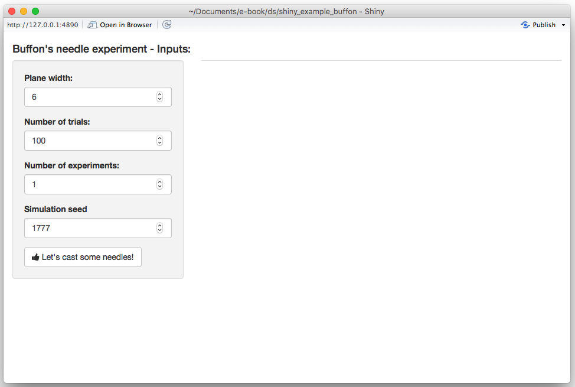
</center>

Next, we create two output tabs in which we will find the previously mentioned graphs. This can be done by again modifying the `ui`function as follows:

```{r, eval = FALSE}
# Define UI for application
ui <- fluidPage(
  
  # Application title
  titlePanel(h4("Buffon\'s needle experiment - Inputs:")),
  
  sidebarLayout(
    sidebarPanel(
      numericInput("plane", "Plane width:", 10, 6, 100),
      numericInput("B", "Number of trials:", 100, 20, 10^6),
      numericInput("M", "Number of experiments:", 1, 1, 100),
      numericInput("seed", "Simulation seed", 1777, 1, 1000000),
      actionButton("cast", "Let's cast some needles!", icon = icon("thumbs-up"))
    ),
    
    mainPanel(
      tabsetPanel(
        tabPanel("Experiment", plotOutput("exp")),
        tabPanel("Convergence", plotOutput("conv"))
      )
    )
  )
)
```

The app should now look like this:

<center>

</center>

At this point, we have completed the `ui` function and will modify the `server` in the next section.

### Step 3: Connecting frontend and backend

In this section, we will focus on the `server` function to produce the desired output. Let us start by "connecting" our output tabs defined in the `ui` function with the output in the server function. Since both outputs are graphs, we will use the function `renderPlot()` as follows:

```{r, eval = FALSE}
server <- function(input, output) {
  output$exp <- renderPlot({
    # Add graph 1 here!
  }, height = 620)
  
  output$conv <- renderPlot({
    # Add graph 2 here!
  }, height = 620)
}
```

If you re-run the app at this point our changes will have no visible effect. Next, we will focus on the first graph based on the functions `buffon_experiment()` and `plot.buffon_experiment()`. The first thing we will need is to (re-)run the `buffon_experiment()` when the user clicks on the "action" button. This can be done by adding the following lines to the `server` function:

```{r, eval = FALSE}
cast <- eventReactive(input$cast, {
    buffon_experiment(B = input$B, plane_width = input$plane, 
                      seed = input$seed)
  })
```

When this function is (re-)evaluated we want to update/create the first plot, which can be done by replacing the following part of the `server` function

```{r, eval = FALSE}
output$exp <- renderPlot({
    # Add graph 1 here!
}, height = 620)
```

with

```{r, eval = FALSE}
output$exp <- renderPlot({
    plot(cast())
}, height = 620)
```

Therefore, your `server` function should now be:

```{r, eval = FALSE}
server <- function(input, output) {
  
  # Fling some needles!
  cast <- eventReactive(input$cast, {
    buffon_experiment(B = input$B, plane_width = input$plane, 
                      seed = input$seed)
  })
  
  output$exp <- renderPlot({
    plot(cast())
  }, height = 620)
  
  output$conv <- renderPlot({
    # Add graph 2 here!
  }, height = 620)
}
```

and when reloading the app you should now see:

<center>
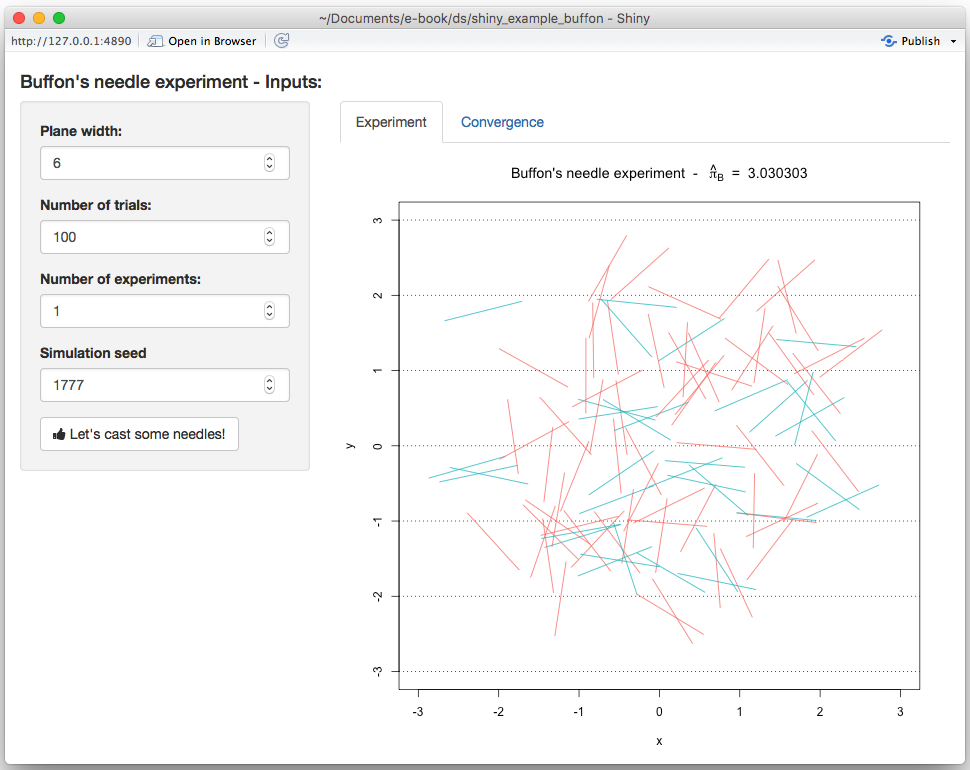
</center>

Similarly, we do the same thing for the second graph by adding the following lines to our `server` function:

```{r, eval = FALSE}
conv <- eventReactive(input$cast, {
    converge(B = input$B, plane_width = input$plane, 
             seed = input$seed, M = input$M)
})
```

and replacing 

```{r, eval = FALSE}
output$conv <- renderPlot({
    # Add graph 2 here!
}, height = 620)
```

with 

```{r, eval = FALSE}
output$conv <- renderPlot({
    conv()
}, height = 620)
```

After these changes, your `server` function should look like this:

```{r, eval = FALSE}
server <- function(input, output) {
  
  # Fling some needles!
  cast <- eventReactive(input$cast, {
    buffon_experiment(B = input$B, plane_width = input$plane, 
                      seed = input$seed)
  })
  
  conv <- eventReactive(input$cast, {
    converge(B = input$B, plane_width = input$plane, 
             seed = input$seed, M = input$M)
  })
  
  output$exp <- renderPlot({
    plot(cast())
  }, height = 620)
  
  output$conv <- renderPlot({
    conv()
  }, height = 620)
}
```

and when reloading the app you should now see on the second tab:

<center>

</center>

Our next step is now to update the seed every time the "action" button is pushed. To do so, we will first need to add an additional input to the `server` function called `session` which will allow us to **dynamically** update the input directly from the `server` function. Therefore, in order to randomly generate a new seed each time the user clicks on the "action" button, we can do the following:

```{r, eval = FALSE}
observeEvent(input$cast,{
    updateNumericInput(session, "seed", 
                       value = round(runif(1, 1, 10^4)))
})
```

Therefore, your final `server` function is now:

```{r, eval = FALSE}
server <- function(input, output, session) {
  
  observeEvent(input$cast,{
    updateNumericInput(session, "seed", 
                       value = round(runif(1, 1, 10^4)))
  })
  
  # Fling some needles!
  cast = eventReactive(input$cast, {
    buffon_experiment(B = input$B, plane_width = input$plane, 
                      seed = input$seed)
  })
  
  conv = eventReactive(input$cast, {
    converge(B = input$B, plane_width = input$plane, 
             seed = input$seed, M = input$M)
  })
  
  output$exp <- renderPlot({
    plot(cast())
  }, height = 620)
  
  output$conv <- renderPlot({
    conv()
  }, height = 620)
}
```

With this change, you will now observe that the seed is updated each time the "action" button is clicked. The final version of the app we have just created can be found [here](http://shiny.science.psu.edu/szg279/buffon/).

<script type="text/javascript" src="http://ajax.googleapis.com/ajax/libs/jquery/1.3.2/jquery.min.js"></script>
<script type="text/javascript">
    $("#hideclass1").hide();
    $("#hideclass2").hide();
    $("#hidebutton1").click(function(){
      $("#hideclass1").toggle();
    });
    $("#hidebutton2").click(function(){
      $("#hideclass2").toggle();
    });
</script>


<!--chapter:end:06-shiny.Rmd-->

# R Packages

In this chapter we introduce one of the most useful tools for R programming as well as for statistical programming in general. Indeed, one of the main goals for statistical programming is to then be able to share all the code and functions that have been implemented in order to respond to a specific task. The latter may often be quite *messy* to do given that different files and functions can be present in various directories or repositories and, for example, some codes may use functions from other codes but do not load the same libraries, thereby producing execution errors.

In order to avoid the above complications (and to program in a healthy and organized manner), R allows you to create *packages* that are software platforms that collect functions as well as other files which, among others, describe these functions and provide users with documentation that allow them to understand and efficiently use these functions. Moreover, when sharing a package (or making it available within a repository) all the user needs to do is to install and load the package within an R session which then makes available the entire environment needed for all the functions included in the package to work. In a nutshell, whenever creating functions to answer a specific research interest or professional task, it is always good to do so by first creating a package within which these functions can be stored and documented.

In this chapter we will describe and explain the steps necessary to create an R package using RStudio. There are other ways and other procedures to produce an R package but in this chapter we will describe one possible way which is consistent with the approach to statistical programming that is presented in this book. As in the previous chapters, we will make use of an example to guide the reader through the different aspects of package building and, for this purpose, let us assume we want to build a package that allows a user to perform Monte-Carlo integration for any user-specificed function as well as produce plots that represent these functions as well as the integrated area. In this case, we have an extremely simple setting where, based on code used in the previous chapters, we only have the following two functions to be included in the package:

```{r}
mc_int = function(x_range, fun, B, seed = 1291){
  # A few checks
  # Check x_range
  if (length(x_range) != 2 || x_range[1] >= x_range[2]){
    stop("x_range is incorrectly specified")
  }

  # Check fun
  if (class(fun) != "character"){
    stop("fun is incorrectly specified and should be a character")
  }

  x = mean(x_range)
  test_fun = try(eval(parse(text = fun)), silent = TRUE)
  if (class(test_fun) == "try-error"){
    stop("fun cannot be evaluated")
  }

  # Check B
  if (B < 1){
    error("B is incorrectly specified")
  }

  # Set seed
  set.seed(seed)

  # Compute the length of the interval, i.e. (b-a)
  interval_length = diff(x_range)

  # Let's draw some uniforms to get Ui and Xi
  Ui = runif(B)
  Xi = x_range[1] + Ui*interval_length

  # Compute \hat{I}
  x = Xi
  I_hat = interval_length*mean(eval(parse(text = fun)))

  # Compute \hat{I}_2
  I2_hat = interval_length*mean((eval(parse(text = fun)))^2)
  var_I_hat = (interval_length*I2_hat - I_hat^2)/B

  # Output list
  out = list(I = I_hat, var = var_I_hat,
             fun = fun, x_range = x_range, B = B)
  class(out) = "MCI"
  out
}

plot.MCI = function(x, ...){
  obj = x
  x_range = obj$x_range
  fun = obj$fun

  Delta = diff(x_range)
  x_range_graph = c(x_range[2] - 1.15*Delta, x_range[1] + 1.15*Delta)
  x = seq(from = x_range_graph[1], to = x_range_graph[2], length.out = 10^3)
  f_x = eval(parse(text = fun))
  plot(NA, xlim = range(x), ylim = range(f_x), xlab = "x", ylab = "f(x)")
  grid()
  title(paste("Estimated integral: ", round(obj$I,4),
              " (", round(sqrt(obj$var),4),")", sep = ""))
  lines(x, f_x)
  x = seq(from = x_range[1], to = x_range[2], length.out = 10^3)
  f_x = eval(parse(text = fun))
  cols = hcl(h = seq(15, 375, length = 3), l = 65, c = 100, alpha = 0.4)[1:3]
  polygon(c(x, rev(x)), c(rep(0, length(x)), rev(f_x)),
          border = NA, col = cols[1])
  abline(v = x_range[1], lty = 2)
  abline(v = x_range[2], lty = 2)
}
```

Hence, the package will contain: 

- the `mc_int()` function: that computes an approximation of the integral of the function `fun` with respect to `x` within the range `x_range` via Monte-Carlo integration using uniform sampling;
- the `plot.MCI()` function: a class function that will plot the object that is created as an output of the `mc_int()` function. 

An example of use of these functions and their output is the following:

```{r}
obj = mc_int(x_range = c(0,1), fun = "x^2*sin(x^2/pi)", B = 10^3)
plot(obj)
```

Now let us suppose that we want to make these functions available to the general user who may be looking for tools that allow them to perform Monte-Carlo intergration. Although we only have two functions, it would be appropriate to provide a single platform containing these functions along with documentation that describes the contents and use of these functions. Therefore, in the following sections we will describe the process to develop an R package for these functions which is consquently valid for any collection of functions needed to perform a specific task.

## Basic steps

As mentioned earlier, the process to develop an R package that is described in this chapter is not strict or unique since there are many different ways of structuring and building them. However, in this book we will describe one way of building a package which is consistent with the approach to statistical programming that has been described thus far. Keeping this in mind, below the reader can find the basic steps to build an R package. 

### Step 1: Create an "empty" R package

The first step to create an R package using RStudio is to build the *skeleton* of the package which contains the basic folders and files that are needed. To do so, within RStudio you should select to create a "New Project..." from the File menu within RStudio as shown below. 

<center>
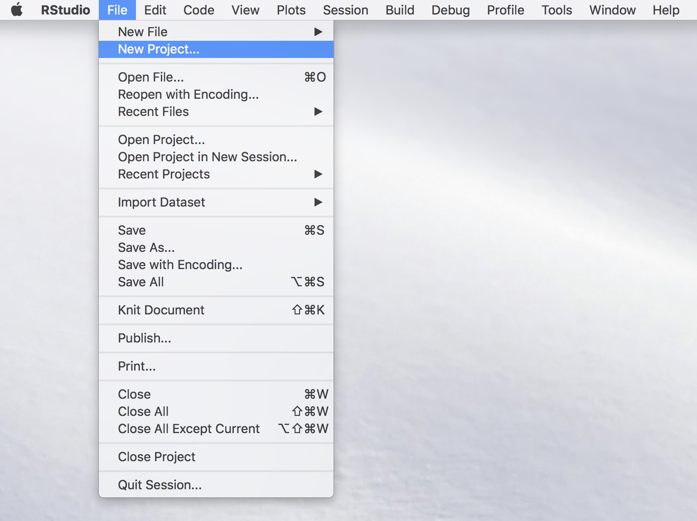
</center>

Once this is done you will see a new window with different options (see image below) among which you select "New Directory" (unless you wish to create the package within an existing directory which is usually not convenient for purpose of organization).

<center>

</center>

Again, another window will appear in which RStudio asks you for the type of project you wish to create and, quite intuitively, you should select the "R Package" option as shown below.

<center>
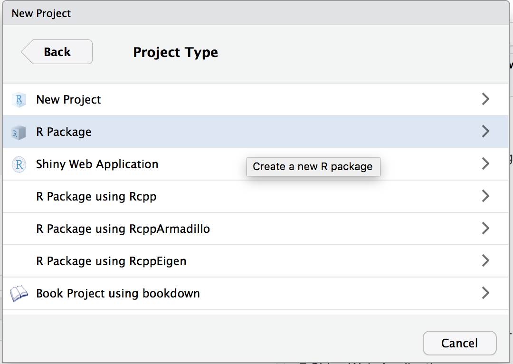
</center>

By doing so you prompt a successive window in which it is possible to name our package which, in the example below, will be `demo`. In the context of this chapter we will not consider the other options that are made available to the user (for more details you can check [this link](http://r-pkgs.had.co.nz/)).

<center>

</center>

Once the package has been named, you can select "Create Project" and another window will be prompted in which the basic files and folders needed for a package will be visualized within an overall repository with the same name as the package (i.e. "demo") as shown below.

<center>

</center>

Within the logic of this chapter which provides one possible procedure (out of various) to build an R package, we will proceed to removing the following files from this folder:

- NAMESPACE
- man/hello.Rd
- R/hello.R

These files are default functions and documentation that are created to provide a basis for the user who can then modify them using their own descriptions and functions. However, for the procedure described in this chapter their presence is redundant (as seen further on) and consequently we invite the reader to remove them if they decide to follow the steps described in this chapter. 

### Step 2: Edit description file

This first step hence creates the skeleton of the package and, in the following steps, we can focus on giving body to this skeleton, starting from the file which contains a summary description of the structure and contents of the package which is to be found in the "DESCRIPTION" file. Once this is opened the user will notice different parts to this file in which various information on the package is contained such as the package name, author information, license and imports. Although there are other pieces of information (see [this link](http://r-pkgs.had.co.nz/description.html)), we will quickly discuss the latter three in the following paragraphs. 

#### Author Roles {-}

One of the lines of information in the description file corresponds to the authors of the package. This therefore corresponds to the list of persons who have actively contributed to the development of code and functions that are included in the package. When there is more than author, the line corresponding to the author can be replaced by a format like the following:

```{r, eval = FALSE}
Authors@R: c(
    person("Justin", "Lee", email = "justinlee@psu.edu", role = c("aut","cre")),
    person("Stephane", "Guerrier", role = "aut"),
    person("Roberto", "Molinari", role = "aut"),
    person("Matthew", "Beckman", role = "aut")
    )
```

This information is important also because it will impact how it is displayed later in the rendered package website (see further on). As you can notice it possible to also specify the role that the author has in relation to the package using the option `role =`, followed by codes for the type of role. In the above examples we can see two types of role that correspond to `aut` which indicates an *author* of the package while `cre` stands for *creator* who is the person in charge of maintaining the package and receiving information as well as bug reports or suggestions. There are other two possible roles available which are `ctb` and `cph` that correspond to *contributor* and *copyright holder* respectively, where the contributor is a person who has provided some minor contributions to the package while the copyright holder is the person or company who holds the copyright of the package.

#### License {-}

The package license determines to what extent and under what conditions the package (and its contents) can be shared and accessed by users. The most common license is the GNU General Public License which is a widely used free software license that guarantees end-users the possibility to run, study, share and modify the software. A complete list of all the possible licenses can be found at this [link](https://cran.r-project.org/web/licenses/) and you are free to choose the license that best fits your requirements. 

#### Imports {-}

It is often the case that your code and functions will depend on functions that are made available from other packages in R. In order to make sure that these packages are available to the user when they install your package, it is important to specify on which external packages yours relies on. In this sense, the `Imports` line in the DESCRIPTION file allows you to do just this so it is important to remember to check whether external packages are correctly specified in this section of the file. 

Our example on Monte-Carlo integration only depends on the base functions in R and therefore there is no need to specify external packages for this case. Therefore, our "demo" package DESCRIPTION file ends up looking as follows:

<center>

</center>

### Step 3: Move your R scripts into the R folder

Having completed the description of the package we can now focus on adding the truly essential part of the package: the functions that deliver the outputs required by the user. In order for the functions to be considered as part of the package, the scripts containing these functions need to be moved into the R folder that is created as part of the package skeleton as seen earlier (therefore replacing the "hello.R" script that we chose to delete).

The organization of the code that collects the functions is subjective and can be included all in one single R script or in various scripts. It is usually suggested to group these functions into separate scripts according to their relative themes or specific tasks they are created for, especially when there is a considerable number of functions in the package. This approach allows to more easily find and fix any errors that are present in the functions as opposed to going through thousands of lines of code to find the function you're interested in. 

In our example we only have two functions so there is no need to separate them and, consequently, we include them in a single R script that we call "mc_integration.R" which is included in the R folder for our demo package.

<center>

</center>

As you may notice, there is another file called "run_shiny.R" which, as we will see later, contains the code to create a Shiny app that is part of the package.

### Step 4: Documentation

The next essential component of a package is its documentation which enables users to know how to use it. Indeed, when users access the `demo` package, they should essentially know how to use its functions by gaining access to help files through the use of commands like `?mc_int` for example. A possible (and efficient) way of creating package documentation is by using a specific syntax before each function in your R scripts which will then be used to automatically generate the necessary `.Rd` files by using the commands `devtools::document()` or `roxygen2::roxygenize`.

We will use the `mc_int()` function from our demo package as an example to show the syntax that can be used before each function which is intended for the user:

```{r, eval = FALSE}
#' @title Simple Monte-Carlo integration
#'
#' @description Compute an approximation of the integral of the function f(x)
#' with respect to dx in the range [a, b] by Monte-Carlo integration using
#' uniform sampling.
#' @param x_range A \code{vector} of dimension 2 used to denote the integration
#' region of interest, i.e. [a, b].
#' @param fun A \code{string} containing the function to be integrated. It
#' is assumed that \code{x} is used as the variable of interest.
#' @param B A \code{numeric} (integer) used to denote the number of simulations.
#' @param seed A \code{numeric} used to control the seed of the random number
#' generator used by this function.
#' @return A \code{list} containing the following attributes:
#' \describe{
#'      \item{I}{Estimated value of the integral}
#'      \item{var}{Estimated variance of the estimator}
#' }
#' @author Stephane Guerrier
#' @importFrom stats runif
#' @export
#' @examples
#' mc_int(x_range = c(0,1), fun = "x^2", B = 10^5)
#' mc_int(x_range = c(0,1), fun = "x^2*sin(x^2/pi)", B = 10^5)
mc_int = function(x_range, fun, B, seed = 1291){
  # A few checks
  # Check x_range
  if (length(x_range) != 2 || x_range[1] >= x_range[2]){
    stop("x_range is incorrectly specified")
  }

  # Check fun
  if (class(fun) != "character"){
    stop("fun is incorrectly specified and should be a character")
  }

  x = mean(x_range)
  test_fun = try(eval(parse(text = fun)), silent = TRUE)
  if (class(test_fun) == "try-error"){
    stop("fun cannot be evaluated")
  }

  # Check B
  if (B < 1){
    error("B is incorrectly specified")
  }

  # Set seed
  set.seed(seed)

  # Compute the length of the interval, i.e. (b-a)
  interval_length = diff(x_range)

  # Let's draw some uniforms to get Ui and Xi
  Ui = runif(B)
  Xi = x_range[1] + Ui*interval_length

  # Compute \hat{I}
  x = Xi
  I_hat = interval_length*mean(eval(parse(text = fun)))

  # Compute \hat{I}_2
  I2_hat = interval_length*mean((eval(parse(text = fun)))^2)
  var_I_hat = (interval_length*I2_hat - I_hat^2)/B

  # Output list
  out = list(I = I_hat, var = var_I_hat,
             fun = fun, x_range = x_range, B = B)
  class(out) = "MCI"
  out
}
```

As can be seen, all the syntax which contributes to the documentation of the function is preceded by the syntax `#' ` and is immediately followed (with no spacing) by the code of the function itself. Focussing on the contents of this documentation, the `@title` and `@description` entries will constitute respectively the title describing the function in a succint manner and the text providing a more detailed description of what the function does. We then find the `@param` syntax that is repeated for each parameter considered by the function in which a brief description of what the parameter is and what type of input is needed for it from the user. Finally we find the `@return` section where there is a description of the outputs of the function and eventual indications as to how these should be interpreted. Additional information can be provided such as the author(s) who specifically contributed to creating the function (`@author`), the packages or functions needed for the function to be employed (`@importFrom`) and examples that can show the user how to use this function in practice (`@examples`).

A final note should be given to the `@export` syntax which MUST absolutely be specified if you want the function you're documenting to be made available to the user. Indeed, there may be functions that are simply created to be used within other functions that are made available to the user and these therefore don't need to have this option specified. However, if the function needs to be made available to the user, then it is essential that this option is specified within the function documentation. Additional information on package documentation can be found [here](http://r-pkgs.had.co.nz/man.html#man-functions). 

Once all the necessary functions have been documented, it is possible to compile this documentation by using the commands `devtools::document()` or `roxygen2::roxygenize` (as mentioned earlier) or by directly building the package. Having done so, an `.Rd` file for each function will appear in the "man" folder (from which we earlier deleted the `hello.Rd` file). Below is an example of the `.Rd` files created for the functions in our example (with an added documentation for a function called `MC_gui` which is related to the code created for the Shiny app).

<center>

</center>

It is possible to check whether the documentation has been correctly compiled by using the command `?yourfunction`. Indeed, if we compiled our example documentation properly, this is what we get by using `?mc_int`:

<center>

</center>


### Step 5: Test your package

The previous steps are all that is necessary to complete the main components that are essential for an R package. Once these have correctly been completed, it is possible to build your package, meaning that you can combine all functions and documentation into a single software platform which can then be made available to the user. This can be done directly through the RStudio IDE where the "Environment, History, ..." pane contains a label named "Build". When selecting this label different options will appear just beneath it, including one called "Build & Reload" which, if selected, will allow you to build the package and load it in your work session. If everything has worked smoothly, then the mentioned pane should report some logs that end with `* DONE (nameofpackage)` (see example below).

<center>

</center>

It is at this point that you can start testing whether the documentation and the functions work as they are supposed to. For this reason, it is always appropriate to create a test script to be placed in the main directory of the package folder that can be run to check if the functions behave the same and that no errors are output after some major changes are made to the package. 

<center>

</center>

In our example, given that we can check both functions with one command, our test file can be as follows:

<center>

</center>

After making possible changes to the functions, we can run the test script and always expect to obtain the following output:

<center>

</center>

If this output is not the same or does not appear at all, then we need to go back to the functions to find where an error was made.

### Step 6: Add a "README.Rmd" file

It is always helpful to create additional material to ensure that your package can be understood and used in the widest manner possible. For this purpose it is possible to create an additional "README.Rmd" file which, as an RMarkdown document, can be used to add descriptions, examples and videos that showcase the usage of your package through a web-page. An example of how to structure this file is given below:

```{eval=FALSE}
---
output: github_document
---

# Add a title
  
Explain what your package is doing here
```

Having saved this file within the main folder of your package, you can compile this document using the `pkgdown` package (this can be installed by executing the following command in your console: `devtools::install_github("hadley/pkgdown")`). When the latter package is installed and loaded, all you need to do is execute the command `pkgdown::build_site()` to obtain the following web-page:

<center>

</center>

In order to publish this web-page, it is possible to do so by creating a GitHub repository dedicated to your package which constitutes the final basic step.

### Step 7: Create a github repo - possibly with the same name as package

The basic idea of creating a package is to share a set of functions with collaborators and users. As we saw in Chapter 2, a convenient tool to share code and projects is GitHub and, in this case as well, you can create a repository dedicated to your package. In this case, it would be convenient to name the repository with the same name of your package so that users can more easily find and access the package that you make available through GitHub.

Once you have created a repository and loaded your package on GitHub, for our example you should obtain something similar to the following case:

<center>

</center>

As you can see, the GitHub repository takes the content of the .Rmd file and presents its content just below the list of folders and files that compose the package. However, it is possible to also create a separate and dedicated web-page (using the contents of the .Rmd file) by using GitHub Pages. To do so, select the "Settings" label within your GitHub repository and scroll down to the GitHub Pages section where you can select the "master branch/docs folder" option under the "Source" area (as can be seen below).

<center>

</center>

Once this is done, you can eventually personalize the web-page a little more by selecting a particular theme for it (more details further on). Having done so, the page is already made available through the following address: `https://<your github id>.github.io/<your repo name>/`. For our example, this is available at [https://smac-group.github.io/demo/](https://smac-group.github.io/demo/). 

## Advanced

Up to now we have described the basic steps that are necessary to build, share and describe an R package. However, it is always possible to add features to the package itself or to the documentation used to explain and promote it. In the following paragraphs we just describe a few of them to allow the reader to get a further idea of the extent to which one can develop packages.

### Adding a shiny app

A feature which can be useful to make your package accessible to the general user (as well as to promote it) can be the possibility of including a Shiny app as an interface to your package. To do so, you will have to include a new folder called "inst" within your package main folder and in which an additional folder is then included with a name of your choice (let us say "MC_int" for the example we have used throughout this chapter). Within the latter you can then include the R script(s) to run the Shiny app (say "app.R") which makes use of the functions made available within the package. An example of the content of such a script is the following:

```{r, eval=FALSE}
# Define UI for application that draws a plot of the approximate integral
ui <- fluidPage(

   # Application title
   titlePanel("Monte-Carlo Integration"),

   # Sidebar with text input for the function to integrate, numeric inputs for the range of integration and number of Monte-Carlo replications
   sidebarLayout(
      sidebarPanel(
        textInput("fun", "Function to integrate:","sin(10*x)*exp(cos(x))"),
        numericInput("low", "Integral lower bound:", 0, min = -100, max = 100),
        numericInput("up", "Integral upper bound:", 1, min = -100, max = 100),
        numericInput("B", "Number of Monte-Carlo replications:", 10^5,
                     min = 100, max = 10^9),
        actionButton("button", "Compute Integral")
      ),

      # Show a plot of the integrated area under the function
      mainPanel(
         plotOutput("distPlot")
      )
   )
)

# Define server logic required to draw the integration plot
server <- function(input, output) {

  a <- eventReactive(input$button, {
    mc_int(x_range = c(input$low, input$up),
          fun = input$fun, B = input$B)
  })

  output$distPlot <- renderPlot({
      plot(a())
  })

}

# Run the application
shinyApp(ui = ui, server = server)
```

Once this is done, an additional R script needs to included within the "R" folder. This R script will contain a function that allows the user to generate a Shiny app (based on the contents of "app.R" for example) and consequently to use the app interface to make use of the package functions. Following from our example, suppose that the latter script, which we will call "run_shiny.r" for this example, contains the following function:

```{r, eval = FALSE}
#' @export
MC_gui = function(){
  appDir = system.file("MC_int", package = "demo")
  shiny::runApp(appDir, display.mode = "normal")
}
```

Given these steps, our main package folder should look like this:

<center>

</center>

After having created the above mentioned folders and correctly written and placed the functions within these folders, all you need to do to make this feature available to the user is to execute the command `devtools::document()` and successively build the package again. Having done so, the only command that the user needs to use to access the Shiny app is to run the function `MC_gui()` in the console.

### Custom website

Below is a video about customizing the website.

```{r, echo = FALSE}
knitr::include_url("https://www.youtube.com/embed/HO54ZoGtzzQ")
```


EXAMPLE: smac-group/demo


<!--chapter:end:07-package.Rmd-->

# High performance computing

## Rcpp: using C++ within R
While R is a relatively new language essentially tailored for statisticians and data
analysts, C++ is a well-established general-purpose programming language.
This chapter does not aim at providing an overview of programming in C++ but rather how it can be used
to address specific problems related to R.
The point of view taken here is that of an R programmer with no notions of C++
or similar languages. Therefore we will not go into details concerning fundamental notions of C++ but rather provide
some necessary concepts in order to start programming with this language and use it within R.

Having said this, R is an [interpreted language](https://en.wikipedia.org/wiki/Interpreted_language)
which makes it particularly inefficient when performing tasks that require a repetition of operations such as `for` and `while` loops,
or recursive calling of functions. On the other hand, C++ is a 
[compiled language](https://en.wikipedia.org/wiki/Compiled_language) which means that,
before being able to use your code, it is translated (compiled) to lower-level
machine language which allows to considerably accelerate the code running time.

Note that C++ is just one of many solutions that can make the execution of R code more efficient such as [vectorization](http://www.dartistics.com/fast-r-code.html) and
[memory management](http://adv-r.had.co.nz/memory.html). [Profiling](http://adv-r.had.co.nz/Profiling.html)
also helps to identify which parts of the code are the slowest to execute and therefore provides useful information
to understand where to improve code efficiency.

Another note that is of interest is that C++ compiles *ahead of time* (before using the code), but there are other
approaches that compile *just in time* (at runtime) such as the [Julia language](https://julialang.org/).

### Installation
Working with C++ in R does not come "out of the box", but it is nevertheless a well handled procedure due to the latest contributions to R. In order to make use of these tools, you basically need two elements: a C++ compiler and a
program that permits to connect R and C++. For the latter, you need to install 
the `Rcpp` package:

```{r,eval=F}
# For CRAN official release
install.packages("Rcpp")

# For development version
devtools::install_github("RcppCore/Rcpp")
```

For the former, it depends on your OS:   
1. On Windows, install `RTools`.   
2. On Mac, install `Xcode` from the App Store.   
3. On Linux, you need to install `r-bas-dev` (or similar) from
your package manager.

Verify that your installation works by running:
```{r, echo=TRUE, message=FALSE, warning=FALSE, include=TRUE, eval=FALSE}
require(Rcpp)
cppFunction("double sumC(double x, double y){
  double s;
  s = x + y;
  return s;
} ")
sumC(3.5, 6.5)
```

```{block2, type="rmdcaution"}
In C++, a line of code must end with a semicolon `;` ottherwise the compiler will return an error.
```

The function `sumC(x,y)` takes two doubles (numeric) values (`x` and `y`)
and returns a double (the sum of the two values). Can you predict what happens if you run the following lines? Can you explain why?

```{r, eval = FALSE}
sumC(3L, 6L)
sumC(TRUE, FALSE)
sumC(c(3,4), c(5,6))
```

### A first program
The above `cppFunction()` creates an *inline* C++ function (within your R code).
However, it is a better practice to create a separate file dedicated to C++ functions.
It is possible then to compile your C++ functions and call them within R.

In RStudio, you can create a C++ file by clicking on *File* > *New File* > *C++ File*.
RStudio provides you with an example. At the top of C++ file, you should see:

```{Rcpp, eval = FALSE}
#include <Rcpp.h>
using namespace Rcpp;
```

The first line tells your program that you can access functionalities from the `Rcpp` library.
The second line tells your program that you can access those functionalities without specifying/loading 
the `Rcpp` library. For example, suppose there is function `mean()` in `Rcpp`.
With the first line, you could use this function only by typing `Rcpp::mean()`.
Adding the second line allows you to directly write `mean()` in your program.
This is somehow equivalent to using `library(Rcpp)` in your R code.

Once the C++ code is written, it should be saved with the appropriate extension which is either
`*.cc` or `*.cpp`. Now you can compile your first C++ program and for this type the following command in your R file:
```{r, eval=FALSE}
sourceCpp("file_name.cpp")
```
To test this, try to write the `sumC()` function within a separate C++ file and compile it in R.

By default, C++ functions are not accessible within your R program.
One key element is to use the attribute `[[Rcpp::export]]` in comment
**just before the function definition**. For example, the separate C++ file could look something like this:

```{Rcpp, eval=FALSE}
#include <Rcpp.h>
using namespace Rcpp;

// [[Rcpp::export]]
double sumC(
    double x,
    double y
) {
  double s;
  s = x + y;
  return s;
}
```

```{block2, type="rmdnote"}
In C++, the symbol `//` is used for single line comment. The symbol `/*` starts a comment
which can possibly cover multiple lines and `*/` ends the comment.
```


### Data structures
One difference you can immediately notice while working with C++ is 
that you need to tell the program what type of data structure you
intend to use before using it. This makes the writing (and execution) of the code "safer" since 
the programmer pay more attention to the implementation details 
thereby preventing the code from being used in a way for which it was not intended. 
On the other hand, a drawback of this characteristic is that the programmer will have to spend (at least at the beginning)
more time conceiving the code.

Here is a list of primitive data types with their keywords:   
- `int` (4) : integer,   
- `float` (4) : single precision floating number (numeric),   
- `double` (8) : double precision floating number (numeric),   
- `bool` : logical (true or false),   
- `char` : character,   
- `void` : without any value.  

The numbers in parenthesis represents typical memory (in bytes) required to store the variable. 
Single and double precision floating numbers represent how the computer
stores real numbers in the memory. `float` requires less memory than `double`
but is less precise. As a general rule, we only use type `double` since this is the default type in R: 

> R has no single precision data type. All real numbers are stored in double precision format.
>
> `help(double)` in R

These data types can be modified by using one (or more) of the following keywords:   
- `long` : allocate more space in memory,   
- `short` : allocate less space in memory,   
- `unsigned` : numbers take only positive value.  

For more complex data structures such as vectors and matrices, the story is slightly more complicated.
Luckily for R programmers, `Rcpp` provides many predefined structures that make
the transition to C++ easier. Here is a non-exhaustive list:

Table : Common data structure in R with Rcpp equivalent.   

Rcpp | R | Role 
--- | --- | ---   
`NumericVector` | `c(...)` or `vector(mode = "double", ...)` | A vector of double   
`IntegerVector` | `c(...)` or `vector(mode = "integer", ...)` | A vector of integer   
`LogicalVector` | `c(...)` or `vector(mode = "bool", ...)` | A vector of boolean   
`NumericMatrix` | `matrix()` | A matrix of double   
`IntegerMatrix` | `matrix()` | A matrix of integer   
`LogicalMatrix` | `matrix()` | A matrix of boolean   
`List`| `list` | A list   
`DataFrame` | `data.frame()` | A data frame   

#### Vectors

Before using a vector in C++, you need to create one. 
For example,
```{Rcpp, eval=FALSE}
NumericVector v(10);
```
creates an empty vector of double of length 10.

To access elements of a vector, the syntax is the same as in R with one notable exception:
**accessor starts at 0**! So if you want to access the first element of a vector `v`,
you should write `v[0]`, the ith element, `v[i-1]`. Note that you can equivalently
write `v(0)` and `v(i-1)`.

The length of the vector `v` can be obtained as follows
```{Rcpp, eval=FALSE}
int n = v.length();
```
Here the length of the vector is saved into an integer `n`.

Note that `length()` is a *method* for the *class* `NumericVector`
and uses the syntax ''dot-function''. Theses concepts are beyond
the scope of this introduction and the only aspect to underline is that the above
notation gives the same result as if you wrote `length(v)` in R.

#### Matrices

Creating a matrix is similar to creating a vector. The command
```{Rcpp, eval=FALSE}
NumericMatrix m(3,4);
```
creates an empty matrix with 3 rows and 4 columns.
This is equivalent to writing the following in R
```{r, eval=FALSE}
m <- matrix(nr=3,nc=4)
```

The syntax for accessing matrix elements is slightly different.
For example, accessing a column or a row can be done as follows
```{Rcpp, eval=FALSE}
// Copy first column into a vector
NumericVector v = m( _ , 0);

// Copy first row into a vector
NumericVector v = m(0, _);

// Access the ith row, jth column
double x = m(i-1, j-1); // i and j are positive integers already defined
```

The number of columns/rows of a matrix can be retrieved using
```{Rcpp, eval=FALSE}
// number of rows
int nr = m.nrow();

// number of columns
int nc = m.ncol();
```

#### List
List creation can be accomplished as follows:
```{Rcpp, eval=FALSE}
// Create a list with elements e1 and e2
List L = List::create(e1, e2);

// Create a list with elements e1 and e2 with names
List L = List::create(Named("name1") e1, Named("name2") e2);
```

The elements `e1` and `e2` can be of any type (e.g. vector, matrix, etc.)

### Control structures

Logical operators in R and C++ are similar.
Here is a list where `x` and `y` are scalar (not vectors!).

Table: Common logical operators for C++.

Operator | Description      
--- | ---   
`x > y` | `x` greater than `y`  
`x >= y` | `x` greater than or equal to `y`  
`x < y` | `x` less than `y`   
`x <= y` | `x` less than or equal to `y`   
`x == y` | `x` equals to `y`   
`x != y` | `x` not equal to `y`   
`x && y` | `x` and `y`   
`x || y` | `x` or `y`  
`!x` | not `x`   


#### if/else/elseif statements
R and C++ share the same syntax also for `if`/`else`/`elseif` statements
with the exception that `else if` has a space in C++ syntax. For example,
the following expression is valid within both R and C++:
```{r,eval=FALSE}
if (condition){
  plan A;
}else{
  plan B;
}
```

#### loops
Loops are much faster in C++ than in R and the syntax is slightly different. 
For example, the following R `for` loop
```{r, eval=FALSE}
for(i in 1:10){
  print("The value is: ", i)
}
```

can be written in C++ with the following code
```{Rcpp, eval=FALSE}
for(int i(1); i<=10; i++){
  Rcpp::Rcout << "The value is: " << i << std::endl;
}
```
Three elements need to be defined:  
1. The initialization statement: an iterator (`i` here), generally of type integer, needs to be initialized 
(here `i` is initialized to 1).   
2. The test expression: the expression is evaluated and should return a boolean. If `false` the loop stops and
if `true`, the body of the for loop is evaluated.   
3. The update statement: it defines the increment of the iterator, usually set to `i++`.

Note that we can also allow the iterators to decrease via the decrement operator `i--`.

C++ also offers variants of assignment operators.

Table: Assignment operator in C++. `x` and `y` are already defined.   

| Operator     | Equivalence  | Description                                                     |
| ------------ | ------------ | --------------------------------------------------------------- |   
| `x = y;`     |              | Assign the value of `y` to `x`                                |
| `x += y;`    | `x = x + y;` | Take the value of `x` and add `y`, then assign to `x`          |
| `x -= y;`    | `x = x - y;` | Take the value of `x` and substract `y`, then assign to `x`    |      
| `x *= y;`    | `x = x * y;` | Take the value of `x` and multiply by `y`, then assign to `x` |           
| `x /= y;`    | `x = x / y;` | Take the value of `x` and divide by `y`, then assign to `x`    |     

Therefore, `i++` is equivalent to `i+=1`. If one therefore wanted to increment by 2 at each loop, one would use `i+=2`.

The C++ `while` loop has the same syntax as R. The following expression
```{Rcpp,eval=FALSE}
while( condition ) {
  body;
}
```
is the same in both languages.

Note that C++ is also equipped with a `do ... while` loop.
This may be useful, for example, in the situation where
you need a first run of the body prior to checking the condition.
```{Rcpp, eval=FALSE}
do{
  body;
}
while(condition);
```

### Functions
Creating functions in C++ is fundamentally not much different from writing them in R.
Neverthelss, C++ requires an additional layer of precision.
A function can follow this pattern:
```{Rcpp, eval=FALSE}
type function_name(type arg1, ..., type argn){
  body of the function;
  
  return obj;
}
```
First, the type of return of the function should be specified.
The `obj` that is returned should be of the same type as the one specified
at the start of the function declaration and each argument should have a type.
Otherwise, as in R, the body of the function contains statements that define what the function does.

As mentioned earlier, by default a C++ function cannot be used within R and the attribute `[[Rcpp::export]]` in comment
**just before the function definition** needs to be specified. For example
```{Rcpp, eval=FALSE}
// [[Rcpp::export]]
type function_name(type arg1, ..., type argn){
  body of the function;
  
  return obj;
}
```
will make `function_name` available within R.

### Comparing with R
Making an effort of writing C++ code instead of R code should deliver advantages.
One way to measure these advantages is by comparing the computational efficiency
of a C++ function with the equivalent R function.
This can be achieved, for example, using the `microbenchmark` package.

For example, suppose you create a function that computes the factorial number of
a positive integer input.
In R, you can write
```{r}
my_factorialR <- function(n){
  factorial <- 1
  for(i in 2:n){
    factorial <- factorial * i
  }
  return(factorial)
}
```

An equivalent C++ function could be
```{Rcpp, eval=FALSE}
int my_factorialC(int n){
  int factorial = 1;
  for(int i(2); i<=n; ++i){
    factorial *= i;
  }
  return factorial;
}
```

```{r, cache=FALSE, echo=FALSE,include=FALSE,eval=TRUE}
Rcpp::cppFunction(
  "int my_factorialC(int n){
  int factorial = 1;
  for(int i(2); i<=n; ++i){
    factorial *= i;
  }
  return factorial;
}")
microbenchmark::microbenchmark(my_factorialR(500), my_factorialC(500))
```

```{r, cache = FALSE, eval=TRUE}
require(microbenchmark)
microbenchmark(my_factorialR(500), my_factorialC(500))
```

It is clear that the computational performance is considerably different.

### Example: Buffon's needle (con't)
Let's reconsider Buffon's needle problem.
We propose to recode the R functions `cast_needle()` and
`buffon_experiment()` into C++.

For this purpose, first create a C++ file with header
```{Rcpp, eval=FALSE}
#include <Rcpp.h>
using namespace Rcpp;
```

The `cast_needle()` function was defined as
```{r, eval=FALSE}
cast_needle <- function(plane_width = 20){
  available_range <- plane_width/2 - 1 # where 1 is the length of the needle (unit)
  x_start <- runif(2, -available_range, available_range)
  angle <- runif(1, 0, 2*pi)
  x_end <- c(cos(angle), sin(angle)) + x_start # where the angles are multiplied by the needle length which is 1 in this example
  cross <- floor(x_start[2]) != floor(x_end[2])
  out <- list(start = x_start, end = x_end, cross = cross)
  out
}
```

A possible C++ implementation is 
```{Rcpp, eval=FALSE}
// [[Rcpp::export]]
List cast_needle(
  unsigned int plane_width = 20
){
  // Variable declaration
  int available_range;
  double angle,my_pi;
  NumericVector x_start(2), x_end(2), tmp_angle(1);
  bool cross;
  
  // Computation
  my_pi = atan(1) * 4; // defines pi (for simplicity)
  available_range = plane_width / 2 - 1;
  x_start = runif(2, -available_range, available_range);
  tmp_angle = runif(1, 0, 2 * my_pi);
  angle = tmp_angle[0];
  x_end[0] = cos(angle) + x_start[0];
  x_end[1] = sin(angle) + x_start[1];
  cross = floor(x_start[2]) != floor(x_end[2]);
  
  return List::create(
    Named("start") = x_start,
    Named("end") = x_end,
    Named("cross") = cross
  );
}
```

Based on the above function, we can make a few remarks:   

- For better readibility, it is good practice to separate variable declaration and computation.  
- The value of $\pi$ is not accessible by default so in this case we simply approximate it (but better solutions exist).   
- Basic functions such as `atan()`, `runif()`, `floor()`, `cos()`, `sin()` are made available
by `Rcpp` (check for **Rcpp sugar**).   
- To avoid an error we have first to save the result of `runif()` as `NumericVector` (its default result type).   


The `buffon_needle()` function was declared in R as follows:
```{r,eval=FALSE}
buffon_experiment <- function(B = 2084, plane_width = 10, seed = NULL){
  
  if (!is.null(seed)){
    set.seed(seed)
  }
  
  X_start <- X_end <- matrix(NA, B, 2) 
  cross <- rep(NA, B)
  
  for (i in 1:B){
    inter <- cast_needle(plane_width = plane_width)
    X_start[i, ] <- inter$start
    X_end[i, ] <- inter$end
    cross[i] <- inter$cross
  }
  
  out <- list(start = X_start, end = X_end, cross = cross, plane = plane_width)
  class(out) <- "buffon_experiment"
  out
}
```

The C++ alternative we propose is the following
```{Rcpp, eval=FALSE}
// [[Rcpp::export]]
List buffon_experiment(
  int B = 2084,
  int plane_width = 10
){
  // Variable declaration
  NumericMatrix X_start(B,2), X_end(B,2);
  LogicalVector cross(B);
  List L;
  NumericVector tmp(2);
  
  // Computation
  for(int i(0); i<B; ++i){
    L = cast_needle(plane_width);
    tmp = L["start"];
    X_start(i,_) = tmp; 
    tmp = L["end"];
    X_end(i,_) = tmp;
    cross(i) = L["cross"];
  }
  
  return List::create(
    Named("start") = X_start,
    Named("end") = X_end,
    Named("cross") = cross,
    Named("plane") = plane_width
  );
}
```

Also in this case we have few remarks:   

- C++ does not know the content of `L["start"]` in advance, so for this reason 
it is first saved into a vector `tmp` of the correct dimension (the same for `L["end"]`).   
- To avoid complexity, the list returned by the C++ implementationis not of
the class *buffon_experiment*. This should be added within R.   

### C++ in an R package
Writing an R package with C++ code follows essentially the same steps
as a regular R package. Here we underline the main differences:

1.  Create an "empty" R package: the option *R package using Rcpp* should be selected as 
Project Type.    
2. Edit description file: `Rcpp` has automatically been added in `Imports` and `LinkingTo` fields.   
3. Move your R scripts into the R folder. In addition, **move the C++ files into the `src` folder**; 
`src` stands for *source*.The C++ function must have the attribute
`// [[Rcpp::export]]` prior to function definition in order to make it available within R.   
4. Documentation: follow the exact same steps as for R files. For C++ files, documentation
uses the same syntax except that `#` should be replaced by `//` (comments in C++).  
5. The steps that follow are identical.   

<!--chapter:end:08-rcpp.Rmd-->

# Web scraping in `R`

Imagine: you are invited to your significant one's parents' place for dinner. You know that his/her father is a big fan of Swiss wine and you can exploit this fact to make a good impression. You are not an expert of wine though, but you can "show off" with your data science skills and build a story around Chasselas grapes.^[[Chasselas or Chasselas blanc is a wine grape variety grown mostly in Switzerland.](https://en.wikipedia.org/wiki/Chasselas)] After an intense googling you realize that the desired dataset simply does not exist, and therefore, you have to collect it by yourself. You find a nice app Vivino, which is a great representative of the recent trends in wine. But how to get the data?

Very often (if not always) well-structured data you need for analysis does not exist and you need to collect it somehow by yourself. Nowadays, a vast majority of data are user-generated content, presented in *unstructured* HTML format. But it is not the worst part -- the data are typically dynamic and vary over the time (e.g., the rating of a particular wine or your Facebook friends list). The good thing is that all information is located on the Internet in human-readable format, that is you have an accesses to these data. Therefore, the problem is not in accessing the data, but how to convert this information into the structured (think of tabular or spreadsheet-like) format. In this chapter, we will learn what is the web scraping, how to scrape using `R`, and when it is legal.

## Web scraping overview

Web scraping is the process of collecting the data from the World Wide Web and transforming it into a structured format. Typically web scraping is referred to an automated procedure, even though formally it includes a manual human scraping. We distinguish several techniques of web scraping: 

- Human manual copy-and-paste

    The name is self-explanatory, that is when humans copy the content of the page and paste it into a well-formatted data structure. This method is very slow but sometimes is unavoidable as the only solution due to legal issues. For instance, one can copy all prices and names from the Vivino list directly into a data frame.
    
- Text pattern matching

    This approach is the next step in web scraping. After fetching the page, regular expressions (regex) are used to match the pattern in the text. For example, you can get each character that starts with "Price:" and ends with "CHF".
    
- Using API/SDK (socket programming)

    Web APIs are interfaces, introduced by large websites, to allow getting the content of the web pages (think of databases) directly by posing HTTP requests. For example, Twitter has its API to search tweets, account activities, etc., so that anyone can get these data by sending an HTTP request. Further, `R` has a package called [`twitteR`](http://geoffjentry.hexdump.org/twitteR.pdf), that generates those requests for you (i.e., it can be considered as Software Development Kit, SDK for short).
    
- HTML parsing

    Most of web pages are generated dynamically from databases using similar templates and css selectors. Identifying such css selectors allows mimicking the structure of databases' tables.
    
The focus of this chapter is on the HTML parsing, and at the end of it you should be able to scrape data using `R`. But there is one more thing we should mention before getting to the nitty-gritty details of scraping.

## Denial-of-service (DoS), crawl rate, and robots.txt

Web pages are stored on servers so that if there will be too many requests per unit of time, they can become unavailable (i.e., shut down). When the server is not accessible by intended users, it is called denial-of-service (DoS).^[[What is a denial-of-serive attack (DoS)?](https://www.paloaltonetworks.com/cyberpedia/what-is-a-denial-of-service-attack-dos)] Often, this property is exploited for DoS attacks, that is when websites are flooded with traffic (buffer overflow attacks) and stop responding. However, it could happen unintentionally (e.g., the introduction of a new exciting website, which was developed to handle only a limited number of users). 

Another concept we need to introduce is a *web crawling*, which has been used extensively by the search engines (such as Google, Bing, etc.) for web indexing. This process is similar to web scraping, but after fetching the content of the web page, crawler extracts only hyperlinks. It means that web crawling also accesses the web page by sending requests. The number of such requests per unit of time is called a crawl rate. Each web crawling requests is the same as a request of a user. Therefore, if your crawler sends too many requests (crawl rate is too high), the server can experience the DoS.

That is exactly what happens to Martijn Koster's server when Charles Stross's web crawler caused DoS (if rumors are trusted). This event inspired Martijn Koster to propose a new standard, a file `robots.txt` that stores a set of rules defining how bots and crawlers should interact with a website, namely which parts should not be accessed, the allowed crawl rate, etc.

The same applies to web scraping: the number of requests should not be too high, and you should access only parts not listed in *robots.txt*.

## Why web scraping could be bad?

Over the years the reputation of the web scraping has been decreased significantly. There are more and more people who ignore and violate not only *robots.txt*, but also Terms of Service (ToS) of websites.^[[Web Scraping and Crawling Are Perfectly Legal, Right?](https://benbernardblog.com/web-scraping-and-crawling-are-perfectly-legal-right/)] However, that is not the only negative side of web scraping.

Remember the film "The Social Network"? At the beginning of the movie, the main character scrapes pictures of female students and then creates a service to rank students by their attractiveness. This is an example of unethical use of web scraping. The topic is very subjective and controversial, therefore, you are at your own responsibility to define what is ethical and what is not (there is no `robots.txt` to define ethics).

## How to avoid troubles?

Rules are simple: 

1. Read carefully the Terms of Service of the web page you want to scrape.^[[Six Compelling Facts about Legality of Web Scraping](http://www.prowebscraper.com/blog/six-compelling-facts-about-legality-of-web-scraping/)]

2. Inspect `robots.txt` to identify which parts can be accessed.

3. Do not be too aggressive by using a high frequency of requests. If the crawl rate is not mentioned in `robot.txt` (section `crawl-delay:`), then use something reasonable, e.g. one request per second.^[[How to prevent getting blacklisted while scraping](https://www.scrapehero.com/how-to-prevent-getting-blacklisted-while-scraping/)]

## Workflow 

This workflow is based on two famous works by @scrap and @sg with a couple of twists.

1. Make sure that you have no other choice than to scrape. That is, if web resourse has API, then use it instead of scraping.

2. Make sure that scraping is legal and ethical for a given web page. You can inspect a particular subdomain (path) using `path_allower` from `robotstxt`:^[[Scraping Responsibly with R](https://www.r-bloggers.com/scraping-responsibly-with-r/)]

    ```{r, eval = FALSE}
    library("robotstxt")
    
    paths_allowed(
        path = "/en/real-estate/rent/city-basel",
        domain = "https://www.immoscout24.ch/"
    )
    ```
    
    or manually go through `robots.txt` of the domain (a function `get_robotstxt()`):
    
    ```{r, eval = FALSE}
    get_robotstxt(domain = "https://www.immoscout24.ch/")
    ```
    
    Sometimes `R` could fail to load this file, and it is a good idea to double check yourself by opening the link to `robots.txt` at your browser (e.g., manually inspecting [https://www.immoscout24.ch/robots.txt](https://www.immoscout24.ch/robots.txt)).
    
3. Load (fetch) and parse the HTML file by using function `read_html()` from `xml2` package:

    ```{r, eval = FALSE}
    library("xml2")
    
    real_estate <- read_html(
        "https://www.immoscout24.ch/en/real-estate/rent/city-basel"
    )
    ```

4. Using [selectorgadget](https://selectorgadget.com) define a css element of interest. 

    Selectorgadget is a tool in your browser (JavaScript bookmarklet) that uses the idea of back engeneering to determine which css object contains the data you want to extract. Selectorgadget is like a kind librarian who tells you in which section to look for a particular book.

    First off, we need to install it. Depending on your browser you can install a Google Chrome [extenssion](https://chrome.google.com/webstore/detail/selectorgadget/mhjhnkcfbdhnjickkkdbjoemdmbfginb) or drag the link from [https://selectorgadget.com page](https://selectorgadget.com) to Bookmarks (shown in the picture below).
    
    <!--   -->
    
    ```{r, echo = FALSE}
    
    ```
    
    Once it has been installed, it is time to use it:
    
    - Open the web page you want to scrap in your browser (e.g., [https://www.immoscout24.ch/en/real-estate/rent/city-basel](https://www.immoscout24.ch/en/real-estate/rent/city-basel))
    
    - Run the selectorgadget. If you use Safari (or similar browsers), click on it in your Bookmarks: 
    
    ```{r, echo = FALSE}
    
    ```
    
    Or click on the icon of the selectorgadget extenssion in Chrome:
    
    ```{r, echo = FALSE}
    
    ```
    
    - Click on the element you want to select. The element you have selected will be highlighted in green, and all other elements with the same css selector will be higlighted in yellow. If there are redundant elements higlighted in yellow, simply click on them, and they will turn red.
    
    ```{r, echo = FALSE}
    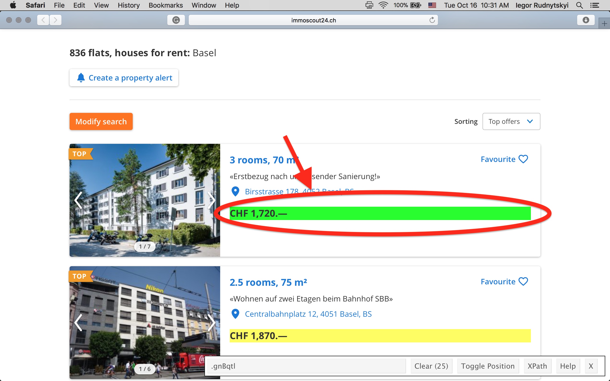
    ```
    
    - Copy the css selector from the text box to `R`.
    
    ```{r, echo = FALSE}
    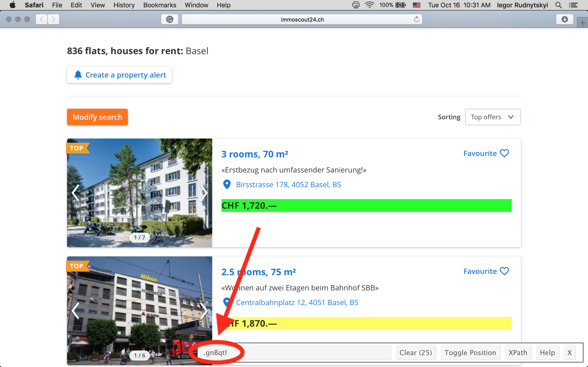
    ```
    
5. Extract data from from the web page by using `html_nodes()` and `html_text()` from `rvest`:

    ```{r, eval = FALSE}
    library("rvest")
    library("magrittr")
    flats <- real_estate %>% 
        html_nodes(".chqpnT") %>%
        html_text()
    ```
    
6. (Optional) Clean and tidy the extracted data. For instance, we use regex to get the number of rooms and the prices in the following code chunk:

  
    ```{r, eval = FALSE}
    flats_df <- data.frame(
      rooms = gsub(pattern = " room.*", "", flats) %>%
        as.numeric(),
      price = gsub(".*CHF |.—.*", "", flats) %>%
        gsub(pattern = ",", replacement = "") %>%
        as.numeric()
    )
    ```

As the conclusion, the web scraping is a very powerful tool for extracting data. However, it comes with a certain responsibility.

<!--chapter:end:09-scraping.Rmd-->

`r if (knitr:::is_html_output()) '# References'`

<!--chapter:end:10-references.Rmd-->

# (APPENDIX) Appendix {-}

# Basic Probability and Statistics with `R`

<!--chapter:end:101-App-prob.Rmd-->

