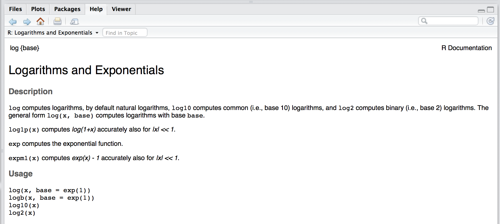

--- 
title: "An Introduction to Statistical Programming Methods with R"
author: "Matthew Beckman, Stéphane Guerrier, Justin Lee & Roberto Molinari"
date: "`r Sys.Date()`"
site: bookdown::bookdown_site
output: bookdown::gitbook
documentclass: book
bibliography: [book.bib, packages.bib]
biblio-style: apalike
link-citations: yes
github-repo: smac-group/ds
description: "This book is under construction and serves as a reference for students or other interested readers who intend to learn the basics of statistical programming using the R language. The book will provide the reader with notions of data management, manipulation and analysis as well as of reproducible research, result-sharing and version control."
includes:
      in_header: style.css
---

# Introduction

This book is currently under development and has been designed as a support for students who are following (or are interested in) courses that provide the basic knowledge to master "statistical programming" with R. By the latter we mean that area of computer programming which focuses on the implementation of methods that not only manage data but also extract meaningful information from it. The importance of this area of research comes from the increased collection of data from different sources such as academic research, public institutions and private companies that has required a corresponding increase in data management and analysis tools. Consequently, the need to develop applications and methods that are able to deliver these tools has brought to a surge in the demand for expertise not only in computer programming but also in statistical and numerical analysis. Indeed, while it is essential to master the basics of programming to build the necessary software, it is now also paramount to understand the programming tools that can effectively respond to the need of finding, extracting and analysing the information to achieve the required goals.

Within the above framework, the statistical software `R` has seen a rise in use due to its flexibility as an efficient language that builds a bridge between software development and data analysis. There are of course many other programming languages that have different advantages over `R` but, as explained further on, the latter is able to develop and quickly adapt to the different needs coming from the data management and analysis community while at the same time making use of other languages in order to deliver computationally efficient solutions (as well as other interesting features described below). With this premise, this book intends to present the basic tools to statistical programming and software development using the wide variety of tools made available through `R`, from method-specific packages to version control programs. The general goals of the book are therefore the following:

* understand data structures in order to manage data, computer memory and computations in an appropriate manner;
* manipulate data structures through controls, instructions and tailored functions in order to achieve the desired output;
* create software platforms (packages and web applications) that collect the developed functions in order to respond to a certain need;
* learn how to manage software development via version control tools (GitHub) and create documentation for this software (with embedded code) to allow others to make use of the software.

All these goals are common to any basic programming course, however all these will be heavily focused on the use and development of statistical tools. In fact, as highlighted earlier, it has become increasingly important to include statistical methodologies within the programming framework thereby allowing software to not only manage data efficiently but also to extract and analyse data in an appropriate manner while doing so. The rest of this introductory chapter will present the R software by explaining why it is used for this book and describing the basic notations and tools that need to be known in order to better grasp its contents.

Once the reader has finished this book, they should be able to:

* Bla
* Bla
* Bla

```{block2,  type='rmdimportant'}
This document is **under development** and it is therefore preferable to always access the text online to be sure you are using the most up-to-date version. Due to its current development, you may encounter errors ranging from broken code to typos or poorly explained topics. If you do, please let us know! Simply send an email to ???????? or add an issue to the GitHub repository used for this document (which can be accessed here????) and we will make the changes as soon as possible. In addition, if you know RMarkdown and are familiar with GitHub, make a pull request and fix an issue yourself, otherwise, if you're not familiar with these tools, they will be explained later on in the book itself.
```

## `R` and `RStudio`

The statistical computing language `R` has now become a widely used software in academia and industry. Having started as an open-source language to make available different statistics and analytical tools to researchers and the public, it steadily developed into one of the major software languages which not only allows to develop up-to-date, sound and flexible analytical tools but also to include these tools within a platform which is well integrated with other important programming languages, communication and version-control features. The latter is also possible thanks to the development of the `RStudio` interface which provides a pleasant and functional user-interface for `R` as well as an efficient Integrated Development Environment (IDE) in which different programming languages, web-applications and other important tools are available to the user.

### Why `R`?

There are many reasons to use `R` nowadays, the first of which is the fact that is a free and open-source software which *per se* does not necessarily imply that it is a good software (although it is also that). The reason why this is an important feature consists in the fact that the results of any code or program developed in the `R` environment can easily be replicated therefore ensuring accessibility and transparency for the general user. More importantly however, this replicability of results is also accompanied by a wide variety of packages that are made available through the `R` environment in which users can find a diversity of codes, functions and features that are designed to tackle a large amount of programming and analytical tasks. Moreover, these packages are relatively simple to create and are extremely useful for code-sharing purposes since they enclose the codes, functions and external dependencies that allow anyone to install any of these features all at once in easy and efficient manner.

In addition to its accessibility and code-sharing features, `R` has acquired visibility and importance mainly due to the cutting-edge tools that it makes available to the general user. Indeed, a growing area of research both in academia and in industry is Statistics and Machine Learning through which it is possible to find, extract and make an efficient use of the increasing amount of data and information being collected. All the latest methods and approaches going from data-mining techniques to predictive analysis are available in `R` and, due to its nature, all future methods and approaches will be made available to all users through `R`. For this reason, any individual, company or organization has a keen interest in acquiring and developing expertise in `R` since it makes available the most appropriate tools for any data-based analysis and decision-making process.

Like any other software, there are of course some drawbacks with using `R`. Firstly, the presence of an extended amount of user-contributed packages can make its usage and bug-reporting problematic. Although this does not represent a major problem since many forums exist and solutions are usually quickly fixed, there can be many issues concerning package updates or deletions that can create problems for other existing packages that depend on them. Despite this being rare, there can consequently be problems in the use of packages that become obsolete and need to be fixed due to these different dependency issues. Another drawback consists in the extensive use of computer memory that `R` entails through its commands which generally give little relevance to this issue. However, many different solutions are being developed which deal with this problem along with the increased memory made available by current operating systems.

In the perspective of improving the usage of computer memory, `R` has been developing efficient and "seemless" connections with high-performance languages which allow functions and packages to make use of them thereby greatly lightening and accelerating computations made through `R`. An important example of this is given by the connections made available to the `C++` language. In this book we will discuss the connections with this language that are particularly well implemented, but other high-performance languages can be used such as `C` and `FORTRAN`.

### Getting started with `R`

As mentioned earlier, `R` can be thought of as a programming language as well as a software environment for statistical programming. Since it is a free and open-source software, all you will need to do is to download it from the following link:

- [`R`](https://cran.r-project.org/) .

Once you've downloaded and installed `R` on your computer you will be able to start using the programming language and packages that the `R` environment provides. Nevertheless, to make full use of the latest developments and features of this software, in this book we recommend using the IDE called `RStudio` which can be downloaded from the following link:

- [RStudio](https://www.rstudio.com/) .

```{block2,  type='rmdimportant'}
You cannot use `RStudio` without having installed `R` on your computer.
```

### About RStudio

`RStudio` is a customizable IDE for the `R` enviornment where the user can have an easily accessbile overview of the working directory, files, plots, data, objects and many other features that are useful to work efficiently with `R`. Moreover, it is possible to create projects in which it is possible to develop a self-contained environment for sets of specific functions and files aimed to deal with various tasks.

**Matt** would you have something we could use here?
**Justin** what about a video here to introduce RStudio???

We should add a link to the RStudio "[cheatsheet](https://www.rstudio.com/wp-content/uploads/2016/01/rstudio-IDE-cheatsheet.pdf)"

In addition, `RStudio` provides embedded functions that allow to synchronize your work on GitHub as well as a set of powerful tools to save and comunicate results (whether they be simulations, data analysis or presenting and making available a new package to other users). Some examples of these tools are `Rmarkdown` and `Shiny Web App` which can be used respectively to note down results with embedded `R` code and to create an online application which can provide a user interface to supply data and retrieve results using `R`. GitHub and `Rmarkdown` will be the object of a more in-depth description in the first chapters of this book in order to provide the reader with the version-control and annotation tools that can be useful for the following chapters of this book.

### Conventions

Throughout this book, `R` code will be typeset using a `monospace` font which is syntax highlighted. For example:

```{r, eval = FALSE}
a = pi
b = 0.5
sin(a*b)
```

Similarly, `R` output lines (that usally appear in your Console) will begin with `##` and will not be syntax highlighted. The output of the above example is the following:

```{r, echo = FALSE}
a = pi
b = 0.5
sin(a*b)
```

Aside from `R` code and its outputs, this book will also insert some boxes that will draw the reader's attention to some details that can be important, curious or purely informative in nature. An example of these boxes was seen at the beginning of this introduction where an important aspect was pointed out to the reader regarding the "under construction" nature of this book. Therefore the following boxes and symbols can be used to represent information of different nature:

```{block2,  type='rmdimportant'}
This is an important piece of information.
```

```{block2, type='rmdnote'}
This is some additional information that could be useful to the reader.
```

```{block2, type='rmdcaution'}
This is something that the reader should pay caution to but should not create major problems if not considered. 
```

```{block2, type='rmdwarning'}
This is a warning which should be considered by the reader to avoid problems of different nature.
```

```{block2, type='rmdtip'}
This is a tip for the reader when following or developing something based on this book.
```

### Simple calculations

A basic aspect to underline about the `R` environment is that it serves as an advanced calculator which therefore allows also for simple calculations. In the table below we show a few examples of such calculations where the first column gives a mathematical expression (calculation), the second gives the equivalent of this expression in `R` and finally in the third column we can find the result that is output from `R`.

| Math.              |R                   | Result      |
|:-------------------|:-------------------|:------------|
| 2+2                | `2+2`              | `4`         |
| $\frac{4}{2}$      | `4/2`              | `2`         |
| $3 \cdot 2^{-0.8}$ | `3*2^(-0.8)`       | `1.723048`  |
| $\sqrt{2}$         | `sqrt(2)`          | `1.414214`  |
| $\pi$              | `pi`               | `3.141593`  |
| $\ln(2)$           | `log(2)`           | `0.6931472` |
| $\log_{3}(9)$      | `log(9, base = 3)` | `2`         |
| $e^{1.1}$          | `exp(1.1)`         | `3.004166`  |
| $\cos(\sqrt{0.9})$ | `cos(sqrt(0.9))`   | `0.5827536` |


### Getting help

In the previous section we presented some examples on how `R` can be used as a calculator and we have already seen several functions such as `sqrt()` or `log()`. To obtain documentation about a function in `R`, simply put a question mark in front of the function name (or just type `help()` around the function name) and its documentation will be displayed. For example, if you are interested in learning about the function `log()` you simply type:

```{r}
?log
```

which will display something similar to:



The `R` documentation can sometimes be very technical or hard to interpret. In these cases, the best solution to understand a function is to search for help on any search engine and you will probably find different forums such as "CrossValidated" or "StackExchange" in which the questions you have about a function have probably already been asked and answered by many other users. 

```{block2, type='rmdtip'}
You can often use the error message to search for answers about a problem you may have with a function.
```

### Installing packages

`R` comes with a number of built-in functions but one of its main strengths is that there is a large number of packages that you can install. These packages provide additional functions, features and data to the R environement. If you want to do something in `R` that is not available by default, there is a good chance that there are packages that will respond to your needs. In this case, an appropriate way to find a package in `R` is to use the search option in the CRAN repository which is the official network of file-transfer protocols and web-servers that store updated versions of code and documentation for `R` (see CRAN website). Another general approach to find a package in `R` is simply to use a search engine in which to type the keywords of the tools you are looking for followed by "R package".

`R` packages can be installed in various ways but in this section we will only discuss the most straightforward approach to do so, which is through the `install.packages()` function. Another way is to use the "Tools -> Install Packages..." path from the dropdown menus in `RStudio` but the `install.packages()` function is nevertheless transversal to any platform for the `R` environment. It must be underlined that these approaches to install packages require that the packages are available within the CRAN repository. However, there is a growing number of packages that are under-development or completed and are made available through other repositories. In the latter setting, Chapter ????? (github) will show other ways of installing packages from a commonly used repository called "GitHub". 

Sticking momentarily to the packages available in the CRAN repository, the use of the `install.packages()` is quite simple. For example, if you want to install the package `devtools` you can simply write:

```{r, eval = FALSE}
install.packages("devtools")
```

Once a package is installed it is not directly usable within your `R` session. To do so you will have to "load" the package into your current `R` session which is generally done through the function `library()`. For example, after having installed the `devtools` package, in order to use it within your session you would write:

```{r, eval = FALSE}
library(devtools)
```

Once this is done, all the functions and documentation of this package are available and can be used within your current session. However, once you close your `R` session, all loaded packages will be closed and you will have to load them again if you want to use them in a new `R` session.

```{block2, type='rmdnote'}
Please notice that although packages need to be loaded at each session if you want to use them, they need to be installed only once. The only exception to this rule is when you need to update the package or reinstall it for some reason.
```

## Basic Probability and Statistics with `R`

The `R` environment provides an up-to-date and efficient programming language to develop different tools and applications. Nevertheless, its main functionality lies in the core statistical framework and tools that consistute the basis of this language. Indeed, this book aims at introducing and describing the methods and approaches of statistical programming which therefore require a basic knowledge of Probability and Statistics in order to grasp the logic and usefulness of the features presented in this book.

For this reason, we will briefly take the reader through some of the basic functions that are available within `R` to obtain probabilities based on parametric distributions, compute summary statistics and understand basic data structures. The latter is just an introduction and a more in-depth description of different data structures will be given in Chapter ???.

### Probability Distributions 

Probability distributions can be uniquely characterized by different functions such as, for example, their density or distribution functions. Based on these it is possible to compute theoretical quantiles and also randomly sample observations from them. Replacing the `R` syntax for a given probability distribution with the general syntax `name`, all these functions and calculations are made available in `R` through the built-in functions: 

- `dname` calculates the value of the density function (pdf);
- `pname` calculates the value of the distribution function (cdf);
- `qname` calculates the value of the theoretical quantile;
- `rname` generates a random sample from a particular distribution.

Note that, when using these functions in practice, `name` is replaced with the syntax used in `R` to denote a specific probability distribution. For example, if we wish to deal with a Uniform probability distribution, then the syntax `name` is replaced by `unif` and, furthering the example, to randomly generate observations from a uniform distribution the function to use will be therefore `runif`. `R` allows to make use of these functions for a wide variety of probability distributions that include, but are not limited to: Gaussian (or Normal), Binomial, Chi-square, Exponential, F-distribution, Geometric, Poisson, Student-t and Uniform. In order to get an idea of how these functions can be used, below is an example of a problem that can be solved using them.

### Problem {-}

Assume that the test scores of a college entrance exam follows a Normal distribution. Furthermore, suppose that the mean test score is 70 and that the standard deviation is 15. How would we find the percentage of students scoring 90 or more in this exam?

### Answer {-}

In this case, we consider a random variable $X$ that is normally distributed as follows: $X \sim N(\mu=70, \sigma^2=225)$ where $\mu$ and $\sigma^2$ represent the mean and variance of the distribution respectively. Since we are looking for the probability of students scoring higher than 90, we are interested in finding $\mathbb{P}(X > x=90)$ and therefore we look at the upper tail of the Normal distribution. To find this probability we need the distribution function (`pname`) for which we therefore replace `name` with the `R` syntax for the Normal distribution: `norm`. The distribution function in `R` has various parameters to be specified in order to compute a probability which, at least for the Normal distribution, can be found by typing `?pnorm` in the Console and are:

- `q`: the quantile we are interested in (e.g. 90);
- `mean`: the mean of the distribution (e.g. 70);
- `sd`: the standard deviation of the distribution (e.g. 15);
- `lower.tail`: a boolean determining whether to compute the probability of being smaller than the given quantile (i.e. $\mathbb{P}(X \leq x)$) which requires the default argument `TRUE` or larger (i.e. $\mathbb{P}(X > x)$) which requires to specify the argument `FALSE`.

Knowing these arguments, it is now possible to compute the probability we are interested in as follows:

```{r}
pnorm(q = 90, mean = 70, sd = 15, lower.tail = FALSE) 
```

As we can see from the output, there is roughly a 9% probability of students scoring 90 or more in the exam.

### Summary Statistics 

While the previous functions deal with theoretical distributions, it is also necessary to deal with real data from which we would like to extract information. This data, for example, can be simulated using the function `rname` (e.g. `rnorm`) and, supposing we don't know from which distribution it is generated, we would be interested in understanding the behavior of the data in order to eventually identify a distribution and estimate its parameters.

The use of certain functions varies according to the nature of the inputs since these can be, for example, numerical or factors.

### Numerical Input

A first step in analysing numerical inputs is given by computing summary statistics of the data which, in this section, we can generally denote as `x` (we will discuss the structure of this data more in detail in the following chapters). For central tendency or spread statistics of a numerical input, we can use the following `R` built-in functions:

- `mean` calculates the mean of an input `x`;
- `median` calculates the median of an input `x`;
- `var` calculates the variance of an input `x`;
- `sd` calculates the standard deviation of an input `x`;
- `IQR` calculates the interquartile range of an input `x`;
- `min` calculates the minimum value of an input `x`;
- `max` calculates the maximum value of an input `x`; 
- `range` returns a vector containing the minimum and maximum of all given arguments;
- `summary` returns a vector containing a mixture of the above functions (i.e. mean, median, first and third quartile, minimum, maximum).

### Factor Input 

If the data of interest is a factor with different categories or levels, then it cannot obviously be treated as a numerical variable and other statistics need to be computed. For example, for a factor input we can extract counts and percentages to summarize the variable by using `table`. Using functions and data structures that will be described in the following chapters, below we create an example dataset with 90 observations of three different colors: 20 being `Yellow`, 10 being `Green` and 50 being `Blue`. We then apply the `table` function to it:

```{r}
table(as.factor(c(rep("Yellow", 20), rep("Green", 10), rep("Blue", 50))))
```

By doing so we obtain a frequency (count) table of the colors.

### Dataset inputs

In many cases, when dealing with data we are actually dealing with datasets (see Chapter ???) where variables of different nature are aligned together (usually in columns). For datasets there is another convenient way to get simple summary statistics which consists in applying the function `summary` to the dataset itself (instead of simply a numerical input as seen earlier). 

As an example, let us explore the [Iris](https://en.wikipedia.org/wiki/Iris_flower_data_set) flower dataset contained in the `R` built-in `datasets` package. The data set consists of 50 samples from each of three species of Iris (Setosa, Virginica and Versicolor). Four features were measured from each sample consisting in the length and the width (in centimeters) of the both sepals and petals. This dataset is widely used as an example since it was used by Fisher to develop a linear discriminant model based on which he intended to distinguish the three species from each other using combinations of these four features.

Using this dataset, let us use the `summary` function on it to output the minimum, first quartile and thrid quartile, median, mean and maximum statistics (for the numerical variables in the dataset) and frequency counts (for factor inputs).

```{r}
summary(iris)
```

## Main references 

This is not the first (or the last) book that has been written explaining and describing statistical programming in `R`. Indeed, this can be seen as a book that brings together and reorganizes information and material from other sources structuring and tailoring it to a course in basic statistical programming. The main references (which are far from being an exhaustive review of literature) that can be used to have a more in-depth view of different aspects treated in this book are:

- @wickham2014advanced : a more technical and advanced introduction to `R`;
- @xie2015 : an overview of document generation in `R`;
- ...


## Licence

We probably should pick a liscence... How about: This work is licensed under a Creative Commons Attribution-NonCommercial-ShareAlike 4.0 International License???? We should probably move this at the end of this section, no?

## Acknowledgments
...